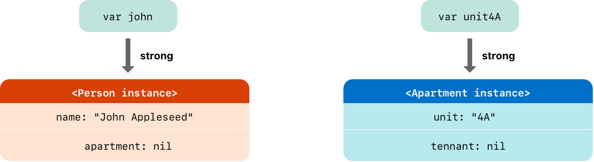
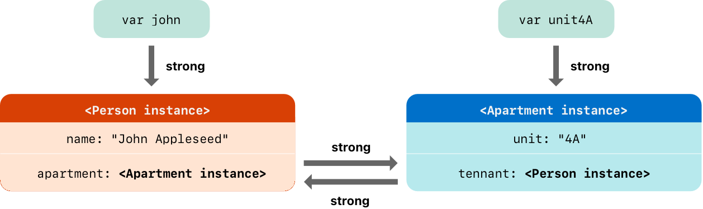
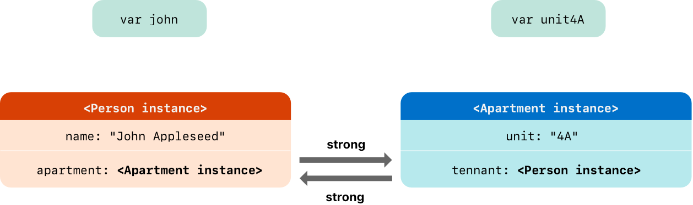
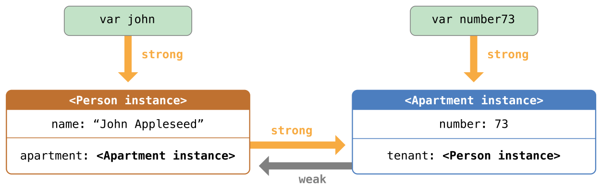
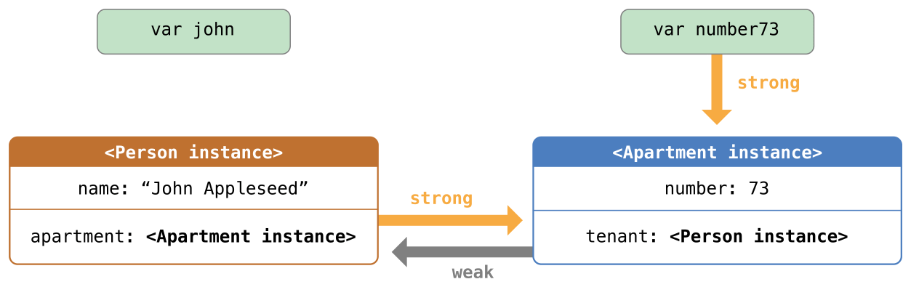
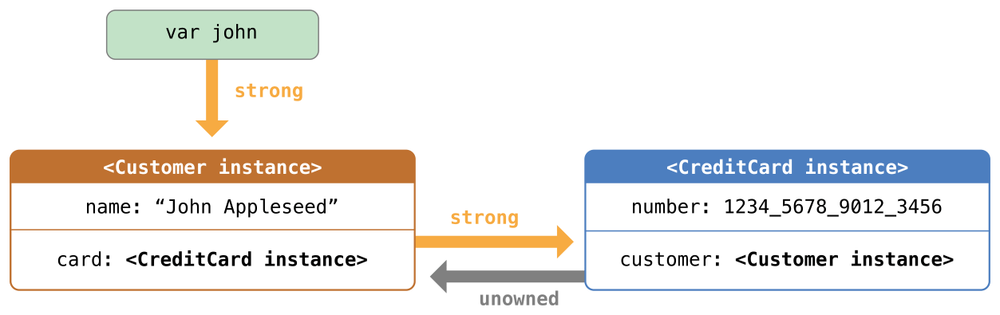
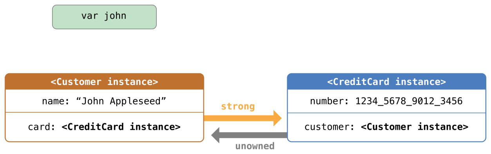
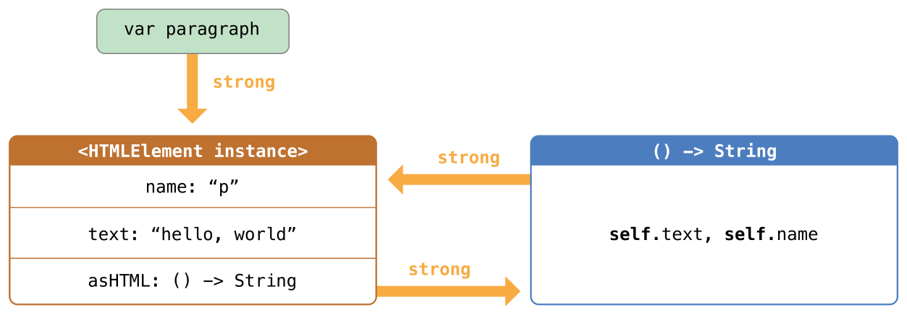
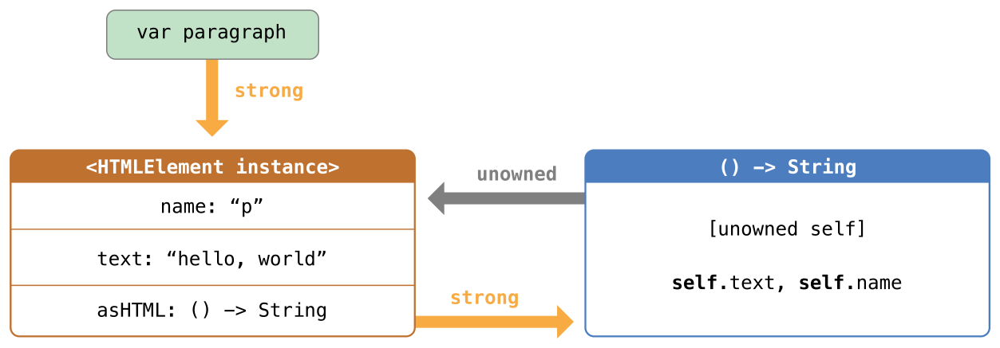

Automatic Reference Counting
============================

Swift uses :newTerm:`Automatic Reference Counting` (ARC)
to track and manage your app's memory usage.
In most cases, this means that memory management “just works” in Swift,
and you do not need to think about memory management yourself.
ARC automatically frees up the memory used by class instances
when those instances are no longer needed.

However, in a few cases ARC requires more information
about the relationships between parts of your code
in order to manage memory for you.
This chapter describes those situations
and shows how you enable ARC to manage all of your app's memory.
Using ARC in Swift is very similar to the approach described in
`Transitioning to ARC Release Notes <//apple_ref/doc/uid/TP40011226>`_
for using ARC with Objective-C.

.. note::

   Reference counting only applies to instances of classes.
   Structures and enumerations are value types, not reference types,
   and are not stored and passed by reference.

.. _AutomaticReferenceCounting_HowARCWorks:

How ARC Works
-------------

Every time you create a new instance of a class,
ARC allocates a chunk of memory to store information about that instance.
This memory holds information about the type of the instance,
together with the values of any stored properties associated with that instance.

Additionally, when an instance is no longer needed,
ARC frees up the memory used by that instance
so that the memory can be used for other purposes instead.
This ensures that class instances do not take up space in memory
when they are no longer needed.

However, if ARC were to deallocate an instance that was still in use,
it would no longer be possible to access that instance's properties,
or call that instance's methods.
Indeed, if you tried to access the instance, your app would most likely crash.

To make sure that instances don't disappear while they are still needed,
ARC tracks how many properties, constants, and variables
are currently referring to each class instance.
ARC will not deallocate an instance
as long as at least one active reference to that instance still exists.

To make this possible,
whenever you assign a class instance to a property, constant, or variable,
that property, constant, or variable makes a :newTerm:`strong reference` to the instance.
The reference is called a "strong" reference because
it keeps a firm hold on that instance,
and does not allow it to be deallocated for as long as that strong reference remains.

.. _AutomaticReferenceCounting_ARCInAction:

ARC in Action
-------------

Here's an example of how Automatic Reference Counting works.
This example starts with a simple class called ``Person``,
which defines a stored constant property called ``name``:

.. testcode:: howARCWorks

   -> class Person {
         let name: String
         init(name: String) {
            self.name = name
            print("\(name) is being initialized")
         }
         deinit {
            print("\(name) is being deinitialized")
         }
      }

The ``Person`` class has an initializer that sets the instance's ``name`` property
and prints a message to indicate that initialization is underway.
The ``Person`` class also has a deinitializer
that prints a message when an instance of the class is deallocated.

The next code snippet defines three variables of type ``Person?``,
which are used to set up multiple references to a new ``Person`` instance
in subsequent code snippets.
Because these variables are of an optional type (``Person?``, not ``Person``),
they are automatically initialized with a value of ``nil``,
and do not currently reference a ``Person`` instance.

.. testcode:: howARCWorks

   -> var reference1: Person?
   << // reference1 : Person? = nil
   -> var reference2: Person?
   << // reference2 : Person? = nil
   -> var reference3: Person?
   << // reference3 : Person? = nil

You can now create a new ``Person`` instance
and assign it to one of these three variables:

.. testcode:: howARCWorks

   -> reference1 = Person(name: "John Appleseed")
   <- John Appleseed is being initialized

Note that the message ``"John Appleseed is being initialized"`` is printed
at the point that you call the ``Person`` class's initializer.
This confirms that initialization has taken place.

Because the new ``Person`` instance has been assigned to the ``reference1`` variable,
there is now a strong reference from ``reference1`` to the new ``Person`` instance.
Because there is at least one strong reference,
ARC makes sure that this ``Person`` is kept in memory and is not deallocated.

If you assign the same ``Person`` instance to two more variables,
two more strong references to that instance are established:

.. testcode:: howARCWorks

   -> reference2 = reference1
   -> reference3 = reference1

There are now *three* strong references to this single ``Person`` instance.

If you break two of these strong references (including the original reference)
by assigning ``nil`` to two of the variables,
a single strong reference remains,
and the ``Person`` instance is not deallocated:

.. testcode:: howARCWorks

   -> reference1 = nil
   -> reference2 = nil

ARC does not deallocate the ``Person`` instance until
the third and final strong reference is broken,
at which point it is clear that you are no longer using the ``Person`` instance:

.. testcode:: howARCWorks

   -> reference3 = nil
   <- John Appleseed is being deinitialized

.. _AutomaticReferenceCounting_StrongReferenceCyclesBetweenClassInstances:

Strong Reference Cycles Between Class Instances
-----------------------------------------------

In the examples above,
ARC is able to track the number of references to the new ``Person`` instance you create
and to deallocate that ``Person`` instance when it is no longer needed.

However, it is possible to write code in which an instance of a class
*never* gets to a point where it has zero strong references.
This can happen if two class instances hold a strong reference to each other,
such that each instance keeps the other alive.
This is known as a :newTerm:`strong reference cycle`.

You resolve strong reference cycles
by defining some of the relationships between classes
as weak or unowned references instead of as strong references.
This process is described in
:ref:`AutomaticReferenceCounting_ResolvingStrongReferenceCyclesBetweenClassInstances`.
However, before you learn how to resolve a strong reference cycle,
it is useful to understand how such a cycle is caused.

Here's an example of how a strong reference cycle can be created by accident.
This example defines two classes called ``Person`` and ``Apartment``,
which model a block of apartments and its residents:

.. testcode:: referenceCycles
   :compile: true

   -> class Person {
         let name: String
         init(name: String) { self.name = name }
         var apartment: Apartment?
         deinit { print("\(name) is being deinitialized") }
      }
   ---
   -> class Apartment {
         let unit: String
         init(unit: String) { self.unit = unit }
         var tenant: Person?
         deinit { print("Apartment \(unit) is being deinitialized") }
      }

Every ``Person`` instance has a ``name`` property of type ``String``
and an optional ``apartment`` property that is initially ``nil``.
The ``apartment`` property is optional, because a person may not always have an apartment.

Similarly, every ``Apartment`` instance has a ``unit`` property of type ``String``
and has an optional ``tenant`` property that is initially ``nil``.
The tenant property is optional because an apartment may not always have a tenant.

Both of these classes also define a deinitializer,
which prints the fact that an instance of that class is being deinitialized.
This enables you to see whether
instances of ``Person`` and ``Apartment`` are being deallocated as expected.

This next code snippet defines two variables of optional type
called ``john`` and ``unit4A``,
which will be set to a specific ``Apartment`` and ``Person`` instance below.
Both of these variables have an initial value of ``nil``, by virtue of being optional:

.. testcode:: referenceCycles
   :compile: true

   -> var john: Person?
   -> var unit4A: Apartment?

You can now create a specific ``Person`` instance and ``Apartment`` instance
and assign these new instances to the ``john`` and ``unit4A`` variables:

.. testcode:: referenceCycles
   :compile: true

   -> john = Person(name: "John Appleseed")
   -> unit4A = Apartment(unit: "4A")

Here's how the strong references look after creating and assigning these two instances.
The ``john`` variable now has a strong reference to the new ``Person`` instance,
and the ``unit4A`` variable has a strong reference to the new ``Apartment`` instance:

You can now link the two instances together
so that the person has an apartment, and the apartment has a tenant.
Note that an exclamation mark (``!``) is used to unwrap and access
the instances stored inside the ``john`` and ``unit4A`` optional variables,
so that the properties of those instances can be set:

.. testcode:: referenceCycles

   -> john!.apartment = unit4A
   -> unit4A!.tenant = john

Here's how the strong references look after you link the two instances together:

Unfortunately, linking these two instances creates
a strong reference cycle between them.
The ``Person`` instance now has a strong reference to the ``Apartment`` instance,
and the ``Apartment`` instance has a strong reference to the ``Person`` instance.
Therefore, when you break the strong references held by
the ``john`` and ``unit4A`` variables,
the reference counts do not drop to zero,
and the instances are not deallocated by ARC:

.. testcode:: referenceCycles
   :compile: true

   -> john = nil
   -> unit4A = nil

Note that neither deinitializer was called
when you set these two variables to ``nil``.
The strong reference cycle prevents the ``Person`` and ``Apartment`` instances
from ever being deallocated, causing a memory leak in your app.

Here's how the strong references look after you set
the ``john`` and ``unit4A`` variables to ``nil``:

The strong references between the ``Person`` instance
and the ``Apartment`` instance remain and cannot be broken.

.. _AutomaticReferenceCounting_ResolvingStrongReferenceCyclesBetweenClassInstances:

Resolving Strong Reference Cycles Between Class Instances
---------------------------------------------------------

Swift provides two ways to resolve strong reference cycles
when you work with properties of class type:
weak references and unowned references.

Weak and unowned references enable one instance in a reference cycle
to refer to the other instance *without* keeping a strong hold on it.
The instances can then refer to each other without creating a strong reference cycle.

Use a weak reference when the other instance
has a different lifetime that this instance has.
When the other instance is deallocated,
the weak reference is set to ``nil``.
In contrast, use an unowned reference when both instances
have the same lifetime ---
that is, both instances will be deallocated at the same time.
Unowned references are never ``nil``
because they are should never refer to an instance
after it has been deallocated.

To chose between
weak references, unowned references, and unsafe unowned references,
consider how much work you want Swift to do at runtime
about the safety of accessing the other instance.
.. XXX

* A weak reference asks Swift to do the most runtime work
  out of these three approaches:
  It's always valid for your code to access a weak reference.
  Swift does work at runtime to set the weak reference to ``nil``,
  which ensures that accessing the weak reference never raises a runtime error.

* A safe unowned reference asks Swift to do some runtime work to ensure safety,
  but also shifts some of the burden to your code.
  Your code is responsible for ensuring that both instances have the same lifetime.
  Swift does work at runtime to raise a runtime error
  if your code tries to access a safe unowned reference
  after the instance has been deallocated.

* An unsafe unowned reference doesn't ask Swift to do any runtime work.
  If your code tries to access an unsafe unowned reference
  after the instance has been deallocated,
  

.. QUESTION: how do I answer the question
   "which of the two properties in the reference cycle
   should be marked as weak or unowned?"

.. TODO: mention the fact that unowned references don't have to perform checks.
   Don't describe it in terms of speed;
   rather, note that the extra checks don't need to be performed.

.. _AutomaticReferenceCounting_WeakReferencesBetweenClassInstances:

Weak References
~~~~~~~~~~~~~~~

A :newTerm:`weak reference` is a reference that does not keep a strong hold
on the instance it refers to,
and so does not stop ARC from disposing of the referenced instance.
This behavior prevents the reference from becoming part of a strong reference cycle.
You indicate a weak reference by placing the ``weak`` keyword
before a property or variable declaration.

Use a weak reference to avoid reference cycles
whenever it is possible for that reference to have
a missing value at some point in its life.
If the reference *always* has a value,
use an unowned reference instead,
as described in :ref:`AutomaticReferenceCounting_UnownedReferencesBetweenClassInstances`.
In the ``Apartment`` example above,
it is appropriate for an apartment to be able to have
no tenant at some point in its lifetime,
and so a weak reference is an appropriate way to break the reference cycle in this case.

Because a weak reference does not keep a strong hold on the instance it refers to,
it is possible for that instance to be deallocated
while the weak reference is still referring to it.
Therefore, ARC automatically sets a weak reference to ``nil``
when the instance that it refers to is deallocated.
And, because weak references need to allow
their value to be changed to ``nil`` at runtime,
they are always declared as variables, rather than constants, of an optional type.

You can check for the existence of a value in the weak reference,
just like any other optional value,
and you will never end up with
a reference to an invalid instance that no longer exists.

.. note::

    Property observers aren't called
    when ARC sets a weak reference to ``nil``.

.. assertion:: weak-reference-doesnt-trigger-didset

    -> class C {
           weak var w: C? { didSet { print("did set") } }
       }
    -> var c1 = C()
    << // c1 : C = REPL.C
    -> do {
    -> var c2 = C()  // Inside a do{} block, so no REPL result.
    -> print(c1.w)
    << nil
    -> c1.w = c2
    << did set
    -> print(c1.w)
    << Optional(REPL.C)
    -> } // ARC deallocates c2; didSet doesn't fire.
    -> print(c1.w)
    << nil

The example below is identical to the ``Person`` and ``Apartment`` example from above,
with one important difference.
This time around, the ``Apartment`` type's ``tenant`` property
is declared as a weak reference:

.. testcode:: weakReferences
   :compile: true

   -> class Person {
         let name: String
         init(name: String) { self.name = name }
         var apartment: Apartment?
         deinit { print("\(name) is being deinitialized") }
      }
   ---
   -> class Apartment {
         let unit: String
         init(unit: String) { self.unit = unit }
         weak var tenant: Person?
         deinit { print("Apartment \(unit) is being deinitialized") }
      }

The strong references from the two variables (``john`` and ``unit4A``)
and the links between the two instances are created as before:

.. testcode:: weakReferences
   :compile: true

   -> var john: Person?
   -> var unit4A: Apartment?
   ---
   -> john = Person(name: "John Appleseed")
   -> unit4A = Apartment(unit: "4A")
   ---
   -> john!.apartment = unit4A
   -> unit4A!.tenant = john

Here's how the references look now that you've linked the two instances together:

The ``Person`` instance still has a strong reference to the ``Apartment`` instance,
but the ``Apartment`` instance now has a *weak* reference to the ``Person`` instance.
This means that when you break the strong reference held by
the ``john`` variable by setting it to ``nil``,
there are no more strong references to the ``Person`` instance:

.. testcode:: weakReferences
   :compile: true

   -> john = nil
   <- John Appleseed is being deinitialized

Because there are no more strong references to the ``Person`` instance,
it is deallocated
and the ``tenant`` property is set to ``nil``:

The only remaining strong reference to the ``Apartment`` instance
is from the ``unit4A`` variable.
If you break *that* strong reference,
there are no more strong references to the ``Apartment`` instance:

.. testcode:: weakReferences
   :compile: true

   -> unit4A = nil
   <- Apartment 4A is being deinitialized

Because there are no more strong references to the ``Apartment`` instance,
it too is deallocated:

.. image:: ../images/weakReference03_2x.png
   :align: center

.. note::

   In systems that use garbage collection,
   weak pointers are sometimes used to implement a simple caching mechanism
   because objects with no strong references are deallocated
   only when memory pressure triggers garbage collection.
   However, with ARC, values are deallocated
   as soon as their last strong reference is removed,
   making weak references unsuitable for such a purpose.

.. _AutomaticReferenceCounting_UnownedReferencesBetweenClassInstances:

Unowned References
~~~~~~~~~~~~~~~~~~

Like weak references,
an :newTerm:`unowned reference` does not keep
a strong hold on the instance it refers to.
Unlike a weak reference, however,
an unowned reference is used when both instances have the same lifetime.
Because an unowned reference is assumed to *always* have a value,
it is always defined as a nonoptional type.

You indicate an unowned reference by placing one of the following keywords
before a property or variable declaration:

``unowned``
    A shorter spelling of ``unowned(safe)``.

``unowned(safe)``
    If you try to access a *safe* unowned reference
    after the instance that it references is deallocated,
    you will trigger a runtime error.

``unowned(unsafe)``
    If you try to access an *unsafe* unowned reference
    after the instance that it references is deallocated,
    your program will read from the memory location
    where the instance used to be.
    It might crash, or it might read arbitrary data;
    the specific behavior is undefined.

.. Historically, we had intended "unowned" to mean "unowned(safe)" under -O and -Onone
   and to mean "unowned(unsafe)" under -Ounchecked.
   Joe Groff confirmed as of 2016-10-13 that this never got implemented,
   and implementing it now would cause problems ---
   for example, there would be ABI mismatch issues if we did that for fields in fragile structs.

.. important::

   Use an unowned reference only when you are sure that
   the reference *always* refers to an instance that has not been deallocated.
   If the instance lifetimes are not the same,
   your program will either crash or have undefined behavior,
   as described above.

The following example defines two classes, ``Customer`` and ``CreditCard``,
which model a bank customer and a possible credit card for that customer.
These two classes each store an instance of the other class as a property.
This relationship has the potential to create a strong reference cycle.

The relationship between ``Customer`` and ``CreditCard`` is slightly different from
the relationship between ``Apartment`` and ``Person``
seen in the weak reference example above.
In this data model, a customer may or may not have a credit card,
but a credit card will *always* be associated with a customer.
A ``CreditCard`` instance never outlives the ``Customer`` that it refers to.
To represent this, the ``Customer`` class has an optional ``card`` property,
but the ``CreditCard`` class has a unsafe (and nonoptional) ``customer`` property.

Furthermore, a new ``CreditCard`` instance can *only* be created
by passing a ``number`` value and a ``customer`` instance
to a custom ``CreditCard`` initializer.
This ensures that a ``CreditCard`` instance always has
a ``customer`` instance associated with it when the ``CreditCard`` instance is created.

Because a credit card will always have a customer,
you define its ``customer`` property as an unowned reference,
to avoid a strong reference cycle:

.. testcode:: unownedReferences
   :compile: true

   -> class Customer {
         let name: String
         var card: CreditCard?
         init(name: String) {
            self.name = name
         }
         deinit { print("\(name) is being deinitialized") }
      }
   ---
   -> class CreditCard {
         let number: UInt64
         unowned let customer: Customer
         init(number: UInt64, customer: Customer) {
            self.number = number
            self.customer = customer
         }
         deinit { print("Card #\(number) is being deinitialized") }
      }

.. note::

   The ``number`` property of the ``CreditCard`` class is defined with
   a type of ``UInt64`` rather than ``Int``,
   to ensure that the ``number`` property's capacity is large enough to store
   a 16-digit card number on both 32-bit and 64-bit systems.

This next code snippet defines an optional ``Customer`` variable called ``john``,
which will be used to store a reference to a specific customer.
This variable has an initial value of nil, by virtue of being optional:

.. testcode:: unownedReferences
   :compile: true

   -> var john: Customer?

You can now create a ``Customer`` instance,
and use it to initialize and assign a new ``CreditCard`` instance
as that customer's ``card`` property:

.. testcode:: unownedReferences
   :compile: true

   -> john = Customer(name: "John Appleseed")
   -> john!.card = CreditCard(number: 1234_5678_9012_3456, customer: john!)

Here's how the references look, now that you've linked the two instances:

The ``Customer`` instance now has a strong reference to the ``CreditCard`` instance,
and the ``CreditCard`` instance has an unowned reference to the ``Customer`` instance.

Because of the unowned ``customer`` reference,
when you break the strong reference held by the ``john`` variable,
there are no more strong references to the ``Customer`` instance:

Because there are no more strong references to the ``Customer`` instance,
it is deallocated.
After this happens,
there are no more strong references to the ``CreditCard`` instance,
and it too is deallocated:

.. testcode:: unownedReferences
   :compile: true

   -> john = nil
   <- John Appleseed is being deinitialized
   <- Card #1234567890123456 is being deinitialized

The final code snippet above shows that
the deinitializers for the ``Customer`` instance and ``CreditCard`` instance
both print their “deinitialized” messages
after the ``john`` variable is set to ``nil``.

.. _AutomaticReferenceCounting_UnownedReferencesAndImplicitlyUnwrappedOptionalProperties:

Unowned References and Implicitly Unwrapped Optional Properties
~~~~~~~~~~~~~~~~~~~~~~~~~~~~~~~~~~~~~~~~~~~~~~~~~~~~~~~~~~~~~~~

The examples for weak and unowned references above
cover two of the more common scenarios
in which it is necessary to break a strong reference cycle.

The ``Person`` and ``Apartment`` example shows
a situation where two properties, both of which are allowed to be ``nil``,
have the potential to cause a strong reference cycle.
This scenario is best resolved with a weak reference.

The ``Customer`` and ``CreditCard`` example
shows a situation where one property that is allowed to be ``nil``
and another property that cannot be ``nil``
have the potential to cause a strong reference cycle.
This scenario is best resolved with an unowned reference.

However, there is a third scenario,
in which *both* properties should always have a value,
and neither property should ever be ``nil`` once initialization is complete.
In this scenario, it is useful to combine an unowned property on one class
with an implicitly unwrapped optional property on the other class.

This enables both properties to be accessed directly
(without optional unwrapping) once initialization is complete,
while still avoiding a reference cycle.
This section shows you how to set up such a relationship.

The example below defines two classes, ``Country`` and ``City``,
each of which stores an instance of the other class as a property.
In this data model, every country must always have a capital city,
and every city must always belong to a country.
To represent this, the ``Country`` class has a ``capitalCity`` property,
and the ``City`` class has a ``country`` property:

.. testcode:: implicitlyUnwrappedOptionals
   :compile: true

   -> class Country {
         let name: String
         var capitalCity: City!
         init(name: String, capitalName: String) {
            self.name = name
            self.capitalCity = City(name: capitalName, country: self)
         }
      }
   ---
   -> class City {
         let name: String
         unowned let country: Country
         init(name: String, country: Country) {
            self.name = name
            self.country = country
         }
      }

To set up the interdependency between the two classes,
the initializer for ``City`` takes a ``Country`` instance,
and stores this instance in its ``country`` property.

The initializer for ``City`` is called from within the initializer for ``Country``.
However, the initializer for ``Country`` cannot pass ``self`` to the ``City`` initializer
until a new ``Country`` instance is fully initialized,
as described in :ref:`Initialization_TwoPhaseInitialization`.

To cope with this requirement,
you declare the ``capitalCity`` property of ``Country`` as
an implicitly unwrapped optional property,
indicated by the exclamation mark at the end of its type annotation (``City!``).
This means that the ``capitalCity`` property has a default value of ``nil``,
like any other optional,
but can be accessed without the need to unwrap its value
as described in :ref:`TheBasics_ImplicitlyUnwrappedOptionals`.

Because ``capitalCity`` has a default ``nil`` value,
a new ``Country`` instance is considered fully initialized
as soon as the ``Country`` instance sets its ``name`` property within its initializer.
This means that the ``Country`` initializer can start to reference and pass around
the implicit ``self`` property as soon as the ``name`` property is set.
The ``Country`` initializer can therefore pass ``self`` as one of the parameters for
the ``City`` initializer when the ``Country`` initializer is setting
its own ``capitalCity`` property.

All of this means that you can create the ``Country`` and ``City`` instances
in a single statement, without creating a strong reference cycle,
and the ``capitalCity`` property can be accessed directly,
without needing to use an exclamation mark to unwrap its optional value:

.. testcode:: implicitlyUnwrappedOptionals
   :compile: true

   -> var country = Country(name: "Canada", capitalName: "Ottawa")
   -> print("\(country.name)'s capital city is called \(country.capitalCity.name)")
   <- Canada's capital city is called Ottawa

In the example above, the use of an implicitly unwrapped optional
means that all of the two-phase class initializer requirements are satisfied.
The ``capitalCity`` property can be used and accessed like a nonoptional value
once initialization is complete,
while still avoiding a strong reference cycle.

.. _AutomaticReferenceCounting_StrongReferenceCyclesForClosures:

Strong Reference Cycles for Closures
------------------------------------

You saw above how a strong reference cycle can be created
when two class instance properties hold a strong reference to each other.
You also saw how to use weak and unowned references to break these strong reference cycles.

A strong reference cycle can also occur
if you assign a closure to a property of a class instance,
and the body of that closure captures the instance.
This capture might occur because the closure's body accesses a property of the instance,
such as ``self.someProperty``,
or because the closure calls a method on the instance,
such as ``self.someMethod()``.
In either case, these accesses cause the closure to “capture” ``self``,
creating a strong reference cycle.

This strong reference cycle occurs because closures, like classes, are *reference types*.
When you assign a closure to a property,
you are assigning a *reference* to that closure.
In essence, it's the same problem as above ---
two strong references are keeping each other alive.
However, rather than two class instances,
this time it's a class instance and a closure that are keeping each other alive.

Swift provides an elegant solution to this problem,
known as a :newTerm:`closure capture list`.
However, before you learn how to break a strong reference cycle with a closure capture list,
it is useful to understand how such a cycle can be caused.

The example below shows how you can create a strong reference cycle
when using a closure that references ``self``.
This example defines a class called ``HTMLElement``,
which provides a simple model for an individual element within an HTML document:

.. testcode:: strongReferenceCyclesForClosures

   -> class HTMLElement {
   ---
         let name: String
         let text: String?
   ---
         lazy var asHTML: () -> String = {
            if let text = self.text {
               return "<\(self.name)>\(text)</\(self.name)>"
            } else {
               return "<\(self.name) />"
            }
         }
   ---
         init(name: String, text: String? = nil) {
            self.name = name
            self.text = text
         }
   ---
         deinit {
            print("\(name) is being deinitialized")
         }
   ---
      }

The ``HTMLElement`` class defines a ``name`` property,
which indicates the name of the element,
such as ``"h1"`` for a heading element,
``"p"`` for a paragraph element,
or ``"br"`` for a line break element.
``HTMLElement`` also defines an optional ``text`` property,
which you can set to a string that represents
the text to be rendered within that HTML element.

In addition to these two simple properties,
the ``HTMLElement`` class defines a lazy property called ``asHTML``.
This property references a closure that combines ``name`` and ``text``
into an HTML string fragment.
The ``asHTML`` property is of type ``() -> String``,
or “a function that takes no parameters, and returns a ``String`` value”.

By default, the ``asHTML`` property is assigned a closure that returns
a string representation of an HTML tag.
This tag contains the optional ``text`` value if it exists,
or no text content if ``text`` does not exist.
For a paragraph element, the closure would return ``"
some text
"`` or ``"
"``,
depending on whether the ``text`` property equals ``"some text"`` or ``nil``.

The ``asHTML`` property is named and used somewhat like an instance method.
However, because ``asHTML`` is a closure property rather than an instance method,
you can replace the default value of the ``asHTML`` property with a custom closure,
if you want to change the HTML rendering for a particular HTML element.

For example, the ``asHTML`` property could be set to a closure
that defaults to some text if the ``text`` property is ``nil``,
in order to prevent the representation from returning an empty HTML tag:

.. testcode:: strongReferenceCyclesForClosures

   -> let heading = HTMLElement(name: "h1")
   << // heading : HTMLElement = REPL.HTMLElement
   -> let defaultText = "some default text"
   << // defaultText : String = "some default text"
   -> heading.asHTML = {
         return "<\(heading.name)>\(heading.text ?? defaultText)</\(heading.name)>"
      }
   -> print(heading.asHTML())
   <- <h1>some default text</h1>

.. note::

   The ``asHTML`` property is declared as a lazy property,
   because it is only needed if and when the element actually needs to be rendered
   as a string value for some HTML output target.
   The fact that ``asHTML`` is a lazy property means that you can refer to ``self``
   within the default closure,
   because the lazy property will not be accessed until
   after initialization has been completed and ``self`` is known to exist.

The ``HTMLElement`` class provides a single initializer,
which takes a ``name`` argument and (if desired) a ``text`` argument
to initialize a new element.
The class also defines a deinitializer,
which prints a message to show when an ``HTMLElement`` instance is deallocated.

Here's how you use the ``HTMLElement`` class to create and print a new instance:

.. testcode:: strongReferenceCyclesForClosures

   -> var paragraph: HTMLElement? = HTMLElement(name: "p", text: "hello, world")
   << // paragraph : HTMLElement? = Optional(REPL.HTMLElement)
   -> print(paragraph!.asHTML())
   <- 
hello, world

.. note::

   The ``paragraph`` variable above is defined as an *optional* ``HTMLElement``,
   so that it can be set to ``nil`` below to demonstrate
   the presence of a strong reference cycle.

Unfortunately, the ``HTMLElement`` class, as written above,
creates a strong reference cycle between
an ``HTMLElement`` instance and the closure used for its default ``asHTML`` value.
Here's how the cycle looks:

The instance's ``asHTML`` property holds a strong reference to its closure.
However, because the closure refers to ``self`` within its body
(as a way to reference ``self.name`` and ``self.text``),
the closure *captures* self,
which means that it holds a strong reference back to the ``HTMLElement`` instance.
A strong reference cycle is created between the two.
(For more information about capturing values in a closure,
see :ref:`Closures_CapturingValues`.)

.. note::

   Even though the closure refers to ``self`` multiple times,
   it only captures one strong reference to the ``HTMLElement`` instance.

If you set the ``paragraph`` variable to ``nil``
and break its strong reference to the ``HTMLElement`` instance,
neither the ``HTMLElement`` instance nor its closure are deallocated,
because of the strong reference cycle:

.. testcode:: strongReferenceCyclesForClosures

   -> paragraph = nil

Note that the message in the ``HTMLElement`` deinitializer is not printed,
which shows that the ``HTMLElement`` instance is not deallocated.

.. _AutomaticReferenceCounting_ResolvingStrongReferenceCyclesForClosures:

Resolving Strong Reference Cycles for Closures
----------------------------------------------

You resolve a strong reference cycle between a closure and a class instance
by defining a :newTerm:`capture list` as part of the closure's definition.
A capture list defines the rules to use when capturing one or more reference types
within the closure's body.
As with strong reference cycles between two class instances,
you declare each captured reference to be a weak or unowned reference
rather than a strong reference.
The appropriate choice of weak or unowned depends on
the relationships between the different parts of your code.

.. note::

   Swift requires you to write ``self.someProperty`` or ``self.someMethod()``
   (rather than just ``someProperty`` or ``someMethod()``)
   whenever you refer to a member of ``self`` within a closure.
   This helps you remember that it's possible to capture ``self`` by accident.

.. _AutomaticReferenceCounting_DefiningACaptureList:

Defining a Capture List
~~~~~~~~~~~~~~~~~~~~~~~

Each item in a capture list is a pairing of the ``weak`` or ``unowned`` keyword
with a reference to a class instance (such as ``self``)
or a variable initialized with some value (such as ``delegate = self.delegate!``).
These pairings are written within a pair of square braces, separated by commas.

Place the capture list before a closure's parameter list and return type
if they are provided:

.. testcode:: strongReferenceCyclesForClosures

   >> class SomeClass {
   >> var delegate: AnyObject?
      lazy var someClosure: (Int, String) -> String = {
            [unowned self, weak delegate = self.delegate!] (index: Int, stringToProcess: String) -> String in
         // closure body goes here
   >>    return "foo"
      }
   >> }

If a closure does not specify a parameter list or return type
because they can be inferred from context,
place the capture list at the very start of the closure,
followed by the ``in`` keyword:

.. testcode:: strongReferenceCyclesForClosures

   >> class AnotherClass {
   >> var delegate: AnyObject?
      lazy var someClosure: () -> String = {
            [unowned self, weak delegate = self.delegate!] in
         // closure body goes here
   >>    return "foo"
      }
   >> }

.. _AutomaticReferenceCounting_WeakAndUnownedReferencesForClosures:

Weak and Unowned References
~~~~~~~~~~~~~~~~~~~~~~~~~~~

Define a capture in a closure as an unowned reference
when the closure and the instance it captures will always refer to each other,
and will always be deallocated at the same time.

Conversely, define a capture as a weak reference when the captured reference
may become ``nil`` at some point in the future.
Weak references are always of an optional type,
and automatically become ``nil`` when the instance they reference is deallocated.
This enables you to check for their existence within the closure's body.

.. note::

   If the captured reference will never become ``nil``,
   it should always be captured as an unowned reference,
   rather than a weak reference.

An unowned reference is the appropriate capture method to use to resolve
the strong reference cycle in the ``HTMLElement`` example from earlier.
Here's how you write the ``HTMLElement`` class to avoid the cycle:

.. testcode:: unownedReferencesForClosures

   -> class HTMLElement {
   ---
         let name: String
         let text: String?
   ---
         lazy var asHTML: () -> String = {
               [unowned self] in
            if let text = self.text {
               return "<\(self.name)>\(text)</\(self.name)>"
            } else {
               return "<\(self.name) />"
            }
         }
   ---
         init(name: String, text: String? = nil) {
            self.name = name
            self.text = text
         }
   ---
         deinit {
            print("\(name) is being deinitialized")
         }
   ---
      }

This implementation of ``HTMLElement`` is identical to the previous implementation,
apart from the addition of a capture list within the ``asHTML`` closure.
In this case, the capture list is ``[unowned self]``,
which means “capture self as an unowned reference rather than a strong reference”.

You can create and print an ``HTMLElement`` instance as before:

.. testcode:: unownedReferencesForClosures

   -> var paragraph: HTMLElement? = HTMLElement(name: "p", text: "hello, world")
   << // paragraph : HTMLElement? = Optional(REPL.HTMLElement)
   -> print(paragraph!.asHTML())
   <- 
hello, world

Here's how the references look with the capture list in place:

This time, the capture of ``self`` by the closure is an unowned reference,
and does not keep a strong hold on the ``HTMLElement`` instance it has captured.
If you set the strong reference from the ``paragraph`` variable to ``nil``,
the ``HTMLElement`` instance is deallocated,
as can be seen from the printing of its deinitializer message in the example below:

.. testcode:: unownedReferencesForClosures

   -> paragraph = nil
   <- p is being deinitialized

For more information about capture lists,
see :ref:`Expressions_CaptureLists`.
