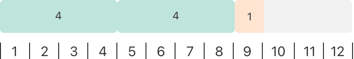
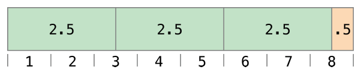

Basic Operators
===============

An :newTerm:`operator` is a special symbol or phrase that you use to
check, change, or combine values.
For example, the addition operator (``+``) adds two numbers,
as in ``let i = 1 + 2``,
and the logical AND operator (``&&``) combines two Boolean values,
as in ``if enteredDoorCode && passedRetinaScan``.

Swift supports most standard C operators
and improves several capabilities to eliminate common coding errors.
The assignment operator (``=``) does not return a value,
to prevent it from being mistakenly used when
the equal to operator (``==``) is intended.
Arithmetic operators (``+``, ``-``, ``*``, ``/``, ``%`` and so forth)
detect and disallow value overflow,
to avoid unexpected results when working with numbers that become larger or smaller
than the allowed value range of the type that stores them.
You can opt in to value overflow behavior
by using Swift's overflow operators,
as described in :ref:`AdvancedOperators_OverflowOperators`.

Unlike C, Swift lets you perform remainder (``%``) calculations on floating-point numbers.
Swift also provides two range operators (``a..<b`` and ``a...b``) not found in C,
as a shortcut for expressing a range of values.

This chapter describes the common operators in Swift.
:doc:`AdvancedOperators` covers Swift's advanced operators,
and describes how to define your own custom operators
and implement the standard operators for your own custom types.

.. _BasicOperators_Terminology:

Terminology
-----------

Operators are unary, binary, or ternary:

* :newTerm:`Unary` operators operate on a single target (such as ``-a``).
  Unary :newTerm:`prefix` operators appear immediately before their target (such as ``!b``),
  and unary :newTerm:`postfix` operators appear immediately after their target (such as ``c!``).
* :newTerm:`Binary` operators operate on two targets (such as ``2 + 3``)
  and are :newTerm:`infix` because they appear in between their two targets.
* :newTerm:`Ternary` operators operate on three targets.
  Like C, Swift has only one ternary operator,
  the ternary conditional operator (``a ? b : c``).

The values that operators affect are :newTerm:`operands`.
In the expression ``1 + 2``, the ``+`` symbol is a binary operator
and its two operands are the values ``1`` and ``2``.

.. _BasicOperators_AssignmentOperator:

Assignment Operator
-------------------

The :newTerm:`assignment operator` (``a = b``)
initializes or updates the value of ``a`` with the value of ``b``:

.. testcode:: assignmentOperator

   -> let b = 10
   << // b : Int = 10
   -> var a = 5
   << // a : Int = 5
   -> a = b
   /> a is now equal to \(a)
   </ a is now equal to 10

If the right side of the assignment is a tuple with multiple values,
its elements can be decomposed into multiple constants or variables at once:

.. testcode:: assignmentOperator

   -> let (x, y) = (1, 2)
   << // (x, y) : (Int, Int) = (1, 2)
   /> x is equal to \(x), and y is equal to \(y)
   </ x is equal to 1, and y is equal to 2

.. assertion:: tuple-unwrapping-with-var

   >> var (x, y) = (1, 2)
   << // (x, y) : (Int, Int) = (1, 2)

.. This still allows assignment to variables,
   even though var patterns have been removed,
   because it's parsed as a variable-declaration,
   using the first alternative where (x, y) is a pattern,
   but `var` comes from the variable-declaration-head
   rather than from the pattern.

Unlike the assignment operator in C and Objective-C,
the assignment operator in Swift does not itself return a value.
The following statement is not valid:

.. testcode:: assignmentOperatorInvalid

   -> if x = y {
         // this is not valid, because x = y does not return a value
      }
   !! <REPL Input>:1:4: error: use of unresolved identifier 'x'
   !! if x = y {
   !!    ^
   !! <REPL Input>:1:8: error: use of unresolved identifier 'y'
   !! if x = y {
   !!        ^

This feature prevents the assignment operator (``=``) from being used by accident
when the equal to operator (``==``) is actually intended.
By making ``if x = y`` invalid,
Swift helps you to avoid these kinds of errors in your code.

.. TODO: Should we mention that x = y = z is also not valid?
   If so, is there a convincing argument as to why this is a good thing?

.. _BasicOperators_ArithmeticOperators:

Arithmetic Operators
--------------------

Swift supports the four standard :newTerm:`arithmetic operators` for all number types:

* Addition (``+``)
* Subtraction (``-``)
* Multiplication (``*``)
* Division (``/``)

.. testcode:: arithmeticOperators

   -> 1 + 2       // equals 3
   << // r0 : Int = 3
   -> 5 - 3       // equals 2
   << // r1 : Int = 2
   -> 2 * 3       // equals 6
   << // r2 : Int = 6
   -> 10.0 / 2.5  // equals 4.0
   << // r3 : Double = 4.0

Unlike the arithmetic operators in C and Objective-C,
the Swift arithmetic operators do not allow values to overflow by default.
You can opt in to value overflow behavior by using Swift's overflow operators
(such as ``a &+ b``). See :ref:`AdvancedOperators_OverflowOperators`.

The addition operator is also supported for ``String`` concatenation:

.. testcode:: arithmeticOperators

   -> "hello, " + "world"  // equals "hello, world"
   << // r4 : String = "hello, world"

.. _BasicOperators_RemainderOperator:

Remainder Operator
~~~~~~~~~~~~~~~~~~

The :newTerm:`remainder operator` (``a % b``)
works out how many multiples of ``b`` will fit inside ``a``
and returns the value that is left over
(known as the :newTerm:`remainder`).

.. note::

   The remainder operator (``%``) is also known as
   a :newTerm:`modulo operator` in other languages.
   However, its behavior in Swift for negative numbers means that it is,
   strictly speaking, a remainder rather than a modulo operation.

.. assertion:: percentOperatorIsRemainderNotModulo

   -> for i in -5...0 {
         print(i % 4)
      }
   << -1
   << 0
   << -3
   << -2
   << -1
   << 0

Here's how the remainder operator works.
To calculate ``9 % 4``, you first work out how many ``4``\ s will fit inside ``9``:

You can fit two ``4``\ s inside ``9``, and the remainder is ``1`` (shown in orange).

In Swift, this would be written as:

.. testcode:: arithmeticOperators

   -> 9 % 4    // equals 1
   << // r5 : Int = 1

To determine the answer for ``a % b``,
the ``%`` operator calculates the following equation
and returns ``remainder`` as its output:

``a`` = (``b`` x ``some multiplier``) + ``remainder``

where ``some multiplier`` is the largest number of multiples of ``b``
that will fit inside ``a``.

Inserting ``9`` and ``4`` into this equation yields:

``9`` = (``4`` x ``2``) + ``1``

The same method is applied when calculating the remainder for a negative value of ``a``:

.. testcode:: arithmeticOperators

   -> -9 % 4   // equals -1
   << // r6 : Int = -1

Inserting ``-9`` and ``4`` into the equation yields:

``-9`` = (``4`` x ``-2``) + ``-1``

giving a remainder value of ``-1``.

The sign of ``b`` is ignored for negative values of ``b``.
This means that ``a % b`` and ``a % -b`` always give the same answer.

.. _BasicOperators_FloatingPointRemainderCalculations:

Floating-Point Remainder Calculations
~~~~~~~~~~~~~~~~~~~~~~~~~~~~~~~~~~~~~

Unlike the remainder operator in C and Objective-C,
Swift's remainder operator can also operate on floating-point numbers:

.. testcode:: arithmeticOperators

   -> 8 % 2.5   // equals 0.5
   << // r7 : Double = 0.5

In this example, ``8`` divided by ``2.5`` equals ``3``, with a remainder of ``0.5``,
so the remainder operator returns a ``Double`` value of ``0.5``.

.. _BasicOperators_UnaryMinusOperator:

Unary Minus Operator
~~~~~~~~~~~~~~~~~~~~

The sign of a numeric value can be toggled using a prefixed ``-``,
known as the :newTerm:`unary minus operator`:

.. testcode:: arithmeticOperators

   -> let three = 3
   << // three : Int = 3
   -> let minusThree = -three       // minusThree equals -3
   << // minusThree : Int = -3
   -> let plusThree = -minusThree   // plusThree equals 3, or "minus minus three"
   << // plusThree : Int = 3

The unary minus operator (``-``) is prepended directly before the value it operates on,
without any white space.

.. _BasicOperators_UnaryPlusOperator:

Unary Plus Operator
~~~~~~~~~~~~~~~~~~~

The :newTerm:`unary plus operator` (``+``) simply returns
the value it operates on, without any change:

.. testcode:: arithmeticOperators

   -> let minusSix = -6
   << // minusSix : Int = -6
   -> let alsoMinusSix = +minusSix  // alsoMinusSix equals -6
   << // alsoMinusSix : Int = -6

Although the unary plus operator doesn't actually do anything,
you can use it to provide symmetry in your code for positive numbers
when also using the unary minus operator for negative numbers.

.. _BasicOperators_CompoundAssignmentOperators:

Compound Assignment Operators
-----------------------------

Like C, Swift provides :newTerm:`compound assignment operators` that combine assignment (``=``) with another operation.
One example is the :newTerm:`addition assignment operator` (``+=``):

.. testcode:: compoundAssignment

   -> var a = 1
   << // a : Int = 1
   -> a += 2
   /> a is now equal to \(a)
   </ a is now equal to 3

The expression ``a += 2`` is shorthand for ``a = a + 2``.
Effectively, the addition and the assignment are combined into one operator
that performs both tasks at the same time.

.. note::

   The compound assignment operators do not return a value.
   For example, you cannot write ``let b = a += 2``.

A complete list of compound assignment operators can be found in :doc:`../ReferenceManual/Expressions`.

.. _BasicOperators_ComparisonOperators:

Comparison Operators
--------------------

Swift supports all standard C :newTerm:`comparison operators`:

* Equal to (``a == b``)
* Not equal to (``a != b``)
* Greater than (``a > b``)
* Less than (``a < b``)
* Greater than or equal to (``a >= b``)
* Less than or equal to (``a <= b``)

.. note::

   Swift also provides two :newTerm:`identity operators` (``===`` and ``!==``),
   which you use to test whether two object references both refer to the same object instance.
   For more information, see :doc:`ClassesAndStructures`.

Each of the comparison operators returns a ``Bool`` value to indicate whether or not the statement is true:

.. testcode:: comparisonOperators

   -> 1 == 1   // true, because 1 is equal to 1
   << // r0 : Bool = true
   -> 2 != 1   // true, because 2 is not equal to 1
   << // r1 : Bool = true
   -> 2 > 1    // true, because 2 is greater than 1
   << // r2 : Bool = true
   -> 1 < 2    // true, because 1 is less than 2
   << // r3 : Bool = true
   -> 1 >= 1   // true, because 1 is greater than or equal to 1
   << // r4 : Bool = true
   -> 2 <= 1   // false, because 2 is not less than or equal to 1
   << // r5 : Bool = false

Comparison operators are often used in conditional statements,
such as the ``if`` statement:

.. testcode:: comparisonOperators

   -> let name = "world"
   << // name : String = "world"
   -> if name == "world" {
         print("hello, world")
      } else {
         print("I'm sorry \(name), but I don't recognize you")
      }
   << hello, world
   // prints "hello, world", because name is indeed equal to "world"

For more on the ``if`` statement, see :doc:`ControlFlow`.

.. TODO: which types do these operate on by default?
   How do they work with strings?
   How about with tuples / with your own types?

.. _BasicOperators_TernaryConditionalOperator:

Ternary Conditional Operator
----------------------------

The :newTerm:`ternary conditional operator` is a special operator with three parts,
which takes the form ``question ? answer1 : answer2``.
It is a shortcut for evaluating one of two expressions
based on whether ``question`` is true or false.
If ``question`` is true, it evaluates ``answer1`` and returns its value;
otherwise, it evaluates ``answer2`` and returns its value.

The ternary conditional operator is shorthand for the code below:

.. testcode:: ternaryConditionalOperatorOutline

   >> let question = true
   << // question : Bool = true
   >> let answer1 = true
   << // answer1 : Bool = true
   >> let answer2 = true
   << // answer2 : Bool = true
   -> if question {
         answer1
      } else {
         answer2
      }

Here's an example, which calculates the height for a table row.
The row height should be 50 points taller than the content height
if the row has a header, and 20 points taller if the row doesn't have a header:

.. testcode:: ternaryConditionalOperatorPart1

   -> let contentHeight = 40
   << // contentHeight : Int = 40
   -> let hasHeader = true
   << // hasHeader : Bool = true
   -> let rowHeight = contentHeight + (hasHeader ? 50 : 20)
   << // rowHeight : Int = 90
   /> rowHeight is equal to \(rowHeight)
   </ rowHeight is equal to 90

The preceding example is shorthand for the code below:

.. testcode:: ternaryConditionalOperatorPart2
   :compile: true

   -> let contentHeight = 40
   -> let hasHeader = true
   -> let rowHeight: Int
   -> if hasHeader {
         rowHeight = contentHeight + 50
      } else {
         rowHeight = contentHeight + 20
      }
   /> rowHeight is equal to \(rowHeight)
   </ rowHeight is equal to 90

The first example's use of the ternary conditional operator means that
``rowHeight`` can be set to the correct value on a single line of code.
This is more concise than the second example,
and removes the need for ``rowHeight`` to be a variable,
because its value does not need to be modified within an ``if`` statement.

The ternary conditional operator provides
an efficient shorthand for deciding which of two expressions to consider.
Use the ternary conditional operator with care, however.
Its conciseness can lead to hard-to-read code if overused.
Avoid combining multiple instances of the ternary conditional operator into one compound statement.

.. _BasicOperators_NilCoalescingOperator:

Nil Coalescing Operator
-----------------------

The :newTerm:`nil coalescing operator` (``a ?? b``)
unwraps an optional ``a`` if it contains a value,
or returns a default value ``b`` if ``a`` is ``nil``.
The expression ``a`` is always of an optional type.
The expression ``b`` must match the type that is stored inside ``a``.

The nil coalescing operator is shorthand for the code below:

.. testcode:: nilCoalescingOperatorOutline

   >> var a: Int?
   << // a : Int? = nil
   >> let b = 42
   << // b : Int = 42
   -> a != nil ? a! : b
   << // r0 : Int = 42

The code above uses the ternary conditional operator and forced unwrapping (``a!``)
to access the value wrapped inside ``a`` when ``a`` is not ``nil``,
and to return ``b`` otherwise.
The nil coalescing operator provides a more elegant way to encapsulate
this conditional checking and unwrapping in a concise and readable form.

.. note::

   If the value of ``a`` is non-``nil``,
   the value of ``b`` is not evaluated.
   This is known as :newTerm:`short-circuit evaluation`.

The example below uses the nil coalescing operator to choose between
a default color name and an optional user-defined color name:

.. testcode:: nilCoalescingOperator

   -> let defaultColorName = "red"
   << // defaultColorName : String = "red"
   -> var userDefinedColorName: String?   // defaults to nil
   << // userDefinedColorName : String? = nil
   ---
   -> var colorNameToUse = userDefinedColorName ?? defaultColorName
   << // colorNameToUse : String = "red"
   /> userDefinedColorName is nil, so colorNameToUse is set to the default of \"\(colorNameToUse)\"
   </ userDefinedColorName is nil, so colorNameToUse is set to the default of "red"

The ``userDefinedColorName`` variable is defined as an optional ``String``,
with a default value of ``nil``.
Because ``userDefinedColorName`` is of an optional type,
you can use the nil coalescing operator to consider its value.
In the example above, the operator is used to determine
an initial value for a ``String`` variable called ``colorNameToUse``.
Because ``userDefinedColorName`` is ``nil``,
the expression ``userDefinedColorName ?? defaultColorName`` returns
the value of ``defaultColorName``, or ``"red"``.

If you assign a non-``nil`` value to ``userDefinedColorName``
and perform the nil coalescing operator check again,
the value wrapped inside ``userDefinedColorName`` is used instead of the default:

.. testcode:: nilCoalescingOperator

   -> userDefinedColorName = "green"
   -> colorNameToUse = userDefinedColorName ?? defaultColorName
   /> userDefinedColorName is not nil, so colorNameToUse is set to \"\(colorNameToUse)\"
   </ userDefinedColorName is not nil, so colorNameToUse is set to "green"

.. _BasicOperators_RangeOperators:

Range Operators
---------------

Swift includes two :newTerm:`range operators`,
which are shortcuts for expressing a range of values.

.. _BasicOperators_ClosedRangeOperator:

Closed Range Operator
~~~~~~~~~~~~~~~~~~~~~

The :newTerm:`closed range operator` (``a...b``)
defines a range that runs from ``a`` to ``b``,
and includes the values ``a`` and ``b``.
The value of ``a`` must not be greater than ``b``.

.. assertion:: closedRangeStartCanBeLessThanEnd

   -> let range = 1...2
   << // range : Range<Int> = Range(1..<3)

.. assertion:: closedRangeStartCanBeTheSameAsEnd

   -> let range = 1...1
   << // range : Range<Int> = Range(1..<2)

.. assertion:: closedRangeStartCannotBeGreaterThanEnd

   -> let range = 1...0
   xx assertion

The closed range operator is useful when iterating over a range
in which you want all of the values to be used,
such as with a ``for``-``in`` loop:

.. testcode:: rangeOperators

   -> for index in 1...5 {
         print("\(index) times 5 is \(index * 5)")
      }
   </ 1 times 5 is 5
   </ 2 times 5 is 10
   </ 3 times 5 is 15
   </ 4 times 5 is 20
   </ 5 times 5 is 25

For more on ``for``-``in`` loops, see :doc:`ControlFlow`.

.. _BasicOperators_HalfClosedRangeOperator:

Half-Open Range Operator
~~~~~~~~~~~~~~~~~~~~~~~~

The :newTerm:`half-open range operator` (``a..<b``)
defines a range that runs from ``a`` to ``b``,
but does not include ``b``.
It is said to be :newTerm:`half-open`
because it contains its first value, but not its final value.
As with the closed range operator,
the value of ``a`` must not be greater than ``b``.
If the value of ``a`` is equal to ``b``,
then the resulting range will be empty.

.. assertion:: halfOpenRangeStartCanBeLessThanEnd

   -> let range = 1..<2
   << // range : Range<Int> = Range(1..<2)

.. assertion:: halfOpenRangeStartCanBeTheSameAsEnd

   -> let range = 1..<1
   << // range : Range<Int> = Range(1..<1)

.. assertion:: halfOpenRangeStartCannotBeGreaterThanEnd

   -> let range = 1..<0
   xx assertion

Half-open ranges are particularly useful when you work with
zero-based lists such as arrays,
where it is useful to count up to (but not including) the length of the list:

.. testcode:: rangeOperators

   -> let names = ["Anna", "Alex", "Brian", "Jack"]
   << // names : [String] = ["Anna", "Alex", "Brian", "Jack"]
   -> let count = names.count
   << // count : Int = 4
   -> for i in 0..<count {
         print("Person \(i + 1) is called \(names[i])")
      }
   </ Person 1 is called Anna
   </ Person 2 is called Alex
   </ Person 3 is called Brian
   </ Person 4 is called Jack

Note that the array contains four items,
but ``0..<count`` only counts as far as ``3``
(the index of the last item in the array),
because it is a half-open range.
For more on arrays, see :ref:`CollectionTypes_Arrays`.

.. _BasicOperators_LogicalOperators:

Logical Operators
-----------------

:newTerm:`Logical operators` modify or combine
the Boolean logic values ``true`` and ``false``.
Swift supports the three standard logical operators found in C-based languages:

* Logical NOT (``!a``)
* Logical AND (``a && b``)
* Logical OR (``a || b``)

.. _BasicOperators_LogicalNOTOperator:

Logical NOT Operator
~~~~~~~~~~~~~~~~~~~~

The :newTerm:`logical NOT operator` (``!a``) inverts a Boolean value so that ``true`` becomes ``false``,
and ``false`` becomes ``true``.

The logical NOT operator is a prefix operator,
and appears immediately before the value it operates on,
without any white space.
It can be read as “not ``a``”, as seen in the following example:

.. testcode:: logicalOperators

   -> let allowedEntry = false
   << // allowedEntry : Bool = false
   -> if !allowedEntry {
         print("ACCESS DENIED")
      }
   <- ACCESS DENIED

The phrase ``if !allowedEntry`` can be read as “if not allowed entry.”
The subsequent line is only executed if “not allowed entry” is true;
that is, if ``allowedEntry`` is ``false``.

As in this example,
careful choice of Boolean constant and variable names
can help to keep code readable and concise,
while avoiding double negatives or confusing logic statements.

.. _BasicOperators_LogicalANDOperator:

Logical AND Operator
~~~~~~~~~~~~~~~~~~~~

The :newTerm:`logical AND operator` (``a && b``) creates logical expressions
where both values must be ``true`` for the overall expression to also be ``true``.

If either value is ``false``,
the overall expression will also be ``false``.
In fact, if the *first* value is ``false``,
the second value won't even be evaluated,
because it can't possibly make the overall expression equate to ``true``.
This is known as :newTerm:`short-circuit evaluation`.

This example considers two ``Bool`` values
and only allows access if both values are ``true``:

.. testcode:: logicalOperators

   -> let enteredDoorCode = true
   << // enteredDoorCode : Bool = true
   -> let passedRetinaScan = false
   << // passedRetinaScan : Bool = false
   -> if enteredDoorCode && passedRetinaScan {
         print("Welcome!")
      } else {
         print("ACCESS DENIED")
      }
   <- ACCESS DENIED

.. _BasicOperators_LogicalOROperator:

Logical OR Operator
~~~~~~~~~~~~~~~~~~~

The :newTerm:`logical OR operator`
(``a || b``) is an infix operator made from two adjacent pipe characters.
You use it to create logical expressions in which
only *one* of the two values has to be ``true``
for the overall expression to be ``true``.

Like the Logical AND operator above,
the Logical OR operator uses short-circuit evaluation to consider its expressions.
If the left side of a Logical OR expression is ``true``,
the right side is not evaluated,
because it cannot change the outcome of the overall expression.

In the example below,
the first ``Bool`` value (``hasDoorKey``) is ``false``,
but the second value (``knowsOverridePassword``) is ``true``.
Because one value is ``true``,
the overall expression also evaluates to ``true``,
and access is allowed:

.. testcode:: logicalOperators

   -> let hasDoorKey = false
   << // hasDoorKey : Bool = false
   -> let knowsOverridePassword = true
   << // knowsOverridePassword : Bool = true
   -> if hasDoorKey || knowsOverridePassword {
         print("Welcome!")
      } else {
         print("ACCESS DENIED")
      }
   <- Welcome!

.. _BasicOperators_CombiningLogicalOperators:

Combining Logical Operators
~~~~~~~~~~~~~~~~~~~~~~~~~~~

You can combine multiple logical operators to create longer compound expressions:

.. testcode:: logicalOperators

   -> if enteredDoorCode && passedRetinaScan || hasDoorKey || knowsOverridePassword {
         print("Welcome!")
      } else {
         print("ACCESS DENIED")
      }
   <- Welcome!

This example uses multiple ``&&`` and ``||`` operators to create a longer compound expression.
However, the ``&&`` and ``||`` operators still operate on only two values,
so this is actually three smaller expressions chained together.
The example can be read as:

If we've entered the correct door code and passed the retina scan,
or if we have a valid door key,
or if we know the emergency override password,
then allow access.

Based on the values of ``enteredDoorCode``, ``passedRetinaScan``, and ``hasDoorKey``,
the first two subexpressions are ``false``.
However, the emergency override password is known,
so the overall compound expression still evaluates to ``true``.

.. note::

   The Swift logical operators ``&&`` and ``||`` are left-associative,
   meaning that compound expressions with multiple logical operators
   evaluate the leftmost subexpression first.

.. _BasicOperators_Explicit Parentheses:

Explicit Parentheses
~~~~~~~~~~~~~~~~~~~~

It is sometimes useful to include parentheses when they are not strictly needed,
to make the intention of a complex expression easier to read.
In the door access example above,
it is useful to add parentheses around the first part of the compound expression
to make its intent explicit:

.. testcode:: logicalOperators

   -> if (enteredDoorCode && passedRetinaScan) || hasDoorKey || knowsOverridePassword {
         print("Welcome!")
      } else {
         print("ACCESS DENIED")
      }
   <- Welcome!

The parentheses make it clear that the first two values
are considered as part of a separate possible state in the overall logic.
The output of the compound expression doesn't change,
but the overall intention is clearer to the reader.
Readability is always preferred over brevity;
use parentheses where they help to make your intentions clear.
