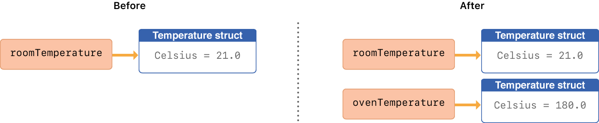
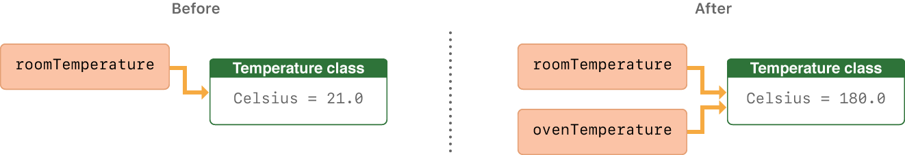

Structures and Classes
======================

:newTerm:`Structures` and :newTerm:`classes` are general-purpose,
flexible constructs that become the building blocks of your program's code.
You define properties and methods to add functionality to your structures and classes
using the same syntax you use to define constants, variables, and functions.

Unlike other programming languages,
Swift doesn't require you to create separate interface and implementation files
for custom structures and classes.
In Swift, you define a structure or class in a single file,
and the external interface to that class or structure is
automatically made available for other code to use.

.. note::

   An instance of a class is traditionally known as an :newTerm:`object`.
   However, Swift structures and classes
   are much closer in functionality than in other languages,
   and much of this chapter describes functionality that applies to
   instances of *either* a class or a structure type.
   Because of this, the more general term :newTerm:`instance` is used.

.. _ClassesAndStructures_ComparingClassesAndStructures:

Comparing Structures and Classes
--------------------------------

Structures and classes in Swift have many things in common.
Both can:

* Define properties to store values
* Define methods to provide functionality
* Define subscripts to provide access to their values using subscript syntax
* Define initializers to set up their initial state
* Be extended to expand their functionality beyond a default implementation
* Conform to protocols to provide standard functionality of a certain kind

For more information, see
:doc:`Properties`, :doc:`Methods`, :doc:`Subscripts`, :doc:`Initialization`,
:doc:`Extensions`, and :doc:`Protocols`.

Classes have additional capabilities that structures don't have:

* Inheritance enables one class to inherit the characteristics of another.
* Type casting enables you to check and interpret the type of a class instance at runtime.
* Deinitializers enable an instance of a class to free up any resources it has assigned.
* Reference counting allows more than one reference to a class instance.

For more information, see
:doc:`Inheritance`, :doc:`TypeCasting`, :doc:`Deinitialization`,
and :doc:`AutomaticReferenceCounting`.

The additional capabilities that classes support
come at the cost of increased complexity.
As a general guideline,
prefer structures because they're easier to reason about,
and use classes when they're appropriate or necessary.
In practice, this means most of the custom data types you define
will be structures and enumerations.
For a more detailed comparison,
see `Choosing Between Structures and Classes <https://developer.apple.com/documentation/swift/choosing_between_structures_and_classes>`_.

.. _ClassesAndStructures_DefinitionSyntax:

Definition Syntax
~~~~~~~~~~~~~~~~~

Structures and classes have a similar definition syntax.
You introduce structures with the ``struct`` keyword
and classes with the ``class`` keyword.
Both place their entire definition within a pair of braces:

.. testcode:: ClassesAndStructures

   -> struct SomeStructure {
         // structure definition goes here
      }
   -> class SomeClass {
         // class definition goes here
      }

.. note::

   Whenever you define a new structure or class,
   you define a new Swift type.
   Give types ``UpperCamelCase`` names
   (such as ``SomeStructure`` and ``SomeClass`` here)
   to match the capitalization of standard Swift types
   (such as ``String``, ``Int``, and ``Bool``).
   Give properties and methods ``lowerCamelCase`` names
   (such as ``frameRate`` and ``incrementCount``)
   to differentiate them from type names.

Here's an example of a structure definition and a class definition:

.. testcode:: ClassesAndStructures

   -> struct Resolution {
         var width = 0
         var height = 0
      }
   -> class VideoMode {
         var resolution = Resolution()
         var interlaced = false
         var frameRate = 0.0
         var name: String?
      }

The example above defines a new structure called ``Resolution``,
to describe a pixel-based display resolution.
This structure has two stored properties called ``width`` and ``height``.
Stored properties are constants or variables that are bundled up and stored
as part of the structure or class.
These two properties are inferred to be of type ``Int``
by setting them to an initial integer value of ``0``.

The example above also defines a new class called ``VideoMode``,
to describe a specific video mode for video display.
This class has four variable stored properties.
The first, ``resolution``, is initialized with a new ``Resolution`` structure instance,
which infers a property type of ``Resolution``.
For the other three properties,
new ``VideoMode`` instances will be initialized with
an ``interlaced`` setting of ``false`` (meaning “noninterlaced video”),
a playback frame rate of ``0.0``,
and an optional ``String`` value called ``name``.
The ``name`` property is automatically given a default value of ``nil``,
or “no ``name`` value”, because it's of an optional type.

.. _ClassesAndStructures_ClassAndStructureInstances:

Structure and Class Instances
~~~~~~~~~~~~~~~~~~~~~~~~~~~~~

The ``Resolution`` structure definition and the ``VideoMode`` class definition
only describe what a ``Resolution`` or ``VideoMode`` will look like.
They themselves don't describe a specific resolution or video mode.
To do that, you need to create an instance of the structure or class.

The syntax for creating instances is very similar for both structures and classes:

.. testcode:: ClassesAndStructures

   -> let someResolution = Resolution()
   << // someResolution : Resolution = REPL.Resolution(width: 0, height: 0)
   -> let someVideoMode = VideoMode()
   << // someVideoMode : VideoMode = REPL.VideoMode

Structures and classes both use initializer syntax for new instances.
The simplest form of initializer syntax uses the type name of the class or structure
followed by empty parentheses, such as ``Resolution()`` or ``VideoMode()``.
This creates a new instance of the class or structure,
with any properties initialized to their default values.
Class and structure initialization is described in more detail
in :doc:`Initialization`.

.. TODO: note that you can only use the default constructor if you provide default values
   for all properties on a structure or class.

.. _ClassesAndStructures_AccessingProperties:

Accessing Properties
~~~~~~~~~~~~~~~~~~~~

You can access the properties of an instance using :newTerm:`dot syntax`.
In dot syntax, you write the property name immediately after the instance name,
separated by a period (``.``), without any spaces:

.. testcode:: ClassesAndStructures

   -> print("The width of someResolution is \(someResolution.width)")
   <- The width of someResolution is 0

In this example,
``someResolution.width`` refers to the ``width`` property of ``someResolution``,
and returns its default initial value of ``0``.

You can drill down into subproperties,
such as the ``width`` property in the ``resolution`` property of a ``VideoMode``:

.. testcode:: ClassesAndStructures

   -> print("The width of someVideoMode is \(someVideoMode.resolution.width)")
   <- The width of someVideoMode is 0

You can also use dot syntax to assign a new value to a variable property:

.. testcode:: ClassesAndStructures

   -> someVideoMode.resolution.width = 1280
   -> print("The width of someVideoMode is now \(someVideoMode.resolution.width)")
   <- The width of someVideoMode is now 1280

.. _ClassesAndStructures_MemberwiseInitializersForStructureTypes:

Memberwise Initializers for Structure Types
~~~~~~~~~~~~~~~~~~~~~~~~~~~~~~~~~~~~~~~~~~~

All structures have an automatically generated :newTerm:`memberwise initializer`,
which you can use to initialize the member properties of new structure instances.
Initial values for the properties of the new instance
can be passed to the memberwise initializer by name:

.. testcode:: ClassesAndStructures

   -> let vga = Resolution(width: 640, height: 480)
   << // vga : Resolution = REPL.Resolution(width: 640, height: 480)

Unlike structures, class instances don't receive a default memberwise initializer.
Initializers are described in more detail in :doc:`Initialization`.

.. assertion:: classesDontHaveADefaultMemberwiseInitializer

   -> class C { var x = 0, y = 0 }
   -> let c = C(x: 1, y: 1)
   !$ error: argument passed to call that takes no arguments
   !! let c = C(x: 1, y: 1)
   !!         ^~~~~~~~~~~~
   !!-

.. _ClassesAndStructures_StructuresAndEnumerationsAreValueTypes:

Structures and Enumerations Are Value Types
-------------------------------------------

A :newTerm:`value type` is a type whose value is *copied*
when it's assigned to a variable or constant,
or when it's passed to a function.

You've actually been using value types extensively throughout the previous chapters.
In fact, all of the basic types in Swift ---
integers, floating-point numbers, Booleans, strings, arrays and dictionaries ---
are value types, and are implemented as structures behind the scenes.

All structures and enumerations are value types in Swift.
This means that any structure and enumeration instances you create ---
and any value types they have as properties ---
are always copied when they are passed around in your code.

.. note::

    Collections defined by the standard library
    like arrays, dictionaries, and strings
    use an optimization to reduce the performance cost of copying.
    Instead of making a copy immediately,
    these collections share the memory where the elements are stored
    between the original instance and any copies.
    If one of the copies of the collection is modified,
    the elements are copied just before the modification.
    The behavior you see in your code
    is always as if a copy took place immediately.

Consider this example, which uses the ``Resolution`` structure from the previous example:

.. testcode:: ClassesAndStructures

   -> let hd = Resolution(width: 1920, height: 1080)
   << // hd : Resolution = REPL.Resolution(width: 1920, height: 1080)
   -> var cinema = hd
   << // cinema : Resolution = REPL.Resolution(width: 1920, height: 1080)

This example declares a constant called ``hd``
and sets it to a ``Resolution`` instance initialized with
the width and height of full HD video
(1920 pixels wide by 1080 pixels high).

It then declares a variable called ``cinema``
and sets it to the current value of ``hd``.
Because ``Resolution`` is a structure,
a *copy* of the existing instance is made,
and this new copy is assigned to ``cinema``.
Even though ``hd`` and ``cinema`` now have the same width and height,
they are two completely different instances behind the scenes.

Next, the ``width`` property of ``cinema`` is amended to be
the width of the slightly wider 2K standard used for digital cinema projection
(2048 pixels wide and 1080 pixels high):

.. testcode:: ClassesAndStructures

   -> cinema.width = 2048

Checking the ``width`` property of ``cinema``
shows that it has indeed changed to be ``2048``:

.. testcode:: ClassesAndStructures

   -> print("cinema is now \(cinema.width) pixels wide")
   <- cinema is now 2048 pixels wide

However, the ``width`` property of the original ``hd`` instance
still has the old value of ``1920``:

.. testcode:: ClassesAndStructures

   -> print("hd is still \(hd.width) pixels wide")
   <- hd is still 1920 pixels wide

When ``cinema`` was given the current value of ``hd``,
the *values* stored in ``hd`` were copied into the new ``cinema`` instance.
The end result was two completely separate instances
that contained the same numeric values.
However, because they are separate instances,
setting the width of ``cinema`` to ``2048``
doesn't affect the width stored in ``hd``,
as shown in the figure below:

The same behavior applies to enumerations:

.. testcode:: ClassesAndStructures

   -> enum CompassPoint {
         case north, south, east, west
         mutating func turnNorth() {
            self = .north
         }
      }
   -> var currentDirection = CompassPoint.west
   << // currentDirection : CompassPoint = REPL.CompassPoint.west
   -> let rememberedDirection = currentDirection
   << // rememberedDirection : CompassPoint = REPL.CompassPoint.west
   -> currentDirection.turnNorth()
   ---
   -> print("The current direction is \(currentDirection)")
   -> print("The remembered direction is \(rememberedDirection)")
   <- The current direction is north
   <- The remembered direction is west

When ``rememberedDirection`` is assigned the value of ``currentDirection``,
it's actually set to a copy of that value.
Changing the value of ``currentDirection`` thereafter doesn't affect
the copy of the original value that was stored in ``rememberedDirection``.

.. TODO: Should I give an example of passing a value type to a function here?

.. _ClassesAndStructures_ClassesAreReferenceTypes:

Classes Are Reference Types
---------------------------

Unlike value types, :newTerm:`reference types` are *not* copied
when they are assigned to a variable or constant,
or when they are passed to a function.
Rather than a copy, a reference to the same existing instance is used.

Here's an example, using the ``VideoMode`` class defined above:

.. testcode:: ClassesAndStructures

   -> let tenEighty = VideoMode()
   << // tenEighty : VideoMode = REPL.VideoMode
   -> tenEighty.resolution = hd
   -> tenEighty.interlaced = true
   -> tenEighty.name = "1080i"
   -> tenEighty.frameRate = 25.0

This example declares a new constant called ``tenEighty``
and sets it to refer to a new instance of the ``VideoMode`` class.
The video mode is assigned a copy of the HD resolution of ``1920`` by ``1080`` from before.
It's set to be interlaced,
its name is set to ``"1080i"``,
and its frame rate is set to ``25.0`` frames per second.

Next, ``tenEighty`` is assigned to a new constant, called ``alsoTenEighty``,
and the frame rate of ``alsoTenEighty`` is modified:

.. testcode:: ClassesAndStructures

   -> let alsoTenEighty = tenEighty
   << // alsoTenEighty : VideoMode = REPL.VideoMode
   -> alsoTenEighty.frameRate = 30.0

Because classes are reference types,
``tenEighty`` and ``alsoTenEighty`` actually both refer to the *same* ``VideoMode`` instance.
Effectively, they are just two different names for the same single instance,
as shown in the figure below:

Checking the ``frameRate`` property of ``tenEighty``
shows that it correctly reports the new frame rate of ``30.0``
from the underlying ``VideoMode`` instance:

.. testcode:: ClassesAndStructures

   -> print("The frameRate property of tenEighty is now \(tenEighty.frameRate)")
   <- The frameRate property of tenEighty is now 30.0

This example also shows how reference types can be harder to reason about.
If ``tenEighty`` and ``alsoTenEighty`` were far apart in your program's code,
it could be difficult to find all the ways that the video mode is changed.
Wherever you use ``tenEighty``,
you also have to think about the code that uses ``alsoTenEighty``,
and vice versa.
In contrast, value types are easier to reason about
because all of the code that interacts with the same value
is close together in your source files.

Note that ``tenEighty`` and ``alsoTenEighty`` are declared as *constants*,
rather than variables.
However, you can still change ``tenEighty.frameRate`` and ``alsoTenEighty.frameRate`` because
the values of the ``tenEighty`` and ``alsoTenEighty`` constants themselves don't actually change.
``tenEighty`` and ``alsoTenEighty`` themselves don't “store” the ``VideoMode`` instance ---
instead, they both *refer* to a ``VideoMode`` instance behind the scenes.
It's the ``frameRate`` property of the underlying ``VideoMode`` that is changed,
not the values of the constant references to that ``VideoMode``.

.. TODO: reiterate here that arrays and dictionaries are value types rather than reference types,
   and demonstrate what that means for the values they store
   when they themselves are value types or reference types.
   Also make a note about what this means for key copying,
   as per the swift-discuss email thread "Dictionaries and key copying"
   started by Alex Migicovsky on Mar 1 2014.

.. _ClassesAndStructures_IdentityOperators:

Identity Operators
~~~~~~~~~~~~~~~~~~

Because classes are reference types,
it's possible for multiple constants and variables to refer to
the same single instance of a class behind the scenes.
(The same isn't true for structures and enumerations,
because they are always copied when they are assigned to a constant or variable,
or passed to a function.)

.. assertion:: structuresDontSupportTheIdentityOperators

   -> struct S { var x = 0, y = 0 }
   -> let s1 = S()
   << // s1 : S = REPL.S(x: 0, y: 0)
   -> let s2 = S()
   << // s2 : S = REPL.S(x: 0, y: 0)
   -> if s1 === s2 { print("s1 === s2") } else { print("s1 !== s2") }
   !$ error: cannot convert value of type 'S' to expected argument type 'AnyObject?'
   !! if s1 === s2 { print("s1 === s2") } else { print("s1 !== s2") }
   !!       ^
   !! as AnyObject
   !$ error: cannot convert value of type 'S' to expected argument type 'AnyObject?'
   !! if s1 === s2 { print("s1 === s2") } else { print("s1 !== s2") }
   !!       ^
   !! as AnyObject

.. assertion:: enumerationsDontSupportTheIdentityOperators

   -> enum E { case a, b }
   -> let e1 = E.a
   << // e1 : E = REPL.E.a
   -> let e2 = E.b
   << // e2 : E = REPL.E.b
   -> if e1 === e2 { print("e1 === e2") } else { print("e1 !== e2") }
   !$ error: cannot convert value of type 'E' to expected argument type 'AnyObject?'
   !! if e1 === e2 { print("e1 === e2") } else { print("e1 !== e2") }
   !!       ^
   !! as AnyObject
   !$ error: cannot convert value of type 'E' to expected argument type 'AnyObject?'
   !! if e1 === e2 { print("e1 === e2") } else { print("e1 !== e2") }
   !!       ^
   !! as AnyObject

It can sometimes be useful to find out whether two constants or variables refer to
exactly the same instance of a class.
To enable this, Swift provides two identity operators:

* Identical to (``===``)
* Not identical to (``!==``)

Use these operators to check whether two constants or variables refer to the same single instance:

.. testcode:: ClassesAndStructures

   -> if tenEighty === alsoTenEighty {
         print("tenEighty and alsoTenEighty refer to the same VideoMode instance.")
      }
   <- tenEighty and alsoTenEighty refer to the same VideoMode instance.

Note that *identical to* (represented by three equals signs, or ``===``)
doesn't mean the same thing as *equal to* (represented by two equals signs, or ``==``).
*Identical to* means that
two constants or variables of class type refer to exactly the same class instance.
*Equal to* means that
two instances are considered equal or equivalent in value,
for some appropriate meaning of *equal*, as defined by the type's designer.

When you define your own custom structures and classes,
it's your responsibility to decide what qualifies as two instances being equal.
The process of defining your own implementations of the ``==`` and ``!=`` operators
is described in :ref:`AdvancedOperators_EquivalenceOperators`.

.. assertion:: classesDontGetEqualityByDefault

   -> class C { var x = 0, y = 0 }
   -> let c1 = C()
   << // c1 : C = REPL.C
   -> let c2 = C()
   << // c2 : C = REPL.C
   -> if c1 == c2 { print("c1 == c2") } else { print("c1 != c2") }
   !! <REPL Input>:1:7: error: binary operator '==' cannot be applied to two 'C' operands
   !! if c1 == c2 { print("c1 == c2") } else { print("c1 != c2") }
   !!    ~~ ^  ~~
   !~ <REPL Input>:1:7: note: overloads for '==' exist with these partially matching parameter lists:
   !! if c1 == c2 { print("c1 == c2") } else { print("c1 != c2") }
   !!       ^

.. assertion:: structuresDontGetEqualityByDefault

   -> struct S { var x = 0, y = 0 }
   -> let s1 = S()
   << // s1 : S = REPL.S(x: 0, y: 0)
   -> let s2 = S()
   << // s2 : S = REPL.S(x: 0, y: 0)
   -> if s1 == s2 { print("s1 == s2") } else { print("s1 != s2") }
   !! <REPL Input>:1:7: error: binary operator '==' cannot be applied to two 'S' operands
   !! if s1 == s2 { print("s1 == s2") } else { print("s1 != s2") }
   !!    ~~ ^  ~~
   !~ <REPL Input>:1:7: note: overloads for '==' exist with these partially matching parameter lists:
   !! if s1 == s2 { print("s1 == s2") } else { print("s1 != s2") }
   !!       ^

.. TODO: This needs clarifying with regards to function references.

.. _ClassesAndStructures_Pointers:

Pointers
~~~~~~~~

If you have experience with C, C++, or Objective-C,
you may know that these languages use :newTerm:`pointers` to refer to addresses in memory.
A Swift constant or variable that refers to an instance of some reference type
is similar to a pointer in C,
but isn't a direct pointer to an address in memory,
and doesn't require you to write an asterisk (``*``)
to indicate that you are creating a reference.
Instead, these references are defined like any other constant or variable in Swift.
The standard library provides pointer and buffer types
that you can use if you need to interact with pointers directly ---
see `Manual Memory Management <https://developer.apple.com/documentation/swift/swift_standard_library/manual_memory_management>`_.

.. TODO: functions aren't "instances". This needs clarifying.

.. TODO: Add a justification here to say why this is a good thing.

.. QUESTION: what's the deal with tuples and reference types / value types?
