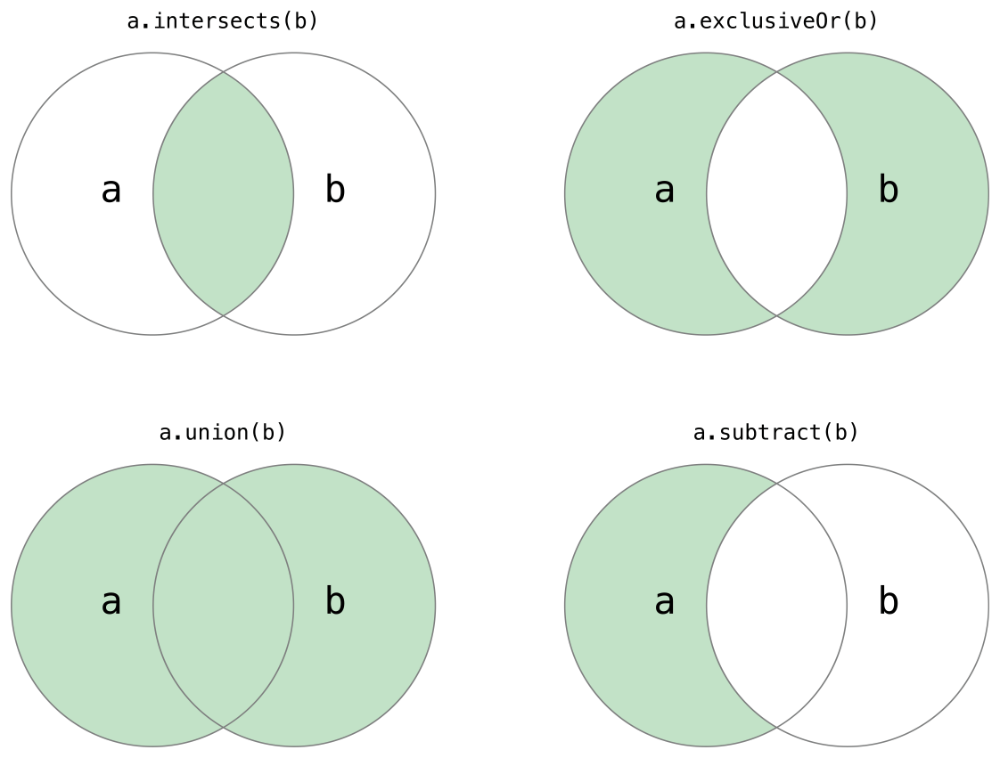
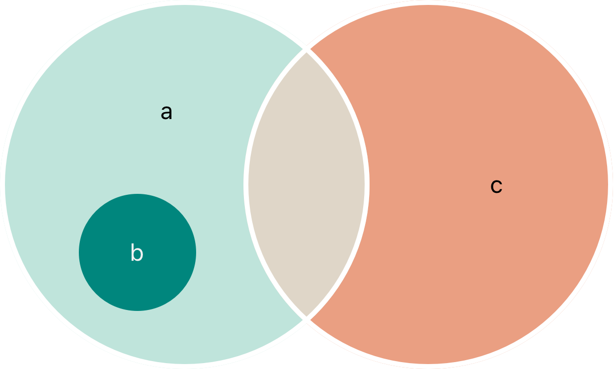

Collection Types
================

Swift provides three primary :newTerm:`collection types`,
known as arrays, sets, and dictionaries,
for storing collections of values.
Arrays are ordered collections of values.
Sets are unordered collections of distinct values.
Dictionaries are unordered collections of key-value associations.

Arrays, sets, and dictionaries in Swift are always clear about the types of values
and keys that they can store.
This means that you cannot insert a value of the wrong type
into a collection by mistake.
It also means you can be confident about the types of values
you will retrieve from a collection.
Swift's use of typed arrays, sets, and dictionaries ensures that
your code is always clear about the types of values a collection can work with
and enables you to catch any type mismatches early in your code's development.

.. note::

   Swift's array, set, and dictionary types are implemented as :newTerm:`generic collections`.
   For more on generic types and collections, see :doc:`Generics`.

.. TODO: should I mention the Collection protocol, to which both of these conform?

.. TODO: mention for i in indices(collection) { collection[i] }

.. TODO: discuss collection equality

.. _CollectionTypes_MutabilityOfCollections:

Mutability of Collections
-------------------------

If you create an array, a set, or a dictionary and assign it to a variable,
the collection that is created will be :newTerm:`mutable`.
This means that you can change (or :newTerm:`mutate`) the collection after it is created
by adding, removing, or changing items in the collection.
Conversely, if you assign an array, a set, or a dictionary to a constant,
that collection is :newTerm:`immutable`,
and its size and contents cannot be changed.

.. note::

   It is good practice to create immutable collections
   in all cases where the collection does not need to change.
   Doing so enables the Swift compiler to optimize the performance of
   the collections you create.

.. _CollectionTypes_Arrays:

Arrays
------

An :newTerm:`array` stores values of the same type in an ordered list.
The same value can appear in an array multiple times at different positions.

.. note::

   Swift's ``Array`` type is bridged to Foundation's ``NSArray`` class.

   For more information about using ``Array`` with Foundation and Cocoa,
   see `Using Swift with Cocoa and Objective-C <//apple_ref/doc/uid/TP40014216>`_.

.. _CollectionTypes_ArrayTypeShorthandSyntax:

Array Type Shorthand Syntax
~~~~~~~~~~~~~~~~~~~~~~~~~~~

The type of a Swift array is written in full as ``Array<SomeType>``,
where ``SomeType`` is the type of values the array is allowed to store.
You can also write the type of an array in shorthand form as ``[SomeType]``.
Although the two forms are functionally identical,
the shorthand form is preferred
and is used throughout this guide when referring to the type of an array.

.. _CollectionTypes_CreatingAndInitializingAnArray:

Creating and Initializing an Array
~~~~~~~~~~~~~~~~~~~~~~~~~~~~~~~~~~

You can create an empty array of a certain type
using initializer syntax:

.. testcode:: arraysEmpty

   -> var someInts = [Int]()
   << // someInts : [(Int)] = []
   -> println("someInts is of type [Int] with \(someInts.count) items.")
   <- someInts is of type [Int] with 0 items.

Note that the type of the ``someInts`` variable is inferred to be ``[Int]``
from the type of the initializer.

Alternatively, if the context already provides type information,
such as a function argument or an already typed variable or constant,
you can create an empty array with an empty array literal,
which is written as ``[]``
(an empty pair of square brackets):

.. testcode:: arraysEmpty

   -> someInts.append(3)
   /> someInts now contains \(someInts.count) value of type Int
   </ someInts now contains 1 value of type Int
   -> someInts = []
   // someInts is now an empty array, but is still of type [Int]

Swift's ``Array`` type also provides
an initializer for creating an array of a certain size
with all of its values set to a provided default value.
You pass this initializer the number of items to be added to the new array (called ``count``)
and a default value of the appropriate type (called ``repeatedValue``):

.. testcode:: arraysEmpty

   -> var threeDoubles = [Double](count: 3, repeatedValue: 0.0)
   << // threeDoubles : [(Double)] = [0.0, 0.0, 0.0]
   // threeDoubles is of type [Double], and equals [0.0, 0.0, 0.0]

You can create a new array by adding together two existing arrays with compatible types
with the addition operator (``+``).
The new array's type is inferred from the type of the two arrays you add together:

.. testcode:: arraysEmpty

   -> var anotherThreeDoubles = [Double](count: 3, repeatedValue: 2.5)
   << // anotherThreeDoubles : [(Double)] = [2.5, 2.5, 2.5]
   /> anotherThreeDoubles is inferred as [Double], and equals [\(anotherThreeDoubles[0]), \(anotherThreeDoubles[1]), \(anotherThreeDoubles[2])]
   </ anotherThreeDoubles is inferred as [Double], and equals [2.5, 2.5, 2.5]
   ---
   -> var sixDoubles = threeDoubles + anotherThreeDoubles
   << // sixDoubles : [(Double)] = [0.0, 0.0, 0.0, 2.5, 2.5, 2.5]
   /> sixDoubles is inferred as [Double], and equals [\(sixDoubles[0]), \(sixDoubles[1]), \(sixDoubles[2]), \(sixDoubles[3]), \(sixDoubles[4]), \(sixDoubles[5])]
   </ sixDoubles is inferred as [Double], and equals [0.0, 0.0, 0.0, 2.5, 2.5, 2.5]

.. TODO: func find<T: Equatable>(array: [T], value: T) -> Int?
   This is defined in Algorithm.swift,
   and gives a way to find the index of a value in an array if it exists.
   I'm holding off writing about it until NewArray lands.

.. TODO: mutating func sort(isOrderedBefore: (T, T) -> Bool)
   This is defined in Array.swift.
   Likewise I'm holding off writing about it until NewArray lands.

.. _CollectionTypes_ArrayLiterals:

Array Literals
~~~~~~~~~~~~~~

You can also initialize an array with an :newTerm:`array literal`,
which is a shorthand way to write one or more values as an array collection.
An array literal is written as a list of values, separated by commas,
surrounded by a pair of square brackets:

.. syntax-outline::

   [<#value 1#>, <#value 2#>, <#value 3#>]

The example below creates an array called ``shoppingList`` to store ``String`` values:

.. testcode:: arrays

   -> var shoppingList: [String] = ["Eggs", "Milk"]
   << // shoppingList : [String] = ["Eggs", "Milk"]
   // shoppingList has been initialized with two initial items

The ``shoppingList`` variable is declared as
“an array of string values”, written as ``[String]``.
Because this particular array has specified a value type of ``String``,
it is allowed to store ``String`` values only.
Here, the ``shoppingList`` array is initialized with two ``String`` values
(``"Eggs"`` and ``"Milk"``), written within an array literal.

.. note::

   The ``shoppingList`` array is declared as a variable (with the ``var`` introducer)
   and not a constant (with the ``let`` introducer)
   because more items are added to the shopping list in the examples below.

In this case, the array literal contains two ``String`` values and nothing else.
This matches the type of the ``shoppingList`` variable's declaration
(an array that can only contain ``String`` values),
and so the assignment of the array literal is permitted
as a way to initialize ``shoppingList`` with two initial items.

Thanks to Swift's type inference,
you don't have to write the type of the array
if you're initializing it with an array literal containing values of the same type.
The initialization of ``shoppingList`` could have been written in a shorter form instead:

.. testcode:: arraysInferred

   -> var shoppingList = ["Eggs", "Milk"]
   << // shoppingList : [String] = ["Eggs", "Milk"]

Because all values in the array literal are of the same type,
Swift can infer that ``[String]`` is
the correct type to use for the ``shoppingList`` variable.

.. _CollectionTypes_AccessingAndModifyingAnArray:

Accessing and Modifying an Array
~~~~~~~~~~~~~~~~~~~~~~~~~~~~~~~~

You access and modify an array through its methods and properties,
or by using subscript syntax.

To find out the number of items in an array, check its read-only ``count`` property:

.. testcode:: arraysInferred

   -> println("The shopping list contains \(shoppingList.count) items.")
   <- The shopping list contains 2 items.

Use the Boolean ``isEmpty`` property
as a shortcut for checking whether the ``count`` property is equal to ``0``:

.. testcode:: arraysInferred

   -> if shoppingList.isEmpty {
         println("The shopping list is empty.")
      } else {
         println("The shopping list is not empty.")
      }
   <- The shopping list is not empty.

You can add a new item to the end of an array by calling the array's ``append(_:)`` method:

.. testcode:: arraysInferred

   -> shoppingList.append("Flour")
   /> shoppingList now contains \(shoppingList.count) items, and someone is making pancakes
   </ shoppingList now contains 3 items, and someone is making pancakes

Alternatively, append an array of one or more compatible items
with the addition assignment operator (``+=``):

.. testcode:: arraysInferred

   -> shoppingList += ["Baking Powder"]
   /> shoppingList now contains \(shoppingList.count) items
   </ shoppingList now contains 4 items
   -> shoppingList += ["Chocolate Spread", "Cheese", "Butter"]
   /> shoppingList now contains \(shoppingList.count) items
   </ shoppingList now contains 7 items

Retrieve a value from the array by using :newTerm:`subscript syntax`,
passing the index of the value you want to retrieve within square brackets
immediately after the name of the array:

.. testcode:: arraysInferred

   -> var firstItem = shoppingList[0]
   << // firstItem : String = "Eggs"
   /> firstItem is equal to \"\(firstItem)\"
   </ firstItem is equal to "Eggs"

Note that the first item in the array has an index of ``0``, not ``1``.
Arrays in Swift are always zero-indexed.

You can use subscript syntax to change an existing value at a given index:

.. testcode:: arraysInferred

   -> shoppingList[0] = "Six eggs"
   /> the first item in the list is now equal to \"\(shoppingList[0])\" rather than \"Eggs\"
   </ the first item in the list is now equal to "Six eggs" rather than "Eggs"

You can also use subscript syntax to change a range of values at once,
even if the replacement set of values has a different length than the range you are replacing.
The following example replaces ``"Chocolate Spread"``, ``"Cheese"``, and ``"Butter"``
with ``"Bananas"`` and ``"Apples"``:

.. testcode:: arraysInferred

   -> shoppingList[4...6] = ["Bananas", "Apples"]
   /> shoppingList now contains \(shoppingList.count) items
   </ shoppingList now contains 6 items

.. note::

   You can't use subscript syntax to append a new item to the end of an array.

.. QUESTION: should I note here that you can't set the firstItem variable
   and expect the value in the array to change,
   because String is a value type?

To insert an item into the array at a specified index,
call the array's ``insert(_:atIndex:)`` method:

.. testcode:: arraysInferred

   -> shoppingList.insert("Maple Syrup", atIndex: 0)
   /> shoppingList now contains \(shoppingList.count) items
   </ shoppingList now contains 7 items
   /> \"\(shoppingList[0])\" is now the first item in the list
   </ "Maple Syrup" is now the first item in the list

This call to the ``insert(_:atIndex:)`` method inserts a new item with a value of ``"Maple Syrup"``
at the very beginning of the shopping list,
indicated by an index of ``0``.

Similarly, you remove an item from the array with the ``removeAtIndex(_:)`` method.
This method removes the item at the specified index and returns the removed item
(although you can ignore the returned value if you do not need it):

.. testcode:: arraysInferred

   -> let mapleSyrup = shoppingList.removeAtIndex(0)
   << // mapleSyrup : String = "Maple Syrup"
   // the item that was at index 0 has just been removed
   /> shoppingList now contains \(shoppingList.count) items, and no Maple Syrup
   </ shoppingList now contains 6 items, and no Maple Syrup
   /> the mapleSyrup constant is now equal to the removed \"\(mapleSyrup)\" string
   </ the mapleSyrup constant is now equal to the removed "Maple Syrup" string

.. note::

   If you try to access or modify a value for an index
   that is outside of an array's existing bounds,
   you will trigger a runtime error.
   However, you can check that an index is valid before using it,
   by comparing it to the array's ``count`` property.
   Except when ``count`` is ``0`` (meaning the array is empty),
   the largest valid index in an array will always be ``count - 1``,
   because arrays are indexed from zero.

Any gaps in an array are closed when an item is removed,
and so the value at index ``0`` is once again equal to ``"Six eggs"``:

.. testcode:: arraysInferred

   -> firstItem = shoppingList[0]
   /> firstItem is now equal to \"\(firstItem)\"
   </ firstItem is now equal to "Six eggs"

If you want to remove the final item from an array,
use the ``removeLast()`` method rather than the ``removeAtIndex(_:)`` method
to avoid the need to query the array's ``count`` property.
Like the ``removeAtIndex(_:)`` method, ``removeLast()`` returns the removed item:

.. testcode:: arraysInferred

   -> let apples = shoppingList.removeLast()
   << // apples : String = "Apples"
   // the last item in the array has just been removed
   /> shoppingList now contains \(shoppingList.count) items, and no apples
   </ shoppingList now contains 5 items, and no apples
   /> the apples constant is now equal to the removed \"\(apples)\" string
   </ the apples constant is now equal to the removed "Apples" string

.. TODO: write about the algorithmic methods on Array.

.. _CollectionTypes_IteratingOverAnArray:

Iterating Over an Array
~~~~~~~~~~~~~~~~~~~~~~~

You can iterate over the entire set of values in an array with the ``for``-``in`` loop:

.. testcode:: arraysInferred

   -> for item in shoppingList {
         println(item)
      }
   </ Six eggs
   </ Milk
   </ Flour
   </ Baking Powder
   </ Bananas

If you need the integer index of each item as well as its value,
use the global ``enumerate`` function to iterate over the array instead.
The ``enumerate`` function returns a tuple for each item in the array
composed of the index and the value for that item.
You can decompose the tuple into temporary constants or variables
as part of the iteration:

.. testcode:: arraysInferred

   -> for (index, value) in enumerate(shoppingList) {
         println("Item \(index + 1): \(value)")
      }
   </ Item 1: Six eggs
   </ Item 2: Milk
   </ Item 3: Flour
   </ Item 4: Baking Powder
   </ Item 5: Bananas

For more about the ``for``-``in`` loop, see :ref:`ControlFlow_ForLoops`.

.. _CollectionTypes_Sets:

Sets
----

A :newTerm:`set` stores distinct values of the same type
in a collection with no defined ordering.
You can use sets as an alternative to arrays when the order of items is not important,
or when you need to ensure that an item only appears once.

.. note::

   Swift's ``Set`` type is bridged to Foundation's ``NSSet`` class.

   For more information about using ``Set`` with Foundation and Cocoa,
   see `Using Swift with Cocoa and Objective-C <//apple_ref/doc/uid/TP40014216>`_.

.. TODO: Add note about performance characteristics of contains on sets as opposed to arrays?

.. _CollectionTypes_SetTypeShorthandSyntax:

Set Type Syntax
~~~~~~~~~~~~~~~

The type of a Swift set is written as ``Set<SomeType>``,
where ``SomeType`` is the type that the set is allowed to store.
Unlike arrays, sets do not have an equivalent shorthand form.

.. _CollectionTypes_CreatingAndInitializingASet:

Creating and Initializing a Set
~~~~~~~~~~~~~~~~~~~~~~~~~~~~~~~

You can create an empty set of a certain type
using initializer syntax:

.. testcode:: setsEmpty

   -> var letters = Set<Character>()
   << // letters : Set<Character> = Set([])
   -> println("letters is of type Set<Character> with \(letters.count) items.")
   <- letters is of type Set<Character> with 0 items.

Note that the type of the ``letters`` variable is inferred to be ``Set<Character>``,
from the type of the initializer.

Alternatively, if the context already provides type information,
such as a function argument or an already typed variable or constant,
you can create an empty set with an empty array literal:

.. testcode:: setsEmpty

   -> letters.insert("a")
   /> letters now contains \(letters.count) value of type Character
   </ letters now contains 1 value of type Character
   -> letters = []
   // letters is now an empty set, but is still of type Set<Character>

.. _CollectionTypes_SetWithArrayLiterals:

Sets with Array Literals
~~~~~~~~~~~~~~~~~~~~~~~~

You can also initialize a set with an array literal,
as a shorthand way to write one or more values as a set collection.

The example below creates a set called ``favoriteGenres`` to store ``String`` values:

.. testcode:: sets

   -> var favoriteGenres: Set<String> = ["Rock", "Classical", "Hip hop"]
   << // favoriteGenres : Set<String> = Set(["Rock", "Classical", "Hip hop"])
   // favoriteGenres has been initialized with three initial items

The ``favoriteGenres`` variable is declared as
“a set of ``String`` values”, written as ``Set<String>``.
Because this particular set has specified a value type of ``String``,
it is *only* allowed to store ``String`` values.
Here, the ``favoriteGenres`` set is initialized with three ``String`` values
(``"Rock"``, ``"Classical"``, and ``"Hip hop"``), written within an array literal.

.. note::

   The ``favoriteGenres`` set is declared as a variable (with the ``var`` introducer)
   and not a constant (with the ``let`` introducer)
   because items are added and removed in the examples below.

A set type cannot be inferred from an array literal alone,
so the type ``Set`` must be explicitly declared.
However, because of Swift's type inference,
you don't have to write the type of the set
if you're initializing it with an array literal containing values of the same type.
The initialization of ``favoriteGenres`` could have been written in a shorter form instead:

.. testcode:: setsInferred

   -> var favoriteGenres: Set = ["Rock", "Classical", "Hip hop"]
   << // favoriteGenres : Set<String> = Set(["Rock", "Classical", "Hip hop"])

Because all values in the array literal are of the same type,
Swift can infer that ``Set<String>`` is
the correct type to use for the ``favoriteGenres`` variable.

.. _CollectionTypes_AccessingAndModifyingASet:

Accessing and Modifying a Set
~~~~~~~~~~~~~~~~~~~~~~~~~~~~~

You access and modify a set through its methods and properties.

To find out the number of items in a set,
check its read-only ``count`` property:

.. testcode:: setUsage

   >> var favoriteGenres: Set = ["Rock", "Classical", "Hip hop"]
   << // favoriteGenres : Set<String> = Set(["Rock", "Classical", "Hip hop"])
   -> println("I have \(favoriteGenres.count) favorite music genres.")
   <- I have 3 favorite music genres.

Use the Boolean ``isEmpty`` property
as a shortcut for checking whether the ``count`` property is equal to ``0``:

.. testcode:: setUsage

   -> if favoriteGenres.isEmpty {
         println("As far as music goes, I'm not picky.")
      } else {
         println("I have particular music preferences.")
      }
   <- I have particular music preferences.

You can add a new item into a set by calling the set's ``insert(_:)`` method:

.. testcode:: setUsage

   -> favoriteGenres.insert("[Tool J]")
   /> favoriteGenres now contains \(favoriteGenres.count) items
   </ favoriteGenres now contains 4 items

You can remove an item from a set by calling the set's ``remove(_:)`` method,
which removes the item if it's a member of the set,
and returns the removed value,
or returns ``nil`` if the set did not contain it.
Alternatively, all items in a set can be removed with its ``removeAll()`` method.

.. testcode:: setUsage

   -> if let removedGenre = favoriteGenres.remove("Rock") {
         println("\(removedGenre)? I'm over it.")
      } else {
         println("I never much cared for that.")
      }
   <- Rock? I'm over it.

To check whether a set contains a particular item, use the ``contains(_:)`` method.

.. testcode:: setUsage

   -> if favoriteGenres.contains("Funk") {
          println("I get up on the good foot.")
      } else {
          println("It's too funky in here.")
      }
   <- It's too funky in here.

.. _CollectionTypes_IteratingOverASet:

Iterating Over a Set
~~~~~~~~~~~~~~~~~~~~

You can iterate over the values in a set with a ``for``-``in`` loop.

.. testcode:: setUsage

   -> for genre in favoriteGenres {
         println("\(genre)")
      }
   </ Classical
   </ [Tool J]
   </ Hip hop

For more about the ``for``-``in`` loop, see :ref:`ControlFlow_ForLoops`.

Swift's ``Set`` type does not have a defined ordering.
To iterate over the values of a set in a specific order,
use the global ``sorted`` function,
which returns an ordered collection of the provided sequence.

.. testcode:: setUsage

   -> for genre in sorted(favoriteGenres) {
         println("\(genre)")
      }
   </ Classical
   </ Hip hop
   </ [Tool J]

.. _CollectionTypes_PerformingSetOperations:

Performing Set Operations
-------------------------

You can efficiently perform fundamental set operations,
such as combining two sets together,
determining which values two sets have in common,
or determining whether two sets contain all, some, or none of the same values.

.. _CollectionTypes_ConstructingSets:

Constructing Sets
~~~~~~~~~~~~~~~~~

The illustration below depicts two sets--``a`` and ``b``--
with the results of various set operations represented by the shaded regions.

* Use the ``union(_:)`` method to create a new set with all of the values in both sets.
* Use the ``subtract(_:)`` method to create a new set with values not in the specified set.
* Use the ``intersect(_:)`` method to create a new set with only the values common to both sets.
* Use the ``exclusiveOr(_:)`` method to create a new set with values in either set, but not both.

.. testcode:: setOperations

   -> let oddDigits: Set = [1, 3, 5, 7, 9]
   << // oddDigits : Set<Int> = Set([5, 7, 3, 1, 9])
   -> let evenDigits: Set = [0, 2, 4, 6, 8]
   << // evenDigits : Set<Int> = Set([6, 2, 0, 4, 8])
   -> let singleDigitPrimeNumbers: Set = [2, 3, 5, 7]
   << // singleDigitPrimeNumbers : Set<Int> = Set([5, 7, 2, 3])
   -> sorted(oddDigits.union(evenDigits))
   // [0, 1, 2, 3, 4, 5, 6, 7, 8, 9]
   -> sorted(oddDigits.intersect(evenDigits))
   // []
   -> sorted(oddDigits.subtract(singleDigitPrimeNumbers))
   // [1, 9]
   -> sorted(oddDigits.exclusiveOr(singleDigitPrimeNumbers))
   // [1, 2, 9]

.. _CollectionTypes_ComparingSets:

Comparing Sets
~~~~~~~~~~~~~~

The illustration below depicts three sets--``a``, ``b`` and ``c``--
with overlapping regions representing elements shared between sets.
Set ``a`` is a :newTerm:`superset` of set ``b``,
because ``a`` contains all elements in ``b``.
Conversely, set ``b`` is a :newTerm:`subset` of set ``a``,
because all elements in ``b`` are also contained by ``a``.
Set ``b`` and set ``c`` are :newTerm:`disjoint` with one another,
because they share no elements in common.

* Use the “is equal” operator (``==``) to determine whether two sets contain all of the same values.
* Use the ``isSubsetOf(_:)`` method to determine whether all of the values of a set are contained in the specified set, or .
* Use the ``isSupersetOf(_:)`` method to determine whether a set contains all of the values in a specified set, or .
* Use the ``isStrictSubsetOf(_:)`` or ``isStrictSupersetOf(_:)`` methods to determine whether a set is a subset or superset, but not equal to, a specified set.
* Use the ``isDisjointWith(_:)`` method to determine whether two sets have any values in common.

.. testcode:: setOperations

   -> let houseAnimals: Set = ["🐶", "🐱"]
   << // houseAnimals : Set<String> = Set(["🐶", "🐱"])
   -> let farmAnimals: Set = ["🐮", "🐔", "🐑", "🐶", "🐱"]
   << // farmAnimals : Set<String> = Set(["🐮", "🐔", "🐑", "🐶", "🐱"])
   -> let cityAnimals: Set = ["🐦", "🐭"]
   << // cityAnimals : Set<String> = Set(["🐦", "🐭"])
   -> houseAnimals.isSubsetOf(farmAnimals)
   // true
   -> farmAnimals.isSupersetOf(houseAnimals)
   // true
   -> farmAnimals.isDisjointWith(cityAnimals)
   // true

.. _CollectionTypes_HashValuesForSetTypes:

Hash Values for Set Types
~~~~~~~~~~~~~~~~~~~~~~~~~

A type must be :newTerm:`hashable` in order to be stored in a set ---
that is, the type must provide a way to compute a :newTerm:`hash value` for itself.
A hash value is an ``Int`` value that is the same for all objects that compare equal,
such that if ``a == b``, it follows that ``a.hashValue == b.hashValue``.

All of Swift's basic types (such as ``String``, ``Int``, ``Double``, and ``Bool``)
are hashable by default, and can be used as set value types or dictionary key types.
Enumeration member values without associated values
(as described in :doc:`Enumerations`)
are also hashable by default.

.. note::

   You can use your own custom types as set value types or dictionary key types
   by making them conform to the ``Hashable`` protocol from Swift's standard library.
   Types that conform to the ``Hashable`` protocol must provide
   a gettable ``Int`` property called ``hashValue``.
   The value returned by a type's ``hashValue`` property
   is not required to be the same across different executions of the same program,
   or in different programs.

   Because the ``Hashable`` protocol conforms to ``Equatable``,
   conforming types must must also provide an implementation of the “is equal” operator (``==``).
   The ``Equatable`` protocol requires
   any conforming implementation of ``==`` to be an equivalence relation.
   That is, an implementation of ``==`` must satisfy the following three conditions,
   for all values ``a``, ``b``, and ``c``:

   * ``a == a`` (Reflexivity)
   * ``a == b`` implies ``b == a`` (Symmetry)
   * ``a == b && b == c`` implies ``a == c`` (Transitivity)

   For more information about conforming to protocols, see :doc:`Protocols`.

.. _CollectionTypes_Dictionaries:

Dictionaries
------------

A :newTerm:`dictionary` stores associations between
keys of the same type and values of the same type
in an collection with no defined ordering.
Each value is associated with a unique :newTerm:`key`,
which acts as an identifier for that value within the dictionary.
Unlike items in an array, items in a dictionary do not have a specified order.
You use a dictionary when you need to look up values based on their identifier,
in much the same way that a real-world dictionary is used to look up
the definition for a particular word.

.. note::

   Swift's ``Dictionary`` type is bridged to Foundation's ``NSDictionary`` class.

   For more information about using ``Dictionary`` with Foundation and Cocoa,
   see `Using Swift with Cocoa and Objective-C <//apple_ref/doc/uid/TP40014216>`_.

.. _CollectionTypes_DictionaryTypeShorthandSyntax:

Dictionary Type Shorthand Syntax
~~~~~~~~~~~~~~~~~~~~~~~~~~~~~~~~

The type of a Swift dictionary is written in full as ``Dictionary<Key, Value>``,
where ``Key`` is the type of value that can be used as a dictionary key,
and ``Value`` is the type of value that the dictionary stores for those keys.

.. note::
   A dictionary ``Key`` type must conform to the ``Hashable`` protocol,
   like a set's value type.

You can also write the type of a dictionary in shorthand form as ``[Key: Value]``.
Although the two forms are functionally identical,
the shorthand form is preferred
and is used throughout this guide when referring to the type of a dictionary.

.. _CollectionTypes_CreatingAnEmptyDictionary:

Creating an Empty Dictionary
~~~~~~~~~~~~~~~~~~~~~~~~~~~~

As with arrays,
you can create an empty ``Dictionary`` of a certain type by using initializer syntax:

.. testcode:: dictionariesEmpty

   -> var namesOfIntegers = [Int: String]()
   << // namesOfIntegers : [Int : String] = [:]
   // namesOfIntegers is an empty [Int: String] dictionary

This example creates an empty dictionary of type ``[Int: String]``
to store human-readable names of integer values.
Its keys are of type ``Int``, and its values are of type ``String``.

If the context already provides type information,
you can create an empty dictionary with an empty dictionary literal,
which is written as ``[:]``
(a colon inside a pair of square brackets):

.. testcode:: dictionariesEmpty

   -> namesOfIntegers[16] = "sixteen"
   /> namesOfIntegers now contains \(namesOfIntegers.count) key-value pair
   </ namesOfIntegers now contains 1 key-value pair
   -> namesOfIntegers = [:]
   // namesOfIntegers is once again an empty dictionary of type [Int: String]

.. _CollectionTypes_DictionaryLiterals:

Dictionary Literals
~~~~~~~~~~~~~~~~~~~

You can also initialize a dictionary with a :newTerm:`dictionary literal`,
which has a similar syntax to the array literal seen earlier.
A dictionary literal is a shorthand way to write
one or more key-value pairs as a ``Dictionary`` collection.

A :newTerm:`key-value pair` is a combination of a key and a value.
In a dictionary literal,
the key and value in each key-value pair are separated by a colon.
The key-value pairs are written as a list, separated by commas,
surrounded by a pair of square brackets:

.. syntax-outline::

   [<#key 1#>: <#value 1#>, <#key 2#>: <#value 2#>, <#key 3#>: <#value 3#>]

The example below creates a dictionary to store the names of international airports.
In this dictionary, the keys are three-letter International Air Transport Association codes,
and the values are airport names:

.. testcode:: dictionaries

   -> var airports: [String: String] = ["YYZ": "Toronto Pearson", "DUB": "Dublin"]
   << // airports : [String : String] = ["DUB": "Dublin", "YYZ": "Toronto Pearson"]

The ``airports`` dictionary is declared as having a type of ``[String: String]``,
which means “a ``Dictionary`` whose keys are of type ``String``,
and whose values are also of type ``String``”.

.. note::

   The ``airports`` dictionary is declared as a variable (with the ``var`` introducer),
   and not a constant (with the ``let`` introducer),
   because more airports are added to the dictionary in the examples below.

The ``airports`` dictionary is initialized with
a dictionary literal containing two key-value pairs.
The first pair has a key of ``"YYZ"`` and a value of ``"Toronto Pearson"``.
The second pair has a key of ``"DUB"`` and a value of ``"Dublin"``.

This dictionary literal contains two ``String: String`` pairs.
This key-value type matches the type of the ``airports`` variable declaration
(a dictionary with only ``String`` keys, and only ``String`` values),
and so the assignment of the dictionary literal is permitted
as a way to initialize the ``airports`` dictionary with two initial items.

As with arrays,
you don't have to write the type of the dictionary
if you're initializing it with a dictionary literal whose keys and values have consistent types.
The initialization of ``airports`` could have been written in a shorter form instead:

.. testcode:: dictionariesInferred

   -> var airports = ["YYZ": "Toronto Pearson", "DUB": "Dublin"]
   << // airports : [String : String] = ["DUB": "Dublin", "YYZ": "Toronto Pearson"]

Because all keys in the literal are of the same type as each other,
and likewise all values are of the same type as each other,
Swift can infer that ``[String: String]`` is
the correct type to use for the ``airports`` dictionary.

.. _CollectionTypes_AccessingAndModifyingADictionary:

Accessing and Modifying a Dictionary
~~~~~~~~~~~~~~~~~~~~~~~~~~~~~~~~~~~~

You access and modify a dictionary through its methods and properties,
or by using subscript syntax.
As with an array, you find out the number of items in a ``Dictionary``
by checking its read-only ``count`` property:

.. testcode:: dictionariesInferred

   -> println("The airports dictionary contains \(airports.count) items.")
   <- The airports dictionary contains 2 items.

Use the Boolean ``isEmpty`` property
as a shortcut for checking whether the ``count`` property is equal to ``0``:

.. testcode:: dictionariesInferred

   -> if airports.isEmpty {
         println("The airports dictionary is empty.")
      } else {
         println("The airports dictionary is not empty.")
      }
   <- The airports dictionary is not empty.

You can add a new item to a dictionary with subscript syntax.
Use a new key of the appropriate type as the subscript index,
and assign a new value of the appropriate type:

.. testcode:: dictionariesInferred

   -> airports["LHR"] = "London"
   /> the airports dictionary now contains \(airports.count) items
   </ the airports dictionary now contains 3 items

You can also use subscript syntax to change the value associated with a particular key:

.. testcode:: dictionariesInferred

   -> airports["LHR"] = "London Heathrow"
   >> var lhr = "LHR" // a hack to get around rdar://16336177
   << // lhr : String = "LHR"
   /> the value for \"LHR\" has been changed to \"\(airports[lhr]!)\"
   </ the value for "LHR" has been changed to "London Heathrow"

As an alternative to subscripting,
use a dictionary's ``updateValue(_:forKey:)`` method
to set or update the value for a particular key.
Like the subscript examples above, the ``updateValue(_:forKey:)`` method
sets a value for a key if none exists,
or updates the value if that key already exists.
Unlike a subscript, however,
the ``updateValue(_:forKey:)`` method returns the *old* value after performing an update.
This enables you to check whether or not an update took place.

The ``updateValue(_:forKey:)`` method returns an optional value
of the dictionary's value type.
For a dictionary that stores ``String`` values, for example,
the method returns a value of type ``String?``,
or “optional ``String``”.
This optional value contains the old value for that key if one existed before the update,
or ``nil`` if no value existed:

.. testcode:: dictionariesInferred

   -> if let oldValue = airports.updateValue("Dublin Airport", forKey: "DUB") {
         println("The old value for DUB was \(oldValue).")
      }
   <- The old value for DUB was Dublin.

You can also use subscript syntax to retrieve a value from the dictionary for a particular key.
Because it is possible to request a key for which no value exists,
a dictionary's subscript returns an optional value of the dictionary's value type.
If the dictionary contains a value for the requested key,
the subscript returns an optional value containing the existing value for that key.
Otherwise, the subscript returns ``nil``:

.. testcode:: dictionariesInferred

   -> if let airportName = airports["DUB"] {
         println("The name of the airport is \(airportName).")
      } else {
         println("That airport is not in the airports dictionary.")
      }
   <- The name of the airport is Dublin Airport.

You can use subscript syntax to remove a key-value pair from a dictionary
by assigning a value of ``nil`` for that key:

.. testcode:: dictionariesInferred

   -> airports["APL"] = "Apple International"
   // "Apple International" is not the real airport for APL, so delete it
   -> airports["APL"] = nil
   // APL has now been removed from the dictionary
   >> if let deletedName = airports["APL"] {
   >>    println("The key-value pair for APL has *not* been deleted, but it should have been!")
   >> } else {
   >>    println("APL has now been removed from the dictionary")
   >> }
   << APL has now been removed from the dictionary

Alternatively, remove a key-value pair from a dictionary
with the ``removeValueForKey(_:)`` method.
This method removes the key-value pair if it exists
and returns the removed value,
or returns ``nil`` if no value existed:

.. testcode:: dictionariesInferred

   -> if let removedValue = airports.removeValueForKey("DUB") {
         println("The removed airport's name is \(removedValue).")
      } else {
         println("The airports dictionary does not contain a value for DUB.")
      }
   <- The removed airport's name is Dublin Airport.

.. _CollectionTypes_IteratingOverADictionary:

Iterating Over a Dictionary
~~~~~~~~~~~~~~~~~~~~~~~~~~~

You can iterate over the key-value pairs in a dictionary with a ``for``-``in`` loop.
Each item in the dictionary is returned as a ``(key, value)`` tuple,
and you can decompose the tuple's members into temporary constants or variables
as part of the iteration:

.. testcode:: dictionariesInferred

   -> for (airportCode, airportName) in airports {
         println("\(airportCode): \(airportName)")
      }
   </ YYZ: Toronto Pearson
   </ LHR: London Heathrow

For more about the ``for``-``in`` loop, see :ref:`ControlFlow_ForLoops`.

You can also retrieve an iterable collection of a dictionary's keys or values
by accessing its ``keys`` and ``values`` properties:

.. testcode:: dictionariesInferred

   -> for airportCode in airports.keys {
         println("Airport code: \(airportCode)")
      }
   </ Airport code: YYZ
   </ Airport code: LHR
   ---
   -> for airportName in airports.values {
         println("Airport name: \(airportName)")
      }
   </ Airport name: Toronto Pearson
   </ Airport name: London Heathrow

If you need to use a dictionary's keys or values
with an API that takes an ``Array`` instance, initialize a new array
with the ``keys`` or ``values`` property:

.. testcode:: dictionariesInferred

   -> let airportCodes = [String](airports.keys)
   << // airportCodes : [(String)] = ["YYZ", "LHR"]
   /> airportCodes is [\"\(airportCodes[0])\", \"\(airportCodes[1])\"]
   </ airportCodes is ["YYZ", "LHR"]
   ---
   -> let airportNames = [String](airports.values)
   << // airportNames : [(String)] = ["Toronto Pearson", "London Heathrow"]
   /> airportNames is [\"\(airportNames[0])\", \"\(airportNames[1])\"]
   </ airportNames is ["Toronto Pearson", "London Heathrow"]

Swift's ``Dictionary`` type does not have a defined ordering.
To iterate over the keys or values of a dictionary in a specific order,
use the global ``sorted`` function on its ``keys`` or ``values`` property.
