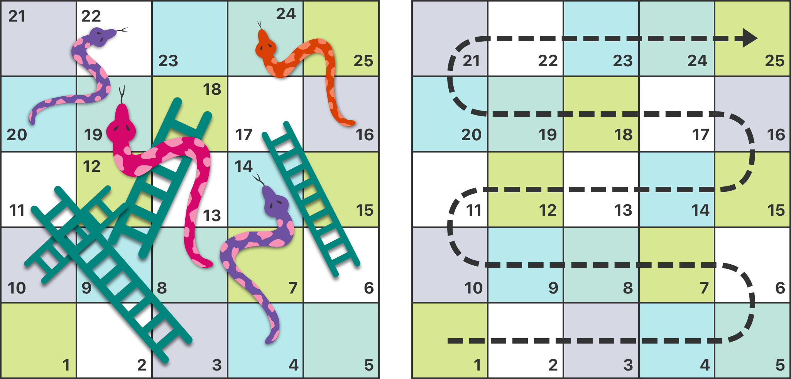
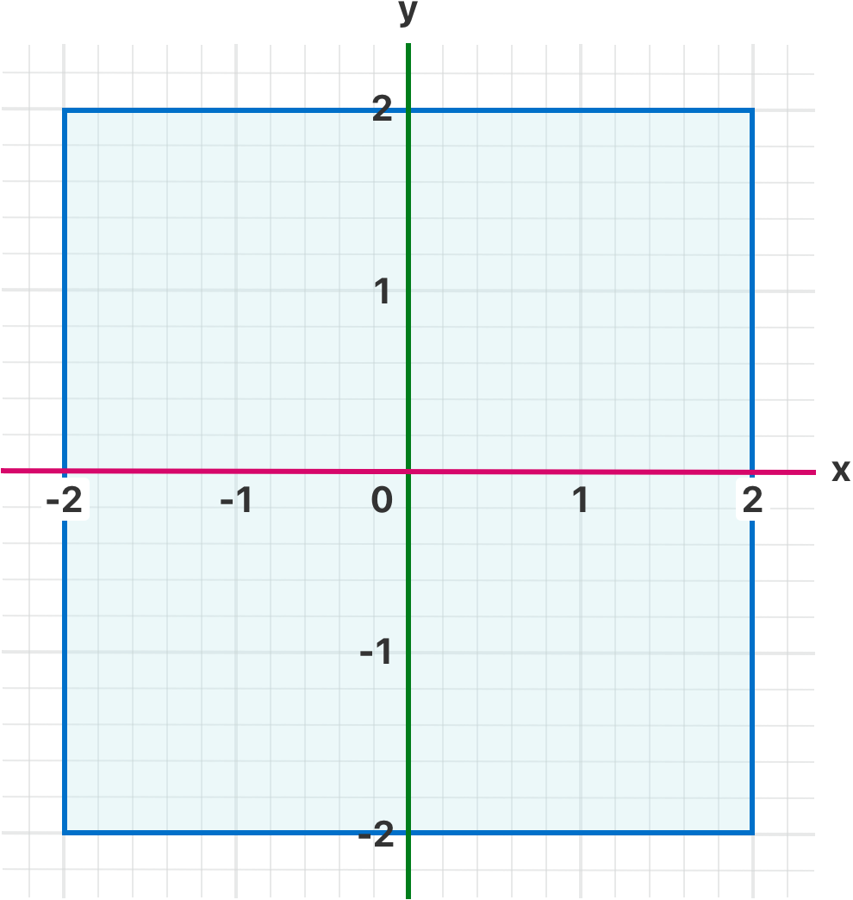
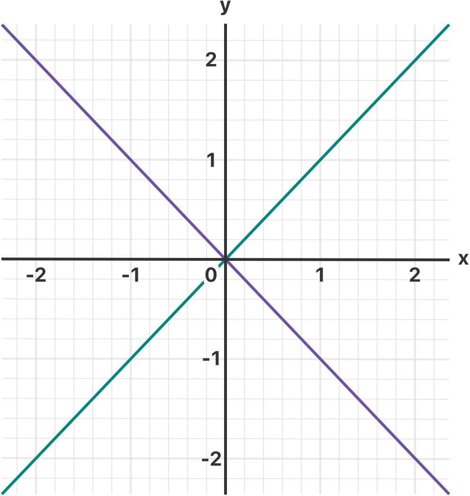

Control Flow
============

Swift provides a variety of control flow statements.
These include ``while`` loops to perform a task multiple times;
``if``, ``guard``, and ``switch`` statements
to execute different branches of code based on certain conditions;
and statements such as ``break`` and ``continue``
to transfer the flow of execution to another point in your code.

Swift also provides a ``for``-``in`` loop that makes it easy to iterate over
arrays, dictionaries, ranges, strings, and other sequences.

Swift's ``switch`` statement is also considerably more powerful
than its counterpart in many C-like languages.
Because the cases of a ``switch`` statement do not fall through to the next case in Swift,
it avoids common C errors caused by missing ``break`` statements.
Cases can match many different patterns,
including interval matches, tuples, and casts to a specific type.
Matched values in a ``switch`` case can be bound to temporary constants or variables
for use within the case's body,
and complex matching conditions can be expressed with a ``where`` clause for each case.

.. _ControlFlow_ForLoops:

For-In Loops
------------

You use the ``for``-``in`` loop to iterate over a sequence,
such as ranges of numbers, items in an array, or characters in a string.

This example prints the first few entries in the five-times table:

.. testcode:: forLoops

   -> for index in 1...5 {
         print("\(index) times 5 is \(index * 5)")
      }
   </ 1 times 5 is 5
   </ 2 times 5 is 10
   </ 3 times 5 is 15
   </ 4 times 5 is 20
   </ 5 times 5 is 25

The sequence being iterated over is
a range of numbers from ``1`` to ``5``, inclusive,
as indicated by the use of the closed range operator (``...``).
The value of ``index`` is set to the first number in the range (``1``),
and the statements inside the loop are executed.
In this case, the loop contains only one statement,
which prints an entry from the five-times table for the current value of ``index``.
After the statement is executed,
the value of ``index`` is updated to contain the second value in the range (``2``),
and the ``print(_:separator:terminator:)`` function is called again.
This process continues until the end of the range is reached.

In the example above, ``index`` is a constant whose value is automatically set
at the start of each iteration of the loop.
As such, ``index`` does not have to be declared before it is used.
It is implicitly declared simply by its inclusion in the loop declaration,
without the need for a ``let`` declaration keyword.

If you don't need each value from a sequence,
you can ignore the values by using an underscore in place of a variable name.

.. testcode:: forLoops

   -> let base = 3
   << // base : Int = 3
   -> let power = 10
   << // power : Int = 10
   -> var answer = 1
   << // answer : Int = 1
   -> for _ in 1...power {
         answer *= base
      }
   -> print("\(base) to the power of \(power) is \(answer)")
   <- 3 to the power of 10 is 59049

.. x*  Bogus * paired with the one in the listing, to fix VIM syntax highlighting.

The example above calculates the value of one number to the power of another
(in this case, ``3`` to the power of ``10``).
It multiplies a starting value of ``1``
(that is, ``3`` to the power of ``0``)
by ``3``, ten times,
using a closed range that starts with ``1`` and ends with ``10``.
For this calculation, the individual counter values each time through the loop are unnecessary ---
the code simply executes the loop the correct number of times.
The underscore character (``_``)
used in place of a loop variable
causes the individual values to be ignored
and does not provide access to the current value during each iteration of the loop.

In some situations, you might not want to use closed ranges,
which include both endpoints.
Consider drawing the tick marks for every minute on a watch face.
You want to draw ``60`` tick marks, starting with the ``0`` minute.

.. testcode:: forLoops

   -> let minutes = 60
   << // minutes : Int = 60
   >> var result = [Int]()
   << // result : [Int] = []
   -> for index in 0..<minutes {
         // render the mark each minute (60 times)
   >>    result.append(index)
      }
   >> print(result.first!, result.last!, result.count)
   << 0 59 60
   
Some users might want fewer tick marks in their UI.
They could prefer one mark every ``5`` minutes instead.
Use the ``stride(from:to:by:)`` function to skip the unwanted marks.

.. testcode:: forLoops

   -> let hashInterval = 5
   << // hashInterval : Int = 5
   >> result = [Int]()
   -> for index in stride(from: 0, to: minutes, by: hashInterval) {
         // render the 5 minute mark (0, 5, 10, 15 ... 45, 50, 55)
   >>      result.append(index)
      }
   >> print(result.first!, result.last!, result.count)
   << 0 55 12
   
If you want closed ranges, use ``stride(from:through:by:)`` instead.

.. testcode:: forLoops

   -> let hours = 12
   << // hours : Int = 12
   -> let hourInterval = 3
   << // hourInterval : Int = 3
   -> for index in stride(from: 3, through: hours, by: hourInterval) {
         // render the hourly mark for 3, 6, 9 and 12.
   >>    print(index)
      }
   << 3
   << 6
   << 9
   << 12

Use a ``for``-``in`` loop with an array to iterate over its items.

.. testcode:: forLoops

   -> let names = ["Anna", "Alex", "Brian", "Jack"]
   << // names : [String] = ["Anna", "Alex", "Brian", "Jack"]
   -> for name in names {
         print("Hello, \(name)!")
      }
   </ Hello, Anna!
   </ Hello, Alex!
   </ Hello, Brian!
   </ Hello, Jack!

You can also iterate over a dictionary to access its key-value pairs.
Each item in the dictionary is returned as a ``(key, value)`` tuple
when the dictionary is iterated,
and you can decompose the ``(key, value)`` tuple's members as explicitly named constants
for use within the body of the ``for``-``in`` loop.
Here, the dictionary's keys are decomposed into a constant called ``animalName``,
and the dictionary's values are decomposed into a constant called ``legCount``.

.. testcode:: forLoops

   -> let numberOfLegs = ["spider": 8, "ant": 6, "cat": 4]
   << // numberOfLegs : [String : Int] = ["ant": 6, "spider": 8, "cat": 4]
   -> for (animalName, legCount) in numberOfLegs {
         print("\(animalName)s have \(legCount) legs")
      }
   </ ants have 6 legs
   </ spiders have 8 legs
   </ cats have 4 legs

Items in a ``Dictionary`` may not necessarily be iterated in the same order in which they were inserted.
The contents of a ``Dictionary`` are inherently unordered,
and iterating over them does not guarantee the order in which they will be retrieved.
For more on arrays and dictionaries, see :doc:`CollectionTypes`.

.. TODO: provide some advice on how to iterate over a Dictionary in order
   (perhaps sorted by key), using a predicate or array sort or some kind.

.. TODO: include the note below once we have some documentation for Sequence:
   The examples above use a ``for``-``in`` loop to iterate
   ranges, arrays, dictionaries, and strings.
   However, you can use this syntax to iterate *any* collection,
   including your own classes and collection types,
   as long as they conform to the ``Sequence`` protocol.
   <link to Sequence definition>

.. TODO: for (index, object) in enumerate(collection)
   and also for i in indices(collection) { collection[i] }

.. _ControlFlow_WhileLoops:

While Loops
-----------

A ``while`` loop performs a set of statements until a condition becomes ``false``.
These kinds of loops are best used when
the number of iterations is not known before the first iteration begins.
Swift provides two kinds of ``while`` loops:

* ``while`` evaluates its condition at the start of each pass through the loop.
* ``repeat``-``while`` evaluates its condition at the end of each pass through the loop.

.. _ControlFlow_While:

While
~~~~~

A ``while`` loop starts by evaluating a single condition.
If the condition is ``true``,
a set of statements is repeated until the condition becomes ``false``.

Here's the general form of a ``while`` loop:

.. syntax-outline::

   while <#condition#> {
      <#statements#>
   }

This example plays a simple game of *Snakes and Ladders*
(also known as *Chutes and Ladders*):

The rules of the game are as follows:

* The board has 25 squares, and the aim is to land on or beyond square 25.
* The player's starting square is “square zero”,
  which is just off the bottom-left corner of the board.
* Each turn, you roll a six-sided dice and move by that number of squares,
  following the horizontal path indicated by the dotted arrow above.
* If your turn ends at the bottom of a ladder, you move up that ladder.
* If your turn ends at the head of a snake, you move down that snake.

The game board is represented by an array of ``Int`` values.
Its size is based on a constant called ``finalSquare``,
which is used to initialize the array
and also to check for a win condition later in the example.
Because the players start off the board, on "square zero",
the board is initialized with 26 zero ``Int`` values, not 25.

.. testcode:: snakesAndLadders1

   -> let finalSquare = 25
   << // finalSquare : Int = 25
   -> var board = [Int](repeating: 0, count: finalSquare + 1)
   << // board : [Int] = [0, 0, 0, 0, 0, 0, 0, 0, 0, 0, 0, 0, 0, 0, 0, 0, 0, 0, 0, 0, 0, 0, 0, 0, 0, 0]

Some squares are then set to have more specific values for the snakes and ladders.
Squares with a ladder base have a positive number to move you up the board,
whereas squares with a snake head have a negative number to move you back down the board.

.. testcode:: snakesAndLadders1

   -> board[03] = +08; board[06] = +11; board[09] = +09; board[10] = +02
   -> board[14] = -10; board[19] = -11; board[22] = -02; board[24] = -08

Square 3 contains the bottom of a ladder that moves you up to square 11.
To represent this, ``board[03]`` is equal to ``+08``,
which is equivalent to an integer value of ``8``
(the difference between ``3`` and ``11``).
The unary plus operator (``+i``) balances with
the unary minus operator (``-i``),
and numbers lower than ``10`` are padded with zeros
so that all board definitions align.
(Neither stylistic tweak is strictly necessary,
but they lead to neater code.)

.. testcode:: snakesAndLadders1

   -> var square = 0
   << // square : Int = 0
   -> var diceRoll = 0
   << // diceRoll : Int = 0
   -> while square < finalSquare {
         // roll the dice
         diceRoll += 1
         if diceRoll == 7 { diceRoll = 1 }
   >>    print("diceRoll is \(diceRoll)")
         // move by the rolled amount
         square += diceRoll
   >>    print("after diceRoll, square is \(square)")
         if square < board.count {
            // if we're still on the board, move up or down for a snake or a ladder
            square += board[square]
   >>       print("after snakes or ladders, square is \(square)")
         }
      }
   -> print("Game over!")
   << diceRoll is 1
   << after diceRoll, square is 1
   << after snakes or ladders, square is 1
   << diceRoll is 2
   << after diceRoll, square is 3
   << after snakes or ladders, square is 11
   << diceRoll is 3
   << after diceRoll, square is 14
   << after snakes or ladders, square is 4
   << diceRoll is 4
   << after diceRoll, square is 8
   << after snakes or ladders, square is 8
   << diceRoll is 5
   << after diceRoll, square is 13
   << after snakes or ladders, square is 13
   << diceRoll is 6
   << after diceRoll, square is 19
   << after snakes or ladders, square is 8
   << diceRoll is 1
   << after diceRoll, square is 9
   << after snakes or ladders, square is 18
   << diceRoll is 2
   << after diceRoll, square is 20
   << after snakes or ladders, square is 20
   << diceRoll is 3
   << after diceRoll, square is 23
   << after snakes or ladders, square is 23
   << diceRoll is 4
   << after diceRoll, square is 27
   << Game over!

The example above uses a very simple approach to dice rolling.
Instead of generating a random number,
it starts with a ``diceRoll`` value of ``0``.
Each time through the ``while`` loop,
``diceRoll`` is incremented by one
and is then checked to see whether it has become too large.
Whenever this return value equals ``7``,
the dice roll has become too large and is reset to a value of ``1``.
The result is a sequence of ``diceRoll`` values that is always
``1``, ``2``, ``3``, ``4``, ``5``, ``6``, ``1``, ``2`` and so on.

After rolling the dice, the player moves forward by ``diceRoll`` squares.
It's possible that the dice roll may have moved the player beyond square 25,
in which case the game is over.
To cope with this scenario,
the code checks that ``square`` is less than the ``board`` array's ``count`` property
before adding the value stored in ``board[square]`` onto the current ``square`` value
to move the player up or down any ladders or snakes.

.. note::

   Had this check not been performed,
   ``board[square]`` might try to access a value outside the bounds of the ``board`` array,
   which would trigger an error.
   If ``square`` were equal to ``26``,
   the code would try to check the value of ``board[26]``,
   which is larger than the size of the array.

The current ``while`` loop execution then ends,
and the loop's condition is checked to see if the loop should be executed again.
If the player has moved on or beyond square number ``25``,
the loop's condition evaluates to ``false`` and the game ends.

A ``while`` loop is appropriate in this case,
because the length of the game is not clear at the start of the ``while`` loop.
Instead, the loop is executed until a particular condition is satisfied.

.. _ControlFlow_DoWhile:

Repeat-While
~~~~~~~~~~~~

The other variation of the ``while`` loop,
known as the ``repeat``-``while`` loop,
performs a single pass through the loop block first,
*before* considering the loop's condition.
It then continues to repeat the loop until the condition is ``false``.

.. note::

   The ``repeat``-``while`` loop in Swift is analogous to
   a ``do``-``while`` loop in other languages.

Here's the general form of a ``repeat``-``while`` loop:

.. syntax-outline::

   repeat {
      <#statements#>
   } while <#condition#>

Here's the *Snakes and Ladders* example again,
written as a ``repeat``-``while`` loop rather than a ``while`` loop.
The values of ``finalSquare``, ``board``, ``square``, and ``diceRoll``
are initialized in exactly the same way as with a ``while`` loop.

.. testcode:: snakesAndLadders2

   -> let finalSquare = 25
   << // finalSquare : Int = 25
   -> var board = [Int](repeating: 0, count: finalSquare + 1)
   << // board : [Int] = [0, 0, 0, 0, 0, 0, 0, 0, 0, 0, 0, 0, 0, 0, 0, 0, 0, 0, 0, 0, 0, 0, 0, 0, 0, 0]
   -> board[03] = +08; board[06] = +11; board[09] = +09; board[10] = +02
   -> board[14] = -10; board[19] = -11; board[22] = -02; board[24] = -08
   -> var square = 0
   << // square : Int = 0
   -> var diceRoll = 0
   << // diceRoll : Int = 0

In this version of the game,
the *first* action in the loop is to check for a ladder or a snake.
No ladder on the board takes the player straight to square 25,
and so it isn't possible to win the game by moving up a ladder.
Therefore, it's safe to check for a snake or a ladder as the first action in the loop.

At the start of the game, the player is on “square zero”.
``board[0]`` always equals ``0`` and has no effect.

.. testcode:: snakesAndLadders2

   -> repeat {
         // move up or down for a snake or ladder
         square += board[square]
   >>      print("after snakes or ladders, square is \(square)")
         // roll the dice
         diceRoll += 1
         if diceRoll == 7 { diceRoll = 1 }
   >>    print("diceRoll is \(diceRoll)")
         // move by the rolled amount
         square += diceRoll
   >>    print("after diceRoll, square is \(square)")
   -> } while square < finalSquare
   -> print("Game over!")
   << after snakes or ladders, square is 0
   << diceRoll is 1
   << after diceRoll, square is 1
   << after snakes or ladders, square is 1
   << diceRoll is 2
   << after diceRoll, square is 3
   << after snakes or ladders, square is 11
   << diceRoll is 3
   << after diceRoll, square is 14
   << after snakes or ladders, square is 4
   << diceRoll is 4
   << after diceRoll, square is 8
   << after snakes or ladders, square is 8
   << diceRoll is 5
   << after diceRoll, square is 13
   << after snakes or ladders, square is 13
   << diceRoll is 6
   << after diceRoll, square is 19
   << after snakes or ladders, square is 8
   << diceRoll is 1
   << after diceRoll, square is 9
   << after snakes or ladders, square is 18
   << diceRoll is 2
   << after diceRoll, square is 20
   << after snakes or ladders, square is 20
   << diceRoll is 3
   << after diceRoll, square is 23
   << after snakes or ladders, square is 23
   << diceRoll is 4
   << after diceRoll, square is 27
   << Game over!

After the code checks for snakes and ladders,
the dice is rolled and the player is moved forward by ``diceRoll`` squares.
The current loop execution then ends.

The loop's condition (``while square < finalSquare``) is the same as before,
but this time it's not evaluated until the *end* of the first run through the loop.
The structure of the ``repeat``-``while`` loop is better suited to this game
than the ``while`` loop in the previous example.
In the ``repeat``-``while`` loop above,
``square += board[square]`` is always executed *immediately after*
the loop's ``while`` condition confirms that ``square`` is still on the board.
This behavior removes the need for the array bounds check
seen in the earlier version of the game.

.. _ControlFlow_ConditionalStatements:

Conditional Statements
----------------------

It is often useful to execute different pieces of code based on certain conditions.
You might want to run an extra piece of code when an error occurs,
or to display a message when a value becomes too high or too low.
To do this, you make parts of your code :newTerm:`conditional`.

Swift provides two ways to add conditional branches to your code:
the ``if`` statement and the ``switch`` statement.
Typically, you use the ``if`` statement
to evaluate simple conditions with only a few possible outcomes.
The ``switch`` statement is better suited to
more complex conditions with multiple possible permutations
and is useful in situations where pattern matching can help select
an appropriate code branch to execute.

.. _ControlFlow_If:

If
~~

In its simplest form,
the ``if`` statement has a single ``if`` condition.
It executes a set of statements only if that condition is ``true``.

.. testcode:: ifElse

   -> var temperatureInFahrenheit = 30
   << // temperatureInFahrenheit : Int = 30
   -> if temperatureInFahrenheit <= 32 {
         print("It's very cold. Consider wearing a scarf.")
      }
   <- It's very cold. Consider wearing a scarf.

The example above checks whether the temperature
is less than or equal to 32 degrees Fahrenheit
(the freezing point of water).
If it is, a message is printed.
Otherwise, no message is printed,
and code execution continues after the ``if`` statement's closing brace.

The ``if`` statement can provide an alternative set of statements,
known as an :newTerm:`else clause`,
for situations when the ``if`` condition is ``false``.
These statements are indicated by the ``else`` keyword.

.. testcode:: ifElse

   -> temperatureInFahrenheit = 40
   -> if temperatureInFahrenheit <= 32 {
         print("It's very cold. Consider wearing a scarf.")
      } else {
         print("It's not that cold. Wear a t-shirt.")
      }
   <- It's not that cold. Wear a t-shirt.

One of these two branches is always executed.
Because the temperature has increased to ``40`` degrees Fahrenheit,
it is no longer cold enough to advise wearing a scarf
and so the ``else`` branch is triggered instead.

You can chain multiple ``if`` statements together
to consider additional clauses.

.. testcode:: ifElse

   -> temperatureInFahrenheit = 90
   -> if temperatureInFahrenheit <= 32 {
         print("It's very cold. Consider wearing a scarf.")
      } else if temperatureInFahrenheit >= 86 {
         print("It's really warm. Don't forget to wear sunscreen.")
      } else {
         print("It's not that cold. Wear a t-shirt.")
      }
   <- It's really warm. Don't forget to wear sunscreen.

Here, an additional ``if`` statement was added to respond to particularly warm temperatures.
The final ``else`` clause remains,
and it prints a response for any temperatures that are neither too warm nor too cold.

The final ``else`` clause is optional, however,
and can be excluded if the set of conditions does not need to be complete.

.. testcode:: ifElse

   -> temperatureInFahrenheit = 72
   -> if temperatureInFahrenheit <= 32 {
         print("It's very cold. Consider wearing a scarf.")
      } else if temperatureInFahrenheit >= 86 {
         print("It's really warm. Don't forget to wear sunscreen.")
      }

Because the temperature is neither too cold nor too warm to trigger the ``if`` or ``else if`` conditions,
no message is printed.

.. _ControlFlow_Switch:

Switch
~~~~~~

A ``switch`` statement considers a value
and compares it against several possible matching patterns.
It then executes an appropriate block of code,
based on the first pattern that matches successfully.
A ``switch`` statement provides an alternative to the ``if`` statement
for responding to multiple potential states.

In its simplest form, a ``switch`` statement compares a value against
one or more values of the same type.

.. syntax-outline::

   switch <#some value to consider#> {
      case <#value 1#>:
         <#respond to value 1#>
      case <#value 2#>,
          <#value 3#>:
         <#respond to value 2 or 3#>
      default:
         <#otherwise, do something else#>
   }

Every ``switch`` statement consists of multiple possible :newTerm:`cases`,
each of which begins with the ``case`` keyword.
In addition to comparing against specific values,
Swift provides several ways for each case to specify
more complex matching patterns.
These options are described later in this chapter.

Like the body of an ``if`` statement, each ``case`` is a separate branch of code execution.
The ``switch`` statement determines which branch should be selected.
This procedure is known as :newTerm:`switching` on the value that is being considered.

Every ``switch`` statement must be :newTerm:`exhaustive`.
That is, every possible value of the type being considered
must be matched by one of the ``switch`` cases.
If it's not appropriate to provide a case for every possible value,
you can define a default case to cover any values that are not addressed explicitly.
This default case is indicated by the ``default`` keyword,
and must always appear last.

This example uses a ``switch`` statement to consider
a single lowercase character called ``someCharacter``:

.. testcode:: switch

   -> let someCharacter: Character = "z"
   << // someCharacter : Character = "z"
   -> switch someCharacter {
         case "a":
            print("The first letter of the alphabet")
         case "z":
            print("The last letter of the alphabet")
         default:
            print("Some other character")
      }
   <- The last letter of the alphabet

The ``switch`` statement's first case matches
the first letter of the English alphabet, ``a``,
and its second case matches the last letter, ``z``.
Because the ``switch`` must have a case for every possible character,
not just every alphabetic character,
this ``switch`` statement uses a ``default`` case
to match all characters other than ``a`` and ``z``.
This provision ensures that the ``switch`` statement is exhaustive.

.. _ControlFlow_NoImplicitFallthrough:

No Implicit Fallthrough
+++++++++++++++++++++++

In contrast with ``switch`` statements in C and Objective-C,
``switch`` statements in Swift do not
fall through the bottom of each case and into the next one by default.
Instead, the entire ``switch`` statement finishes its execution
as soon as the first matching ``switch`` case is completed,
without requiring an explicit ``break`` statement.
This makes the ``switch`` statement safer and easier to use than the one in C
and avoids executing more than one ``switch`` case by mistake.

.. note::

   Although ``break`` is not required in Swift,
   you can use a ``break`` statement to match and ignore a particular case
   or to break out of a matched case before that case has completed its execution.
   For details, see :ref:`ControlFlow_BreakInASwitchStatement`.

The body of each case *must* contain at least one executable statement.
It is not valid to write the following code, because the first case is empty:

.. testcode:: noFallthrough

   -> let anotherCharacter: Character = "a"
   << // anotherCharacter : Character = "a"
   -> switch anotherCharacter {
         case "a": // Invalid, the case has an empty body
         case "A":
            print("The letter A")
         default:
            print("Not the letter A")
      }
   !! <REPL Input>:2:6: error: 'case' label in a 'switch' should have at least one executable statement
   !!      case "a": // Invalid, the case has an empty body
   !!      ^~~~~~~~~
   !!                break
   // This will report a compile-time error.

Unlike a ``switch`` statement in C,
this ``switch`` statement does not match both ``"a"`` and ``"A"``.
Rather, it reports a compile-time error that ``case "a":``
does not contain any executable statements.
This approach avoids accidental fallthrough from one case to another
and makes for safer code that is clearer in its intent.

To make a ``switch`` with a single case that
matches both ``"a"`` and ``"A"``,
combine the two values into a compound case,
separating the values with commas.

.. testcode:: compoundCaseInsteadOfFallthrough

   -> let anotherCharacter: Character = "a"
   << // anotherCharacter : Character = "a"
   -> switch anotherCharacter {
         case "a", "A":
            print("The letter A")
         default:
            print("Not the letter A")
      }
   <- The letter A

For readability,
a compound case can also be written over multiple lines.
For more information about compound cases,
see :ref:`ControlFlow_CompoundCases`.

.. note::

   To explicitly fall through at the end of a particular ``switch`` case,
   use the ``fallthrough`` keyword,
   as described in :ref:`ControlFlow_Fallthrough`.

.. _ControlFlow_RangeMatching:

Interval Matching
+++++++++++++++++

Values in ``switch`` cases can be checked for their inclusion in an interval.
This example uses number intervals
to provide a natural-language count for numbers of any size:

.. REFERENCE
   Saturn has 62 moons with confirmed orbits.

.. testcode:: intervalMatching
   :compile: true

   -> let approximateCount = 62
   -> let countedThings = "moons orbiting Saturn"
   -> var naturalCount: String
   -> switch approximateCount {
      case 0:
          naturalCount = "no"
      case 1..<5:
          naturalCount = "a few"
      case 5..<12:
          naturalCount = "several"
      case 12..<100:
          naturalCount = "dozens of"
      case 100..<1000:
          naturalCount = "hundreds of"
      default:
          naturalCount = "many"
      }
   -> print("There are \(naturalCount) \(countedThings).")
   <- There are dozens of moons orbiting Saturn.

In the above example, ``approximateCount`` is evaluated in a ``switch`` statement.
Each ``case`` compares that value to a number or interval.
Because the value of ``approximateCount`` falls between 12 and 100,
``naturalCount`` is assigned the value ``"dozens of"``,
and execution is transferred out of the ``switch`` statement.

.. _ControlFlow_Tuples:

Tuples
++++++

You can use tuples to test multiple values in the same ``switch`` statement.
Each element of the tuple can be tested against a different value or interval of values.
Alternatively, use the underscore character (``_``),
also known as the wildcard pattern,
to match any possible value.

The example below takes an (x, y) point,
expressed as a simple tuple of type ``(Int, Int)``,
and categorizes it on the graph that follows the example.

.. testcode:: tuples

   -> let somePoint = (1, 1)
   << // somePoint : (Int, Int) = (1, 1)
   -> switch somePoint {
         case (0, 0):
            print("(0, 0) is at the origin")
         case (_, 0):
            print("(\(somePoint.0), 0) is on the x-axis")
         case (0, _):
            print("(0, \(somePoint.1)) is on the y-axis")
         case (-2...2, -2...2):
            print("(\(somePoint.0), \(somePoint.1)) is inside the box")
         default:
            print("(\(somePoint.0), \(somePoint.1)) is outside of the box")
      }
   <- (1, 1) is inside the box

The ``switch`` statement determines whether the point is
at the origin (0, 0),
on the red x-axis,
on the orange y-axis,
inside the blue 4-by-4 box centered on the origin,
or outside of the box.

Unlike C, Swift allows multiple ``switch`` cases to consider the same value or values.
In fact, the point (0, 0) could match all *four* of the cases in this example.
However, if multiple matches are possible,
the first matching case is always used.
The point (0, 0) would match ``case (0, 0)`` first,
and so all other matching cases would be ignored.

.. _ControlFlow_ValueBindings:

Value Bindings
++++++++++++++

A ``switch`` case can bind the value or values it matches to temporary constants or variables,
for use in the body of the case.
This behavior is known as :newTerm:`value binding`,
because the values are bound to temporary constants or variables within the case's body.

The example below takes an (x, y) point,
expressed as a tuple of type ``(Int, Int)``,
and categorizes it on the graph that follows:

.. testcode:: valueBindings

   -> let anotherPoint = (2, 0)
   << // anotherPoint : (Int, Int) = (2, 0)
   -> switch anotherPoint {
         case (let x, 0):
            print("on the x-axis with an x value of \(x)")
         case (0, let y):
            print("on the y-axis with a y value of \(y)")
         case let (x, y):
            print("somewhere else at (\(x), \(y))")
      }
   <- on the x-axis with an x value of 2

.. image:: ../images/coordinateGraphMedium_2x.png
   :align: center

The ``switch`` statement determines whether the point is
on the red x-axis,
on the orange y-axis,
or elsewhere (on neither axis).

The three ``switch`` cases declare placeholder constants ``x`` and ``y``,
which temporarily take on one or both tuple values from ``anotherPoint``.
The first case, ``case (let x, 0)``,
matches any point with a ``y`` value of ``0``
and assigns the point's ``x`` value to the temporary constant ``x``.
Similarly, the second case, ``case (0, let y)``,
matches any point with an ``x`` value of ``0``
and assigns the point's ``y`` value to the temporary constant ``y``.

After the temporary constants are declared,
they can be used within the case's code block.
Here, they are used to print the categorization of the point.

This ``switch`` statement does not have a ``default`` case.
The final case, ``case let (x, y)``,
declares a tuple of two placeholder constants that can match any value.
Because ``anotherPoint`` is always a tuple of two values,
this case matches all possible remaining values,
and a ``default`` case is not needed to make the ``switch`` statement exhaustive.

.. _ControlFlow_Where:

Where
+++++

A ``switch`` case can use a ``where`` clause to check for additional conditions.

The example below categorizes an (x, y) point on the following graph:

.. testcode:: where

   -> let yetAnotherPoint = (1, -1)
   << // yetAnotherPoint : (Int, Int) = (1, -1)
   -> switch yetAnotherPoint {
         case let (x, y) where x == y:
            print("(\(x), \(y)) is on the line x == y")
         case let (x, y) where x == -y:
            print("(\(x), \(y)) is on the line x == -y")
         case let (x, y):
            print("(\(x), \(y)) is just some arbitrary point")
      }
   <- (1, -1) is on the line x == -y

The ``switch`` statement determines whether the point is
on the green diagonal line where ``x == y``,
on the purple diagonal line where ``x == -y``,
or neither.

The three ``switch`` cases declare placeholder constants ``x`` and ``y``,
which temporarily take on the two tuple values from ``yetAnotherPoint``.
These constants are used as part of a ``where`` clause,
to create a dynamic filter.
The ``switch`` case matches the current value of ``point``
only if the ``where`` clause's condition evaluates to ``true`` for that value.

As in the previous example, the final case matches all possible remaining values,
and so a ``default`` case is not needed to make the ``switch`` statement exhaustive.

.. _ControlFlow_CompoundCases:

Compound Cases
++++++++++++++

Multiple switch cases that share the same body
can be combined by writing several patterns after ``case``,
with a comma between each of the patterns.
If any of the patterns match, then the case is considered to match.
The patterns can be written over multiple lines if the list is long.
For example:

.. testcode:: compound-switch-case

   -> let someCharacter: Character = "e"
   << // someCharacter : Character = "e"
   -> switch someCharacter {
          case "a", "e", "i", "o", "u":
              print("\(someCharacter) is a vowel")
          case "b", "c", "d", "f", "g", "h", "j", "k", "l", "m",
              "n", "p", "q", "r", "s", "t", "v", "w", "x", "y", "z":
              print("\(someCharacter) is a consonant")
          default:
              print("\(someCharacter) is not a vowel or a consonant")
      }
   <- e is a vowel

The ``switch`` statement's first case matches
all five lowercase vowels in the English language.
Similarly, its second case matches all lowercase English consonants.
Finally, the ``default`` case matches any other character.

Compound cases can also include value bindings.
All of the patterns of a compound case
have to include the same set of value bindings,
and each binding has to get a value of the same type
from all of the patterns in the compound case.
This ensures that,
no matter which part of the compound case matched,
the code in the body of the case
can always access a value for the bindings
and that the value always has the same type.

.. testcode:: compound-switch-case

    -> let stillAnotherPoint = (9, 0)
    << // stillAnotherPoint : (Int, Int) = (9, 0)
    -> switch stillAnotherPoint {
           case (let distance, 0), (0, let distance):
               print("On an axis, \(distance) from the origin")
           default:
               print("Not on an axis")
       }
    <- On an axis, 9 from the origin

The ``case`` above has two patterns:
``(let distance, 0)`` matches points on the x-axis
and ``(0, let distance)`` matches points on the y-axis.
Both patterns include a binding for ``distance``
and ``distance`` is an integer in both patterns ---
which means that the code in the body of the ``case``
can always access a value for ``distance``.

.. _ControlFlow_ControlTransferStatements:

Control Transfer Statements
---------------------------

:newTerm:`Control transfer statements` change the order in which your code is executed,
by transferring control from one piece of code to another.
Swift has five control transfer statements:

* ``continue``
* ``break``
* ``fallthrough``
* ``return``
* ``throw``

The ``continue``, ``break``, and ``fallthrough`` statements are described below.
The ``return`` statement is described in :doc:`Functions`,
and the ``throw`` statement is described in :ref:`ErrorHandling_Throw`.

.. _ControlFlow_Continue:

Continue
~~~~~~~~

The ``continue`` statement tells a loop to stop what it is doing
and start again at the beginning of the next iteration through the loop.
It says “I am done with the current loop iteration”
without leaving the loop altogether.

The following example removes all vowels and spaces from a lowercase string
to create a cryptic puzzle phrase:

.. testcode:: continue

   -> let puzzleInput = "great minds think alike"
   << // puzzleInput : String = "great minds think alike"
   -> var puzzleOutput = ""
   << // puzzleOutput : String = ""
   -> let charactersToRemove: [Character] = ["a", "e", "i", "o", "u", " "]
   << // charactersToRemove : [Character] = ["a", "e", "i", "o", "u", " "]
   -> for character in puzzleInput.characters {
         if charactersToRemove.contains(character) {
            continue
         } else {
            puzzleOutput.append(character)
         }
      }
   -> print(puzzleOutput)
   <- grtmndsthnklk

The code above calls the ``continue`` keyword whenever it matches a vowel or a space,
causing the current iteration of the loop to end immediately
and to jump straight to the start of the next iteration.

.. _ControlFlow_Break:

Break
~~~~~

The ``break`` statement ends execution of an entire control flow statement immediately.
The ``break`` statement can be used inside a ``switch`` statement or loop statement
when you want to terminate the execution of the ``switch`` or loop statement
earlier than would otherwise be the case.

.. _ControlFlow_BreakInALoop:

Break in a Loop Statement
+++++++++++++++++++++++++

When used inside a loop statement,
``break`` ends the loop's execution immediately
and transfers control to the code after the loop's closing brace (``}``).
No further code from the current iteration of the loop is executed,
and no further iterations of the loop are started.

.. TODO: I need an example here.

.. _ControlFlow_BreakInASwitchStatement:

Break in a Switch Statement
+++++++++++++++++++++++++++

When used inside a ``switch`` statement,
``break`` causes the ``switch`` statement to end its execution immediately
and to transfer control to the code after
the ``switch`` statement's closing brace (``}``).

This behavior can be used to match and ignore one or more cases in a ``switch`` statement.
Because Swift's ``switch`` statement is exhaustive
and does not allow empty cases,
it is sometimes necessary to deliberately match and ignore a case
in order to make your intentions explicit.
You do this by writing the ``break`` statement as the entire body of the case you want to ignore.
When that case is matched by the ``switch`` statement,
the ``break`` statement inside the case ends the ``switch`` statement's execution immediately.

.. note::

   A ``switch`` case that contains only a comment is reported as a compile-time error.
   Comments are not statements and do not cause a ``switch`` case to be ignored.
   Always use a ``break`` statement to ignore a ``switch`` case.

The following example switches on a ``Character`` value
and determines whether it represents a number symbol in one of four languages.
For brevity, multiple values are covered in a single ``switch`` case.

.. testcode:: breakInASwitchStatement

   -> let numberSymbol: Character = "三"  // Chinese symbol for the number 3
   << // numberSymbol : Character = "三"
   -> var possibleIntegerValue: Int?
   << // possibleIntegerValue : Int? = nil
   -> switch numberSymbol {
         case "1", "١", "一", "๑":
            possibleIntegerValue = 1
         case "2", "٢", "二", "๒":
            possibleIntegerValue = 2
         case "3", "٣", "三", "๓":
            possibleIntegerValue = 3
         case "4", "٤", "四", "๔":
            possibleIntegerValue = 4
         default:
            break
      }
   -> if let integerValue = possibleIntegerValue {
         print("The integer value of \(numberSymbol) is \(integerValue).")
      } else {
         print("An integer value could not be found for \(numberSymbol).")
      }
   <- The integer value of 三 is 3.

This example checks ``numberSymbol`` to determine whether it is
a Latin, Arabic, Chinese, or Thai symbol for
the numbers ``1`` to ``4``.
If a match is found,
one of the ``switch`` statement's cases sets
an optional ``Int?`` variable called ``possibleIntegerValue``
to an appropriate integer value.

After the switch statement completes its execution,
the example uses optional binding to determine whether a value was found.
The ``possibleIntegerValue`` variable has an implicit initial value of ``nil``
by virtue of being an optional type,
and so the optional binding will succeed only
if ``possibleIntegerValue`` was set to an actual value
by one of the ``switch`` statement's first four cases.

Because it's not practical to list every possible ``Character`` value in the example above,
a ``default`` case handles any characters that are not matched.
This ``default`` case does not need to perform any action,
and so it is written with a single ``break`` statement as its body.
As soon as the ``default`` case is matched,
the ``break`` statement ends the ``switch`` statement's execution,
and code execution continues from the ``if let`` statement.

.. _ControlFlow_Fallthrough:

Fallthrough
~~~~~~~~~~~

Switch statements in Swift don't fall through the bottom of each case and into the next one.
Instead, the entire switch statement completes its execution as soon as the first matching case is completed.
By contrast, C requires you to insert an explicit ``break`` statement
at the end of every ``switch`` case to prevent fallthrough.
Avoiding default fallthrough means that Swift ``switch`` statements are
much more concise and predictable than their counterparts in C,
and thus they avoid executing multiple ``switch`` cases by mistake.

If you need C-style fallthrough behavior,
you can opt in to this behavior on a case-by-case basis with the ``fallthrough`` keyword.
The example below uses ``fallthrough`` to create a textual description of a number.

.. testcode:: fallthrough

   -> let integerToDescribe = 5
   << // integerToDescribe : Int = 5
   -> var description = "The number \(integerToDescribe) is"
   << // description : String = "The number 5 is"
   -> switch integerToDescribe {
         case 2, 3, 5, 7, 11, 13, 17, 19:
            description += " a prime number, and also"
            fallthrough
         default:
            description += " an integer."
      }
   -> print(description)
   <- The number 5 is a prime number, and also an integer.

This example declares a new ``String`` variable called ``description``
and assigns it an initial value.
The function then considers the value of ``integerToDescribe`` using a ``switch`` statement.
If the value of ``integerToDescribe`` is one of the prime numbers in the list,
the function appends text to the end of ``description``,
to note that the number is prime.
It then uses the ``fallthrough`` keyword to “fall into” the ``default`` case as well.
The ``default`` case adds some extra text to the end of the description,
and the ``switch`` statement is complete.

Unless the value of ``integerToDescribe`` is in the list of known prime numbers,
it is not matched by the first ``switch`` case at all.
Because there are no other specific cases,
``integerToDescribe`` is matched by the ``default`` case.

After the ``switch`` statement has finished executing,
the number's description is printed using the ``print(_:separator:terminator:)`` function.
In this example,
the number ``5`` is correctly identified as a prime number.

.. note::

   The ``fallthrough`` keyword does not check the case conditions
   for the ``switch`` case that it causes execution to fall into.
   The ``fallthrough`` keyword simply causes code execution to move
   directly to the statements inside the next case (or ``default`` case) block,
   as in C's standard ``switch`` statement behavior.

.. _ControlFlow_LabeledStatements:

Labeled Statements
~~~~~~~~~~~~~~~~~~

In Swift, you can nest loops and conditional statements
inside other loops and conditional statements
to create complex control flow structures.
However, loops and conditional statements can both use the ``break`` statement
to end their execution prematurely.
Therefore, it is sometimes useful to be explicit about
which loop or conditional statement you want a ``break`` statement to terminate.
Similarly, if you have multiple nested loops,
it can be useful to be explicit about which loop the ``continue`` statement
should affect.

To achieve these aims,
you can mark a loop statement or conditional statement with a :newTerm:`statement label`.
With a conditional statement,
you can use a statement label with the ``break`` statement
to end the execution of the labeled statement.
With a loop statement,
you can use a statement label with the ``break`` or ``continue`` statement
to end or continue the execution of the labeled statement.

A labeled statement is indicated by placing
a label on the same line as the statement's introducer keyword, followed by a colon.
Here's an example of this syntax for a ``while`` loop,
although the principle is the same for all loops and ``switch`` statements:

.. syntax-outline::

   <#label name#>: while <#condition#> {
      <#statements#>
   }

The following example uses the ``break`` and ``continue`` statements
with a labeled ``while`` loop for an adapted version of the *Snakes and Ladders* game
that you saw earlier in this chapter.
This time around, the game has an extra rule:

* To win, you must land *exactly* on square 25.

If a particular dice roll would take you beyond square 25,
you must roll again until you roll the exact number needed to land on square 25.

The game board is the same as before.

The values of ``finalSquare``, ``board``, ``square``, and ``diceRoll``
are initialized in the same way as before:

.. testcode:: labels

   -> let finalSquare = 25
   << // finalSquare : Int = 25
   -> var board = [Int](repeating: 0, count: finalSquare + 1)
   << // board : [Int] = [0, 0, 0, 0, 0, 0, 0, 0, 0, 0, 0, 0, 0, 0, 0, 0, 0, 0, 0, 0, 0, 0, 0, 0, 0, 0]
   -> board[03] = +08; board[06] = +11; board[09] = +09; board[10] = +02
   -> board[14] = -10; board[19] = -11; board[22] = -02; board[24] = -08
   -> var square = 0
   << // square : Int = 0
   -> var diceRoll = 0
   << // diceRoll : Int = 0

This version of the game uses a ``while`` loop and a ``switch`` statement
to implement the game's logic.
The ``while`` loop has a statement label called ``gameLoop``
to indicate that it is the main game loop for the Snakes and Ladders game.

The ``while`` loop's condition is ``while square != finalSquare``,
to reflect that you must land exactly on square 25.

.. testcode:: labels

   -> gameLoop: while square != finalSquare {
         diceRoll += 1
         if diceRoll == 7 { diceRoll = 1 }
   >>    print("diceRoll is \(diceRoll)")
         switch square + diceRoll {
            case finalSquare:
               // diceRoll will move us to the final square, so the game is over
   >>          print("finalSquare, game is over")
               break gameLoop
            case let newSquare where newSquare > finalSquare:
               // diceRoll will move us beyond the final square, so roll again
   >>          print("move too far, roll again")
               continue gameLoop
            default:
               // this is a valid move, so find out its effect
               square += diceRoll
   >>          print("after diceRoll, square is \(square)")
               square += board[square]
   >>          print("after snakes or ladders, square is \(square)")
         }
      }
   -> print("Game over!")
   << diceRoll is 1
   << after diceRoll, square is 1
   << after snakes or ladders, square is 1
   << diceRoll is 2
   << after diceRoll, square is 3
   << after snakes or ladders, square is 11
   << diceRoll is 3
   << after diceRoll, square is 14
   << after snakes or ladders, square is 4
   << diceRoll is 4
   << after diceRoll, square is 8
   << after snakes or ladders, square is 8
   << diceRoll is 5
   << after diceRoll, square is 13
   << after snakes or ladders, square is 13
   << diceRoll is 6
   << after diceRoll, square is 19
   << after snakes or ladders, square is 8
   << diceRoll is 1
   << after diceRoll, square is 9
   << after snakes or ladders, square is 18
   << diceRoll is 2
   << after diceRoll, square is 20
   << after snakes or ladders, square is 20
   << diceRoll is 3
   << after diceRoll, square is 23
   << after snakes or ladders, square is 23
   << diceRoll is 4
   << move too far, roll again
   << diceRoll is 5
   << move too far, roll again
   << diceRoll is 6
   << move too far, roll again
   << diceRoll is 1
   << after diceRoll, square is 24
   << after snakes or ladders, square is 16
   << diceRoll is 2
   << after diceRoll, square is 18
   << after snakes or ladders, square is 18
   << diceRoll is 3
   << after diceRoll, square is 21
   << after snakes or ladders, square is 21
   << diceRoll is 4
   << finalSquare, game is over
   << Game over!

The dice is rolled at the start of each loop.
Rather than moving the player immediately,
the loop uses a ``switch`` statement to consider the result of the move
and to determine whether the move is allowed:

* If the dice roll will move the player onto the final square,
  the game is over.
  The ``break gameLoop`` statement transfers control to
  the first line of code outside of the ``while`` loop, which ends the game.
* If the dice roll will move the player *beyond* the final square,
  the move is invalid and the player needs to roll again.
  The ``continue gameLoop`` statement ends the current ``while`` loop iteration
  and begins the next iteration of the loop.
* In all other cases, the dice roll is a valid move.
  The player moves forward by ``diceRoll`` squares,
  and the game logic checks for any snakes and ladders.
  The loop then ends, and control returns to the ``while`` condition
  to decide whether another turn is required.

.. note::

   If the ``break`` statement above did not use the ``gameLoop`` label,
   it would break out of the ``switch`` statement, not the ``while`` statement.
   Using the ``gameLoop`` label makes it clear which control statement should be terminated.

   It is not strictly necessary to use the ``gameLoop`` label
   when calling ``continue gameLoop`` to jump to the next iteration of the loop.
   There is only one loop in the game,
   and therefore no ambiguity as to which loop the ``continue`` statement will affect.
   However, there is no harm in using the ``gameLoop`` label with the ``continue`` statement.
   Doing so is consistent with the label's use alongside the ``break`` statement
   and helps make the game's logic clearer to read and understand.

.. _ControlFlow_Guard:

Early Exit
----------

A ``guard`` statement, like an ``if`` statement,
executes statements depending on the Boolean value of an expression.
You use a ``guard`` statement to require that a condition must be true
in order for the code after the ``guard`` statement to be executed.
Unlike an ``if`` statement,
a ``guard`` statement always has an ``else`` clause ---
the code inside the ``else`` clause is executed if the condition is not true.

.. testcode:: guard

    -> func greet(person: [String: String]) {
           guard let name = person["name"] else {
               return
           }

           print("Hello \(name)!")

           guard let location = person["location"] else {
               print("I hope the weather is nice near you.")
               return
           }

           print("I hope the weather is nice in \(location).")
       }
    ---
    -> greet(person: ["name": "John"])
    <- Hello John!
    <- I hope the weather is nice near you.
    -> greet(person: ["name": "Jane", "location": "Cupertino"])
    <- Hello Jane!
    <- I hope the weather is nice in Cupertino.

If the ``guard`` statement's condition is met,
code execution continues after the ``guard`` statement's closing brace.
Any variables or constants that were assigned values
using an optional binding as part of the condition
are available for the rest of the code block
that the ``guard`` statement appears in.

If that condition is not met,
the code inside the ``else`` branch is executed.
That branch must transfer control to exit the code block
in which the ``guard`` statement appears.
It can do this with a control transfer statement
such as ``return``, ``break``, ``continue``, or ``throw``,
or it can call a function or method
that doesn't return, such as ``fatalError(_:file:line:)``.

Using a ``guard`` statement for requirements
improves the readability of your code,
compared to doing the same check with an ``if`` statement.
It lets you write the code that's typically executed
without wrapping it in an ``else`` block,
and it lets you keep the code that handles a violated requirement
next to the requirement.

.. _ControlFlow_Available:

Checking API Availability
-------------------------

Swift has built-in support for checking API availability,
which ensures that you don't accidentally use APIs that are unavailable
on a given deployment target.

The compiler uses availability information in the SDK
to verify that all of the APIs used in your code
are available on the deployment target specified by your project.
Swift reports an error at compile time
if you try to use an API that isn't available.

You use an :newTerm:`availability condition` in an ``if`` or ``guard`` statement
to conditionally execute a block of code,
depending on whether the APIs you want to use are available at runtime.
The compiler uses the information from the availability condition
when it verifies that the APIs in that block of code are available.

.. testcode:: availability

   -> if #available(iOS 10, macOS 10.12, *) {
          // Use iOS 10 APIs on iOS, and use macOS 10.12 APIs on macOS
      } else {
          // Fall back to earlier iOS and macOS APIs
      }

.. x*  Bogus * paired with the one in the listing, to fix VIM syntax highlighting.

The availability condition above specifies that on iOS,
the body of the ``if`` executes only on iOS 10 and later;
on macOS, only on macOS 10.12 and later.
The last argument, ``*``, is required and specifies that on any other platform,
the body of the ``if`` executes on the minimum deployment target specified by your target.

In its general form,
the availability condition takes a list of platform names and versions.
You use platform names such as ``iOS``, ``macOS``, ``watchOS``, and ``tvOS`` ---
for the full list, see :ref:`Attributes_DeclarationAttributes`.
In addition to specifying major version numbers like iOS 8,
you can specify minor versions numbers like iOS 8.3 and macOS 10.10.3.

.. FIXME: In the above line, changed "OS X 10.10.3" to "macOS 10.10.3",
    even though the new editorial guidelines state to only use "macOS"
    for versions of the OS that are 10.12 and later.
    However, in the context in which this appears,
    the more helpful thing to do is to use "macOS",
    especially because that's what you're going to use in the language.
    When we have an minor version of 10.12 to use as an example here,
    we should use that instead.

.. syntax-outline::

   if #available(<#platform name#> <#version#>, <#...#>, *) {
       <#statements to execute if the APIs are available#>
   } else {
       <#fallback statements to execute if the APIs are unavailable#>
   }

.. x*  Bogus * paired with the one in the listing, to fix VIM syntax highlighting.

.. FIXME
    Not a general purpose condition; can't combine with &&, etc.
    Use can use it with if-let, and other Boolean conditions, using a comma

.. FIXME
    When used with 'guard' it refines the availablity for the remainder of the
    block of code.

    You can do this on your own classes that depend on SDK versiosn

    @available class Foo

    guard #available {
        fall back and return
    }
    let  f = Foo
    do cool new stuff with Foo

