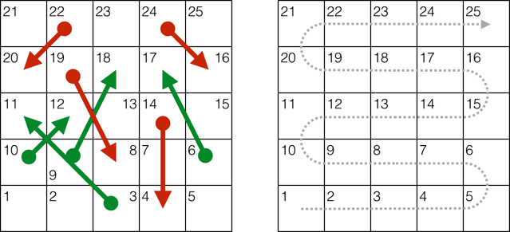
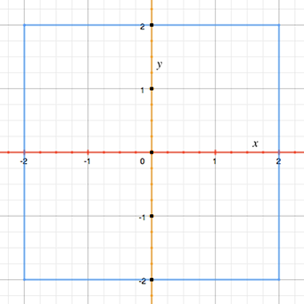
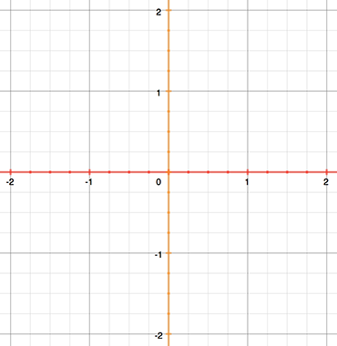
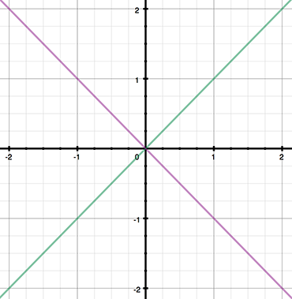

.. docnote:: Subjects to be covered in this section

   * Conditional branching (if)
   * Looping (while, do while, for, for in)
   * Iterators
   * Switch statement (including pattern matching)
   * Pattern matching and expressions in patterns
   * Overloading the ~= function for pattern matching
   * Control transfer (return, break, continue, fallthrough)
   * Ranges
   * Variable scope (as this is the first time we've defined scopes)
   * Clarification around expressions and statements?

Control Flow
============

Swift provides all of the familiar control flow constructs found in C-like languages.
These include ``for`` and ``while`` loops to perform a task multiple times;
``if``-``else`` and ``switch`` statements
to execute different branches of code based on certain conditions;
and control flow statements such as ``break`` and ``continue``
to transfer the flow of execution to another point in your code.

In addition to the traditional ``for``-``condition``-``increment`` loop found in C,
Swift adds a ``for``-``in`` loop that makes it easy to iterate over
arrays, dictionaries, ranges, strings, and sequences.
The ``for``-``in`` loop can even be used with your own custom types
if they conform to the ``Sequence`` protocol.

Swift's ``switch`` statement is also considerably more powerful than its counterpart in C.
The cases of a ``switch`` statement do not “fall through” to the next case in Swift,
avoiding common C errors caused by missing ``break`` statements.
Cases can match many different types of pattern,
including range matches, tuples, and casts to a specific type.
Matched values in a ``switch`` case can be bound to temporary constants or variables
for use within the case's body,
and complex matching conditions can be expressed with a ``where`` clause for each case.

.. _ControlFlow_ForLoops:

For Loops
---------

A ``for`` loop performs a set of statements a certain number of times.
Swift provides two kinds of ``for`` loop:

* ``for``-``in``, which performs a set of statements for each item in
  a range, sequence, collection, or progression
* ``for``-``condition``-``increment``, which performs a set of statements until
  a specific condition is met, typically by incrementing a counter each time the loop ends

.. _ControlFlow_ForIn:

For-In
~~~~~~

The ``for``-``in`` loop provides a powerful way to iterate over collections of items,
such as ranges of numbers, items in an array, and characters in a string.

This example prints the first few entries in the five-times-table:

.. testcode:: forLoops

   -> for index in 1..5 {
         println("\(index) times 5 is \(index * 5)")
      }
   </ 1 times 5 is 5
   </ 2 times 5 is 10
   </ 3 times 5 is 15
   </ 4 times 5 is 20
   </ 5 times 5 is 25

Here, the collection of items being iterated is a
closed range of numbers from ``1`` to ``5`` inclusive,
as indicated by the use of the closed range operator (``..``).
The value of ``index`` is set to the first number in the range (``1``),
and the statements inside the loop are executed.
In this case, the loop contains only one statement,
which prints an entry from the five-times-table for the current value of ``index``.
After the statement is executed,
the value of ``index`` is updated to contain the second value in the range (``2``),
and the ``println`` function is called again.
This process continues until the end of the range is reached.

``index`` is a constant whose value is automatically set
at the start of each iteration of the loop.
As such, it does not have to be declared before it is used.
It is implicitly declared simply by its inclusion in the loop declaration,
without the need for a ``let`` declaration keyword.
This does, however, mean that ``index`` exists only within the scope of the loop.
To check the value of ``index`` after the loop completes,
or to work with its value as a variable rather than a constant,
you must declare it yourself before its use in the loop.

If you don't need each value from the range,
you can ignore the values by using an underscore in place of a variable name:

.. testcode:: forLoops

   -> let base = 3
   << // base : Int = 3
   -> let power = 10
   << // power : Int = 10
   -> var answer = 1
   << // answer : Int = 1
   -> for _ in 0...power {
         answer *= base
      }
   -> println("\(base) to the power of \(power) is \(answer)")
   <- 3 to the power of 10 is 59049

This example calculates the value of one number to the power of another
(in this case, ``3`` to the power of ``10``).
It multiplies a starting value of ``1``
(that is, ``3`` to the power of ``0``)
by ``3``, ten times,
using a half-open loop that starts with ``0`` and ends with ``9``.
This calculation doesn't need to know the individual counter values each time through the loop –
it simply needs to execute the loop the correct number of times.
The underscore character ``_``
(used in place of a loop variable)
causes the individual values to be ignored
and does not provide access to the current value during each iteration of the loop.

Use the ``for``-``in`` loop with an array to iterate over its items:

.. testcode:: forLoops

   -> let names = ["Anna", "Alex", "Brian", "Jack"]
   << // names : String[] = ["Anna", "Alex", "Brian", "Jack"]
   -> for name in names {
         println("Hello, \(name)!")
      }
   </ Hello, Anna!
   </ Hello, Alex!
   </ Hello, Brian!
   </ Hello, Jack!

Swift's ``String`` type has a ``chars`` property,
which provides the individual characters in the string as an ``Array`` of ``UnicodeScalar`` values
(also known as an “``Array`` of type ``UnicodeScalar``”).
Use this property to iterate over the characters in a string in order:

.. testcode:: forLoops

   -> for scalar in "Hello".chars {
         println(scalar)
      }
   </ H
   </ e
   </ l
   </ l
   </ o

You can also iterate over a dictionary to access its key-value pairs.
Each item in the dictionary is returned as a ``(key, value)`` tuple
when the dictionary is iterated,
and you can decompose the ``(key, value)`` tuple's members as explicitly-named constants
for use within in the body of the ``for``-``in`` loop.
Here, the dictionary's keys are decomposed into a constant called ``animalName``,
and the dictionary's values are decomposed into a constant called ``legCount``:

.. testcode:: forLoops

   -> let numberOfLegs = ["spider" : 8, "ant" : 6, "cat" : 4]
   << // numberOfLegs : Dictionary<String, Int> = Dictionary<String, Int>(1.33333333333333, 3, <DictionaryBufferOwner<String, Int> instance>)
   -> for (animalName, legCount) in numberOfLegs {
         println("\(animalName)s have \(legCount) legs")
      }
   </ spiders have 8 legs
   </ ants have 6 legs
   </ cats have 4 legs

Items in a ``Dictionary`` may not necessarily be iterated in the same order as they were inserted.
The contents of a ``Dictionary`` are inherently unordered,
and iterating over them does not guarantee the order in which they will be retrieved.
(Arrays and Dictionaries are described in more detail in :doc:`CollectionTypes`.)

.. TODO: provide some advice on how to iterate over a Dictionary in order
   (perhaps sorted by key), using a predicate or array sort or some kind.

The examples above use a ``for``-``in`` loop to iterate
ranges, arrays, strings, and dictionaries.
However, you can use this syntax to iterate *any* collection,
including your own classes and collection types,
as long as they conform to the ``Sequence`` protocol.
For more on protocols, including ``Sequence``, see :doc:`Protocols`.

.. QUESTION: are there any plans for enums to conform to Sequence?
   If so, they might make for a good example.
   What would the syntax be if they did?
   'for planet in Planet'?

.. TODO: for (index, object) in enumerate(collection)
   and also for i in indices(collection) { collection[i] }

.. _ControlFlow_ForConditionIncrement:

For-Condition-Increment
~~~~~~~~~~~~~~~~~~~~~~~

In addition to ``for``-``in`` loops,
Swift supports traditional C-style ``for`` loops with a condition and an incrementer:

.. testcode:: forLoops

   -> for var index = 0; index < 3; ++index {
         println("index is \(index)")
      }
   </ index is 0
   </ index is 1
   </ index is 2

The general form of this loop format is:

.. syntax-outline::

   for <#initialization#>; <#condition#>; <#increment#> {
      <#statements#>
   }

Semicolons separate the three parts of the loop's definition, as in C.
However, unlike C, you don't need to add parentheses around
the entire “initialization; condition; increment” block.

The loop is executed as follows:

1. When the loop is first entered,
   the :newTerm:`initialization expression` is evaluated once,
   to set up any constants or variables that are needed for the loop.

2. The :newTerm:`condition expression` is evaluated.
   If it equates to ``false``, the loop ends,
   and code execution continues after the ``for`` loop's closing brace (``}``).
   If the expression equates to ``true``,
   code execution continues by executing the :newTerm:`statements` inside the braces.

3. After all statements are executed,
   the :newTerm:`increment expression` is evaluated.
   It might increase or decrease the value of a counter,
   or set one of the initialized variables to a new value based on the outcome of the statements.
   After the increment expression has been evaluated,
   execution returns to step 2,
   and the condition expression is evaluated again.

The execution process described above is effectively shorthand for (and equivalent to):

::

   <#initialization#>
   while <#condition#> {
      <#statements#>
      <#increment#>
   }

Constants and variables declared within the initialization expression
(such as ``var index = 0``)
are only valid within the scope of the ``for`` loop itself.
To retrieve the final value of ``index`` after the loop ends,
you must declare ``index`` before the loop's scope begins:

.. testcode:: forLoops

   -> var index = 0
   << // index : Int = 0
   -> for index = 0; index < 3; ++index {
         println("index is \(index)")
      }
   </ index is 0
   </ index is 1
   </ index is 2
   -> println("The loop statements were executed \(index) times")
   <- The loop statements were executed 3 times

.. TODO: We shouldn't need to initialize index to 0 on the first line of this example,
   but variables can't currently be used unitialized in the REPL.

Note that the final value of ``index`` after this loop is completed is ``3``, not ``2``.
The last time the increment statement ``++index`` is called,
it sets ``index`` to ``3``,
which causes ``index < 3`` to equate to ``false``,
ending the loop.

.. TODO: Need to mention that loop variables are immutable by default.
.. QUESTION: Can you make a loop variable mutable –
   and therefore influence loop execution, such as jumping ahead –
   by prepending it with 'var'?

.. _ControlFlow_WhileLoops:

While Loops
-----------

A ``while`` loop performs a set of statements until a condition becomes ``false``.
These kinds of loops are best used when
the number of iterations is not known before the first iteration begins.
Swift provides two kinds of ``while`` loop:

* ``while``, which evaluates its condition at the start of each pass through the loop
* ``do``-``while``, which evaluates its condition at the end of each pass through the loop

.. _ControlFlow_While:

While
~~~~~

A ``while`` loop starts by evaluating a single condition.
If the condition is ``true``,
a set of statements is repeated until the condition becomes ``false``.

The general form of a ``while`` loop is:

.. syntax-outline::

   while <#condition equates to true#> {
      <#statements#>
   }

This example plays a simple game of *Snakes and Ladders*
(also known as *Chutes and Ladders*):

The rules of the game are as follows:

* The board has 25 squares, and the aim is to land on or beyond square 25.
* Each turn, you roll a six-sided dice and move by that number of squares,
  following the horizontal path indicated by the dotted arrow above.
* If your turn ends at the bottom of a ladder, you move up that ladder.
* If your turn ends at the head of a snake, you move down that snake.

.. TODO: update this description to match the look of the final artwork.

The game board is represented by an ``Array`` of type ``Int``.
Its size is based on a constant called ``finalSquare``,
which is used to initialize the array,
and also to check for a win condition later in the example.
The board is initialized with 26 zeroes, not 25 –
one each at indices ``0`` through ``25`` inclusive:

.. testcode:: snakesAndLadders1

   -> let finalSquare = 25
   << // finalSquare : Int = 25
   -> var board = Array<Int>()
   << // board : Array<Int> = []
   -> for _ in 0..finalSquare { board.append(0) }

Some squares are then set to have more specific values for the snakes and ladders.
Squares with a ladder base have a positive number to move you up the board,
whereas squares with a snake head have a negative number to move you back down the board:

.. testcode:: snakesAndLadders1

   -> board[03] = +08; board[06] = +11; board[09] = +09; board[10] = +02
   -> board[14] = -10; board[19] = -11; board[22] = -02; board[24] = -08

Square 3 contains the bottom of a ladder that moves you up to square 11.
To represent this, ``board[03]`` is equal to ``+08``,
which is equivalent to an integer value of ``8``
(the difference between ``3`` and ``11``).
The unary plus operator (``+i``) balances with
the unary minus operator (``-i``),
and numbers lower than ``10`` are padded with zeros
so that all board definitions align.
(Neither stylistic tweak is strictly necessary,
but they lead to neater code.)

The player's starting square is “square zero”,
which is just off the bottom left corner of the board.
The first dice roll always moves the player on to the board:

.. testcode:: snakesAndLadders1

   -> var square = 0
   << // square : Int = 0
   -> var diceRoll = 0
   << // diceRoll : Int = 0
   -> while square < finalSquare {
         // roll the dice
         if ++diceRoll == 7 { diceRoll = 1 }
   >>    println("diceRoll is \(diceRoll)")
         // move by the rolled amount
         square += diceRoll
   >>    println("after diceRoll, square is \(square)")
         if square < board.count {
            // if we're still on the board, move up or down for a snake or a ladder
            square += board[square]
   >>       println("after snakes or ladders, square is \(square)")
         }
      }
   -> println("Game over!")
   << diceRoll is 1
   << after diceRoll, square is 1
   << after snakes or ladders, square is 1
   << diceRoll is 2
   << after diceRoll, square is 3
   << after snakes or ladders, square is 11
   << diceRoll is 3
   << after diceRoll, square is 14
   << after snakes or ladders, square is 4
   << diceRoll is 4
   << after diceRoll, square is 8
   << after snakes or ladders, square is 8
   << diceRoll is 5
   << after diceRoll, square is 13
   << after snakes or ladders, square is 13
   << diceRoll is 6
   << after diceRoll, square is 19
   << after snakes or ladders, square is 8
   << diceRoll is 1
   << after diceRoll, square is 9
   << after snakes or ladders, square is 18
   << diceRoll is 2
   << after diceRoll, square is 20
   << after snakes or ladders, square is 20
   << diceRoll is 3
   << after diceRoll, square is 23
   << after snakes or ladders, square is 23
   << diceRoll is 4
   << after diceRoll, square is 27
   << Game over!

This example uses a very simple approach to dice rolling.
Instead of a random number generator,
it starts with a ``diceRoll`` value of ``0``.
Each time through the ``while`` loop,
``diceRoll`` is incremented with the prefix increment operator (``++i``),
and is then checked to see if it has become too large.
The return value of ``++diceRoll`` is equal to
the value of ``diceRoll`` *after* it is incremented.
Whenever this return value equals ``7``,
the dice roll has become too large, and is reset to a value of ``1``.
This gives a sequence of ``diceRoll`` values that is always
``1``, ``2``, ``3``, ``4``, ``5``, ``6``, ``1``, ``2`` and so on.

After rolling the dice, the player moves forward by ``diceRoll`` squares.
It's possible that the dice roll may have moved the player beyond square 25,
in which case the game is over.
To cope with this scenario,
the code makes sure that ``square`` is less than the ``board`` array's ``count`` property
before adding the value stored in ``board[square]`` onto the current ``square`` value
to move the player up or down any ladders or snakes.

If it had not performed this check,
``board[square]`` might try and access a value outside of the bounds of the ``board`` array,
which would trigger an error.
If ``square`` is now equal to ``26``, say,
the code would try to check the value of ``board[26]``,
which is larger than the size of the array.

The current ``while`` loop execution then ends,
and the loop's condition is checked to see if the loop should be executed again.
If the player has moved on or beyond square number ``25``,
the loop's condition equates to ``false``, and the game ends.

A ``while`` loop is appropriate in this case
because the length of the game is not clear at the start of the ``while`` loop.
Instead, the loop is executed until a particular condition is satisfied.

.. _ControlFlow_DoWhile:

Do-While
~~~~~~~~

The other variation of the ``while`` loop,
known as the ``do``-``while`` loop,
performs a single pass through the loop block first,
*before* considering the loop's condition.
It then continues to repeat the loop until the condition is ``false``.

The general form of a ``do``-``while`` loop is:

.. syntax-outline::

   do {
      <#statements#>
   } while <#condition equates to true#>

Here's the *Snakes and Ladders* example again,
written as a ``do``-``while`` loop rather than a ``while`` loop.
The values of ``finalSquare``, ``board``, ``square``, and ``diceRoll``
are initialized in exactly the same way as with a ``while`` loop:

.. testcode:: snakesAndLadders2

   -> let finalSquare = 25
   << // finalSquare : Int = 25
   -> var board = Array<Int>()
   << // board : Array<Int> = []
   -> for _ in 0..finalSquare { board.append(0) }
   -> board[03] = +08; board[06] = +11; board[09] = +09; board[10] = +02
   -> board[14] = -10; board[19] = -11; board[22] = -02; board[24] = -08
   -> var square = 0
   << // square : Int = 0
   -> var diceRoll = 0
   << // diceRoll : Int = 0

In this version of the game,
the *first* action in the loop is to check for a ladder or a snake.
No ladder on the board takes the player straight to square 25,
and so it is not possible to win the game by moving up a ladder.
This makes it safe to check for a snake or a ladder as the first action in the loop.

At the start of the game, the player is on “square zero”.
``board[0]`` always equals ``0``,
and has no effect:

.. testcode:: snakesAndLadders2

   -> do {
         // move up or down for a snake or ladder
         square += board[square]
   >>      println("after snakes or ladders, square is \(square)")
         // roll the dice
         if ++diceRoll == 7 { diceRoll = 1 }
   >>    println("diceRoll is \(diceRoll)")
         // move by the rolled amount
         square += diceRoll
   >>    println("after diceRoll, square is \(square)")
   -> } while square < finalSquare
   -> println("Game over!")
   << after snakes or ladders, square is 0
   << diceRoll is 1
   << after diceRoll, square is 1
   << after snakes or ladders, square is 1
   << diceRoll is 2
   << after diceRoll, square is 3
   << after snakes or ladders, square is 11
   << diceRoll is 3
   << after diceRoll, square is 14
   << after snakes or ladders, square is 4
   << diceRoll is 4
   << after diceRoll, square is 8
   << after snakes or ladders, square is 8
   << diceRoll is 5
   << after diceRoll, square is 13
   << after snakes or ladders, square is 13
   << diceRoll is 6
   << after diceRoll, square is 19
   << after snakes or ladders, square is 8
   << diceRoll is 1
   << after diceRoll, square is 9
   << after snakes or ladders, square is 18
   << diceRoll is 2
   << after diceRoll, square is 20
   << after snakes or ladders, square is 20
   << diceRoll is 3
   << after diceRoll, square is 23
   << after snakes or ladders, square is 23
   << diceRoll is 4
   << after diceRoll, square is 27
   << Game over!

After the code checks for snakes and ladders, the dice is rolled,
and the player is moved forward by ``diceRoll`` squares.
The current loop execution then ends.

The loop's condition (``while square < finalSquare``) is the same as before,
but this time it is not evaluated until the *end* of the first run through the loop.
The structure of the ``do``-``while`` loop is better suited to this game
than the ``while`` loop in the previous example.
In the ``do``-``while`` loop above,
``square += board[square]`` is always executed *immediately after*
the loop's ``while`` condition confirms that ``square`` is still on the board.
This behavior removes the need for the array bounds check
seen in the earlier version of the game.

.. _ControlFlow_ConditionalStatements:

Conditional Statements
----------------------

It is often useful to execute different pieces of code based on certain conditions.
You might want to run an extra piece of code when an error occurs,
or to display a message when a value becomes too high or too low.
To do this, you make parts of your code :newTerm:`conditional`.

Swift provides two ways to add conditional branches to your code:

* ``if``-``else``
* ``switch``

Typically, you use the ``if``-``else`` statement
to evaluate simple conditions with only a few possible outcomes.
The ``switch`` statement is better suited to
more complex conditions with multiple possible permutations,
or situations where pattern-matching can help to select
an appropriate code branch to execute.

.. _ControlFlow_IfElse:

If-Else
~~~~~~~

In its simplest form,
the ``if``-``else`` statement has a single ``if`` condition.
It executes a set of statements only if that condition is ``true``:

.. testcode:: ifElse

   -> var temperatureInFahrenheit = 30
   << // temperatureInFahrenheit : Int = 30
   -> if temperatureInFahrenheit <= 32 {
         println("It's very cold. Consider wearing a scarf.")
      }
   <- It's very cold. Consider wearing a scarf.

The preceding example checks to see whether the temperature
is less than or equal to 32 degrees Fahrenheit
(the freezing point of water).
If it is, a message is printed.
Otherwise, no message is printed,
and code execution continues after the ``if`` statement's closing brace.

As its name suggests, the ``if``-``else`` statement can provide
an alternative set of statements when the ``if`` condition is ``false``:

.. testcode:: ifElse

   -> temperatureInFahrenheit = 40
   -> if temperatureInFahrenheit <= 32 {
         println("It's very cold. Consider wearing a scarf.")
      } else {
         println("It's not that cold. Wear a t-shirt.")
      }
   <- It's not that cold. Wear a t-shirt.

One of of these two branches is always executed.
Because the temperature has increased to ``40`` degrees Fahrenheit,
it is no longer cold enough to advise wearing a scarf,
and so the ``else`` branch is triggered instead.

You can chain multiple ``if``-``else`` statements together,
to consider additional clauses:

.. testcode:: ifElse

   -> temperatureInFahrenheit = 90
   -> if temperatureInFahrenheit <= 32 {
         println("It's very cold. Consider wearing a scarf.")
      } else if temperatureInFahrenheit >= 86 {
         println("It's really warm. Don't forget to wear sunscreen.")
      } else {
         println("It's not that cold. Wear a t-shirt.")
      }
   <- It's really warm. Don't forget to wear sunscreen.

Here, an additional ``if`` clause is added to respond to particularly warm temperatures.
The final ``else`` clause remains,
and prints a response for any temperatures that are neither too warm nor too cold.

The final ``else`` clause is optional, however, and can be excluded if the set of conditions does not need to be complete:

.. testcode:: ifElse

   -> temperatureInFahrenheit = 72
   -> if temperatureInFahrenheit <= 32 {
         println("It's very cold. Consider wearing a scarf.")
      } else if temperatureInFahrenheit >= 86 {
         println("It's really warm. Don't forget to wear sunscreen.")
      }

In this example,
the temperature is neither too cold nor too warm to trigger the ``if`` or ``else if`` conditions,
and so no message is printed.

.. _ControlFlow_Switch:

Switch
~~~~~~

A ``switch`` statement considers a value
and compares it against several possible matching patterns.
It then executes an appropriate block of code,
based on the first pattern that matched successfully.
It provides an alternative approach to the ``if``-``else`` statement
for responding to multiple potential states.

In its simplest form, a ``switch`` statement compares
one or more values of the same type against the value being considered:

.. syntax-outline::

   switch <#some value to consider#> {
      case <#possible value 1#>:
         <#do things in response to possible value 1#>
      case <#possible value 2#>,
          <#possible value 3#>:
         <#do things in response to possible values 2 or 3#>
      default:
         <#otherwise, do something else#>
   }

Every ``switch`` statement consists of multiple possible :newTerm:`cases`,
each of which begins with the ``case`` keyword.
In addition to comparing against specific values,
Swift provides several ways for each case to specify
more complex matching patterns.
These options are described later in this section.

The body of each ``switch`` case is a separate branch of code execution,
in a similar manner to the branches of an ``if``-``else`` statement.
The ``switch`` statement determines which branch should be selected,
and it does this by :newTerm:`switching` on the value to be considered.

Every ``switch`` statement must be :newTerm:`exhaustive`. 
That is, every possible value of the type to be considered
must be able to be matched by one of the ``switch`` cases.
If it is not appropriate to provide a ``switch`` case for every possible value,
you can define a default catch-all case to cover any values that are not addressed explicitly.
This catch-all case is indicated by the keyword ``default``,
and must always appear last.

The following example switches on a ``UnicodeScalar`` value,
and determines whether it represents a number symbol in one of four languages.
Multiple values are covered in a single ``switch`` case for brevity:

.. testcode:: switch

   -> let numberSymbol = '三'   // Simplified Chinese symbol for the number 3
   << // numberSymbol : UnicodeScalar = '三'
   -> var possibleIntegerValue: Int?
   << // possibleIntegerValue : Int? = <unprintable value>
   -> switch numberSymbol {
         case '1', '١', '一', '๑':
            possibleIntegerValue = 1
         case '2', '٢', '二', '๒':
            possibleIntegerValue = 2
         case '3', '٣', '三', '๓':
            possibleIntegerValue = 3
         case '4', '٤', '四', '๔':
            possibleIntegerValue = 4
         default:
            possibleIntegerValue = nil
      }
   -> if let integerValue = possibleIntegerValue {
         println("The integer value of \(numberSymbol) is \(integerValue).")
      } else {
         println("An integer value could not be found for \(numberSymbol).")
      }
   <- The integer value of 三 is 3.

.. TODO: The default case should become a no-op case once we can use
   a single semi-colon to indicate a deliberately empty case.
   This gives a good opportunity to mention that pattern, too.
   The required change to the language is being tracked as rdar://16381532.

This example checks ``numberSymbol`` to determine if it is
a Latin, Arabic, Chinese or Thai symbol for
the numbers ``1`` to ``4``.
If a match is found,
it sets an optional ``Int?`` variable (called ``possibleIntegerValue``)
to the appropriate integer value.
If the symbol is not recognized,
the optional ``Int?`` is set to a value of ``nil``, meaning “no value”.
Finally, the example uses optional binding to check whether a value was found.
If it was, the output value is printed;
otherwise, an error message is reported.

It is not practical to list every possible ``UnicodeScalar`` value in the example above,
so a ``default`` case provides a catchall for any characters that have not already been matched.

.. _ControlFlow_NoImplicitFallthrough:

No Implicit Fallthrough
_______________________

Unlike C and Objective-C, ``switch`` statements in Swift do not
fall through the bottom of each case and into the next one by default.
Instead, the entire ``switch`` statement finishes its execution
as soon as the first matching ``switch`` case is completed,
*without* requiring an explicit ``break`` statement.

Furthermore, the body of each case *must* contain
at least one executable statement.
It is not valid to write the following code,
because the first case is empty:

.. testcode:: switch

   -> let someCharacter = "a"
   << // someCharacter : String = "a"
   -> switch someCharacter {
         case "a":
         case "A":
            println("The letter A")
         default:
            println("Not the letter A")
      }
   !! <REPL Input>:2:3: error: 'case' label in a 'switch' should have at least one executable statement
   !!          case "a":
   !!          ^~~~~~~~~
   // this will report a compile-time error

Unlike C, this ``switch`` statement does not match both ``"a"`` and ``"A"``.
Rather, it reports a compile-time error that ``case "a":``
does not contain any executable statements.
This approach avoids accidental fallthrough from one case to another,
and makes for safer code that is explicit in its intent.

Multiple matches for a single ``switch`` case can be separated by commas,
and can be written over multiple lines if the list is long:

.. syntax-outline::

   switch <#some value to consider#> {
      case <#possible value 1#>,
          <#possible value 2#>:
         <#statements#>
   }

.. note::

   To opt in to fallthrough behavior for a particular ``switch`` case,
   use the ``fallthrough`` keyword,
   as described in :ref:`ControlFlow_Fallthrough`.

.. _ControlFlow_IgnoringCases:

Ignoring Cases
______________

Swift's ``switch`` statement is exhaustive, and does not allow empty cases.
Because of this,
it is sometimes necessary to deliberately match and ignore a certain case.
You do this by writing a single semicolon (``;``) as the body of the case you want to ignore.
A semicolon is considered a “statement” in this context,
and makes it clear that you wish to match and ignore that particular case.

.. note::

   A ``switch`` case that only contains a comment is reported as a compile-time error.
   Comments are not statements, and do not cause a ``switch`` case to be ignored.
   Always use a single semicolon to ignore a ``switch`` case.

In the ``numberSymbol`` example above,
it is not necessary to assign a value of ``nil`` to ``possibleIntegerValue``
within the ``switch`` statement's ``default`` case,
because ``possibleIntegerValue`` is automatically set to ``nil`` when it is created,
by virtue of being of an optional type.
Nonetheless, the ``default`` case is still required to make
the ``switch`` statement exhaustive.

To satisfy this requirement without an unnecessary ``nil`` assignment,
the ``switch`` statement can be written with
a semicolon inside its ``default`` case instead:

.. testcode:: switch

   -> switch numberSymbol {
         case '1', '١', '一', '๑':
            possibleIntegerValue = 1
         case '2', '٢', '二', '๒':
            possibleIntegerValue = 2
         case '3', '٣', '三', '๓':
            possibleIntegerValue = 3
         case '4', '٤', '四', '๔':
            possibleIntegerValue = 4
         default:
            ;
      }

This revised ``switch`` statement is still exhaustive,
but no longer performs an unnecessary operation within its ``default`` case.

.. _ControlFlow_RangeMatching:

Range Matching
______________

Values in ``switch`` cases can be checked for their inclusion in a range.
This example uses number ranges
to provide a natural-language count for numbers of any size:

.. testcode:: switch

   -> let count = 3_000_000_000_000
   << // count : Int = 3000000000000
   -> let countedThings = "stars in the Milky Way"
   << // countedThings : String = "stars in the Milky Way"
   -> var naturalCount = ""
   << // naturalCount : String = ""
   -> switch count {
         case 0:
            naturalCount = "no"
         case 1..3:
            naturalCount = "a few"
         case 4..9:
            naturalCount = "several"
         case 10..99:
            naturalCount = "tens of"
         case 100..999:
            naturalCount = "hundreds of"
         case 1000..999_999:
            naturalCount = "thousands of"
         default:
            naturalCount = "millions and millions of"
      }
   -> println("There are \(naturalCount) \(countedThings).")
   <- There are millions and millions of stars in the Milky Way.

.. TODO: remove the initializer for naturalCount once we can declare unitialized variables in the REPL.
.. TODO: Add a description for this example.

.. _ControlFlow_Tuples:

Tuples
______

You can test multiple values can be tested in the same ``switch`` statement using tuples.
Each element of the tuple can be tested against a different value or range of values.
Alternatively, use the underscore (``_``) identifier to match any possible value.

The example below takes an (x, y) point,
expressed as a simple tuple of type ``(Int, Int)``,
and categorizes it on the graph that follows:

.. testcode:: switch

   -> let somePoint = (1, 1)
   << // somePoint : (Int, Int) = (1, 1)
   -> switch somePoint {
         case (0, 0):
            println("(0, 0) is at the origin")
         case (_, 0):
            println("(\(somePoint.0), 0) is on the x-axis")
         case (0, _):
            println("(0, \(somePoint.1)) is on the y-axis")
         case (-2..2, -2..2):
            println("(\(somePoint.0), \(somePoint.1)) is inside the box")
         default:
            println("(\(somePoint.0), \(somePoint.1)) is outside of the box")
      }
   <- (1, 1) is inside the box

The ``switch`` statement determines if the point is
at the origin (0, 0);
on the red x-axis;
on the orange y-axis;
inside the blue 4-by-4 box centered on the origin;
or outside of the box altogether.

Unlike C, Swift allows multiple ``switch`` cases to consider the same value or values.
In fact, the point (0, 0) could match all *four* of the cases in this example.
However, if multiple matches are possible,
the first matching case is always used.
The point (0, 0) would match ``case (0, 0)`` first,
and so all other matching cases would be ignored.

.. TODO: The type of a tuple can be used in a case statement to check for different types:
   var x: Any = (1, 2)
   switch x {
   case is (Int, Int):

.. _ControlFlow_ValueBindings:

Value Bindings
______________

A ``switch`` case can bind the value or values it matches to temporary constants or variables,
for use in the body of the case.
This is known as :newTerm:`value binding`,
because the values are “bound” to temporary constants or variables within the case's body.

Again, the example below takes an (x, y) point,
expressed as a tuple of type ``(Int, Int)``,
and categorizes it on the graph that follows:

.. testcode:: switch

   -> let anotherPoint = (2, 0)
   << // anotherPoint : (Int, Int) = (2, 0)
   -> switch anotherPoint {
         case (let x, 0):
            println("on the x-axis with an x value of \(x)")
         case (0, let y):
            println("on the y-axis with a y value of \(y)")
         case let (x, y):
            println("somewhere else at (\(x), \(y))")
      }
   <- on the x-axis with an x value of 2

The ``switch`` statement determines if the point is
on the red x-axis;
on the orange y-axis;
or somewhere else.

The three ``switch`` cases declare placeholder constants ``x`` and ``y``,
which temporarily take on one or both tuple values from ``anotherPoint``.
The first case, ``case (let x, 0)``,
matches any point with a ``y`` value of ``0``,
and assigns the point's ``x`` value to the temporary constant ``x``.
Similarly, the second case, ``case (0, let y)``,
matches any point with an ``x`` value of ``0``,
and assigns the point's ``y`` value to the temporary constant ``y``.

Once the temporary constants are declared,
they can be used within the case's code block.
Here, they are used as shorthand for printing the values with the ``println`` function.

Note that this ``switch`` statement does not have a ``default`` case.
The final case, ``case let (x, y)``,
declares a tuple of two placeholder constants that can match any value.
As a result, it matches all possible remaining values,
and a ``default`` case is not needed to make the ``switch`` statement exhaustive.

In the example above,
``x`` and ``y`` have been declared as constants with the ``let`` keyword,
because there is no need to modify their values within the body of the case.
However, they could have been declared as variables instead, via the ``var`` keyword.
If this had been done, a temporary variable would have been created
and initialized with the appropriate value.
Any changes to that variable would only have an effect within the body of the case.

.. _ControlFlow_Where:

Where
_____

A ``switch`` case can check for additional conditions using the ``where`` clause.

The example below categorizes an (x, y) point on the following graph:

.. testcode:: switch

   -> let yetAnotherPoint = (1, -1)
   << // yetAnotherPoint : (Int, Int) = (1, -1)
   -> switch yetAnotherPoint {
         case let (x, y) where x == y:
            println("(\(x), \(y)) is on the line x == y")
         case let (x, y) where x == -y:
            println("(\(x), \(y)) is on the line x == -y")
         case let (x, y):
            println("(\(x), \(y)) is just some arbitrary point")
      }
   <- (1, -1) is on the line x == -y

The ``switch`` statement determines if the point is
on the green diagonal line where ``x == y``;
on the purple diagonal line where ``x == -y``;
or none of the above.

The three ``switch`` cases declare placeholder constants ``x`` and ``y``,
which temporarily take on the two tuple values from ``point``.
Here, these constants are used as part of a ``where`` clause,
to create a dynamic filter.
The ``switch`` case matches the current value of ``point``
only if the ``where`` clause's condition equates to ``true`` for that value.

As in the previous example, the final case matches all possible remaining values,
and so a ``default`` case is not needed to make the ``switch`` statement exhaustive.

.. _ControlFlow_ControlTransferStatements:

Control Transfer Statements
---------------------------

:newTerm:`Control transfer statements` change the order in which your code is executed,
by transferring control from one piece of code to another.
Swift has four control transfer statements:

* ``continue``
* ``break``
* ``fallthrough``
* ``return``

The ``control``, ``break`` and ``fallthrough`` statements are described below.
The ``return`` statement is described in :doc:`Functions`.

.. _ControlFlow_Continue:

Continue
~~~~~~~~

The ``continue`` statement tells a loop to stop what it is doing
and start again at the beginning of the next iteration through the loop.
It says “I am done with the current loop iteration”
without leaving the loop altogether.

.. note::

   In a ``for``-``condition``-``increment`` loop,
   the incrementer is still evaluated after calling the ``continue`` statement.
   The loop itself continues to work as normal;
   only the code within the loop's body is skipped.

The following example removes all vowels and spaces from a lowercase string
to create a cryptic puzzle phrase:

.. testcode:: controlTransfer

   -> let puzzleInput = "great minds think alike"
   << // puzzleInput : String = "great minds think alike"
   -> var puzzleOutput = ""
   << // puzzleOutput : String = ""
   -> for letter in puzzleInput.chars {
         switch letter {
            case 'a', 'e', 'i', 'o', 'u', ' ':
               continue
            default:
               puzzleOutput += letter
         }
      }
   -> println(puzzleOutput)
   <- grtmndsthnklk

The ``letter`` constant is inferred to be of type ``UnicodeScalar``
by its iteration over a sequence of ``UnicodeScalar`` values.
This is why the case statement compares ``letter`` against ``UnicodeScalar`` values
(with single quote marks) rather than ``String`` values.

The code above calls the ``continue`` keyword whenever it matches a vowel or a space,
causing the current iteration of the loop to end immediately
and to jump straight to the start of the next iteration.
This behavior enables the switch block to match (and ignore) only
the vowel and space characters,
rather than requiring the block to match every character that should get printed.

.. _ControlFlow_Break:

Break
~~~~~

The ``break`` statement is similar to the ``continue`` statement,
except that it jumps out of the loop altogether,
transferring control to the first line of code after the loop's closing brace (``}``).
No further code from the current iteration of the loop is executed,
and no further iterations of the loop are started.

The following example shows the ``continue`` and ``break`` statements in action
for an adapted version of the *Snakes and Ladders* game.

This time around, the game has an extra rule:

* To win, you must land *exactly* on square 25.

If a particular dice roll would take you beyond square 25,
roll again until you roll the exact number needed to land on square 25.

The game board is the same as before:

The values of ``finalSquare``, ``board``, ``square``, and ``diceRoll``
are initialized in the same way as before:

.. testcode:: snakesAndLadders3

   -> let finalSquare = 25
   << // finalSquare : Int = 25
   -> var board = Array<Int>()
   << // board : Array<Int> = []
   -> for _ in 0..finalSquare { board.append(0) }
   -> board[03] = +08; board[06] = +11; board[09] = +09; board[10] = +02
   -> board[14] = -10; board[19] = -11; board[22] = -02; board[24] = -08
   -> var square = 0
   << // square : Int = 0
   -> var diceRoll = 0
   << // diceRoll : Int = 0

This version of the game uses a ``while`` loop and a ``switch`` statement
to implement the game's logic.
The ``while`` loop's condition is ``while square != finalSquare``,
to reflect that you must land exactly on square 25:

.. testcode:: snakesAndLadders3

   -> while square != finalSquare {
         if ++diceRoll == 7 { diceRoll = 1 }
   >>    println("diceRoll is \(diceRoll)")
         switch square + diceRoll {
            case finalSquare:
               // diceRoll will move us to the final square, so the game is over
   >>          println("finalSquare, game is over")
               break
            case let newSquare where newSquare > finalSquare:
               // diceRoll will move us beyond the final square, so roll again
   >>          println("move too far, roll again")
               continue
            default:
               // this is a valid move, so find out its effect
               square += diceRoll
   >>          println("after diceRoll, square is \(square)")
               square += board[square]
   >>          println("after snakes or ladders, square is \(square)")
         }
      }
   -> println("Game over!")
   << diceRoll is 1
   << after diceRoll, square is 1
   << after snakes or ladders, square is 1
   << diceRoll is 2
   << after diceRoll, square is 3
   << after snakes or ladders, square is 11
   << diceRoll is 3
   << after diceRoll, square is 14
   << after snakes or ladders, square is 4
   << diceRoll is 4
   << after diceRoll, square is 8
   << after snakes or ladders, square is 8
   << diceRoll is 5
   << after diceRoll, square is 13
   << after snakes or ladders, square is 13
   << diceRoll is 6
   << after diceRoll, square is 19
   << after snakes or ladders, square is 8
   << diceRoll is 1
   << after diceRoll, square is 9
   << after snakes or ladders, square is 18
   << diceRoll is 2
   << after diceRoll, square is 20
   << after snakes or ladders, square is 20
   << diceRoll is 3
   << after diceRoll, square is 23
   << after snakes or ladders, square is 23
   << diceRoll is 4
   << move too far, roll again
   << diceRoll is 5
   << move too far, roll again
   << diceRoll is 6
   << move too far, roll again
   << diceRoll is 1
   << after diceRoll, square is 24
   << after snakes or ladders, square is 16
   << diceRoll is 2
   << after diceRoll, square is 18
   << after snakes or ladders, square is 18
   << diceRoll is 3
   << after diceRoll, square is 21
   << after snakes or ladders, square is 21
   << diceRoll is 4
   << finalSquare, game is over
   << Game over!

The dice is rolled at the start of each loop.
Rather than moving the player immediately,
a ``switch`` statement is used to consider the result of the move,
and to work out whether the move is allowed:

* If the dice roll will move the player onto the final square,
  the game is over.
  The ``break`` statement transfers control to
  the first line of code outside of the loop, which ends the game.
* If the dice roll will move the player *beyond* the final square,
  the move is invalid, and the player needs to roll again.
  The ``continue`` statement ends the current loop iteration,
  and begins the next iteration of the loop.
* In all other cases, the dice roll is a valid move.
  The player moves forward by ``diceRoll`` squares,
  and the game logic checks for any snakes and ladders.
  The loop then ends, and control returns to the ``while`` condition
  to decide whether another turn is required.

.. _ControlFlow_Fallthrough:

Fallthrough
~~~~~~~~~~~

Switch statements in Swift do not fall through the bottom of each case and into the next one.
Instead, the entire switch statement completes its execution as soon as the first matching case is completed.
By contrast, C requires you to insert an explicit ``break`` statement
at the end of every ``switch`` case to prevent fallthrough.
Avoiding default fallthrough means that Swift ``switch`` statements are
much more concise and predictable than their counterparts in C,
and thus they avoid executing multiple ``switch`` cases by mistake.

If you really need C-style fallthrough behavior,
you can opt in to this behavior on a case-by-case basis with the ``fallthrough`` keyword.
The example below uses ``fallthrough`` to create a textual description of a number:

.. testcode:: controlTransfer

   -> let integerToDescribe = 5
   << // integerToDescribe : Int = 5
   -> var description = "The number \(integerToDescribe) is"
   << // description : String = "The number 5 is"
   -> switch integerToDescribe {
         case 2, 3, 5, 7, 11, 13, 17, 19:
            description += " a prime number, and also"
            fallthrough
         default:
            description += " an integer."
      }
   -> println(description)
   <- The number 5 is a prime number, and also an integer.

This example declares a new ``String`` variable called ``description``,
and assigns it an initial value.
The function then considers the value of ``integerToDescribe`` using a ``switch`` statement.
If the value of ``integerToDescribe`` is one of the prime numbers in the list,
the function appends text to the end of ``description``,
to note that the number is prime.
It then uses the ``fallthrough`` keyword to “fall into” the ``default`` case as well.
The ``default`` case adds some extra text to the end of the description,
and the ``switch`` statement is complete.

If the value of ``integerToDescribe`` is *not* in the list of known prime numbers,
it is not matched by the first ``switch`` case at all.
There are no other specific cases,
and so it ends up being matched by the catchall ``default`` case.

After the ``switch`` statement has finished executing,
the number's description is printed using the ``println`` function.
In this example,
the number ``5`` is correctly identified as a prime number.

.. note::

   Fallthrough does not check the conditions for the ``switch`` case it falls into.
   It simply causes code execution to move directly to the statements
   inside the next case (or ``default`` case) block,
   as in C's standard ``switch`` statement behavior.

.. refnote:: References

   * https://[Internal Staging Server]/docs/whitepaper/GuidedTour.html#branching-and-looping
   * https://[Internal Staging Server]/docs/whitepaper/GuidedTour.html#pattern-matching
   * https://[Internal Staging Server]/docs/Pattern%20Matching.html
   * https://[Internal Staging Server]/docs/LangRef.html#pattern-expr
   * /swift/include/swift/AST/Stmt.h
   * /swift/test/IDE/complete_stmt_controlling_expr.swift
   * /swift/test/interpreter/break_continue.swift
   * /swift/test/Parse/foreach.swift
   * /swift/test/reverse.swift
   * /swift/test/statements.swift
