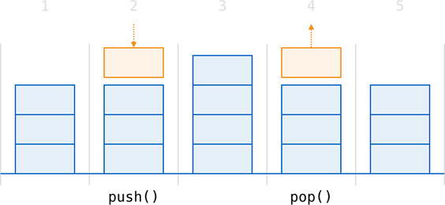
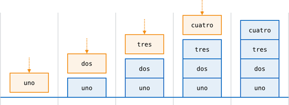
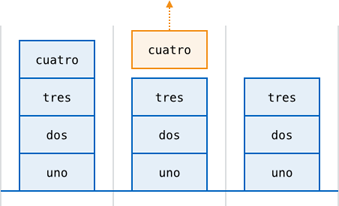

Generics
========

:newTerm:`Generic code` enables you to write flexible, reusable functions and types
that can work with any type, subject to requirements that you define.
You can write code that avoids duplication,
and expresses its intent in a clear, abstracted manner.

Generics are one of the most powerful features of Swift,
and much of the Swift standard library is built with generic code.
In fact, you've been using generics throughout this Language Guide,
even if you didn't realize it.
For example, Swift's ``Array`` and ``Dictionary`` types
are both generic collections.
You can create an array that holds ``Int`` values,
or an array that holds ``String`` values,
or indeed an array for any other type that can be created in Swift.
Similarly, you can create a dictionary to store values of any specified type,
and there are no limitations on what that type can be.

.. _Generics_The ProblemThatGenericsSolve:

The Problem That Generics Solve
-------------------------------

Here's a standard, non-generic function called ``swapTwoInts``,
which swaps two ``Int`` values:

.. testcode:: whyGenerics

   -> func swapTwoInts(inout a: Int, inout b: Int) {
         let temporaryA = a
         a = b
         b = temporaryA
      }

This function makes use of in-out parameters to swap the values of ``a`` and ``b``,
as described in :ref:`Functions_InOutParameters`.

The ``swapTwoInts`` function swaps the original value of ``b`` into ``a``,
and the original value of ``a`` into ``b``.
You can call this function to swap the values in two ``Int`` variables:

.. testcode:: whyGenerics

   -> var someInt = 3
   << // someInt : Int = 3
   -> var anotherInt = 107
   << // anotherInt : Int = 107
   -> swapTwoInts(&someInt, &anotherInt)
   -> println("someInt is now \(someInt), and anotherInt is now \(anotherInt)")
   <- someInt is now 107, and anotherInt is now 3

The ``swapTwoInts`` function is useful, but it can only be used with ``Int`` values.
If you want to swap two ``String`` values,
or two ``Double`` values,
you have to write more functions,
such as the ``swapTwoStrings`` and ``swapTwoDoubles`` functions shown below:

.. testcode:: whyGenerics

   -> func swapTwoStrings(inout a: String, inout b: String) {
         let temporaryA = a
         a = b
         b = temporaryA
      }
   ---
   -> func swapTwoDoubles(inout a: Double, inout b: Double) {
         let temporaryA = a
         a = b
         b = temporaryA
      }

You may have noticed that the bodies of
the ``swapTwoInts``, ``swapTwoStrings``, and ``swapTwoDoubles`` functions are identical.
The only difference is the type of the values that they accept
(``Int``, ``String``, and ``Double``).

It would be much more useful, and considerably more flexible,
to write a single function that could swap two values of *any* type.
This is the kind of problem that generic code can solve.
(A generic version of these functions is defined below.)

.. note::

   In all three functions,
   it is important that the types of ``a`` and ``b`` are defined to be the same as each other.
   If ``a`` and ``b`` were not of the same type,
   it would not be possible to swap their values.
   Swift is a type-safe language,
   and does not allow (for example) a variable of type ``String``
   and a variable of type ``Double``
   to swap values with each other.
   Attempting to do so would be reported as a compile-time error.

.. _Generics_GenericFunctions:

Generic Functions
-----------------

:newTerm:`Generic functions` can work with any type.
Here's a generic version of the ``swapTwoInts`` function from above,
called ``swapTwoValues``:

.. testcode:: genericFunctions

   -> func swapTwoValues<T>(inout a: T, inout b: T) {
         let temporaryA = a
         a = b
         b = temporaryA
      }

The body of the ``swapTwoValues`` function
is identical to the body of the ``swapTwoInts`` function.
However, the first line of ``swapTwoValues``
is slightly different from ``swapTwoInts``.
Here's how the first lines compare:

.. testcode:: genericFunctionsComparison

   -> func swapTwoInts(inout a: Int, inout b: Int)
   >> {
   >>    let temporaryA = a
   >>    a = b
   >>    b = temporaryA
   >> }
   -> func swapTwoValues<T>(inout a: T, inout b: T)
   >> {
   >>    let temporaryA = a
   >>    a = b
   >>    b = temporaryA
   >> }

The generic version of the function
uses a *placeholder* type name (called ``T``, in this case)
instead of an *actual* type name (such as ``Int``, ``String``, or ``Double``).
The placeholder type name doesn't say anything about what ``T`` must be,
but it *does* say that both ``a`` and ``b`` must be of the same type ``T``,
whatever ``T`` represents.
The actual type to use in place of ``T``
will be determined each time the ``swapTwoValues`` function is called.

The other difference is that the generic function's name (``swapTwoValues``)
is followed by the placeholder type name (``T``) inside angle brackets (``<T>``).
The brackets tell Swift that ``T`` is a placeholder type name
within the ``swapTwoValues`` function definition.
Because ``T`` is a placeholder, Swift does not look for an actual type called ``T``.

The ``swapTwoValues`` function can now be called in the same way as ``swapTwoInts``,
except that it can be passed two values of *any* type,
as long as both of those values are of the same type as each other.
Each time ``swapTwoValues`` is called,
the type to use for ``T`` is inferred from the types of values passed to the function.

In the two examples below, ``T`` is inferred to be ``Int`` and ``String`` respectively:

.. testcode:: genericFunctions

   -> var someInt = 3
   << // someInt : Int = 3
   -> var anotherInt = 107
   << // anotherInt : Int = 107
   -> swapTwoValues(&someInt, &anotherInt)
   /> someInt is now \(someInt), and anotherInt is now \(anotherInt)
   </ someInt is now 107, and anotherInt is now 3
   ---
   -> var someString = "hello"
   << // someString : String = "hello"
   -> var anotherString = "world"
   << // anotherString : String = "world"
   -> swapTwoValues(&someString, &anotherString)
   /> someString is now \"\(someString)\", and anotherString is now \"\(anotherString)\"
   </ someString is now "world", and anotherString is now "hello"

.. note::

   The ``swapTwoValues`` function defined above is inspired by
   a generic function called ``swap``, which is part of the Swift standard library,
   and is automatically made available for you to use in your apps.
   If you need the behavior of the ``swapTwoValues`` function in your own code,
   you can use Swift's existing ``swap`` function rather than providing your own implementation.

.. _Generics_TypeParameters:

Type Parameters
---------------

In the ``swapTwoValues`` example above,
the placeholder type ``T`` is an example of a :newTerm:`type parameter`.
Type parameters specify and name a placeholder type,
and are written immediately after the function's name,
between a pair of matching angle brackets (such as ``<T>``).

Once specified,
a type parameter can be used as the type of a function's parameters
(such as the ``a`` and ``b`` parameters of the ``swapTwoValues`` function);
or as the function's return type;
or as a type annotation within the body of the function.
In each case, the placeholder type represented by the type parameter
is replaced with an *actual* type whenever the function is called.
(In the ``swapTwoValues`` example above,
``T`` was replaced with ``Int`` the first time the function was called,
and was replaced with ``String`` the second time it was called.)

You can provide more than one type parameter if needed,
by writing multiple type parameters within the angle brackets,
separated by commas.

.. _Generics_NamingTypeParameters:

Naming Type Parameters
~~~~~~~~~~~~~~~~~~~~~~

In simple cases where a generic function or generic type
needs to refer to a single placeholder type
(such as the ``swapTwoValues`` generic function above,
or a generic collection that stores a single type, such as ``Array``),
it is traditional to use the single-character name ``T`` for the type parameter.
However, you are can use any valid identifier as the type parameter name.

If you are defining more complex generic functions,
or generic types with multiple parameters,
it can be useful to provide more descriptive type parameter names.
For example, Swift's ``Dictionary`` type has two type parameters –
one for its keys and one for its values.
If you were writing ``Dictionary`` yourself,
you might name these two type parameters ``KeyType`` and ``ValueType``
to remind you of their purpose as you use them within your generic code.

.. note::

   Always give type parameters ``UpperCamelCase`` names
   (such as ``T`` and ``KeyType``)
   to indicate that they are a placeholder for a *type*, not a value.

.. _Generics_GenericTypes:

Generic Types
-------------

In addition to generic functions,
Swift also enables you to define your own :newTerm:`generic types`.
These are custom classes, structures, and enumerations
that can work with *any* type, in a similar way to ``Array`` and ``Dictionary``.

This section shows you how to write a generic collection type called ``Stack``.
This type represents an ordered “stack” of values, with two operations:

* :newTerm:`Pushing` a new value on to the top of the stack
* :newTerm:`Popping` a value off the top of the stack

The illustration below shows the push / pop behavior for a stack:

1. There are currently three values on the stack.
2. A fourth value is “pushed” on to the top of the stack
3. The stack now holds four values, with the most recent one at the top.
4. The top item in the stack is removed, or “popped”.
5. After popping a value, the stack once again holds three values.

Here's how to write a non-generic version of a stack,
in this case for a stack of ``Int`` values:

.. testcode:: genericStack

   -> struct IntStack {
         var items = Int
         mutating func push(item: Int) {
            items.append(item)
         }
         mutating func pop() -> Int {
            return items.popLast()
         }
      }
   >> var intStack = IntStack()
   << // intStack : IntStack = IntStack([])
   >> intStack.push(1)
   >> intStack.push(2)
   >> intStack.push(3)
   >> intStack.push(4)
   >> println("the stack now contains \(intStack.items.count) integers")
   << the stack now contains 4 integers

This structure uses an ``Array`` property called ``items`` to store the values in the stack.
``Stack`` provides two methods, ``push`` and ``pop``,
to push and pop values on and off the stack.
These methods are marked as ``mutating``,
because they need to modify (or *mutate*) the structure's ``items`` array.

The ``IntStack`` type shown above can only be used with ``Int`` values, however.
It would be much more useful to define a *generic* ``Stack`` class,
that can manage a stack of *any* type of value.

Here's a generic version of the same code:

.. testcode:: genericStack

   -> struct Stack<T> {
         var items = T
         mutating func push(item: T) {
            items.append(item)
         }
         mutating func pop() -> T {
            return items.popLast()
         }
      }

.. QUESTION: should Stack's pop() method include bounds checking?
   I haven't yet introduced assert()…

.. TODO: describe the fact that Array has a popLast() method

Note how the generic version of ``Stack``
is essentially the same as the non-generic version,
but with a placeholder type parameter called ``T``
instead of an actual type of ``Int``.

The ``Stack`` structure can be used to create a stack of any type,
such as a stack of ``String`` values:

.. testcode:: genericStack

   -> var stackOfStrings = Stack<String>()
   << // stackOfStrings : Stack<String> = Stack<String>([])
   -> stackOfStrings.push("uno")
   -> stackOfStrings.push("dos")
   -> stackOfStrings.push("tres")
   -> stackOfStrings.push("cuatro")
   /> the stack now contains \(stackOfStrings.items.count) strings
   </ the stack now contains 4 strings

Here's how ``stackOfStrings`` looks after pushing these four values on to the stack:

Popping a value from the stack returns and removes the top value, ``"cuatro"``:

.. testcode:: genericStack

   -> let fromTheTop = stackOfStrings.pop()
   << // fromTheTop : String = "cuatro"
   /> fromTheTop is equal to \"\(fromTheTop)\", and the stack now contains \(stackOfStrings.items.count) strings
   </ fromTheTop is equal to "cuatro", and the stack now contains 3 strings

Here's how the stack looks after popping its top value:

Because it is a generic type,
``Stack`` can be used to create a stack of *any* valid type in Swift,
in a similar manner to ``Array`` and ``Dictionary``.

.. _Generics_GenericTypeDefinitionSyntax:

Generic Type Definition Syntax
~~~~~~~~~~~~~~~~~~~~~~~~~~~~~~

Generic types use type parameters to provide a name for the placeholder types they work with,
in the same way as generic functions described above.

Here's how a type parameter is used within the definition of ``Stack``:

.. testcode:: genericStackDefinition

   -> struct Stack<T> {
         var items = T
         mutating func push(item: T) {
            items.append(item)
         }
         mutating func pop() -> T {
            return items.popLast()
         }
      }

As with ``swapTwoValues<T>``,
the ``Stack`` definition includes a single type parameter called ``T``,
written within a pair of angle brackets (``<T>``).
This type parameter is written immediately after the structure name, ``Stack``.

``T`` defines a placeholder name for “some type ``T``” to be provided later on.
This future type can be referred to as “``T``” anywhere within the structure's definition.
In this case, ``T`` is used as a placeholder in three places:

1. to create a property called ``items``,
   which is initialized with an empty array of values of type ``T``
2. to specify that the ``push`` method has a single parameter called ``item``,
   which must be of type ``T``
3. to specify that the value returned by the ``pop`` method
   will be a value of type ``T``

This use of a placeholder type enables ``Stack`` to define the generic behavior
of a stack of values, regardless of what type those values happen to be for a particular stack.

You create instances of ``Stack`` in a similar way to ``Array`` and ``Dictionary``,
by writing the actual type to be used for this specific stack within angle brackets
after the variable name:

.. testcode:: genericStackDefinition

   -> var stackOfInts = Stack<Int>()
   << // stackOfInts : Stack<Int> = Stack<Int>([])
   -> stackOfInts.push(42)

.. _Generics_TypeConstraints:

Type Constraints
----------------

The ``swapTwoValues`` function and the ``Stack`` type
are both able to work with any type.
However, it can sometimes be useful to enforce
certain :newTerm:`type constraints` on the types that can be used with
generic functions and generic types.
Type constraints specify that a type parameter must
inherit from a specific class,
or conform to a particular protocol or protocol composition.

For example,
Swift's ``Dictionary`` type places a limitation on
the types that can be used as keys for a dictionary.
As described in :ref:`CollectionTypes_Dictionaries`,
the type of a dictionary's keys must be :newTerm:`hashable` –
that is, it must provide a way to make itself uniquely representable.
``Dictionary`` needs its keys to be hashable so that it can
check whether it already contains a value for a particular key.
Without this requirement, ``Dictionary`` could not tell
whether it should insert or replace a value for a particular key,
nor would it be able to find a value for a given key that is already in the dictionary.

``Dictionary`` enforces this requirement by saying that
its key type must conform to the ``Hashable`` protocol,
which is a special protocol defined in the Swift standard library.
All of Swift's basic types (such as ``String``, ``Int``, ``Double``, and ``Bool``)
are hashable by default.
You can make your own custom types conform to the ``Hashable`` protocol
so that they too can be dictionary keys,
as described in :doc:`Protocols`.

You can define your own type constraints when creating custom generic types,
and these constraints provide much of the power of generic programming.
Abstract concepts like ``Hashable``
give a way to talk about types in terms of their conceptual characteristics,
rather than their explicit type.

.. _Generics_TypeConstraintSyntax:

Type Constraint Syntax
~~~~~~~~~~~~~~~~~~~~~~

Type constraints are written by placing a single class or protocol constraint
after a type parameter's name, separated by a colon,
as part of the type parameter list.
The general syntax for type constraints is shown below for
a generic function called ``someFunction``
(although the syntax is the same for generic types):

.. testcode:: typeConstraints

   -> func someFunction<T: SomeClass, U: SomeProtocol>(someT: T, someU: U) {
         // function body goes here
      }

The hypothetical function above has two type parameters.
The first type parameter, ``T``, has a type constraint
that requires ``T`` to be a subclass of ``SomeClass``.
The second type parameter, ``U``, has a type constraint
that requires ``U`` to conform to the protocol ``SomeProtocol``

.. _Generics_TypeConstraintsInAction:

Type Constraints In Action
~~~~~~~~~~~~~~~~~~~~~~~~~~

Here's a non-generic function called ``findInt``,
which is given an ``Int`` value to find
and an array of ``Int`` values within which to find it.
The ``findInt`` function returns an optional ``Int`` value,
which will be the index of the first matching value in the array if it is found,
or ``nil`` if the value cannot be found:

.. testcode:: typeConstraints

   -> func findInt(array: Int[], valueToFind: Int) -> Int? {
         var index = 0
         for integer in array {
            if integer == valueToFind {
               return index
            }
            ++index
         }
         return nil
      }

The ``findInt`` function can be used to find an integer value in an array of integers:

.. testcode:: typeConstraints

   -> let integers = [-6, 0, -27, 3, 2001]
   << // integers : Array<Int> = [-6, 0, -27, 3, 2001]
   -> if let foundIndex = findInt(integers, -27) {
         println("The index of -27 is \(foundIndex)")
      }
   <- The index of -27 is 2

The principle of finding a value in an array isn't useful only for integers, however.
You can write the same functionality as a generic function called ``findValue``,
by replacing any mention of integers with values of some type ``T`` instead.
Here's how a generic version of ``findInt``, called ``findValue``, might be written:

.. testcode:: typeConstraints

   -> func findValue<T>(array: T[], valueToFind: T) -> Int? {
         var index = 0
         for value in array {
            if value == valueToFind {
               return index
            }
            ++index
         }
         return nil
      }
   !! <REPL Input>:4:18: error: could not find an overload for '==' that accepts the supplied arguments
   !!              if value == valueToFind {
   !!                 ~~~~~~^~~~~~~~~~~~~~

Note that the return type of this function is still ``Int?``,
because the function returns an optional index number,
not an optional value from the array.

However, this function will not compile as written above.
The problem lies with the equality check, “``if value == valueToFind``”.
Not every type in Swift can be compared with the equality operator (``==``).
If you create your own class or structure to represent a complex data model, for example,
then the meaning of “equality” for that class or structure
is not something that Swift can guess for you.
Because of this, it is not possible to guarantee that this code will work
for *every* possible type ``T``,
and an appropriate error is reported when you try to compile the code.

All is not lost, however.
The Swift standard library defines a protocol called ``Equatable``,
which requires any conforming type to implement the equality operator
to compare any two values of that type.
All of Swift's standard types automatically support the ``Equatable`` protocol,
and you can make your own types conform to ``Equatable`` too,
as described in :ref:`AdvancedOperators_ProtocolOperatorRequirements`.

.. TODO: will the way to do this *actually* be described there?

Any type that is ``Equatable`` can be used safely with the ``findValue`` function,
because it is guaranteed to support the equality operator.
To express this fact, you write a type constraint of ``Equatable``
as part of the type parameter's definition when you define the function:

.. testcode:: typeConstraintsEquatable

   -> func findValue<T: Equatable>(array: T[], valueToFind: T) -> Int? {
         var index = 0
         for value in array {
            if value == valueToFind {
               return index
            }
            ++index
         }
         return nil
      }

The single type parameter for ``findValue`` is written as ``T: Equatable``,
which means “any type ``T`` that conforms to the ``Equatable`` protocol.”

The ``findValue`` function now compiles successfully,
and can be used with any type that is ``Equatable``, such as ``Double`` or ``String``:

.. testcode:: typeConstraintsEquatable

   -> let doubleIndex = findValue([3.14159, 0.1, 0.25], 9.3)
   << // doubleIndex : Int? = nil
   /> doubleIndex is an optional Int with no value, because 9.3 is not in the array
   </ doubleIndex is an optional Int with no value, because 9.3 is not in the array
   -> let stringIndex = findValue(["Mike", "Malcolm", "Andrea"], "Andrea")
   << // stringIndex : Int? = 2
   /> stringIndex is an optional Int containing a value of \(stringIndex!)
   </ stringIndex is an optional Int containing a value of 2

.. providing different type parameters on individual methods within a generic type
.. likewise providing type parameters for initializers
.. requirements can be inheritance clauses as well as protocol conformance clauses

.. _Generics_AssociatedTypes:

Associated Types
----------------

When defining a protocol,
it is sometimes useful to declare one or more :newterm:`associated types`
as part of the protocol's definition.
An associated type is a way to give a placeholder name (or :newTerm:`alias`)
to a type that is used as part of the protocol.
The actual type to use for that associated type
is not specified until the protocol is adopted.
Associated types are specified with the ``typealias`` keyword.

Here's an example of a protocol called ``Container``,
which declares an associated type called ``ItemType``:

.. testcode:: associatedTypes

   -> protocol Container {
         typealias ItemType
         mutating func append(item: ItemType)
         var count: Int { get }
         subscript(i: Int) -> ItemType { get }
      }

The ``Container`` protocol defines three requirements to describe a simple container.
New items can be added to the container with an ``append`` method;
a count of the items in the container can be retrieved with a ``count`` property;
and each item in the container can be retrieved
with a subscript that takes an ``Int`` index value.

This protocol doesn't specify how the items in the container should be stored,
or what type they are allowed to be.
The protocol only specifies the three bits of functionality
that any type must provide in order to be considered a ``Container``.
A conforming type can provide additional functionality if it wishes,
as long as it satisfies at least these three requirements.

Any type that conforms to the ``Container`` protocol needs to be able to specify
the type of values it stores.
Specifically, it needs to make sure that only items of the right type
are added to the collection,
and it needs to be clear about the type of the items returned by its subscript.

In order to be able to define these requirements,
the ``Container`` protocol needs a way to talk about
the type of the elements that a container will hold,
without knowing what that type is for a specific container.
The ``Container`` protocol needs a way to say that
any value passed to the ``append`` method
must have the same type as the container's element type,
and that the value returned by the container's subscript
will be of the same type as the container's element type.

To achieve this,
the ``Container`` protocol declares an associated type called ``ItemType``,
written as  ``typealias ItemType``.
The protocol does not define what ``ItemType`` is an alias *for* –
that information is left for any conforming type to provide.
Nonetheless, the ``ItemType`` alias gives a way to talk about
the type of the items in a ``Collection``,
and to define a type for use with the ``append`` method and subscript,
to ensure that the expected behavior of any ``Collection`` is enforced.

Here's a version of the non-generic ``IntStack`` type from earlier,
adapted to conform to the ``Collection`` protocol:

.. testcode:: associatedTypes

   -> struct IntStack: Container {
         // original IntStack implementation
         var items = Int
         mutating func push(item: Int) {
            items.append(item)
         }
         mutating func pop() -> Int {
            return items.popLast()
         }
         // conformance to the Container protocol
         typealias ItemType = Int
         mutating func append(item: Int) {
            self.push(item)
         }
         var count: Int {
            return items.count
         }
         subscript(i: Int) -> Int {
            return items[i]
         }
      }

The ``IntStack`` type implements all three of the ``Container`` protocol's requirements,
and in each case wraps part of the ``IntStack`` type's existing functionality
to satisfy these requirements.

Moreover, ``IntStack`` specifies that for this implementation of ``Container``,
the appropriate ``ItemType`` to use is a type of ``Int``.
The definition of ``typealias ItemType = Int`` turns the abstract type of ``ItemType``
into a concrete type of ``Int`` for this implementation.

Thanks to Swift's type inference,
you don't actually need to declare a concrete ``ItemType`` of ``Int``
as part of the definition of ``IntStack``.
Because ``IntStack`` conforms to all of the requirements of the ``Container`` protocol,
Swift can infer the appropriate type to use by looking at the type of
the ``append`` method's ``item`` parameter,
and the subscript's return type.
If you delete the ``typealias ItemType = Int`` line from the code above,
everything still just works, and it is clear what type to use for ``ItemType``.

You can also make the generic ``Stack`` type conform to the ``Container`` protocol:

.. testcode:: associatedTypes

   -> struct Stack<T>: Container {
         // original Stack<T> implementation
         var items = T
         mutating func push(item: T) {
            items.append(item)
         }
         mutating func pop() -> T {
            return items.popLast()
         }
         // conformance to the Container protocol
         mutating func append(item: T) {
            self.push(item)
         }
         var count: Int {
            return items.count
         }
         subscript(i: Int) -> T {
            return items[i]
         }
      }

This time, the placeholder type parameter ``T`` is used as
the type of the ``append`` method's ``item`` parameter,
and the return type of the subscript.
Swift can therefore infer that ``T`` is the appropriate type to use
as the ``ItemType`` for this particular container.

You can extend an existing type to add conformance to a protocol,
as described in :ref:`Protocols_AddingProtocolConformanceWithAnExtension`.
This includes a protocol with an associated type.

Swift's ``Array`` type already provides an ``append`` method,
a ``count`` property, and a subscript with an ``Int`` index to retrieve its elements.
These three capabilities match the requirements of the ``Container`` protocol.
This means that you can extend ``Array`` to conform to the ``Container`` protocol
simply by declaring that ``Array`` adopts the protocol.
You do this with an empty extension,
as described in :ref:`Protocols_DeclaringProtocolAdoption`:

.. testcode:: associatedTypes

   -> extension Array: Container {}

Array's existing ``append`` method and subscript enable Swift to infer
the appropriate type to use for ``ItemType``,
just as for the generic ``Stack`` type above.
After declaring this extension, you can now use any ``Array`` as a ``Container``.

.. _Generics_Subscripts:

Subscripts
----------

.. write-me::

.. Protocols can require conforming types to provide specific subscripts
.. These typically return a value of type T, which is why I've moved this here

.. _Generics_GenericEnumerations:

Generic Enumerations
--------------------

.. write-me::

.. Describe how Optional<T> actually works

.. where do I mention SomeType.self, SomeType.Type and all that malarkey?
   I'm going to have to talk about passing around types at some point,
   but that tends to blow people's brains. Might it go in here?

.. generics can be extended, and the syntax is:
   extension Array {
      // T is available for you to use in this context
      func doStuff() -> T { ... }
   }