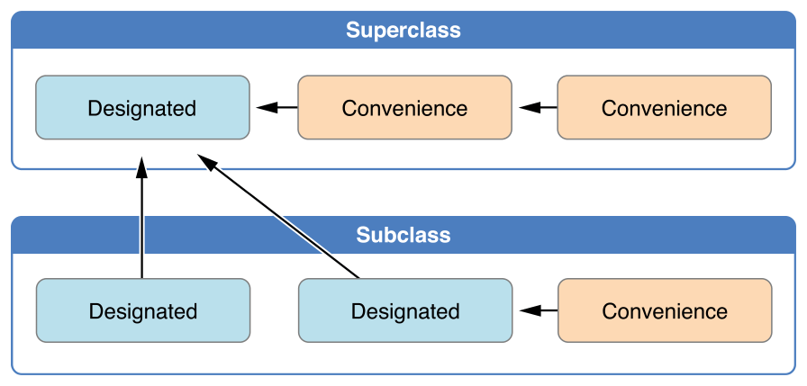
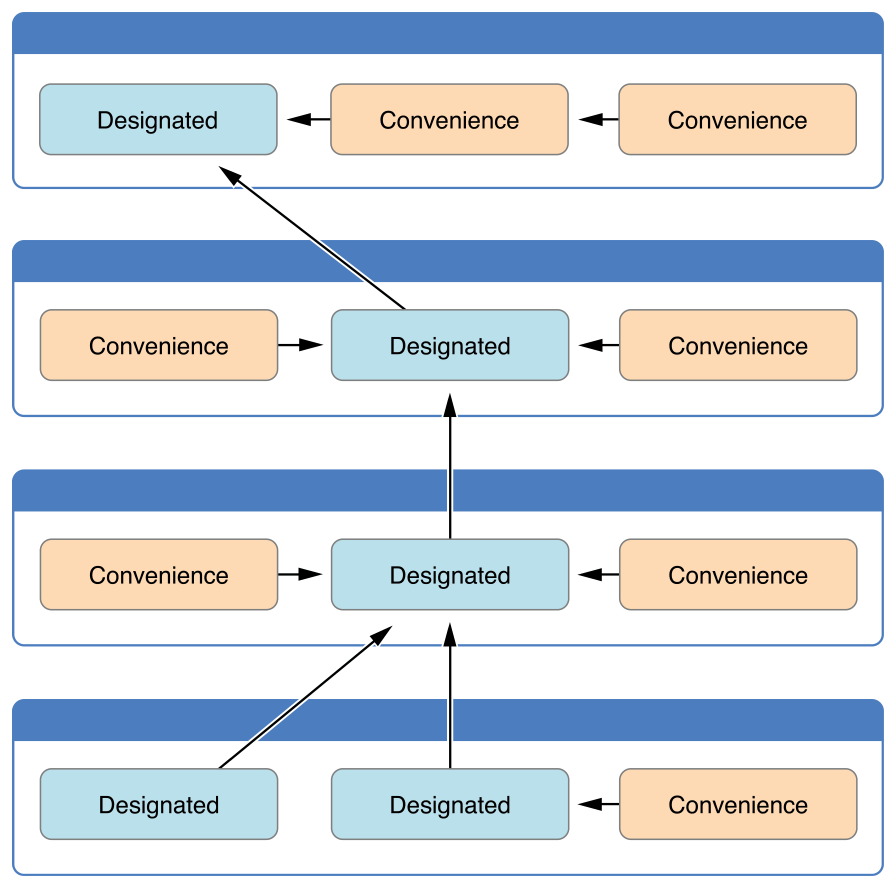
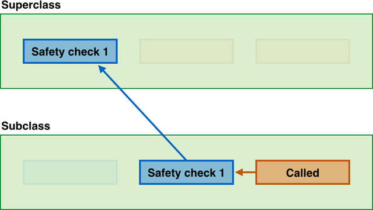
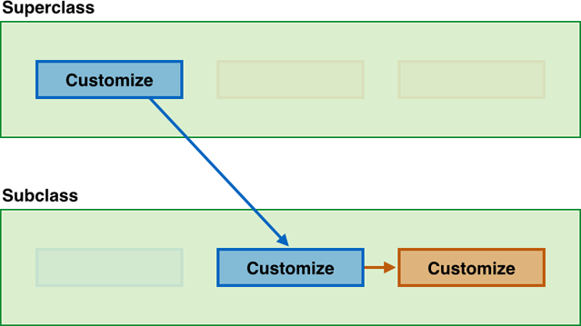
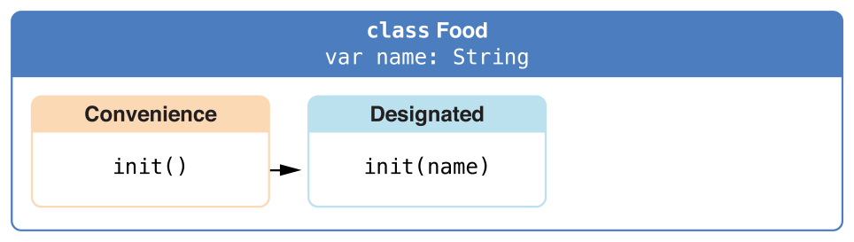
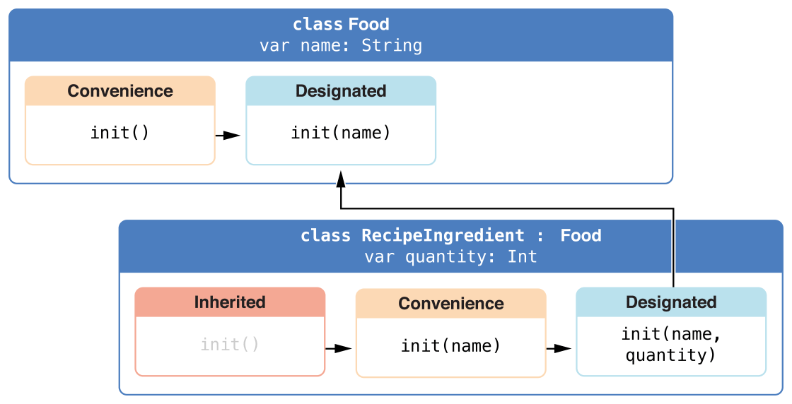
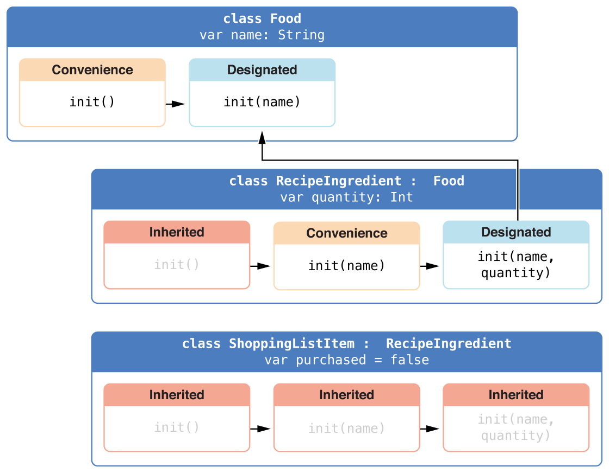
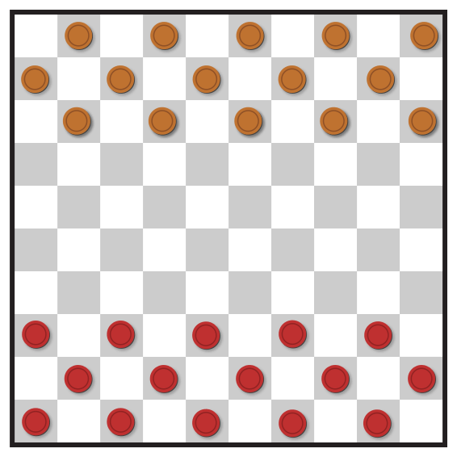

Initialization
==============

:newTerm:`Initialization` is the process of preparing an instance of
a class, structure, or enumeration for use.
This involves setting an initial value for each stored property on that instance,
and performing any other required setup or initialization that is required
before the new instance is considered ready to for use.

You implement this initialization process by defining :newTerm:`initializers`,
which are like special methods that can be called
to create a new instance of a particular type.
Unlike Objective-C, Swift initializers do not return a value.
Their primary role is to ensure that new instances of a type
are correctly initialized before they are used for the first time.

Instances of class types can also implement a :newTerm:`deinitializer`,
which gives an opportunity to perform any custom cleanup
just before an instance of that class is deallocated.
For more information about deinitializers, see :doc:`Deinitialization`.

.. TODO: mention that you can't construct a class instance from a class metatype value,
   because you can't be sure that a subclass will definitely provide the constructor –
   see doug's notes from r14175 for more info

.. _Initialization_SettingInitialValuesForStoredProperties:

Setting Initial Values for Stored Properties
--------------------------------------------

Classes and structures **must** set all of their stored properties
to an appropriate initial value by the time
an instance of that class or structure is created.
Stored properties cannot be left in an indeterminate state.

You can set an initial value for a stored property within an initializer,
or by assigning a default property value as part of the property's definition.
These actions are described in the following sections.

.. note::
   When you assign a default value to a stored property,
   or set its initial value within an initializer,
   the value of that property is set directly,
   without calling any property observers.

.. _Initialization_Initializers:

Initializers
~~~~~~~~~~~~

:newTerm:`Initializers` are called to create a new instance of a particular type.
In its simplest form, an initializer is like an instance method with no parameters,
written using the ``init`` keyword:

The example below defines a new structure called ``Fahrenheit``
to store temperatures expressed in the Fahrenheit scale:

.. testcode:: fahrenheitInit

   -> struct Fahrenheit {
         var temperature: Double
         init() {
            temperature = 32.0
         }
      }
   -> var f = Fahrenheit()
   << // f : Fahrenheit = V4REPL10Fahrenheit (has 1 child)
   -> println("The default temperature is \(f.temperature)° Fahrenheit")
   <- The default temperature is 32.0° Fahrenheit

The ``Fahrenheit`` structure has one stored property,
``temperature``, which is of type ``Double``.
The structure defines a single initializer, ``init``, with no parameters,
which initializes the stored temperature with a value of ``32.0``
(the freezing point of water when expressed in the Fahrenheit scale).

.. _Initialization_DefaultPropertyValues:

Default Property Values
~~~~~~~~~~~~~~~~~~~~~~~

You can set the initial value of a stored property from within an initializer,
as shown above.
Alternatively, you can provide a :newTerm:`default property value`
as part of the property's declaration.

If a property always takes the same initial value,
provide a default value as part of the property's declaration,
rather than setting its value within an initializer.
The end result is the same,
but the default value ties the property's initialization more closely to its declaration,
and makes for shorter, clearer initializers.
It also enables you to infer the type of the property from its default value.
The default value also makes it easier for you to take advantage of
default initializers and initializer inheritance,
as described later in this chapter.

The ``Fahrenheit`` structure from above can be written in a simpler form
by providing a default value for its ``temperature`` property
at the point that the property is declared:

.. testcode:: fahrenheitDefault

   -> struct Fahrenheit {
         var temperature = 32.0
      }

.. _Initialization_CustomizingInitialization:

Customizing Initialization
--------------------------

You can customize the initialization process
with input parameters and optional property types,
or by modifying constant properties during initialization,
as described in the following sections.

.. _Initialization_InitializationParameters:

Initialization Parameters
~~~~~~~~~~~~~~~~~~~~~~~~~

You can provide :newTerm:`initialization parameters` as part of an initializer's definition,
to define the types and names of values that customize the initialization process.
Initialization parameters have the same capabilities and syntax
as function and method parameters.

The following example defines a structure called ``Celsius``,
which stores temperatures expressed in the Celsius scale.
The ``Celsius`` structure implements two custom initializers called
``init(fromFahrenheit:)`` and ``init(fromKelvin:)``,
which initialize a new instance of the structure
with a value from a different temperature scale:

.. testcode:: initialization

   -> struct Celsius {
         var temperatureInCelsius: Double = 0.0
         init(fromFahrenheit fahrenheit: Double) {
            temperatureInCelsius = (fahrenheit - 32.0) / 1.8
         }
         init(fromKelvin kelvin: Double) {
            temperatureInCelsius = kelvin + 273.15
         }
      }
   -> let boilingPointOfWater = Celsius(fromFahrenheit: 212.0)
   << // boilingPointOfWater : Celsius = V4REPL7Celsius (has 1 child)
   /> boilingPointOfWater.temperatureInCelsius is \(boilingPointOfWater.temperatureInCelsius)
   </ boilingPointOfWater.temperatureInCelsius is 100.0
   -> let freezingPointOfWater = Celsius(fromKelvin: -273.15)
   << // freezingPointOfWater : Celsius = V4REPL7Celsius (has 1 child)
   /> freezingPointOfWater.temperatureInCelsius is \(freezingPointOfWater.temperatureInCelsius)
   </ freezingPointOfWater.temperatureInCelsius is 0.0

The first initializer has a single initialization parameter
with an external name of ``fromFahrenheit``, and a local name of ``fahrenheit``.
The second initializer has a single initialization parameter
with an external name of ``fromKelvin``, and a local name of ``kelvin``.
Both of these initializers convert their single argument into
a value in the Celsius scale,
and store this value in a property called ``temperatureInCelsius``.

.. TODO: I need to provide an example of default values for initializer parameters,
   to show they can help you to get multiple initializers "for free" (after a fashion).

.. _Initialization_LocalAndExternalNames:

Local and External Parameter Names
~~~~~~~~~~~~~~~~~~~~~~~~~~~~~~~~~~

As with function and method parameters,
initialization parameters can have both a local name
for use within the initializer's body,
and an external name for use when calling the initializer.

However, initializers do not have an identifying function name before their parentheses
in the way that functions and methods do.
This means that the names and types of an initializer's parameters
play a particularly important role in identifying which initializer should be called.
Because of this, it is usually desirable to provide an external name
for every initialization parameter.

To help with this, Swift provides an automatic external name
for *every* parameter in an initializer if you don't provide an external name yourself.
This automatic external name is the same as the local name,
as if you had written a hash symbol before every initialization parameter.

.. note::

   If you do not want to provide an external name for a parameter in an initializer,
   provide an underscore (``_``) as an explicit external name for that parameter
   to override the default behavior described above.

The following example defines a structure called ``Color``,
with three constant properties called ``red``, ``green``, and ``blue``.
These properties store a value between ``0.0`` and ``1.0``
to indicate the amount of red, green, and blue in the color.

``Color`` provides an initializer with
three appropriately-named parameters of type ``Double``:

.. testcode:: externalParameterNames

   -> struct Color {
         let red = 0.0, green = 0.0, blue = 0.0
         init(red: Double, green: Double, blue: Double) {
            self.red   = red
            self.green = green
            self.blue  = blue
         }
      }

Whenever you create a new ``Color`` instance,
you call its initializer using external names for each of the three color components:

.. testcode:: externalParameterNames

   -> let magenta = Color(red: 1.0, green: 0.0, blue: 1.0)
   << // magenta : Color = V4REPL5Color (has 3 children)

Note that it is not possible to call this initializer
without using the external names.
External names must always be used in an intializer if they are defined,
and omitting them is a compile-time error:

.. testcode:: externalParameterNames

   -> let veryGreen = Color(0.0, 1.0, 0.0)
   // this reports a compile-time error - external names are required
   !! <REPL Input>:1:22: error: missing argument labels 'red:green:blue:' in call
   !! let veryGreen = Color(0.0, 1.0, 0.0)
   !! ^
   !! red: green:  blue:

.. _Initialization_OptionalPropertyTypes:

Optional Property Types
~~~~~~~~~~~~~~~~~~~~~~~

If your custom type has a stored property that is logically allowed to have “no value”,
you should declare the property with an *optional* type.
This might be because the property's value is not set during initialization,
or because the property is allowed to have “no value” at some later point.

Because it is of an optional type,
this kind of property will be automatically initialized with a value of ``nil``
if you do not provide a default value.
This makes it clear that the property is deliberately intended to have “no value yet”
during initialization.

The following example defines a class called ``SurveyQuestion``,
with an optional ``String`` property called ``response``:

.. testcode:: surveyQuestionVariable

   -> class SurveyQuestion {
         var text: String
         var response: String?
         init(text: String) {
            self.text = text
         }
         func ask() {
            println(text)
         }
      }
   -> let cheeseQuestion = SurveyQuestion(text: "Do you like cheese?")
   << // cheeseQuestion : SurveyQuestion = C4REPL14SurveyQuestion (has 2 children)
   -> cheeseQuestion.ask()
   <- Do you like cheese?
   -> cheeseQuestion.response = "Yes, I do like cheese."

The response to a survey question cannot be known until it is asked,
and so the ``response`` property is declared with a type of ``String?``,
or “optional ``String``”.
It is automatically assigned a default value of ``nil``, meaning “no string yet”,
when a new instance of ``SurveyQuestion`` is initialized.

.. _Initialization_ModifyingConstantPropertiesDuringInitialization:

Modifying Constant Properties During Initialization
~~~~~~~~~~~~~~~~~~~~~~~~~~~~~~~~~~~~~~~~~~~~~~~~~~~

The value of a constant property can be modified at any point during initialization,
as long as it is set to a definite value by the time initialization has finished.

.. note::

   For class instances,
   a constant property can only be modified during initialization
   by the class that introduces it.
   It cannot be modified by a subclass.

You can revise the ``SurveyQuestion`` example from above to use
a constant property rather than a variable property for the ``text`` property of the question,
to indicate that the question does not change once an instance of ``SurveyQuestion`` is created.
Even though the ``text`` property is now a constant,
it can still be set within the class's initializer:

.. testcode:: surveyQuestionConstant

   -> class SurveyQuestion {
         let text: String
         var response: String?
         init(text: String) {
            self.text = text
         }
         func ask() {
            println(text)
         }
      }
   -> let beetsQuestion = SurveyQuestion(text: "How about beets?")
   << // beetsQuestion : SurveyQuestion = C4REPL14SurveyQuestion (has 2 children)
   -> beetsQuestion.ask()
   <- How about beets?
   -> beetsQuestion.response = "I also like beets. (But not with cheese.)"

.. _Initialization_DefaultInitializers:

Default Initializers
--------------------

Swift provides a :newTerm:`default initializer`
for any structure or base class
that provides default values for all of its properties,
and does not provide at least one initializer itself.
The default initializer simply creates a new instance
with all of its properties set to their default values.

This example defines a class called ``ShoppingListItem``,
which encapsulates the name, quantity, and purchase state
of an item in a shopping list:

.. testcode:: initialization

   -> class ShoppingListItem {
         var name: String?
         var quantity = 1
         var purchased = false
      }
   -> var item = ShoppingListItem()
   << // item : ShoppingListItem = C4REPL16ShoppingListItem (has 3 children)

Because all properties of the ``ShoppingListItem`` class have default values,
and because it is a base class with no superclass,
``ShoppingListItem`` automatically gains a default initializer implementation
that creates a new instance with all of its properties set to their default values.
(The ``name`` property is an optional ``String`` property,
and so it automatically receives a default value of ``nil``,
even though this value is not written in the code.)
The example above uses the default initializer for the ``ShoppingListItem`` class
to create a new instance of the class with initializer syntax
(written as ``ShoppingListItem()``),
and assigns this new instance to a variable called ``item``.

.. QUESTION: How is this affected by inheritance?
   If I am a subclass of a superclass that defines a designated initializer,
   I (the subclass) presumably don't get a default initializer,
   because I am obliged to delegate up to my parent's default initializer.

.. _Initialization_MemberwiseInitializersForStructureTypes:

Memberwise Initializers for Structure Types
~~~~~~~~~~~~~~~~~~~~~~~~~~~~~~~~~~~~~~~~~~~

In addition to the default initializers mentioned above,
structure types automatically receive a :newTerm:`memberwise initializer`
if they provide default values for all of their stored properties
and do not define any of their own custom initializers.

The memberwise initializer is a shorthand way
to initialise the member properties of new structure instances.
Initial values for the properties of the new instance
can be passed to the memberwise initializer by name:

.. testcode:: initialization

   -> struct Size {
         var width = 0.0, height = 0.0
      }
   -> let twoByTwo = Size(width: 2.0, height: 2.0)
   << // twoByTwo : Size = V4REPL4Size (has 2 children)

.. _Initialization_InitializerDelegationForValueTypes:

Initializer Delegation for Value Types
--------------------------------------

Initializers can call other initializers to perform part of an instance's initialization.
This process is known as :newTerm:`initializer delegation`,
and avoids duplicating code across multiple initializers.

The rules for how initializer delegation works,
and for what forms of delegation are allowed,
are different for value types and class types.
Value types (structures and enumerations) do not support inheritance,
and so their initializer delegation process is relatively simple,
because they can only delegate to another initializer that they provide themselves.
Classes, however, can inherit from other classes,
as described in :doc:`Inheritance`.
This means that classes have additional responsibilities for ensuring that
all of the stored properties they inherit are assigned a suitable value during initialization.
These responsibilities are described in
:ref:`Initialization_ClassInheritanceAndInitialization` below.

For value types, you use ``self.init`` to refer to other initializers
from the same value type when writing your own custom initializers.
You can only call ``self.init`` from within an initializer.

Note that if you define a custom initializer for a value type,
you will no longer have access to the default initializer
(or the memberwise structure initializer, if it is a structure) for that type.
This avoids a situation where you provide a more complex initializer
that performs additional essential setup,
but your more complex initializer is circumvented by someone accidentally using
one of the automatic initializers instead.

.. note::

   If you want your custom value type to be initializable with
   the default initializer and memberwise initializer,
   and also with your own custom initializers,
   write your custom initializers in an extension
   rather than as part of the value type's original implementation.
   For more information, see :doc:`Extensions`.

The following example defines a custom ``Rect`` structure to represent a geometric rectangle.
The example requires two supporting structures called ``Size`` and ``Point``,
both of which provide default values of ``0.0`` for all of their properties:

.. testcode:: valueDelegation

   -> struct Size {
         var width = 0.0, height = 0.0
      }
   -> struct Point {
         var x = 0.0, y = 0.0
      }

You can initialize the ``Rect`` structure below in one of three ways –
by using its default zero-initialized ``origin`` and ``size`` property values;
by providing a specific origin point and size;
or by providing a specific center point and size:

.. testcode:: valueDelegation

   -> struct Rect {
         var origin = Point()
         var size = Size()
         init() {}
         init(origin: Point, size: Size) {
            self.origin = origin
            self.size = size
         }
         init(center: Point, size: Size) {
            let originX = center.x - (size.width / 2)
            let originY = center.y - (size.height / 2)
            self.init(origin: Point(x: originX, y: originY), size: size)
         }
      }

The first ``Rect`` initializer, ``init()``, 
is functionally the same as the default initializer that the structure would have received
if it did not have its own custom initializers.
This initializer has an empty body,
represented by an empty pair of curly braces ``{}``,
and does not perfom any initialization.
Calling this initializer returns a ``Rect`` instance whose
``origin`` and ``size`` properties are both initialized with
the default values of ``Point(x: 0.0, y: 0.0)``
and ``Size(width: 0.0, height: 0.0)``
from their property definitions:

.. testcode:: valueDelegation

   -> let basicRect = Rect()
   << // basicRect : Rect = V4REPL4Rect (has 2 children)
   /> basicRect's origin is (\(basicRect.origin.x), \(basicRect.origin.y)) and its size is (\(basicRect.size.width), \(basicRect.size.height))
   </ basicRect's origin is (0.0, 0.0) and its size is (0.0, 0.0)

The second ``Rect`` initializer, ``init(origin:size:)``,
is functionally the same as the memberwise initializer that the structure would have received
if it did not have its own custom initializers.
This initializer simply assigns the ``origin`` and ``size`` argument values to
the appropriate stored properties:

.. testcode:: valueDelegation

   -> let originRect = Rect(origin: Point(x: 2.0, y: 2.0),
         size: Size(width: 5.0, height: 5.0))
   << // originRect : Rect = V4REPL4Rect (has 2 children)
   /> originRect's origin is (\(originRect.origin.x), \(originRect.origin.y)) and its size is (\(originRect.size.width), \(originRect.size.height))
   </ originRect's origin is (2.0, 2.0) and its size is (5.0, 5.0)

The third ``Rect`` initializer, ``init(center:size:)``, is slightly more complex.
It starts by calculating an appropriate origin point based on
a ``center`` point and a ``size`` value.
It then calls (or :newTerm:`delegates`) to the ``init(origin:size:)`` initializer,
which stores the new origin and size values in the appropriate properties:

.. testcode:: valueDelegation

   -> let centerRect = Rect(center: Point(x: 4.0, y: 4.0),
         size: Size(width: 3.0, height: 3.0))
   << // centerRect : Rect = V4REPL4Rect (has 2 children)
   /> centerRect's origin is (\(centerRect.origin.x), \(centerRect.origin.y)) and its size is (\(centerRect.size.width), \(centerRect.size.height))
   </ centerRect's origin is (2.5, 2.5) and its size is (3.0, 3.0)

The ``init(center:size:)`` initializer could have assigned
the new values of ``origin`` and ``size`` to the appropriate properties itself.
However, it is more convenient (and clearer in intent)
for the ``init(center:size:)`` initializer to take advantage of an existing initializer
that already provides exactly that functionality.

.. note::

   For an alternative way to write this example without defining
   the ``init()`` and ``init(origin:size:)`` initializers yourself,
   see :doc:`Extensions`.

.. _Initialization_ClassInheritanceAndInitialization:

Class Inheritance and Initialization
------------------------------------

Classes can inherit from other classes, as described in :doc:`Inheritance`.
This means that any subclass initializers you write
must ensure that all of the subclass's stored properties –
including any properties that the subclass inherits –
are assigned a suitable value during initialization.

When defining a class, you often provide one or two initializers
that ensure an instance of that class is fully initialized.
These initializers are also typically called by subclasses
as part of their own initialization.

In addition to these primary initializers,
it can also be useful to provide more convenient secondary initializers for a subclass,
which provide simpler or more context-specific ways to create an instance of that subclass.

Swift defines two different kinds of initializers for class types to reflect these needs,
known as designated initializers and convenience initializers.

.. _Initialization_DesignatedInitializersAndConvenienceInitializers:

Designated Initializers and Convenience Initializers
~~~~~~~~~~~~~~~~~~~~~~~~~~~~~~~~~~~~~~~~~~~~~~~~~~~~

:newTerm:`Designated initializers` are the primary initializers for a class.
A designated initializer fully initializes all properties introduced by that class,
and calls an appropriate superclass initializer
to continue the initialization process up the superclass chain.

:newTerm:`Convenience initializers` are secondary, supporting initializers for a class.
You can define a convenience initializer to call a designated initializer on the same class
with some of the designated initializer's parameters set to default values,
or to create an instance of that class for a specific use case or input value type.

Classes tend to have very few designated initializers,
and it is quite common for a class to have only one.
Designated initializers are “funnel” points through which initialization takes place,
and through which the initialization process continues up the superclass chain.

Every class must have at least one designated initializer.
In some cases, this requirement is satisfied
by inheriting one or more designated initializers from a superclass,
as described in :ref:`Initialization_AutomaticInitializerInheritance` below.

You do not have to provide convenience initializers if your class does not require them.
Create convenience initializers whenever a shortcut to a common initialization pattern
will save time or make initialization of the class clearer in intent.

.. _Initialization_InitializerChaining:

Initializer Chaining
~~~~~~~~~~~~~~~~~~~~

To simplify the relationships between designated and convenience initializers,
Swift applies the following three rules for delegation calls between initializers:

**Rule 1**
  Designated initializers must call a designated initializer from their immediate superclass.

**Rule 2**
  Convenience initializers must call another initializer available in the *same* class.

**Rule 3**
  Convenience initializers must ultimately end up calling a designated initializer.

A simple way to remember this is:

* Designated initializers must always delegate *up*.
* Convenience initializers must always delegate *across*.

These rules are illustrated in the figure below:

Here, the superclass has a single designated initializer, and two convenience initializers.
One of the convenience initializers calls another convenience initializer,
which in turn calls the single designated initializer.
This satisfies rules 2 and 3 from above.
The superclass does not itself have a further superclass, and so rule 1 does not apply.

The subclass in this figure has two designated initializers and one convenience initializer.
The convenience initializer must call one of the two designated initializers,
because it can only call another initializer from the same class.
This satisfies rules 2 and 3 from above.
Both designated initializers must call the single designated initializer
from the superclass, to satisfy rule 1 from above.

.. note::

   These rules don't affect how users of your classes *create* instances of each class.
   Any initializer in the diagram above can be used to create
   a fully-initialized instance of the class they belong to.
   The rules only affect how you write the class's implementation.

The figure below shows a more complex class hierarchy for four classes,
and illustrates how the designated initializers in this hierarchy
act as “funnel” points for class initialization,
simplifying the interrelationships among classes in the chain:

.. _Initialization_TwoPhaseInitialization:

Two-Phase Initialization
~~~~~~~~~~~~~~~~~~~~~~~~

Class initialization in Swift is a two-phase process.
In the first phase, each stored property is assigned an initial value
by the class that introduced it.
Once the initial state for every stored property has been determined,
the second phase begins,
and each class is given the opportunity to customize its stored properties further
before the new instance is considered ready for use.

The use of a two-phase initialization process makes initialization safe,
while still giving complete flexibility to each class in a class hierarchy.
Two-phase initialization prevents property values
from being accessed before they are initialized,
and prevents property values from being set to a different value
by another initializer unexpectedly.

.. note::

   Swift's two-phase initialization process is similar to initialization in Objective-C.
   The main difference is that during phase 1,
   Objective-C assigns zero or null values (such as ``0`` or ``nil``) to every property.
   Swift's initialization flow is more flexible
   in that it lets you set custom initial values,
   and can cope with types for which ``0`` or ``nil`` is not a valid default value.

Swift's compiler performs four helpful safety-checks to make sure that
two-phase initialization is completed without error:

**Safety check 1**
  A designated initializer must ensure that all of the properties introduced by its class
  are initialized before it delegates up to a superclass initializer.

As mentioned above,
the memory for an object is only considered fully initialized
once the initial state of all of its stored properties is known.
In order for this rule to be satisfied, a designated initializer must make sure that
all of its own properties are initialized before it hands off up the chain.

**Safety check 2**
  A designated initializer must delegate up to a superclass initializer
  before assigning a value to an inherited property.

If it doesn't, the new value the designated initializer assigns
will be overwritten by the superclass as part of its own initialization.

**Safety check 3**
  A convenience initializer must delegate to another initializer
  before assigning a value to *any* property
  (including properties defined by the same class).

If it doesn't, the new value the convenience initializer assigns
will be overwritten by its own class's designated initializer.

**Safety check 4**
  An initializer cannot call any instance methods,
  read the values of any instance properties,
  or refer to ``self`` as a value
  until after the first phase of initialization is complete.

The class instance is not fully valid until the first phase ends.
Properties can only be accessed, and methods can only be called,
once the class instance is known to be valid at the end of the first phase.

Here's how two-phase initialization plays out, based on the four safety checks above:

**Phase 1**

* A designated or convenience initializer is called on some class.
* Memory for a new instance of that class is allocated.
  The memory is not yet considered initialized.
* A designated initializer for that class confirms that
  all stored properties introduced by that class have a value.
  The memory for these stored properties is now considered to be initialized.
* The designated initializer hands off to a superclass initializer to perform the same task
  for its own stored properties.
* This continues up the class inheritance chain until the top of the chain is reached.
* Once the top of the chain is reached,
  and the final class in the chain has ensured that all of its stored properties have a value,
  the instance's memory is considered to be fully initialized, and phase 1 is complete. 

**Phase 2**

* Working back down from the top of the chain,
  each designated initializer in the chain has the option to customize the instance further.
  Initializers are now able to access ``self``
  and can modify its properties, call its instance methods, and so on.
* Finally, any convenience initializers in the chain have the option
  to customize the instance and to work with ``self``.

Here's how phase 1 looks for an initialization call for a hypothetical subclass and superclass:

In this example, initialization begins with a call to
a convenience initializer on the subclass.
This convenience initializer cannot yet modify any properties.
It delegates across to a designated initializer from the same class.

The designated initializer makes sure that all of the subclass's properties have a value,
as per safety check 1. It then calls a designated initializer on its superclass
to continue the initialization up the chain.

The superclass's designated initializer makes sure that
all of the superclass properties have a value.
There are no further superclasses to initialize,
and so no further delegation is needed.

As soon as all properties of the superclass have an initial value,
its memory is considered to be fully initialized,
and Phase 1 is complete.

Here's how phase 2 looks for the same initialization call:

The superclass's designated initializer now has an opportunity
to customize the instance further
(although it does not have to).

Once the superclass's designated initializer is finished,
the subclass's designated initializer can perform additional customization
(although again, it does not have to).

Finally, once the subclass's designated initializer is finished,
the convenience initializer that was originally called
can perform additional customization.

.. _Initialization_InitializerInheritanceAndOverriding:

Initializer Inheritance and Overriding
~~~~~~~~~~~~~~~~~~~~~~~~~~~~~~~~~~~~~~

Unlike Objective-C,
Swift subclasses do not not inherit their superclass initializers by default.
This prevents a situation in which a simple initializer from a superclass
is automatically inherited by a more specialized subclass,
and can be used to create a new instance of the subclass
that is not fully or correctly initialized.

If you want your custom subclass to present
one or more of the same initializers as its superclass –
perhaps to perform some customization during initialization –
you can provide an overriding implementation of the same initializer
within your custom subclass.

If the initializer you are overriding is a *designated* initializer,
you can override its implementation in your subclass,
and call the superclass version of the initializer from within your overriding version.

If the initializer you are overriding is a *convenience* initializer,
your override must call another designated initializer from its own subclass,
as per the rules described above in :ref:`Initialization_InitializerChaining`.

.. note::

   Unlike methods, properties, and subscripts,
   you do not need to write the ``override`` keyword when overriding an initializer.

.. _Initialization_AutomaticInitializerInheritance:

Automatic Initializer Inheritance
~~~~~~~~~~~~~~~~~~~~~~~~~~~~~~~~~

As mentioned above,
subclasses do not not inherit their superclass initializers by default.
However, superclass initializers *are* automatically inherited if certain conditions are met.
In practice, this means that
you do not need to write initializer overrides in many common scenarios,
and can inherit your superclass initializers with minimal effort whenever it is safe to do so.

Assuming that you provide default values for any new properties you introduce in a subclass,
the following two rules apply:

**Rule 1**
  If your subclass doesn't define any designated initializers,
  it automatically inherits all of its superclass designated initializers.

**Rule 2**
  If your subclass provides an implementation of
  *all* of its superclass designated initializers –
  either by inheriting them as per rule 1,
  or by providing a custom implementation as part of its definition –
  then it automatically inherits all of the superclass convenience initializers.

These rules apply even if your subclass adds further convenience initializers.

.. note::

   A subclass can implement a superclass designated initializer
   as a subclass convenience initializer as part of satisfying rule 2.

.. TODO: feedback from Beto is that this note is a little hard to parse.
   Perhaps this point should be left until the later "in action" example,
   where this principle is demonstrated?

.. TODO: There are rare cases in which we automatically insert a call to super.init() for you.
   When is this? Either way, I need to mention it in here.

.. _Initialization_SyntaxForDesignatedAndConvenienceInitializers:

Syntax for Designated and Convenience Initializers
~~~~~~~~~~~~~~~~~~~~~~~~~~~~~~~~~~~~~~~~~~~~~~~~~~

Designated initializers are written in the same way as simple initializers for value types:

.. syntax-outline::

   init(<#parameters#>) {
      <#statements#>
   }

Convenience initializers are written in the same style,
but with the ``convenience`` keyword placed before the ``init`` keyword,
separated by a space:

.. syntax-outline::

   convenience init(<#parameters#>) {
      <#statements#>
   }

Designated and Convenience Initializers in Action
~~~~~~~~~~~~~~~~~~~~~~~~~~~~~~~~~~~~~~~~~~~~~~~~~

The following example shows designated initializers, convenience initializers,
and automatic initializer inheritance in action.
This example defines a hierarchy of three classes called
``Food``, ``RecipeIngredient``, and ``ShoppingListItem``,
and demonstrates how their initializers interact.

The base class in the hierarchy is called ``Food``,
which is a simple class to encapsulate the name of a foodstuff.
The ``Food`` class introduces a single ``String`` property called ``name``,
and provides two initializers for creating ``Food`` instances:

.. testcode:: designatedConvenience

   -> class Food {
         var name: String
         init(name: String) {
            self.name = name
         }
         convenience init() {
            self.init(name: "[Unnamed]")
         }
      }

The figure below shows the initializer chain for the ``Food`` class:

Classes do not have a default memberwise initializer,
and so the ``Food`` class provides a designated initializer
that takes a single argument called ``name``.
This initializer can be used to create a new ``Food`` instance with a specific name:

.. testcode:: designatedConvenience

   -> let namedMeat = Food(name: "Bacon")
   << // namedMeat : Food = C4REPL4Food (has 1 child)
   /> namedMeat's name is \"\(namedMeat.name)\"
   </ namedMeat's name is "Bacon"

The ``init(name: String)`` initializer from the ``Food`` class
is provided as a *designated* initializer,
because it ensures that all of the stored properties of
a new ``Food`` instance are fully initialized.
The ``Food`` class does not have a superclass,
and so the ``init(name: String)`` initializer does not need to call ``super.init()``
to complete its initialization.

The ``Food`` class also provides a *convenience* initializer, ``init()``, with no arguments.
The ``init()`` initializer provides a default placeholder name for a new food
by delegating across to the ``Food`` class's ``init(name: String)`` with
a ``name`` value of ``[Unnamed]``:

.. testcode:: designatedConvenience

   -> let mysteryMeat = Food()
   << // mysteryMeat : Food = C4REPL4Food (has 1 child)
   /> mysteryMeat's name is \"\(mysteryMeat.name)\"
   </ mysteryMeat's name is "[Unnamed]"

The second class in the hierarchy is a subclass of ``Food`` called ``RecipeIngredient``.
The ``RecipeIngredient`` class models an ingredient in a cooking recipe.
It introduces an ``Int`` property called ``quantity``
(in addition to the ``name`` property it inherits from ``Food``)
and defines two initializers for creating ``RecipeIngredient`` instances:

.. testcode:: designatedConvenience

   -> class RecipeIngredient: Food {
         var quantity: Int
         init(name: String, quantity: Int) {
            self.quantity = quantity
            super.init(name: name)
         }
         convenience init(name: String) {
            self.init(name: name, quantity: 1)
         }
      }

The figure below shows the initializer chain for the ``RecipeIngredient`` class:

The ``RecipeIngredient`` class has a single designated initializer,
``init(name: String, quantity: Int)``,
which can be used to populate all of the properties of a new ``RecipeIngredient`` instance.
This initializer starts by assigning
the passed ``quantity`` argument to the ``quantity`` property,
which is the only new property introduced by ``RecipeIngredient``.
After doing so, the initializer delegates up to
the ``init(name: String)`` initializer of the ``Food`` class.
This process satisfies safety check 1
from :ref:`Initialization_TwoPhaseInitialization` above.

``RecipeIngredient`` also defines a convenience initializer,
``init(name: String)``,
which can be used to create a ``RecipeIngredient`` instance by name alone.
This convenience initializer assumes a quantity of ``1``
for any ``RecipeIngredient`` instance that is created without an explicit quantity.
The definition of this convenience initializer makes
``RecipeIngredient`` instances quicker and more convenient to create,
and avoids code duplication when creating
several single-quantity ``RecipeIngredient`` instances.
This convenience initializer simply delegates across to the class's designated initializer.

Note that the ``init(name: String)`` convenience initializer provided by ``RecipeIngredient``
takes the same parameters as the ``init(name: String)`` *designated* initializer from ``Food``.
Even though ``RecipeIngredient`` provides this initializer as a convenience initializer,
``RecipeIngredient`` has nonetheless provided an implementation of
all of its superclass's designated initializers.
Therefore, ``RecipeIngredient`` automatically inherits
all of its superclass's convenience initializers too.

In this example, the superclass for ``RecipeIngredient`` is ``Food``,
which has a single convenience initializer called ``init()``.
This initializer is therefore inherited by ``RecipeIngredient``.
The inherited version of ``init()`` functions in exactly the same way as the ``Food`` version,
except that it delegates to the ``RecipeIngredient`` version of ``init(name: String)``
rather than the ``Food`` version.

All three of these initializers can be used to create new ``RecipeIngredient`` instances:

.. testcode:: designatedConvenience

   -> let oneMysteryItem = RecipeIngredient()
   << // oneMysteryItem : RecipeIngredient = C4REPL16RecipeIngredient (has 2 children)
   -> let oneBacon = RecipeIngredient(name: "Bacon")
   << // oneBacon : RecipeIngredient = C4REPL16RecipeIngredient (has 2 children)
   -> let sixEggs = RecipeIngredient(name: "Eggs", quantity: 6)
   << // sixEggs : RecipeIngredient = C4REPL16RecipeIngredient (has 2 children)

The third and final class in the hierarchy is
a subclass of ``RecipeIngredient`` called ``ShoppingListItem``.
The ``ShoppingListItem`` class models a recipe ingredient as it appears in a shopping list.

Every item in the shopping list starts out as “unpurchased”.
To represent this fact,
``ShoppingListItem`` introduces a Boolean property called ``purchased``,
with a default value of ``false``.
``ShoppingListItem`` also adds a computed ``description`` property,
which provides a textual description of a ``ShoppingListItem`` instance:

.. testcode:: designatedConvenience

   -> class ShoppingListItem: RecipeIngredient {
         var purchased = false
         var description: String {
            var output = "\(quantity) x \(name.lowercaseString)"
            output += purchased ? " ✔" : " ✘"
            return output
         }
      }

.. note::

   ``ShoppingListItem`` does not define an initializer to provide
   an initial value for ``purchased``,
   because items in a shopping list (as modeled here) always start out unpurchased.

Because it provides a default value for all of the properties it introduces,
and does not define any initializers itself,
``ShoppingListItem`` automatically inherits
*all* of the designated and convenience initializers from its superclass.

The figure below shows the overall initializer chain for all three classes:

You can use all three of the inherited initializers
to create a new ``ShoppingListItem`` instance:

.. testcode:: designatedConvenience

   -> var breakfastList = [
         ShoppingListItem(),
         ShoppingListItem(name: "Bacon"),
         ShoppingListItem(name: "Eggs", quantity: 6),
      ]
   << // breakfastList : Array<ShoppingListItem> = [C4REPL16ShoppingListItem (has 2 children), C4REPL16ShoppingListItem (has 2 children), C4REPL16ShoppingListItem (has 2 children)]
   -> breakfastList[0].name = "Orange juice"
   -> breakfastList[0].purchased = true
   -> for item in breakfastList {
         println(item.description)
      }
   </ 1 x orange juice ✔
   </ 1 x bacon ✘
   </ 6 x eggs ✘

Here, a new array called ``breakfastList`` is created from
an array literal containing three new ``ShoppingListItem`` instances.
The type of the array is inferred to be ``ShoppingListItem[]``.
After creating the array,
the name of the unnamed ``ShoppingListItem`` at the start of the array
is changed to ``"Orange juice"``, and it is marked as having been purchased.
Printing the description of each item in the array
shows that their default states have been set as expected.

.. TODO: talk about the general factory initializer pattern,
   and how Swift's approach to initialization removes the need for most factories.

.. NOTE: We import some Obj-C-imported factory initializers as init() -> MyType,
   but you can't currently write these in Swift yourself.
   After conferring with Doug, I've decided not to include these in the Guide
   if you can't write them yourself in pure Swift.

.. TODO: Feedback from Beto is that it would be useful to indicate the flow
   through these inherited initializers.

.. _Initialization_SettingADefaultPropertyValueWithAClosureOrFunction:

Setting A Default Property Value with a Closure or Function
-----------------------------------------------------------

If a stored property's default value requires some customization or setup,
you can use a closure or global function to provide
a customized default value for that property.
Whenever a new instance of the type that the property belongs to is initialized,
the closure or function is called,
and its return value is assigned as the property's default value.

These kinds of closures or functions typically create
a temporary value of the same type as the property;
tailor that value to represent the desired initial state;
and then return that temporary value to be used as the property's default value.

Here's a skeleton outline of how a closure can be used
to provide a default property value:

.. testcode:: defaultPropertyWithClosure

   >> class SomeType {}
   -> class SomeClass {
         let someProperty: SomeType = {
            // create a default value for someProperty inside this closure
            // someValue must be of the same type as SomeType
   >>       let someValue = SomeType()
            return someValue
         }()
      }

Note that the closure's end curly brace is followed by an empty pair of parentheses.
This tells Swift to execute the closure immediately.
If you omit these parentheses,
you are trying to assign the closure itself to the property,
and not the return value of the closure.

.. note::

   If you use a closure to initialize a property,
   remember that the rest of the instance has not yet been initialized
   at the point that the closure is executed.
   This means that you cannot access any other property values from within your closure,
   even if those properties have default values.
   You also cannot use the implicit ``self`` property,
   or call any of the instance's methods.

The example below defines a structure called ``Checkerboard``,
which models a board for the game of *Checkers* (also known as *Draughts*):

The game of *Checkers* is played on a ten-by-ten board,
with alternating black and white squares.
To represent this game board,
the ``Checkerboard`` structure has a single property called ``boardColors``,
which is an array of 100 ``Bool`` values.
A value of ``true`` in the array represents a black square
and a value of ``false`` represents a white square.
The first item in the array represents the top left square on the board
and the last item in the array represents the bottom right square on the board.

The ``boardColors`` array is initialized with a closure to set up its color values:

.. testcode:: checkers

   -> struct Checkerboard {
         let boardColors: Bool[] = {
            var temporaryBoard = Bool
            var isBlack = false
            for i in 1...10 {
               for j in 1...10 {
                  temporaryBoard.append(isBlack)
                  isBlack = !isBlack
               }
               isBlack = !isBlack
            }
            return temporaryBoard
         }()
         func squareIsBlackAtRow(row: Int, column: Int) -> Bool {
            return boardColors[(row * 10) + column]
         }
      }

Whenever a new ``Checkerboard`` instance is created, the closure is executed
and the default value of ``boardColors`` is calculated and returned.
The closure in the example above calculates and sets
the appropriate color for each square on the board
in a temporary array called ``temporaryBoard``,
and returns this temporary array as the closure's return value
once its setup is complete.
The returned array value is stored in ``boardColors``
and can be queried with the ``squareIsBlackAtRow`` utility function:

.. testcode:: checkers

   -> let board = Checkerboard()
   << // board : Checkerboard = V4REPL12Checkerboard (has 1 child)
   -> println(board.squareIsBlackAtRow(0, column: 1))
   <- true
   -> println(board.squareIsBlackAtRow(9, column: 9))
   <- false

.. TODO: reinstate the section about @required initializers
   once we can say something about creating instances from values of protocol metatype.