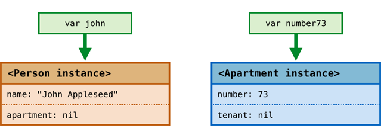
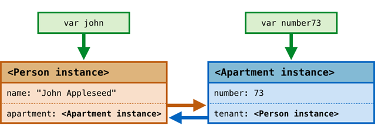
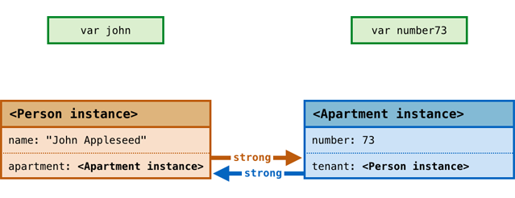
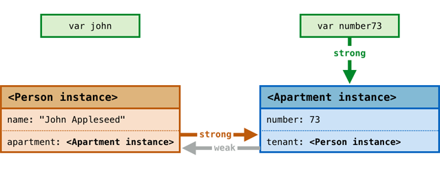
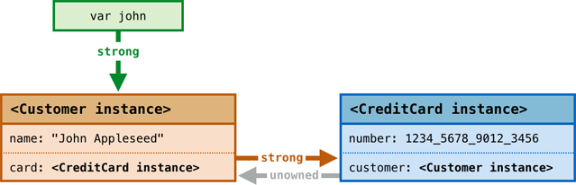
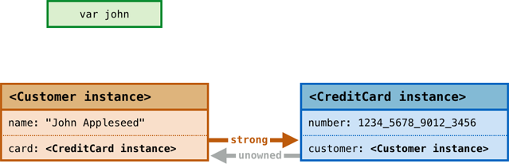

Memory Management
=================

Swift uses :newTerm:`Automatic Reference Counting` (known as ARC)
to track and manage your app's memory usage.
In the vast majority of cases, this means that memory management “just works” in Swift,
and you do not need to think about memory management yourself.
ARC keeps track of the memory being used by your app,
and automatically frees up the memory used by class instances
when those instances are no longer needed.

However, there are a few cases in which ARC requires a little more information
about the relationships between parts of your code
in order to manage memory for you.
This chapter describes those situations,
and shows how to make it easy for ARC to manage all of your app's memory.

.. _MemoryManagement_HowARCWorks:

How ARC Works
-------------

Before considering the relationships between classes in your code,
it is useful to understand how ARC manages memory behind the scenes.
This section introduces the concept of :newTerm:`reference counting`,
and illustrates how ARC takes care of reference counting for you.

.. note::

   Reference counting only applies to instances of classes.
   Structures and enumerations are value types, not reference types,
   and are not stored and passed by reference.

Every time you create a new instance of a class,
Swift allocates a chunk of memory to store information about that instance.
This memory holds information about the type of the instance,
together with the values of any stored properties associated with that instance.

Additionally, when an instance is no longer needed,
Swift frees up the memory used by that instance
so that the memory can be used for other purposes instead.
This makes sure that class instances do not hang around in memory
when they are no longer needed.

In order to manage this process for you,
ARC needs to keep track of whether an instance is still being used.
(If ARC were to destroy an instance that was still in use,
it would no longer be possible to access that instance's properties,
or call that instance's methods.
Indeed, if you tried to access the instance, your app would most likely crash.)

To make sure that instances don't disappear while they are still needed,
ARC keeps track of how many properties, constants, and variables
are currently referring to each class instance.
ARC will not destroy an instance
as long as there is at least one active reference to that instance somewhere in your code.

To make this possible,
whenever you assign a class instance to a property, constant, or variable,
that property, constant, or variable makes a :newTerm:`strong reference` to the instance.
The reference is called a “strong“ reference because
it keeps a firm hold on that instance,
and does not allow it to be destroyed for as long as that strong reference remains.

.. _MemoryManagement_ARCInAction:

ARC In Action
~~~~~~~~~~~~~

Here's an example of how Automatic Reference Counting works.
This example starts by defining a simple class called ``Person``,
which defines a stored constant property called ``name``:

.. testcode:: howARCWorks

   -> class Person {
         let name: String
         init(name: String) {
            self.name = name
            println("\(name) is being initialized")
         }
         deinit {
            println("\(name) is being deinitialized")
         }
      }

The ``Person`` class has an initializer that sets the instance's ``name`` property
and prints a message to indicate that initialization is underway.
The ``Person`` class also has a deinitializer
that prints a message when an instance of the class is destroyed.

The next code snipped defines three variables of type ``Person?``,
which will be used below to set up
multiple references to a new ``Person`` instance below.
Because these variables are of an optional type (``Person?``, not ``Person``),
they are automatically initialized with a value of ``nil``,
and do not currently reference a ``Person`` instance.

.. testcode:: howARCWorks

   -> var reference1: Person?
   << // reference1 : Person? = <unprintable value>
   -> var reference2: Person?
   << // reference2 : Person? = <unprintable value>
   -> var reference3: Person?
   << // reference3 : Person? = <unprintable value>

You can now create a new ``Person`` instance,
and assign it to one of these three variables:

.. testcode:: howARCWorks

   -> reference1 = Person(name: "John Appleseed")
   <- John Appleseed is being initialized

Note that the message ``"John Appleseed is being initialized"`` was printed
at the point that you called the ``Person`` class's initializer.

There is now a strong reference from ``reference1`` to the new ``Person`` instance.
Because there is at least one strong reference,
ARC makes sure that this ``Person`` is kept in memory, and is not destroyed.

If you assign the same ``Person`` instance to two more variables,
two more strong references to that instance are established:

.. testcode:: howARCWorks

   -> reference2 = reference1
   -> reference3 = reference1

There are now *three* strong references to this single ``Person`` instance.

If you break two of these strong references (including the original reference)
by assigning ``nil`` to two of the variables,
a single strong reference will still remain,
and the ``Person`` instance will not be destroyed:

.. testcode:: howARCWorks

   -> reference1 = nil
   -> reference2 = nil

ARC will not destroy the ``Person`` instance until
the third and final strong reference is broken,
at which point it is clear that you are no longer using the ``Person`` instance:

.. testcode:: howARCWorks

   -> reference3 = nil
   <- John Appleseed is being deinitialized

.. _MemoryManagement_StrongReferenceCycles:

Strong Reference Cycles
-----------------------

In the examples above,
ARC is able to track the number of references to the new ``Person`` instance you create,
and to dispose of that ``Person`` instance when it is no longer needed.

However, it is possible to write code in which an instance of a class
*never* gets to a point where it has zero strong references.
This can happen if two class instances hold a strong reference to each other,
such that each instance keeps the other alive.
This is known as a :newTerm:`strong reference cycle`.

You can resolve strong reference cycles
by defining some of the relationships between classes
to be weak or unowned references instead of strong references.
This process is described in :ref:`MemoryManagement_WeakAndUnownedReferences` below.
However, before seeing how to break a strong reference cycle,
it is useful to understand how such a cycle can be caused.

Here's an example of how a strong reference cycle can be created by accident.
This example defines two classes called ``Person`` and ``Apartment``,
which model a block of apartments and its residents:

.. testcode:: referenceCycles
   :compile: true

   -> class Person {
         let name: String
         init(name: String) { self.name = name }
         var apartment: Apartment?
         deinit { println("\(name) is being deinitialized") }
      }
   ---
   -> class Apartment {
         let number: Int
         init(number: Int) { self.number = number }
         var tenant: Person?
         deinit { println("Apartment #\(number) is being deinitialized") }
      }

Every ``Person`` instance has a ``name`` property of type ``String``,
and an optional ``apartment`` property, which is initially ``nil``.
The ``apartment`` property is optional, because a person may not always have an apartment.

Similarly, every ``Apartment`` instance has a ``number`` property of type ``Int``,
and an optional ``tenant`` property, which is initially ``nil``.
The tenant property is optional, because an apartment may not always have a tenant.

Both of these classes also define a deinitializer,
which prints the fact that an instance of that class is being deinitialized.
This enables you to see if
instances of ``Person`` and ``Apartment`` are being disposed of as expected.

This next code snippet defines two variables of optional type
called ``john`` and ``number73``,
which will be set to a specific ``Apartment`` and ``Person`` instance below.
Both of these variables have an initial value of ``nil``, by virtue of being optional:

.. testcode:: referenceCycles
   :compile: true

   -> var john: Person?
   -> var number73: Apartment?

You can now create a specific ``Person`` instance and ``Apartment`` instance,
and assign these new instances to the ``john`` and ``number73`` variables:

.. testcode:: referenceCycles
   :compile: true

   -> john = Person(name: "John Appleseed")
   -> number73 = Apartment(number: 73)

Here's how the strong references look after creating and assigning these two instances.
The ``john`` variable now has a strong reference to the new ``Person`` instance,
and the ``number73`` variable has a strong reference to the new ``Apartment`` instance:

You can now link the two instances together
so that the person has an apartment, and the apartment has a tenant.
Note that an exclamation mark (``!``) is used to unwrap and access
the instances stored inside the ``john`` and ``number73`` optional variables,
so that the properties of those instances can be set:

.. testcode:: referenceCycles

   -> john!.apartment = number73
   -> number73!.tenant = john

Here's how the strong references look after linking the two instances together:

Unfortunately, linking the two instances together creates
a strong reference cycle between the instances.
The ``Person`` instance now has a strong reference to the ``Apartment`` instance,
and the ``Apartment`` instance has a strong reference to the ``Person`` instance.

This means that when you break the strong references held by
the ``john`` and ``number73`` variables,
the reference counts do not drop to zero,
and the instances are not disposed of by ARC:

.. testcode:: referenceCycles
   :compile: true

   -> john = nil
   -> number73 = nil

Note that neither of the deinitializers were called
when you set these two variables to ``nil``.
The strong reference cycle means that the ``Person`` and ``Apartment`` instances
will never be disposed of, causing a memory leak in your app.

Here's how the strong references look after setting
the ``john`` and ``number73`` variables to ``nil``:

The strong references between the ``Person`` instance
and the ``Apartment`` instance remain, and cannot now be broken.

.. _MemoryManagement_WeakAndUnownedReferences:

Weak and Unowned References
---------------------------

Swift provides two ways to resolve strong reference cycles
when working with properties of class type.
These are known as weak references and unowned references.

Weak and unowned references both give a way for one instance in a reference cycle
to refer to the other instance *without* keeping a strong hold on it.
This enables the instances to refer to each other
without creating a strong reference cycle.

You should use a weak reference whenever it is valid for that reference to become ``nil``
at some point during its lifetime.
Conversely, you should use an unowned reference when you know that
the reference will never be ``nil`` once it has been set during initialization.

.. QUESTION: how do I answer the question
   "which of the two properties in the reference cycle
   should be marked as weak or unowned?"

.. _MemoryManagement_WeakReferences:

Weak References
~~~~~~~~~~~~~~~

A :newTerm:`weak reference` is a reference that does not keep a strong hold
on the instance it refers to,
and so does not stop the referenced instance from being destroyed.
This avoids the reference becoming part of a strong reference cycle.
Weak references are indicated by placing the ``weak`` keyword
before a property or variable declaration.

Use a weak reference to avoid reference cycles
whenever it is possible for that reference to have
“no value” at some point in its life.
(If the reference will *always* have a value,
you should use an unowned reference instead,
as described in :ref:`MemoryManagement_UnownedReferences`.)
In the ``Apartment`` example above,
it is appropriate for an apartment to be able to have
“no tenant” at some point in its lifetime,
and so a weak reference is an appropriate way to break the reference cycle in this case.

.. note::

   Weak references must be declared as variables,
   to indicate that their value can change at runtime.
   A weak reference cannot be declared as a constant.

To reflect the fact that weak references are allowed to have “no value”,
every weak reference must be declared as having an optional type.
Optional types are the preferred way to represent the possibility for “no value” in Swift.

Because a weak reference does not keep a strong hold on the instance it refers to,
it is possible for that instance to be destroyed
while the weak reference is still referring to it.
To cope with this fact,
ARC automatically sets a weak reference to ``nil``
when the instance that it refers to is destroyed.
This means that you can safely check for the existence of a value in the weak reference,
just like any other optional value,
and means that you will never end up with
a reference to an invalid instance that no longer exists.

.. TODO: I'm not actually demonstrating this fact. Should I?

Here's how the strong reference cycle example from above
can use a weak reference to avoid the cycle.
This version of the example is identical to the one from above,
with one important difference.
This time around, the ``Apartment`` type's ``tenant`` property
is declared as a weak reference:

.. testcode:: weakReferences
   :compile: true

   -> class Person {
         let name: String
         init(name: String) { self.name = name }
         var apartment: Apartment?
         deinit { println("\(name) is being deinitialized") }
      }
   ---
   -> class Apartment {
         let number: Int
         init(number: Int) { self.number = number }
         weak var tenant: Person?
         deinit { println("Apartment #\(number) is being deinitialized") }
      }

The strong references from the two variables (``john`` and ``number73``),
and the links between the two instances, are created as before:

.. testcode:: weakReferences
   :compile: true

   -> var john: Person?
   -> var number73: Apartment?
   ---
   -> john = Person(name: "John Appleseed")
   -> number73 = Apartment(number: 73)
   ---
   -> john!.apartment = number73
   -> number73!.tenant = john

Here's how the references look after linking the two instances together:

.. image:: ../images/weakReference01.png
   :align: center

The ``Person`` instance still has a strong reference to the ``Apartment`` instance,
but the ``Apartment`` instance now has a *weak* reference to the ``Person`` instance.

This means that when you break the strong references held by
the ``john`` and ``number73`` variables,
there are no more strong references to the ``Person`` instance:

Because there are no more strong references to the ``Person`` instance,
it is destroyed.
After this happens,
there are no more strong references to the ``Apartment`` instance,
and it too is destroyed:

.. testcode:: weakReferences
   :compile: true

   -> john = nil
   -> number73 = nil
   <- John Appleseed is being deinitialized
   <- Apartment #73 is being deinitialized

The final code snippet above shows that
the deinitializers for the ``Person`` instance and ``Apartment`` instance
both print their “deinitialized” messages
after the ``john`` and ``number73`` variables are set to ``nil``.
This proves that the reference cycle has been broken.

.. TODO: weak references can also be implicitly unchecked optionals.
   I should mention this here, but when would it be appropriate to use them?

.. _MemoryManagement_UnownedReferences:

Unowned References
~~~~~~~~~~~~~~~~~~

Just like a weak reference,
an :newTerm:`unowned reference` does not keep a strong hold on the instance it references.
Unlike a weak reference, however,
an unowned reference is assumed to *always* have a value.
Because of this, an unowned reference is always defined as a non-optional type.
Unowned references are indicated by placing the ``unowned`` keyword
before a property or variable declaration.

The fact that an unowned reference is non-optional
means that there is no need to unwrap the unowned reference each time it is used.
An unowned reference can always be accessed directly.

However, because an unowned reference is non-optional,
ARC cannot set the reference to ``nil`` when the instance it refers to is destroyed.
(Variables of a non-optional type cannot be set to ``nil``.)

This means that if you try to access an unowned reference 
after the instance that it references has been destroyed,
you will trigger an unrecoverable runtime error.
This is why unowned references should only be used
when you are sure that the reference will *always* refer to an instance.

.. note::

   Swift guarantees that your app will definitely crash
   if you try and access an unowned reference after the instance it references
   has been destroyed.
   You will never encounter unexpected behavior in this situation –
   your app will always crash reliably.
   (Although you should, of course, avoid it doing so.)

The following example defines two classes, ``Customer`` and ``CreditCard``,
which model a bank customer and a possible credit card for that customer.
These two classes each store an instance of the other class as a property.
This has the potential to create a reference cycle,
as described in :ref:`MemoryManagement_StrongReferenceCycles`.

The relationship between ``Customer`` and ``CreditCard`` is slightly different from
the relationship between ``Apartment`` and ``Person`` seen above.
In this data model, a customer may or may not have a credit card,
but a credit card will *always* be associated with a customer.
To represent this, the ``Customer`` class has an optional ``card`` property,
but the ``CreditCard`` class has a non-optional ``customer`` property.

Furthermore, a new ``CreditCard`` instance can *only* be created
by passing a ``number`` value and a ``customer`` instance
to a custom ``CreditCard`` initializer.
This ensures that a ``CreditCard`` instance always has
a ``customer`` instance associated with it when the ``CreditCard`` instance is created.

Because a credit card will always have a customer,
its ``customer`` property is defined as an unowned reference,
to avoid a strong reference cycle:

.. testcode:: unownedReferences
   :compile: true

   -> class Customer {
         var name: String
         var card: CreditCard?
         init(name: String) {
            self.name = name
         }
         deinit { println("\(name) is being deinitialized") }
      }
   ---
   -> class CreditCard {
         var number: Int
         unowned var customer: Customer
         init(number: Int, customer: Customer) {
            self.number = number
            self.customer = customer
         }
         deinit { println("Card #\(number) is being deinitialized") }
      }

This next code snippet defines an optional ``Customer`` variable called ``john``,
which will be used to store a reference to a specific customer.
This variable has an initial value of nil, by virtue of being optional:

.. testcode:: unownedReferences
   :compile: true

   -> var john: Customer?

You can now create a ``Customer`` instance,
and use it to initialize and assign a new ``CreditCard`` instance
as that customer's ``card`` property:

.. testcode:: unownedReferences
   :compile: true

   -> john = Customer(name: "John Appleseed")
   -> john!.card = CreditCard(number: 1234_5678_9012_3456, customer: john!)

Here's how the references look after linking the two instances together:

The ``Customer`` instance now has a strong reference to the ``CreditCard`` instance,
and the ``CreditCard`` instance has an unowned reference to the ``Customer`` instance.

This means that when you break the strong reference held by the ``john`` variable,
there are no more strong references to the ``Customer`` instance:

Because there are no more strong references to the ``Customer`` instance,
it is destroyed.
After this happens,
there are no more strong references to the ``CreditCard`` instance,
and it too is destroyed:

.. testcode:: unownedReferences
   :compile: true

   -> john = nil
   <- John Appleseed is being deinitialized
   <- Card #1234567890123456 is being deinitialized

The final code snippet above shows that
the deinitializers for the ``Customer`` instance and ``CreditCard`` instance
both print their “deinitialized” messages
after the ``john`` variable is set to ``nil``.

.. _MemoryManagement_UnownedReferencesAndImplicitlyUnwrappedOptionalProperties:

Unowned References and Implicitly Unwrapped Optional Properties
~~~~~~~~~~~~~~~~~~~~~~~~~~~~~~~~~~~~~~~~~~~~~~~~~~~~~~~~~~~~~~~

The examples for weak and unowned references above
cover two of the more common scenarios
in which it is necessary to break a strong reference cycle.

Firstly, the ``Person`` and ``Apartment`` example shows
a situation where two properties, both of which are allowed to be ``nil``,
have the potential to cause a reference cycle.
This scenario is best solved with a weak reference, as shown above.

Secondly, the ``Customer`` and ``CreditCard`` example
shows a situation where one property that is allowed to be ``nil``,
and another property that cannot be ``nil``,
have the potential to cause a reference cycle.
This scenario is best solved with an unowned reference, as shown above.

However, there is a third scenario,
in which *both* properties should always have a value,
and neither property should ever be ``nil`` once initialization is complete.
In this scenario, it is useful to combine an unowned property on one class
with an implicitly unwrapped optional property on the other class.

This enables both properties to be accessed directly
(without optional unwrapping) once initialiation is complete,
while still avoiding a reference cycle.
This section shows you how to set up such a relationship.

The example below defines two classes, ``Country`` and ``City``,
each of which stores an instance of the other class as a property.
In this data model, every country must always have a capital city,
and every city must always belong to a country.
To represent this, the ``Country`` class has a ``capitalCity`` property,
and the ``City`` class has a ``country`` property:

.. testcode:: implicitlyUnwrappedOptionals
   :compile: true

   -> class Country {
         var name: String
         var capitalCity: City!
         init(name: String, capitalName: String) {
            self.name = name
            self.capitalCity = City(name: capitalName, country: self)
         }
      }
   ---
   -> class City {
         var name: String
         unowned var country: Country
         init(name: String, country: Country) {
            self.name = name
            self.country = country
         }
      }

To set up the interdependency between the two classes,
the initializer for ``City`` takes a ``Country`` instance,
and stores this instance in its ``country`` property.

The initializer for ``City`` is called from within the initializer for ``Country``.
However, the initializer for ``Country`` cannot pass ``self`` to the ``City`` initializer
until a new ``Country`` instance has been fully initialized,
as described in :ref:`Initialization_TwoPhaseInitialization`.

To cope with this requirement,
the ``capitalCity`` property of ``Country`` is declared as
an implicitly unwrapped optional property,
indicated by the exclamation mark at the end of its type annotation (``City!``).
This means that it has a default value of ``nil``, like any other optional,
but can be accessed without the need to unwrap its value
(as described in :ref:`TheBasics_ImplicitlyUnwrappedOptionals`).

Because ``capitalCity`` has a default ``nil`` value,
a new ``Country`` instance is considered fully initialized
as soon as the ``Country`` instance sets its ``name`` property within its initializer.
This means that the initializer can start to reference and pass around
the implicit ``self`` property as soon as ``name`` has been set.
This enables it to pass ``self`` as one of the parameters for
the ``City`` initializer when setting its own ``capitalCity`` property.

All of this means that the ``Country`` and ``City`` instances
can be created in a single statement, without creating a reference cycle,
and the ``capitalCity`` property can be accessed directly,
without needing to use an exclamation mark to unwrap its optional value:

.. testcode:: implicitlyUnwrappedOptionals
   :compile: true

   -> var country = Country(name: "Canada", capitalName: "Ottawa")
   -> println("\(country.name)'s capital city is called \(country.capitalCity.name)")
   <- Canada's capital city is called Ottawa

In the example above, the use of an implicitly unwrapped optional
means that all of the two-phase class initializer requirements are satisfied,
and the property can be used and accessed like a non-optional value
once initialization is complete,
while still avoiding a strong reference cycle.

.. _MemoryManagement_ClosureCaptureLists:

Closure Capture Lists
---------------------

:ref:`MemoryManagement_StrongReferenceCycles`
describes how a strong reference cycle can be created
when two class instances hold a strong reference to each other.

Another situation in which a strong reference cycle can occur
is when a closure captures an instance that holds a strong reference to that same closure.
(Capturing values with a closure is described in :ref:`Closures_CapturingValues`.)
Swift provides an elegant solution to this problem,
known as a :newTerm:`closure capture list`.

.. _MemoryManagement_StrongReferenceCyclesInClosures:

Strong Reference Cycles in Closures
~~~~~~~~~~~~~~~~~~~~~~~~~~~~~~~~~~~

.. write-me::