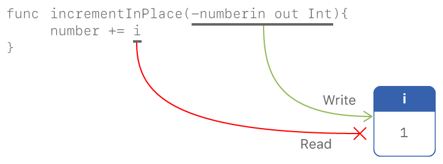

Memory Safety
=============

.. docnote:: TODO

   - Request art changes to the surviving/existing illustrations per the
     FIGURE docnotes below.
   - Meet with art to ask for figures that match the new code listings in the
     "what is exclusivity" section.
   - Resolve XXX comments throughout.  (git grep -I XXX)
   - Convert all code listings to tested code.

By default, Swift prevents unsafe behavior from happening in your code.
For example, Swift ensures that variables are initialized before they’re used,
memory isn’t accessed after it’s been deallocated,
and array indices are checked for out-of-bounds errors.

Swift also makes sure that multiple accesses
to the same area of memory don’t conflict,
by requiring that code modifying an area of memory
has exclusive access to that memory.
Because Swift manages memory automatically,
most of the time you don't have to think about accessing memory at all.
That said,
it's important to understand where potential conflicts can occur,
so you can avoid writing code that causes either compile-time or runtime errors.

.. XXX Brian: Let's bring back this discussion.
   Memory safety refers to...
   The term *safety* usually refers to :newTerm:`memory safety`...
   Unsafe access to memory is available, if you ask for it explicitly...

.. _MemorySafety_WhatIsExclusivity:

Understanding Conflicting Access to Memory
------------------------------------------

Access to memory happens in your code
when you do things like set the value of a variable
or pass an argument to a function.
For example,
the following code contains both a read access and a write access:

:: 

    // a write to the memory where "one" is stored
    var one = 1

    // a read from the memory where "one" is stored
    print("We're number \(one)!")

.. Might be worth a different example,
   or else I'm going to keep getting "We are Number One" stuck in my head.
    

.. XXX Is the listing above adding any real value?

A conflicting access to memory can occur
when different parts of your code are trying
to access the same area of memory at the same time.
If you've written concurrent or multithreaded programs,
conflicting access to memory might be a familiar problem.
However,
the conflicting access discussed in this chapter
*doesn't* involve concurrent or multithreaded code.
In Swift, there are ways to modify a value
that span several lines of code,
which means it's possible for other code to be executed
in the middle of the modification.

You can think of reading from and writing to memory
like writing notes on a piece of paper.
If all your changes involve only one letter,
each change is completed in a single step,
which means one change can't ever happen in the middle of another.
But if a change requires more than one step,
it's possible for other reading and writing to happen
before you finish all of the first change's steps.
You could end up reading some text
that you're still in the middle of writing ---
for example, reading a sentence whose end hasn't been written down yet ---
yielding potentially incorrect results.

Similarly,
multiple accesses to the same area of memory at the same time could
produce unpredictable or inconsistent behaviour
if one of the accesses is writing to that memory.
Two accesses to memory conflict if:

* Both accesses use the same location in memory.
* Both accesses happen at the same time.
* At least one access is writing to that memory.

.. XXX Above, the bullets assume you know what "at the same time" means,
   but long/short term access is described below.

.. XXX Add an example/code listing to show aliasing?

An access is :newterm:`instantaneous`
if it's not possible for other code to run
after that access starts but before it ends.
By their nature, two instantaneous accesses can't happen at the same time.
Most memory access is instantaneous.
For example,
all the read and write accesses in the code listing below are instantaneous:

::

    func oneMore(than number: Int) {
        return number + 1
    }

    var one = 1
    one = oneMore(than: one)
    print(one)

However,
there are several ways to access memory
that span the execution of other code,
which are called a :newterm:`long-term` access.
The important difference between instantaneous and long-term access
is that two long-term accesses can overlap,
with one access starting before the other ends.
The specific kinds of Swift code that use long-term access
are discussed in the sections below.

.. XXX conflicts are unsafe --> they trigger an error

.. note::

    Because exclusive access to memory is a slightly broader guarantee
    than memory safety,
    some code that is memory safe
    violates the guarantee of exclusive access.
    Swift allows this code if the compiler can prove
    that the nonexclusive access to memory is still safe.

.. Versions of Swift before Swift 4 ensure memory safety
   by agressively making a copy of the shared mutable state
   when a conflicting access is possible.
   The copy is no longer shared, preventing the possibility of conflicts.
   However, the copying appproach has a negative impact
   on performance and memory usage.

.. XXX TR: Swift 4 does this copying too.
   Frame this in terms as the copying is the *only* thing Swift 3 did.
   The carrot today is that you have a cleaner semantic model,
   not that you don't get copying.
   It lets you actually know that you have non-overlapping access.

.. docnote:: Facts that need to go somewhere...

    - Within a single thread (use TSan for multithreading)...
    - When working with shared mutable state...

.. XXX Don't put two note boxes next to each other.

.. note::

   Conceptually,
   both read and write access to memory
   can be instantaneous or long-term.
   For example, a nonmutating method
   has a long-term read access to ``self`` for the duration of the method.
   However, in Swift 4.0,
   the only long-term memory action that the compiler models
   is a long-term write.
   It models a long-term read
   as an instantaneous read to make a local copy of the value,
   followed by read accesses to the local copy.

.. <rdar://problem/33115142> [Exclusivity] Write during a long-duration read should be an access violation

.. _MemorySafety_Inout:

Conflicting Access to In-Out Parameters
---------------------------------------

A function has write access
to all of its in-out parameters.
The write access for an in-out parameter starts
after all of the other parameters have been evaluated
and lasts for the entire duration of that function call.

.. XXX What about multiple inout parameters?
   Pretty sure this is just left-to-right.

.. docnote:: Possible example of the "after all other parameters" rule?

One consequence of this long-term write access
is that you can't access the original
variable that was passed as in-out,
even if scoping and access control would otherwise permit it ---
any access to the original creates a conflict.
For example:

.. testcode:: memory-increment

    -> var i = 1
    ---
    -> func incrementInPlace(_ number: inout Int) {
           number += i
       }
    ---
    -> incrementInPlace(&i)  // Error
    xx Simultaneous accesses to 0x10e8667d8, but modification requires exclusive access.
    xx Previous access (a modification) started at  (0x10e86b032).
    xx Current access (a read) started at:

In the code above,
even though ``i`` is a global variable,
and would normally be accessible from within ``incrementInPlace(_:)``,
the read and write accesses to ``i`` conflict
if you call ``incrementInPlace(_:)`` with ``i`` as its parameter.



.. docnote:: FIGURE: add underscored parameter label: (_ number: inout Int)

.. docnote:: Code listing & figure: Replace i with a better name.

Passing the same variable as an in-out parameter more than once
is also an error --- for example:

.. testcode:: memory-balance

    -> func balance(_ x: inout Int, _ y: inout Int) {
           let sum = x + y
           x = sum / 2
           y = sum - x
       }
    -> var myNumber = 42
    -> var myOtherNumber = 9000
    << // myNumber : Int = 42
    << // myOtherNumber : Int = 9000
    -> balance(&myNumber, &myOtherNumber)  // Ok
    -> balance(&myNumber, &myNumber)  // Error
    !! <REPL Input>:1:20: error: inout arguments are not allowed to alias each other
    !! balance(&myNumber, &myNumber)  // Error
    !!                    ^~~~~~~~~
    !! <REPL Input>:1:9: note: previous aliasing argument
    !! balance(&myNumber, &myNumber)  // Error
    !!         ^~~~~~~~~
    !! <REPL Input>:1:9: error: overlapping accesses to 'myNumber', but modification requires exclusive access; consider copying to a local variable
    !! balance(&myNumber, &myNumber)  // Error
    !!                    ^~~~~~~~~
    !! <REPL Input>:1:20: note: conflicting access is here
    !! balance(&myNumber, &myNumber)  // Error
    !!         ^~~~~~~~~

The ``balance(_:_:)`` function above
modifies its two parameters
to divide the total value evenly between them.
Calling it with ``myNumber`` and ``myOtherNumber`` as parameters
preserves exclusive access to memory ---
there are two write accesses that overlap in time,
but they access different memory.
In contrast,
passing ``myNumber`` as the value for both parameters
causes conflicting access to memory
because it tries to perform two write accesses
to the same memory at the same time.

.. note::

    Because operators are implemented as static methods,
    an operator that modifies one or more of operands
    behaves the same as a function
    that takes those value as an in-out parameter.

.. XXX This is a generalization of existing rules around inout.
   Worth revisiting the discussion in the guide/reference
   to adjust wording there, now that it's a consequence of a general rule
   instead of a one-off rule specifically for in-out parameters.

.. _MemorySafety_Methods:

Conflicting Access to self in Methods
-------------------------------------

.. This (probably?) applies to all value types,
   but structures are the only place you can observe it.
   Enumerations can have mutating methods
   but you can't mutate their associated values in place,
   and tuples can't have methods.

.. Methods behave like self is passed to the method as inout
   because, under the hood, that's exactly what happens.

A mutating method on a structure has write access to ``self``
for the duration of the method.
For example, consider a game where each player
has a health amount, which decreases when taking damage,
and an energy amount, which decreases when using special abilities:

.. testcode:: memory-player-share-with-self

    >> func balance(_ x: inout Int, _ y: inout Int) {
    >>     let sum = x + y
    >>     x = sum / 2
    >>     y = sum - x
    >> }
    -> struct Player {
           var name: String
           var health: Int
           var energy: Int
           mutating func restoreHealth() {
               health = 10
           }
       }

In the method above that restores a player's health to 10,
a write access to ``self`` starts at the beginning of the function
and lasts until the function returns.
In this case, there's no other code
inside of ``restoreHealth()``
that could have an overlapping access to properties of a ``Player``.
The ``shareHealth(with:)`` method below takes another ``Player`` as an in-out parameter,
creating the possibility of overlapping accesses.

.. testcode:: memory-player-share-with-self

    -> extension Player {
           mutating func shareHealth(with player: inout Player) {
               balance(&player.health, &health)
           }
       }
    ---
    -> var oscar = Player(name: "Oscar", health: 10, energy: 10)
    -> var maria = Player(name: "Maria", health: 5, energy: 10)
    << // oscar : Player = REPL.Player(name: "Oscar", health: 10, energy: 10)
    << // maria : Player = REPL.Player(name: "Maria", health: 5, energy: 10)
    -> oscar.shareHealth(with: &maria)  // Ok
    -> oscar.shareHealth(with: &oscar)  // Error
    !! <REPL Input>:1:25: error: inout arguments are not allowed to alias each other
    !! oscar.shareHealth(with: &oscar)  // Error
    !!                         ^~~~~~
    !! <REPL Input>:1:1: note: previous aliasing argument
    !! oscar.shareHealth(with: &oscar)  // Error
    !! ^~~~~
    !! <REPL Input>:1:1: error: overlapping accesses to 'oscar', but modification requires exclusive access; consider copying to a local variable
    !! oscar.shareHealth(with: &oscar)  // Error
    !!                          ^~~~~
    !! <REPL Input>:1:25: note: conflicting access is here
    !! oscar.shareHealth(with: &oscar)  // Error
    !! ^~~~~~

In the example above,
calling the ``shareHealth(with:)`` method
for Oscar's player to share health with Maria's player
doesn't cause a violation.
There's a write access to ``oscar`` during the method call
because its the value of ``self`` in a mutating method,
and there's a write access to ``maria``
for the same duration
because it was passed as a in-out parameter.
These write accesses overlap in time,
but they are accessing different memory,
so there is no violation.

However,
if you pass ``oscar`` as the other player,
there's a violation.
The mutating method needs write access to ``self``
for the duration of the method,
and the in-out parameter needs write access to ``player``
for the same duration.
Within the method,
both ``self`` and ``player`` refer to the same ``Player`` ---
the value of ``oscar``` ---
which means the two write accesses conflict.

.. XXX Maybe rename the player parameter to teammate?
   That way you don't have both player and Player in the same discussion.

.. _MemorySafety_Properties:

Conflicting Access to Properties
--------------------------------

Types like structures, tuples, and enumerations
are made up of individual constituent values,
such as the properties of a structure or the elements of a tuple.
Because these are value types, mutating any piece of the value
mutates the whole value ---
this means read or write access to one of the properties
requires read or write access to the whole value.
This rule ensures that value semantics are preserved,
but it doesn't apply to classes, which are reference types.
A mutation to one of the properties of a class instance
isn't considered a mutation to the class instance as a whole.

Here's an example
of how properties can have conflicting access:

.. XXX On a tuple, they're not properties.

.. testcode:: memory-tuple

    >> func balance(_ x: inout Int, _ y: inout Int) {
    >>     let sum = x + y
    >>     x = sum / 2
    >>     y = sum - x
    >> }
    -> var myTuple = (10, 20)
    << // myTuple : (Int, Int) = (10, 20)
    -> balance(&myTuple.0, &myTuple.1)  // Error
    xx Simultaneous accesses to 0x10794d848, but modification requires exclusive access.
    xx Previous access (a modification) started at  (0x107952037).
    xx Current access (a modification) started at:

In the example above,
calling ``balance(_:_:)`` on the elements of a tuple
is an error
because there are overlapping write accesses to the tuple.
Both ``myTuple.0`` and ``myTuple.1`` are passed as in-out parameters,
which means ``balance(_:_:)`` needs write access to them.
In both cases, a write access to the tuple element
requires a write access to the entire tuple.
This means there are two write access to ``myTuple``
with exactly the same duration.

Although a structure is also a value type,
in many cases the compiler can prove
that the overlapping access are safe.
This means most access to stored properties *can* overlap for structures.
For example, consider a game where each player
has a health amount, which decreases when taking damage,
and an energy amount, which decreases when using special abilities.

.. testcode:: memory-share-health

    >> struct Player {
    >>     var name: String
    >>     var health: Int
    >>     var energy: Int
    >> }
    >> func balance(_ x: inout Int, _ y: inout Int) {
    >>     let sum = x + y
    >>     x = sum / 2
    >>     y = sum - x
    >> }
    >> func f() {
    -> var oscar = Player(name: "Oscar", health: 10, energy: 10)
    -> balance(&oscar.health, &oscar.energy)  // Ok
    >> }
    >> f()

.. docnote:: The code in the listing above is wrapped in a hidden function
             because this "overlapping property access is safe" caveat really
             only works for local variables, not globals.  Need to add this to
             the discussion.

In the example above,
Oscar's health and energy are passed
as the two in-out parameters to ``balance(_:_:)`` ---
although this technically violates memory exclusivity
because both are properties of the same structure,
the compiler can prove that memory safety is preserved.
The two stored properties don't interact in any way,
so overlapping writes to them can't cause a problem.

In contrast, if ``health`` is a computed property,
the compiler can't prove whether
the overlapping writes are safe:

.. testcode:: memory-computed-property

    -> struct Player {
           var name: String
           var remainingLives = 5
           var energy = 10
           private var _health: Int = 10
           var health: Int {
               get {
                   return _health
               }
               set {
                   if newValue > 0 {
                       _health = newValue
                   } else {
                       remainingLives -= 1
                       _health = 10
                   }
               }
           }
           init(name: String) {
               self.name = name
           }
       }
    >> func balance(_ x: inout Int, _ y: inout Int) {
    >>     let sum = x + y
    >>     x = sum / 2
    >>     y = sum - x
    >> }
    >> func f() {
    -> var oscar = Player(name: "Oscar")
    -> balance(&oscar.health, &oscar.energy)  // Error
    >> }
    >> f()
    !! <REPL Input>:3:11: error: overlapping accesses to 'oscar', but modification requires exclusive access; consider copying to a local variable
    !! balance(&oscar.health, &oscar.energy)  // Error
    !!                        ^~~~~~~~~~~~~
    !! <REPL Input>:3:26: note: conflicting access is here
    !! balance(&oscar.health, &oscar.energy)  // Error
    !!         ^~~~~~~~~~~~~
    !! <REPL Input>:1:1: error: use of unresolved identifier 'f'
    !! f()
    !! ^

In the version of ``health`` above,
any time the player runs out of health points,
the property setter subtracts a life
and resets ``health`` to its full value of ten.
Because ``health`` is a computed property,
any mutation to a property of ``oscar``
requires mutation to the entire ``Player`` structure,
so overlapping changes to the structure's properties aren't allowed.

.. Because there's no syntax
   to mutate an enum's associated value in place,
   we can't show that overlapping mutations
   to two different associated values on the same enum
   would violate exclusivity.

.. note::

   The compiler can prove
   that overlapping access to properties of a structure is safe
   if the structure is the value of local variable
   that isn't captured by a closure,
   or if it's the value of a local variables
   that's captured by a nonescaping closure.
   For global variables,
   class properties,
   and local variables that are captured by an escaping closures,
   the compiler can’t prove overlapping access is safe.

.. Devin says the latter are "checked at run time"
   but they appear to just be a hard error.

There are two potential ways to fix the conflict access.
Instead of passing multiple properties of a structure
as in-out parameters to the same function,
either write a version of the function
that accepts an instance of the structure as a parameter,
or write a mutating method on the structure.
Both of these approaches avoid the problem
of overlapping write accesses
because they contain only one write access to the structure.

.. TR: This won't apply in nearly as many places.
   The same fundamental problem still applies,
   but the example will get more complicated.

For example,
the code listing below shows two ways
to fix the code from earlier in the chapter
for balancing health and energy.

::

    // Original approach:
    balance(&oscar.health, &oscar.energy)  // Error

    // Passing a single player:
    func balanceHealthAndEnergy(_ player: inout Player) {
        balance(&player.health, &player.energy)
    }
    balanceHealthAndEnergy(&oscar)  // Ok

    // Implemented as a mutating method:
    extension Player {
        mutating func balanceHealthAndEnergy() {
            balance(&health, &energy)
        }
    }
    oscar.balanceHealthAndEnergy()  // Ok

The original approach,
calling ``balance(_:_:)`` and passing it two properties of a ``Player``,
fails because each in-out parameter has its own write access
to ``oscar``.
Both write accesses last the entire duration of the function call,
so they overlap.

The alternate approaches ---
either passing ``oscar`` as the in-out parameter
or implementing ``balance()`` as a mutating method of ``Player`` ---
both resolve the issue the same way:
they have only one write access to ``oscar``.
While that single write access is ongoing,
the properties of ``oscar`` can be read or written.

.. docnote:: TR: Is this accurate?

   It looks like the underlying/nested call to balance(_:_:)
   still has two write accesses,
   one to ``health`` and one to ``energy``.
   Is the difference because those in-out write accesses
   are to a local variable of the outer function/method?

.. _MemorySafety_Resolving:

Strategies for Resolving Exclusivity Violations
-----------------------------------------------

.. docnote:: Move these fixes to be in-line with the corresponding problem,
             instead of all the way down here at the end.

Although, like all types of debugging,
every piece of code is different,
there are some common strategies that you can use
to resolve overlapping access to memory.

**Describe what the code should do.**
Although it might sound silly,
it's useful to work out exactly what was intended
by the code that's causing the compiler error.
In the example above that uses ``mapInPlace``
there were at least two ways
that the code could be expected to execute.

**Make an explicit copy.**
When you have an exclusivity violation
caused by reading memory while that memory is being modified,
you can assign the value to a local constant
before the mutation begins.
For example::

    var numbers = [10, 20, 30]
    let first = numbers[0]
    numbers.mapInPlace { $0 + first }

The first element of ``numbers`` is assigned to ``first``
before calling ``mapInPlace``.
The read access to assign ``first`` its value
completes before ``mapInPlace`` starts modifying the array,
so there isn't a conflict.

.. TR: If you have a conflict using overlapping inout writes,
   you can make an explicit copy using a var,
   and then you have to merge the two values after.

   func (inout foo, closure) { c() }
   var f = 100
   func(&f) { f += 1 }  // Error
   // FIXME: Use a local variable to copy 'f'.


LEFTOVERS
---------

.. docnote:: These need to move to a section above or another chapter.

Some safety violations are detected when you compile your code,
which gives you an error at that time.
Some violations can't be detected at compile time,
because they depend on the current value
of a variable in your code,
such as the index you use to access the array.
These violations that can't be detected at compile time
are detected at runtime.
In general,
Swift detects as many safety violations as possible
at compile time.

At runtime,
when a safety violation is detected,
program execution stops immediately.
Because safety violations are *programmer errors*,
Swift stops program execution instead of throwing an error.
Swift's error-handling mechanism is for recoverable errors;
programmer error, such as a safety violation,
is not recoverable.
Stopping execution immediately, at the point of the violation,
prevents propagating invalid state to other parts of the program
which can corrupt the program's state and the user's data.
A predictable, immediate failure is also easier to debug.
