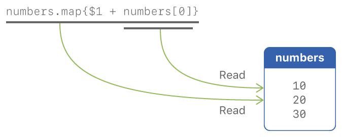
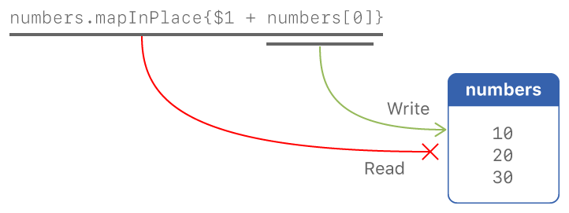
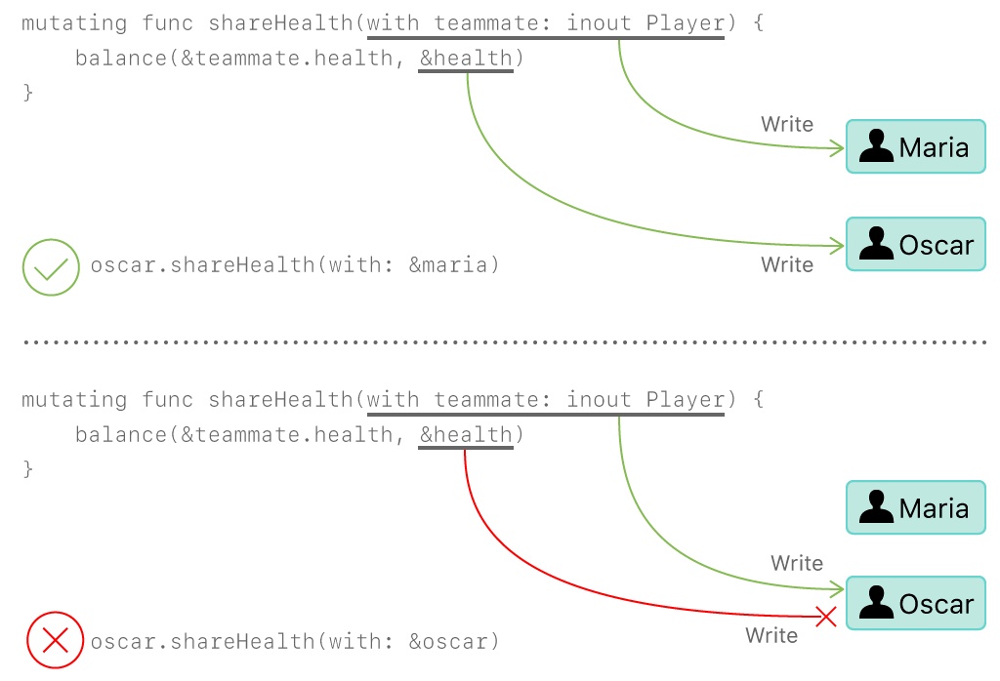

Memory Safety
=============

In Swift, the term *safety* generally refers to :newTerm:`memory safety`.
Although there are other types of safety, such as type safety,

.. XXX Finish connecting the bits of intro above and below.

You can see this naming convention in use
by looking in the standard library
for types and functions that include the word "unsafe" in their name.
Those APIs don't guarantee memory safety,
so it's your responsibility to review your code
when you use them.

Some safety violations are detected when you compile your code,
which gives you an error at that time.
Some violations can't be detected at compile time,
because they depend on the current value
of a variable in your code,
such as the index you use to access the array.
These violations that can't be detected at compile time
are detected at runtime in debug builds.
In general,
Swift detects as many safety violations as possible
at compile time.

At runtime,
when a safety violation is detected,
program execution stops immediately.
Because safety violations are *programmer errors*,
Swift stops program execution instead of throwing an error.
Swift's error-handling mechanism is for recoverable errors;
programmer error, such as a safety violation,
is not recoverable.
Stopping execution immediately, at the point of the violation,
prevents propagating invalid state to other parts of the program
which can corrupt the program's state and the user's data.
A predictable, immediate failure is also easier to debug.

.. note::

    When Swift needs to stop program execution
    in a controlled and predictable manner,
    it uses a mechanism called a trap.
    Although a trap may appear to be the same as a crash to a user
    who sees the program suddenly stop,
    the control and predictability of a trap
    are an important difference.

.. Trapping is also something that Foundation and other frameworks do
   when you violate part of the API contract.
   (Pretty sure that's the same thing there & here.)
   It's implemented there an illegal instruction
   and in the stdlib by Builtin.int_trap().

.. XXX Details about trapping really belong under "Error Handling".

There are several aspects of memory safety that Swift enforces:

* Variables must have a value assigned to them
  before they can be read.
  This guarantee is called :newTerm:`definite initialization`.

* Only memory that is part of a data structure
  can be accessed through that data structure.
  For example, reading past the end of an array
  is an error,
  it doesn't access the adjacent memory.

  .. docnote:: TR: Does this guarantee have a name?

* Access to a region of memory must not overlap,
  except for a read overlapping with another read.
  This guarantee is called :newTerm:`exclusive access`.

.. docnote:: TR: Any other kinds of safety we should mention?

.. XXX Non-overlapping access isn't a 1:1 expression of memory safety ---
   it's a superset of what's required.
   The compiler generally enforces this over-general rule,
   but there are a bunch of special cases
   where violating exclusivity doesn't violate memory safety.
   When the compiler can prove that the nonexclusive access is still safe,
   it concedes to the practical consideration
   of not overburdening the programmer.

The rest of this chapter discusses the guarantee of exclusive access.

Overlapping Access to Memory
----------------------------

When you think about how your program executes,
in many cases the smallest unit you consider
is an individual line of code.
For example,
when you're using the debugger,
you can step through the execution of your program,
one line at a time.
However, within each line of code,
Swift performs several actions.
For example,
consider the steps needed
to execute the second line in the following code listing::

    let numbers = [10, 20, 30]
    let newNumbers = numbers.map { $1 + 100 }

Swift performs the following more granular steps
to execute that line:

* Start reading from ``numbers``.
* Execute the body of the closure three times,
  accumulating the result in a new array.
* Finish reading from ``numbers``.
* Assign the new array as the value of ``newNumbers``.

.. XXX May want to expand on the "execute the closure" step.

Note in particular that
Swift is accessing ``numbers`` for the entire duration
of the ``map`` operation.
Because the read access spans several steps
in the execution,
it's possible for this access to overlap with other accesses.
For example::

    let numbers = [10, 20, 30]
    let newNumbers = numbers.map { $1 + numbers[0] }

This time,
instead of adding a constant amount to each element,
the closure body adds the value of the first element
to each element in ``numbers``.
Swift performs the following more granular steps
to execute the second line:

* Start reading from ``numbers``.
* Execute the closure body three times,
  accumulating the result in a new array.
  Each time, read from ``numbers[0]``.
* Finish reading from ``numbers``.
* Assign the new array as the vaulue of ``newNumbers``.

.. XXX May want to expand on the "execute the closure" step.

The access to ``numbers[0]`` inside the body of the closure
overlaps the ongoing access to ``numbers``
that started in the first step.
However, this overlap is safe
because both accesses are *reading* from the array.

In contrast to the example above,
where two read operations are allowed to overlap,
the example below shows a read and write that overlap,
causing a violation of memory exclusivity,
and a compiler error.
Consider an in-place version of ``map`` called ``mapInPlace``::

    var numbers = [10, 20, 30]
    numbers.mapInPlace { $1 + numbers[0] }  // Error

.. XXX: Add an implementation of mapInPlace.
   The outline has one based on Collection.map,
   but there might be a way to simplify it.

Because ``mapInPlace`` changes the array,
it has a write access to ``numbers`` for the duration
of the function call.
Just like the read access for ``map``,
the write access for ``mapInPlace`` spans several steps ---
overlapping with the read inside the closure
to get the first element of the array.
Different parts of the program
are reading from and writing to the same memory at the same time
which is a violation of memory safety.

In this case,
you can also see the ambiguity
by considering what the value of ``numbers`` should be
after running the code.
Should ``numbers[0]`` access the first element
of the original array,
giving an answer of ``[20, 30, 40]``
or should it access the first element
after it was transformed in place,
giving an answer of ``[20, 40, 50]``?
The answer isn't clear ---
both interpretations of that piece of code
are reasonable.

.. XXX Probably need more here...

Exclusive Access for Functions
------------------------------

A function has write access
to any parameters passed as in-out;
the write access lasts
for that entire duration of the function.
One consequence of this is that you can't access the original
variable or constant that was passed as in-out,
even if scoping and access control would otherwise permit it ---
any access to the original
creates a conflict.

.. XXX Probably only want one of the two examples below.

For example::

    var i = 1

    func incrementInPlace(_ number: inout Int) {
        number += i
    }

    incrementInPlace(&i)

In the code above,
even though ``i`` is a global variable,
and would normally be accessible from within ``incrementInPlace(_:)``,
the read and write accesses to ``i`` conflict
if you call ``incrementInPlace(_:)`` with ``i`` as its parameter.

.. image:: ../images/memory_increment_2x.png
   :align: center

.. XXX This is a generalization of existing rules around inout.
   Worth revisiting the discussion in the guide/reference
   to adjust wording there, now that it's a consequence of a general rule
   instead of a one-off rule specifically for in-out parameters.

.. XXX There's a transition here.

For example, consider a game where each player
has a health amount, which decreases when taking damage,
and an energy amount, which decreases when using special abilities.
One of the players, Oscar,
has an action that lets him give health points
to another player.

::

    struct Player {
        var name: String
        var health: Int
        var energy: Int
    }

    var oscar = Player(name: "Oscar", health: 10, energy: 10)
    var maria = Player(name: "Maria", health: 5, energy: 10)

    func shareHealth(_ player: inout Player) {
        player.health += oscar.health
    }

    shareHealth(&maria)  // Ok
    shareHealth(&oscar)  // Error

In this example,
the `shareHealth(_:)` function lets Oscar share health
with another player
by adding Oscar's health to that other player's health.

In the first case,
Oscar shares health with Maria,
which works as expected.
However, in the second case,
Oscar tries to shares health with himself,
which results in conflicting accesses to ``oscar``.
There is a write access to ``oscar``
for the entire duration of the function,
because it is passed as an in-out parameter.
There is also a read access to ``oscar`` from within the function.

.. XXX A bit of polish above 2 paras.

.. XXX Add a "this example does" after the figure,
   walking through in more detail.

Exclusive Access for Properties
-------------------------------

Depending on whether a type is a value type or a reference type,
exclusivity applies either to the whole value
or only to individual properties.

.. XXX Finish a bit of framing

.. General thoughts on classes vs structs

   It's ok to have spooky action at a distance in classes
   because they're already reference types.
   You need to be able to deal with them having overlapping access
   in the same way that you need to deal with them having
   reference semantics.

   Likewise, for structures,
   the language model for mutation is that
   when you assign a new value to a property of a struct,
   it's the moral equivalent of assigning a new value
   to the entire struct.
   There's no reference semantics,
   so no spooky action at a distance,
   and therefore no overlapping access
   (which could cause such a thing)
   is allowed.

Properties of Value Types
~~~~~~~~~~~~~~~~~~~~~~~~~

Types like structures, tuples, and enumerations
are made up of individual constituent values,
such as a structure's properties or a tuple's elements.
Because these are value types, mutation to any piece of the value
is a mutation to the whole value.

For example,
another action that players have in the game
is to balance the number of points they have
for health and energy.

::

    func balance(_ x: inout Int, _ y: inout Int) {
        let sum = x + y
        x = sum / 2
        y = sum - x
    }
    balance(&oscar.health, &oscar.energy)  // Error

In the example above,
Oscar's health and energy are passed
as the two in-out parameters to ``balance(_:_:)`` ---
which violates memory exclusivity
because both are properties of the same structure.
Any mutation to a property of ``oscar``
requires mutation to the entire ``Player`` structure,
so overlapping changes to its properties aren't allowed.

.. XXX Add an example using balance() on a tuple?

.. Because there's no syntax
   to mutate an enum's associated value in place,
   we can't show that overlapping mutations
   to two different associated values on the same enum
   would violate exclusivity.

Properties of Reference Types
~~~~~~~~~~~~~~~~~~~~~~~~~~~~~

Because classes are reference types,
a mutation to one of the properties of a class instance
isn't considered a mutations to the class instance as a whole.
That rule ensures that value semantics are preserved for value types,
but it doesn't apply to classes, which are reference types.
It's not unusual to have faraway code change parts of a class.

For example,
the code below uses the ``balance(_:_:)`` function
from the previous example
to level the odds for two players
by balancing their scores.

::

    class Game {
        var playerOneScore: Int = 5
        var playerTwoScore: Int = 10
    }
    
    let game = Game()
    balance(&game.playerOneScore, &game.playerTwoScore)  // Ok

Here, the access to ``game.playerOneScore`` and ``game.playerTwoScore`` do overlap,
and they're both write accesses.
However,
because ``Game`` is a class,
access to one of its properties
*doesn't* require access to the entire instance.
The two write accesses happen alongside one another

::

    PLACEHOLDER ART FOR SUGGESTED FIGURE

    balance(&game.playerOneScore, &game.playerTwoScore)
            --------------------  --------------------
                    |                     |                game
                    |                     |
                    |                     +------------->  p2score
                    +----------------------------------->  p1score

Exclusive Access for Methods
----------------------------

Methods on Value Types
----------------------

.. XXX A nonmutating method has a read access to 'self'

.. XXX A nonmutating method has a write  access to 'self'

::

    extension Player {
        mutating func shareHealth(with: player inout Player) {
            balance(&player.health, &health)
        }
    }

    oscar.shareHealth(with: &maria)  // Ok
    oscar.shareHealth(with: &oscar)  // Error

Methods on Reference Types
--------------------------

.. XXX Along the lines of the above discunnion for properties,
   mutating methods on classes
   have read/write access to only the properties they actually access.
   No long-term access to 'self'.

Exclusive Access for Closures
-----------------------------

Swift has a rule about passing more than one closure to the same function. 
This rule allows Swift to perform
all of its checks for memory exclusivity violations
in nonescaping closures
at compile time, and not have to do any at runtime.

.. XXX is there any rule around capturing that we're missing?

For the purposes of checking exclusive access to memory,
a closure is considered nonescaping
if it is one of the following:

* A closure expression that is called immediately.
* A closure expression that's passed
  as a nonescaping function argument.
* A nested function that captures a value
  which is guaranteed to never escape,
  such as an in-out parameter.
  Because the captured value can't escape,
  the nested function will also be restricted from escaping,
  making it nonescaping too.

.. XXX Which needs to come first,
   the rule or the definition of nonescaping
   for the purposes of exclusivity checking?

For functions that take multiple closures,
the restriction is as follows:
one nonescaping closure that's passed as a parameter
to the function
can't be used as a parameter when calling the other closure.
For example,
the following isn't allowed:

::

	typealias Transformation = (Int) -> Int
	typealias MetaTransformation = (Transformation, Int) -> Int

	function myFunction(_ transformation: Transformation, _ metaTransformation: MetaTransformation) {
		metaTransformation(transformation, 9000)
	}

In the code above,
both of the parameters to ``myFunction(_:_:)`` are closures.
Because neither one is marked ``@escaping``,
they are both nonescaping.
However, in the function body,
one nonescaping closure, ``transformation``,
is passed as the argument when calling
another nonescaping closure, ``metaTransformation``.

.. note::

   If you have code that needs to violate this rule,
   mark one of the closures as escaping.

Strategies for Resolving Exclusivity Violations
-----------------------------------------------

.. XXX Swap out below with a less throat-clearing intro.

Although, like all types of debugging,
every piece of code is different,
there are some common strategies that you can use
to resolve overlapping access to memory.

**Describe what the code should do.**
Although it might sound silly,
it's useful to work out exactly what was intended
by the code that's causing the compiler error.
In the example above that uses ``mapInPlace``
there were at least two ways
that the code could be expected to execute.

**Make an explicit copy.**
When you have an exclusivity violation
caused by reading memory while that memory is being modified,
you can assign the value to a local constant
before the mutation begins.
For example::

    var numbers = [10, 20, 30]
    let first = numbers[0]
    numbers.mapInPlace { $0 + first }

The first element of ``numbers`` is assigned to ``first``
before calling ``mapInPlace``.
The read access to assign ``first`` its value
completes before ``mapInPlace`` starts modifying the array,
so there isn't a conflict.

**Operate on a whole structure instead of its properties.**
Instead of passing multiple properties of a structure
as in-out parameters to the same function,
either write a version of the function
that accepts an instance of the structure as a parameter,
or write a mutating method on the structure.
Both of these approaches avoid the problem
of overlapping write accesses
because they contain only one write access to the structure.

For example,
the code listing below shows two ways
to fix the code from earlier in the chapter
for balancing health and energy.

::

    func balanceHealthAndEnergy(player: inout Player) {
        balance(&player.health, &player.energy)
    }
    balanceHealthAndEnerge(&oscar)

    extension Player {
        mutating func balanceHealthAndEnergy {
            balance(&health, &energy)
        }
    }
    oscar.balance()

The first approach,
calling ``balance(_:_:)`` and passing it two properties of a ``Player``,
fails because each in-out parameter has its own write access
to ``oscar``.
Both write accesses last the entire duration of the function call,
so they overlap.
The alternate approaches ---
either passing ``oscar`` as the in-out parameter
or implementing ``balance()`` as a mutating method of ``Player`` ---
both resolve the issue the same way:
they have only one write access to ``oscar``.

.. docnote:: TR: Is this accurate?

   It looks like the underlying/nested call to balance(_:_:)
   still has two write accesses,
   one to ``health`` and one to ``energy``.
   Is the difference because those in-out write accesses
   are to a local variable of the outer function/method?

