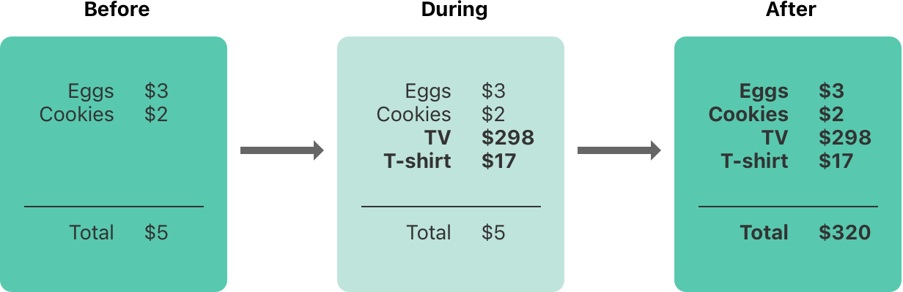
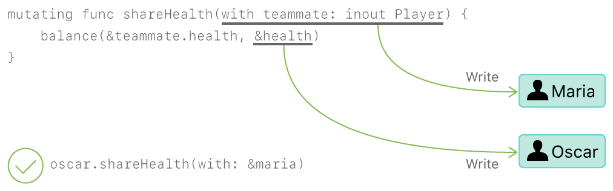
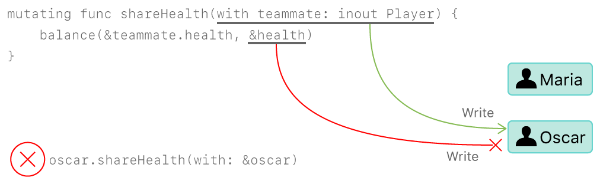

Memory Safety
=============

By default, Swift prevents unsafe behavior from happening in your code.
For example,
Swift ensures that variables are initialized before they're used,
memory isn't accessed after it's been deallocated,
and array indices are checked for out-of-bounds errors.

Swift also makes sure that multiple accesses
to the same area of memory don't conflict,
by requiring code that modifies an area of memory
to have exclusive access to that memory.
Because Swift manages memory automatically,
most of the time you don't have to think about accessing memory at all.
However,
it's important to understand where potential conflicts can occur,
so you can avoid writing code that has conflicting access to memory.
If your code does contain conflicts,
you'll get a compile-time or runtime error.

.. XXX maybe re-introduce this text...

   Memory safety refers to...
   The term *safety* usually refers to :newTerm:`memory safety`...
   Unsafe access to memory is available, if you ask for it explicitly...

.. _MemorySafety_WhatIsExclusivity:

Understanding Conflicting Access to Memory
------------------------------------------

A conflicting access to memory can occur
when different parts of your code are trying
to access the same area of memory at the same time.
If you've written concurrent or multithreaded code,
conflicting access to memory might be a familiar problem.
However,
the conflicting access discussed here can happen
on a single thread and
*doesn't* involve concurrent or multithreaded code.

Conflicting access can happen on a single thread.
In Swift, there are ways to modify a value
that span several lines of code,
which means it's possible for other code to be executed
in the middle of the modification.
Multiple accesses to an area of memory at the same time
can produce unpredictable or inconsistent behavior.

You can see a similar problem
by thinking about how you update a budget
that's written on a piece of paper.
Updating the budget is a two-step process:
First you add the items' names and prices,
and then you change the total amount
to reflect the items currently on the list.
Before and after the update,
you can read any information from the budget
and get a correct answer,
as shown in the figure below.

While you're adding items to a budget,
it's in a temporary, invalid state
because the total amount hasn't been updated
to reflect the newly added items.
Reading the total amount
during the process of adding an item
gives you incorrect information.

.. note::

   If you have conflicting access to memory
   from within a single thread,
   Swift guarantees that you'll get an error
   at either compile time or runtime.
   For multithreaded code,
   use `Thread Sanitizer <https://developer.apple.com/documentation/code_diagnostics/thread_sanitizer>`_
   to help detect conflicting access across threads.

.. XXX The xref above doesn't seem to give enough information.
   What should I be looking for when I get to the linked page?

.. XXX This still isn't really the right place for this threading aside.

.. _Memory_Characteristics:

Characteristics of Memory Access
~~~~~~~~~~~~~~~~~~~~~~~~~~~~~~~~

.. XXX rough drafting...

   There are several characteristics of memory access: duration, location, and read/write.
   These characteristics become important
   when multiple parts of your code interact with possibly related memory.

   Multiple parts of your code interacting could lead to many memory access.

Access to memory happens in your code
when you do things like set the value of a variable
or pass an argument to a function.
For example,
the following code contains both a read access and a write access:

.. testcode:: memory-read-write

    // A write access to the memory where "one" is stored
    -> var one = 1
    << // one : Int = 1
    ---
    // A read access from the memory where "one" is stored
    -> print("We're number \(one)!")
    << We're number 1!

.. Might be worth a different example,
   or else I'm going to keep getting "We are Number One" stuck in my head.
    

You can recognize conflicting access to memory
if you break down your code according to three characteristics:
whether any accesses are writes,
the duration of the accesses, the locations in memory being accessed.
Specifically,
a conflict occurs if you have two accesses
that meet all of the following conditions:

- One is a write access.
- They access the same location.
- Their durations overlap.

The difference between a read and write access
is explained above.
The location of a memory access
refers to the address in memory.
The duration of a memory access
can be described as either instantaneous or long-term.

.. XXX better handwaving around memory location
   variables and properties that refer to the same instances

An access is :newterm:`instantaneous`
if it's not possible for other code to run
after that access starts but before it ends.
By their nature, two instantaneous accesses can't happen at the same time.
Most memory access is instantaneous.
For example,
all the read and write accesses in the code listing below are instantaneous:

.. testcode:: memory-instantaneous

    -> func oneMore(than number: Int) -> Int {
           return number + 1
       }
    ---
    -> var one = 1
    << // one : Int = 1
    -> one = oneMore(than: one)
    -> print(one)
    <- 2

However,
there are several ways to access memory,
called :newterm:`long-term` accesses,
that span the execution of other code.
The difference between instantaneous access and long-term access
is that it’s possible for other code to run
after a long-term access starts but before it ends,
which is called :newTerm:`overlap`.
A long-term access can overlap
with other long-term accesses and instantaneous accesses.

.. XXX maybe re-introduce this text...

   The specific kinds of Swift code that use long-term access
   are discussed in the sections below.

.. _MemorySafety_Inout:

Conflicting Access to In-Out Parameters
---------------------------------------

A function has long-term write access
to all of its in-out parameters.
The write access for an in-out parameter starts
after all of the non-in-out parameters have been evaluated
and lasts for the entire duration of that function call.
If there are multiple in-out parameters,
the write accesses start in the same order as the parameters appear in.

One consequence of this long-term write access
is that you can't access the original
variable that was passed as in-out,
even if scoping rules and access control would otherwise permit it ---
any access to the original creates a conflict.
For example:

.. testcode:: memory-increment

    -> var stepSize = 1
    ---
    -> func incrementInPlace(_ number: inout Int) {
           number += stepSize
       }
    ---
    -> incrementInPlace(&stepSize)  // Error
    xx Simultaneous accesses to 0x10e8667d8, but modification requires exclusive access.
    xx Previous access (a modification) started at  (0x10e86b032).
    xx Current access (a read) started at:

In the code above,
even though ``stepSize`` is a global variable,
and would normally be accessible from within ``incrementInPlace(_:)``,
the read and write accesses to ``stepSize`` conflict
if you call ``incrementInPlace(_:)`` with ``stepSize`` as its parameter.
As shown in the figure below,
both ``number`` and ``stepSize`` refer to the same memory.

.. image:: ../images/memory_increment_2x.png
   :align: center

One way to solve this conflict
is to make an explicit copy of the step size:

.. testcode:: memory-increment-copy

    >> var stepSize = 1
    << // stepSize : Int = 1
    >> func incrementInPlace(_ number: inout Int) {
    >>     number += stepSize
    >> }
    ---
    // Make an explicit copy.
    -> var copyOfStepSize = stepSize
    << // copyOfStepSize : Int = 1
    -> incrementInPlace(&copyOfStepSize)
    ---
    // Update the original.
    -> stepSize = copyOfStepSize
    /> stepSize is now \(stepSize)
    </ stepSize is now 2

When you make a copy of ``stepSize`` before calling ``incrementInPlace(_:)``,
it's clear that the value of ``copyOfStepSize`` is incremented
by the current step size.
There's only one access to ``stepSize`` in the function,
so there isn't a conflict.

Passing the same variable as an in-out parameter more than once
is also an error.
For example:

.. testcode:: memory-balance

    -> func balance(_ x: inout Int, _ y: inout Int) {
           let sum = x + y
           x = sum / 2
           y = sum - x
       }
    -> var myNumber = 42
    -> var myOtherNumber = 9000
    << // myNumber : Int = 42
    << // myOtherNumber : Int = 9000
    -> balance(&myNumber, &myOtherNumber)  // OK
    -> balance(&myNumber, &myNumber)  // Error
    !! <REPL Input>:1:20: error: inout arguments are not allowed to alias each other
    !! balance(&myNumber, &myNumber)  // Error
    !!                    ^~~~~~~~~
    !! <REPL Input>:1:9: note: previous aliasing argument
    !! balance(&myNumber, &myNumber)  // Error
    !!         ^~~~~~~~~
    !! <REPL Input>:1:9: error: overlapping accesses to 'myNumber', but modification requires exclusive access; consider copying to a local variable
    !! balance(&myNumber, &myNumber)  // Error
    !!                    ^~~~~~~~~
    !! <REPL Input>:1:20: note: conflicting access is here
    !! balance(&myNumber, &myNumber)  // Error
    !!         ^~~~~~~~~

The ``balance(_:_:)`` function above
modifies its two parameters
to divide the total value evenly between them.
Calling it with ``myNumber`` and ``myOtherNumber`` as parameters
preserves exclusive access to memory ---
there are two write accesses that overlap in time,
but they access different memory.
In contrast,
passing ``myNumber`` as the value for both parameters
causes conflicting access to memory
because it tries to perform two write accesses
to the same memory at the same time.

.. note::

    Because operators are functions,
    they can have long-term accesses to their in-out parameters too.
    For example, if ``balance`` was an operator function named ``+++``,
    writing ``myNumber +++ myNumber`` would result in the same conflicting access
    as ``balance(&myNumber, &myNumber)``.

.. _MemorySafety_Methods:

Conflicting Access to self in Methods
-------------------------------------

.. This (probably?) applies to all value types,
   but structures are the only place you can observe it.
   Enumerations can have mutating methods
   but you can't mutate their associated values in place,
   and tuples can't have methods.

.. Methods behave like self is passed to the method as inout
   because, under the hood, that's exactly what happens.

A mutating method on a structure has write access to ``self``
for the duration of the method.
For example, consider a game where each player
has a health amount, which decreases when taking damage,
and an energy amount, which decreases when using special abilities.

.. testcode:: memory-player-share-with-self

    >> func balance(_ x: inout Int, _ y: inout Int) {
    >>     let sum = x + y
    >>     x = sum / 2
    >>     y = sum - x
    >> }
    -> struct Player {
           var name: String
           var health: Int
           var energy: Int
           mutating func restoreHealth() {
               health = 10
           }
       }

In the method above that restores a player's health to 10,
a write access to ``self`` starts at the beginning of the function
and lasts until the function returns.
In this case, there's no other code
inside ``restoreHealth()``
that could have an overlapping access to the properties of a ``Player`` instance.
The ``shareHealth(with:)`` method below
takes another ``Player`` instance as an in-out parameter,
creating the possibility of overlapping accesses.

.. testcode:: memory-player-share-with-self

    -> extension Player {
           mutating func shareHealth(with teammate: inout Player) {
               balance(&teammate.health, &health)
           }
       }
    ---
    -> var oscar = Player(name: "Oscar", health: 10, energy: 10)
    -> var maria = Player(name: "Maria", health: 5, energy: 10)
    << // oscar : Player = REPL.Player(name: "Oscar", health: 10, energy: 10)
    << // maria : Player = REPL.Player(name: "Maria", health: 5, energy: 10)
    -> oscar.shareHealth(with: &maria)  // OK! No conflicting accesses.

In the example above,
calling the ``shareHealth(with:)`` method
for Oscar's player to share health with Maria's player
doesn't cause a violation.
There's a write access to ``oscar`` during the method call
because ``oscar`` is the value of ``self`` in a mutating method,
and there's a write access to ``maria``
for the same duration
because ``maria`` was passed as an in-out parameter.
These write accesses overlap in time,
but they access different memory,
so there's no violation,
as shown in the figure below.

However,
if you pass ``oscar`` as the argument to ``shareHealth(with:)``,
there's a violation:

.. testcode:: memory-player-share-with-self

    -> oscar.shareHealth(with: &oscar)  // Error, accesses to oscar conflict!
    !! <REPL Input>:1:25: error: inout arguments are not allowed to alias each other
    !! oscar.shareHealth(with: &oscar)  // Error, accesses to oscar conflict!
    !!                         ^~~~~~
    !! <REPL Input>:1:1: note: previous aliasing argument
    !! oscar.shareHealth(with: &oscar)  // Error, accesses to oscar conflict!
    !! ^~~~~
    !! <REPL Input>:1:1: error: overlapping accesses to 'oscar', but modification requires exclusive access; consider copying to a local variable
    !! oscar.shareHealth(with: &oscar)  // Error, accesses to oscar conflict!
    !!                          ^~~~~
    !! <REPL Input>:1:25: note: conflicting access is here
    !! oscar.shareHealth(with: &oscar)  // Error, accesses to oscar conflict!
    !! ^~~~~~

The mutating method needs write access to ``self``
for the duration of the method,
and the in-out parameter needs write access to ``teammate``
for the same duration.
Within the method,
both ``self`` and ``teammate`` refer to the same ``Player`` ---
the value of ``oscar`` ---
which means the two write accesses conflict,
as shown in the figure below.

.. _MemorySafety_Properties:

Conflicting Access to Properties
--------------------------------

Types like structures, tuples, and enumerations
are made up of individual constituent values,
such as the properties of a structure or the elements of a tuple.
Because these are value types, mutating any piece of the value
mutates the whole value,
meaning read or write access to one of the properties
requires read or write access to the whole value.
For example,
overlapping write accesses to the elements of a tuple
is an error:

.. testcode:: memory-tuple

    >> func balance(_ x: inout Int, _ y: inout Int) {
    >>     let sum = x + y
    >>     x = sum / 2
    >>     y = sum - x
    >> }
    -> var playerInformation = (health: 10, energy: 20)
    << // playerInformation : (Int, Int) = (10, 20)
    -> balance(&playerInformation.health, &playerInformation.energy)  // Error
    xx Simultaneous accesses to 0x10794d848, but modification requires exclusive access.
    xx Previous access (a modification) started at  (0x107952037).
    xx Current access (a modification) started at:

In the example above,
calling ``balance(_:_:)`` on the elements of a tuple
is an error
because there are overlapping write accesses to ``playerInformation``.
Both ``playerInformation.health`` and ``playerInformation.energy``
are passed as in-out parameters,
which means ``balance(_:_:)`` needs write access to them
for the duration of the function call.
In both cases, a write access to the tuple element
requires a write access to the entire tuple.
This means there are two write accesses to ``playerInformation``
with durations that overlap.

Although a structure is also a value type,
in many cases the compiler can prove
that the overlapping accesses are safe.
For example,
if you have a local variable whose value is a structure,
the compiler can prove that
overlapping access to its stored properties
are safe:

.. testcode:: memory-share-health

    >> struct Player {
    >>     var name: String
    >>     var health: Int
    >>     var energy: Int
    >> }
    >> func balance(_ x: inout Int, _ y: inout Int) {
    >>     let sum = x + y
    >>     x = sum / 2
    >>     y = sum - x
    >> }
    -> func someFunction() {
           var oscar = Player(name: "Oscar", health: 10, energy: 10)
           balance(&oscar.health, &oscar.energy)  // OK
       }
    >> someFunction()

In the example above,
Oscar's health and energy are passed
as the two in-out parameters to ``balance(_:_:)``.
Although this violates exclusive access to memory
the compiler can prove that memory safety is preserved.
The two stored properties don't interact in any way,
so overlapping writes to them can't cause a problem.
Because exclusive access to memory is a slightly broader guarantee
than memory safety,
some memory-safe code
violates the guarantee of exclusive access.
Swift allows this memory-safe code if the compiler can prove
that the nonexclusive access to memory is still safe.

.. XXX maybe the list of things the compiler can prove should go here?

In contrast, if ``health`` is a computed property,
the compiler can't prove whether
the overlapping writes are safe:

.. XXX This is kind of a long/complex example.
   Is it really pulling its weight?

.. testcode:: memory-computed-property

    -> struct Player {
           var name: String
           var remainingLives = 5
           var energy = 10
           private var _health: Int = 10
           var health: Int {
               get {
                   return _health
               }
               set {
                   if newValue > 0 {
                       _health = newValue
                   } else {
                       remainingLives -= 1
                       _health = 10
                   }
               }
           }
           init(name: String) {
               self.name = name
           }
       }
    >> func balance(_ x: inout Int, _ y: inout Int) {
    >>     let sum = x + y
    >>     x = sum / 2
    >>     y = sum - x
    >> }
    >> func f() {
    -> var oscar = Player(name: "Oscar")
    -> balance(&oscar.health, &oscar.energy)  // Error
    >> }
    >> f()
    !! <REPL Input>:3:11: error: overlapping accesses to 'oscar', but modification requires exclusive access; consider copying to a local variable
    !! balance(&oscar.health, &oscar.energy)  // Error
    !!                        ^~~~~~~~~~~~~
    !! <REPL Input>:3:26: note: conflicting access is here
    !! balance(&oscar.health, &oscar.energy)  // Error
    !!         ^~~~~~~~~~~~~
    !! <REPL Input>:1:1: error: use of unresolved identifier 'f'
    !! f()
    !! ^

In the version of ``health`` above,
any time the player runs out of health points,
the property setter subtracts a life
and resets ``health`` to its full value of 10.
Because ``health`` is a computed property,
any mutation to a property of ``oscar``
requires mutation to the entire ``Player`` structure,
so overlapping changes to the structure's properties aren't allowed.

.. Because there's no syntax
   to mutate an enum's associated value in place,
   we can't show that overlapping mutations
   to two different associated values on the same enum
   would violate exclusivity.

.. note::

   The compiler can prove
   that overlapping access to properties of a structure is safe
   if the structure is the value of a local variable
   that isn't captured by a closure,
   or if it's the value of a local variable
   that's captured by a nonescaping closure.
   For global variables,
   class properties,
   and local variables that are captured by an escaping closure,
   the compiler can't prove that overlapping access is safe.

.. Devin says the latter are "checked at run time"
   but they appear to just be a hard error.

.. docnote:: Currently, the only way to create a long-term read
             is to use implicit pointer conversion
             when passing a value as a nonmutating unsafe pointer parameter,
             as in the example below.
             There is discussion in <rdar://problem/33115142>
             about changing the semantics of nonmutating method calls
             to be long-term reads,
             but it's not clear if/when that change will land.

   ::

       var global = 4

       func foo(_ x: UnsafePointer<Int>){
           global = 7
       }

       foo(&global)
       print(global)

       // Simultaneous accesses to 0x106761618, but modification requires exclusive access.
       // Previous access (a read) started at temp2`main + 87 (0x10675e417).
       // Current access (a modification) started at:
       // 0    libswiftCore.dylib                 0x0000000106ac7b90 swift_beginAccess + 605
       // 1    temp2                              0x000000010675e500 foo(_:) + 39
       // 2    temp2                              0x000000010675e3c0 main + 102
       // 3    libdyld.dylib                      0x00007fff69c75144 start + 1
       // Fatal access conflict detected.

.. <rdar://problem/33115142> [Exclusivity] Write during a long-duration read should be an access violation

.. TEXT FOR THE FUTURE

   Versions of Swift before Swift 5 ensure memory safety
   by aggressively making a copy of the shared mutable state
   when a conflicting access is possible.
   The copy is no longer shared, preventing the possibility of conflicts.
   However, the copying approach has a negative impact
   on performance and memory usage.

