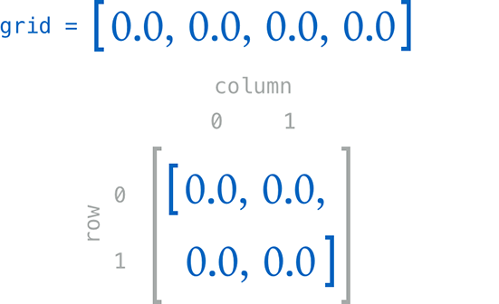
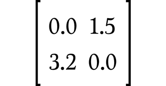

Methods
=======

.. write-me::

.. _Methods_InstanceMethods:

Instance Methods
----------------

:newTerm:`Instance methods` are functions that belong to instances of
a particular class, structure or enumeration.
They support the functionality of those instances,
either by providing ways to access and modify their properties,
or by providing useful functionality related to their purpose.
Instance methods can be written in either function-style syntax or selector-style syntax.

Instance methods are written within the opening and closing braces of the type they belong to.
They have implicit access to all of the other instance methods and properties of that type.
Instance methods can only be called on a specific instance of that type.
They cannot be called in isolation without an existing instance.

Here's an example:

.. testcode:: classesAndStructures

    --> class Counter {
            var count: Int = 0
            func increment() {
                count++
            }
            func incrementBy(amount: Int) {
                count += amount
            }
            func reset() {
                count = 0
            }
        }

This example defines a simple ``Counter`` class,
which keeps track of the number of times something has happened.
It defines three instance methods:

* ``increment()``, which simply increments the counter by ``1``
* ``incrementBy(amount: Int)``, which increments the counter by an arbitrary integer amount, and
* ``reset()``, which resets the counter back to zero

It also defines a variable property, ``count``,
for keeping track of the current counter value.

Instance methods are called using the same dot syntax as properties:

.. testcode:: classesAndStructures

    --> let counter = Counter()
    <<< // counter : Counter = <Counter instance>
    /-> initial counter value is \(counter.count)
    <-/ initial counter value is 0
    --> counter.increment()
    /-> counter value is now \(counter.count)
    <-/ counter value is now 1
    --> counter.incrementBy(5)
    /-> counter value is now \(counter.count)
    <-/ counter value is now 6
    --> counter.reset()
    /-> counter value is now \(counter.count)
    <-/ counter value is now 0

.. _Methods_TheSelfParameter:

The “self” Property
~~~~~~~~~~~~~~~~~~~~

Every instance of a type has an implicit property called ``self``,
which is exactly equivalent to the instance itself.
This implicit ``self`` property can be used
to refer to the current instance within its own instance methods.

For example, the ``increment()`` method from above could have been written like this:

::

    func increment() {
        self.count++
    }

This is effectively saying “I want to increment the ``count`` property of myself”.

In practice, you don't need to write ``self`` in your code very often.
If you don't explicitly write ``self``,
Swift assumes that you are referring to a property or method of the current instance
whenever you use a known property or method name within another method.
This can be seen by the use of ``count`` (rather than ``self.count``)
inside the three instance methods for ``Counter``.

The only exception to this rule is when a method's parameter name
happens to be the same as the name of a property.
In this situation, the parameter name takes precedence,
and it becomes necessary to refer to the property in a more qualified way.
The implicit ``self`` property can be used to make it clear which one is which.

Here, the ``self`` property is used
to disambiguate between a method parameter called ``x``,
and an instance property that is also called ``x``:

.. testcode:: self

    --> struct Point {
            var x = 0.0, y = 0.0
            func isToTheRightOfX(x: Double) -> Bool {
                return self.x > x
            }
        }
    --> let somePoint = Point(4.0, 5.0)
    <<< // somePoint : Point = Point(4.0, 5.0)
    --> if somePoint.isToTheRightOfX(1.0) {
            println("This point is to the right of the line where x == 1.0")
        }
    <-- This point is to the right of the line where x == 1.0

Without the use of ``self``,
Swift would assume that both uses of ``x`` referred to the method parameter.

.. _Methods_SelfClasses:

Using “self” in Class Instance Methods
______________________________________

For classes, the ``self`` property is a read-only reference to the class instance.
Although the reference is read-only, any variable properties of
the instance it refers to can still be modified:

.. testcode:: selfClasses

    --> class BankAccount {
            var balance = 0.0
            func depositMoney(amount: Double) {
                // the next line is the same as "self.balance += amount"
                balance += amount
            }
        }
    --> let savingsAccount = BankAccount()
    <<< // savingsAccount : BankAccount = <BankAccount instance>
    --> savingsAccount.depositMoney(100.00)
    --> println("The savings account now contains $\(savingsAccount.balance)")
    <-- The savings account now contains $100.0

Here, the ``depositMoney()`` instance method modifies
the ``balance`` variable property by adding ``amount`` to it.

This example could have been written with ``self.balance += amount``
rather than ``balance += amount``.
However, the use of the ``self`` prefix is not required,
as there is no ambiguity as to what ``balance`` refers to.

.. note::

    You cannot assign a new value to ``self`` for a class type.

.. _Methods_SelfStructures:

Using “self” in Structure Instance Methods
__________________________________________

By default, the ``self`` property of a structure is a constant,
and cannot be modified.
Because structures are value types,
this means that a structure's properties also cannot be modified
from within an instance method,
even if they are declared as variable properties.

However, if your structure instance does need to modify its properties within a method,
it can opt in to “mutating” behavior for that method.
The method is then able to “mutate” (i.e. “change”)
``self`` and its properties within the method,
and any changes that it makes are written back to the original structure when the method ends.

You can opt in to this behavior by placing the ``mutating`` keyword
before the ``func`` keyword for that method:

.. testcode:: selfStructures

    --> struct Point {
            var x = 0.0, y = 0.0
            mutating func moveBy(deltaX: Double, deltaY: Double) {
                // the next lines are the same as self.x += deltaX and self.y += deltaY
                x += deltaX
                y += deltaY
            }
        }
    --> var somePoint = Point(1.0, 1.0)
    <<< // somePoint : Point = Point(1.0, 1.0)
    --> somePoint.moveBy(2.0, 3.0)
    --> println("The point is now at (\(somePoint.x), \(somePoint.y))")
    <-- The point is now at (3.0, 4.0)

The ``Point`` structure above defines a mutating ``moveBy()`` method,
which moves a ``Point`` instance by a certain amount.
Instead of returning a new point,
this method actually modifies the point on which it is called.
The ``mutating`` keyword has been added to its definition
to enable it to modify the variable properties of the implicit ``self`` parameter.
As before, it does not need to explicitly refer to ``self``,
and can use ``x`` and ``y`` as shorthand for ``self.x`` and ``self.y``.

Mutating methods can also assign an entirely new instance of the structure to ``self``.
The example shown above could have been written in the following way instead:

.. testcode:: selfStructuresAssign

    --> struct Point {
            var x = 0.0, y = 0.0
            mutating func moveBy(deltaX: Double, deltaY: Double) {
                self = Point(x + deltaX, y + deltaY)
            }
        }
    >>> var somePoint = Point(1.0, 1.0)
    <<< // somePoint : Point = Point(1.0, 1.0)
    >>> somePoint.moveBy(2.0, 3.0)
    >>> println("The point is now at (\(somePoint.x), \(somePoint.y))")
    <<< The point is now at (3.0, 4.0)

This version of the mutating ``moveBy()`` method creates a brand new structure
whose ``x`` and ``y`` values are set to the new location.
The end result of calling this alternative version of the method
will be exactly the same as for calling the earlier version.

Note that you cannot call a mutating method on a constant of structure type,
because its properties cannot be changed, even if they are variable properties
(as described in :ref:`Properties_StoredPropertiesOfConstantStructureInstances`):

.. testcode:: selfStructuresAssign

    --> let fixedPoint = Point(3.0, 3.0)
    <<< fixedPoint : Point = Point(3.0, 3.0)
    --> fixedPoint.moveBy(2.0, 3.0)
    !!! <REPL Input>:1:1: error: 'Point' does not have a member named 'moveBy'
    !!! fixedPoint.moveBy(2.0, 3.0)
    !!! ^          ~~~~~~
    /// this will report an error

.. _Methods_SelfEnumerations:

Using “self” in Enumeration Instance Methods
____________________________________________

The ``self`` property of an enumeration instance method
is a read-only copy of the enumeration member,
and cannot be modified within instance methods.
This is similar to the behavior for structure instance methods seen above.

Enumeration instance methods can request to receive a writeable ``self`` property
by placing the ``mutating`` keyword before the ``func`` keyword for that method.
Mutating methods can set ``self`` to a different member from the same enumeration:

.. testcode:: selfEnumerations

    --> enum TriStateSwitch {
            case Off, Low, High
            mutating func next() {
                switch self {
                    case Off:
                        self = Low
                    case Low:
                        self = High
                    case High:
                        self = Off
                }
            }
        }
    --> var ovenLight = TriStateSwitch.Low
    <<< // ovenLight : TriStateSwitch = <unprintable value>
    --> ovenLight.next()
    /// ovenLight is now equal to .High
    --> ovenLight.next()
    /// ovenLight is now equal to .Off

This example defines an enumeration for a three-state switch.
The switch cycles between three different power states
(``Off``, ``Low`` and ``High``)
every time that its ``next()`` method is called.

.. _Methods_TypeMethods:

Type Methods
------------

.. write-me::

.. see release notes from 2013-12-18 for a note about lazy initialization
.. mention that type methods can access type properties (and other type methods?)
   without needing to reference the type's name,
   as they also get an implicit ``self`` parameter.

.. _Methods_Subscripts:

Subscripts
----------

.. QUESTION: is "Methods" the right place for subscripts?
   [Contributor 7746] suggested putting them in Properties.
   Thing is, they're a bit like a method (parameters, return type)
   and a bit like a computed property (getter, setter)…

Classes and structures can define :newTerm:`subscripts`,
which enable instances of that class or structure to be queried via one or more
values in square brackets after the instance name.
This is similar to the way in which the elements in an ``Array`` instance
can be accessed as ``someArray[index]``,
and elements in a ``Dictionary`` instance can be accessed as
``someDictionary[key]``.
(Array and dictionary subscripts are described in detail in :doc:`CollectionTypes`.)

.. _Methods_SubscriptSyntax:

Subscript Syntax
~~~~~~~~~~~~~~~~

Subscripts are written with the ``subscript`` keyword.
Their syntax is similar to both instance method syntax and computed property syntax.
They specify one or more input parameters and a return type,
in the same way as instance methods.
However, subscripts can be read-write or read-only,
and this behavior is communicated via a getter and setter
in the same way as for computed properties:

::

    subscript(index: Int) -> Int {
        get {
            // return an appropriate subscript value here
        }
        set(newValue) {
            // perform a suitable setting action here
        }
    }

The type of ``newValue`` is the same as the return value of the subscript.
As with computed properties, you can choose not to specify the setter's ``(newValue)`` parameter,
and a default parameter called ``newValue`` will be provided to your setter
if you do not provide one yourself.

As with read-only computed properties,
the ``get`` keyword can be dropped for read-only subscripts:

::

    subscript(index: Int) -> Int {
        // return an appropriate subscript value here
    }

Here's an example of a read-only subscript implementation:

.. testcode:: subscripts

    --> class TimesTable {
            let multiplier: Int
            init withMultiplier(multiplier: Int) {
                self.multiplier = multiplier
            }
            subscript(index: Int) -> Int {
                return multiplier * index
            }
        }
    --> var threeTimesTable = TimesTable(withMultiplier: 3)
    <<< // threeTimesTable : TimesTable = <TimesTable instance>
    --> println("six times three is \(threeTimesTable[6])")
    <-- six times three is 18

This example defines a ``TimesTable`` class to represent an n-times-table of integers.
In this example, the class is used to represent the three-times-table.

An n-times-table is based on a fixed mathematical rule.
It is therefore not appropriate to set ``threeTimesTable[someIndex]`` to a new value.
This is why the subscript for ``TimesTable`` is defined as a read-only subscript.

.. _Methods_SubscriptUsage:

Subscript Usage
~~~~~~~~~~~~~~~

The exact meaning of “subscript” depends upon the context in which it is used.
Subscripts are typically used as a convenient shorthand for accessing
the member elements in a collection, list, or sequence.
You are free to implement subscripts in the most appropriate way for
your particular class or structure's functionality.

For example, Swift's ``Dictionary`` collection type implements a subscript to provide
access to the values stored in a ``Dictionary`` instance
by passing in a key of the appropriate type within subscript braces:

.. testcode:: subscripts

    --> let numberOfLegs = ["spider" : 8, "ant" : 6, "cat" : 4]
    <<< // numberOfLegs : Dictionary<String, Int> = Dictionary<String, Int>(1.33333, 3, <DictionaryBufferOwner<String, Int> instance>)
    --> let spiderLegs = numberOfLegs["spider"]
    <<< // spiderLegs : Int = 8
    /-> spiderLegs is equal to \(spiderLegs)
    <-/ spiderLegs is equal to 8

This ``Dictionary`` instance is of type ``Dictionary<String, Int>``.
This means that it has keys of type ``String``,
and values of type ``Int``.
Its subscript implementation therefore expects to be passed a ``String`` key,
and returns the corresponding ``Int`` value for that key.

.. _Methods_SubscriptOptions:

Subscript Options
~~~~~~~~~~~~~~~~~

Subscripts can take any number of input parameters,
and these input parameters can be of any type.
Subscripts can also return any type, including optional types.

A class or structure can provide as many subscript implementations as it needs,
and the appropriate subscript to be used will be inferred based on
the types of the value or values that are contained within the subscript braces
at the point that the subscript is used.
This definition of multiple subscripts is known as :newTerm:`subscript overloading`.

While it is most common for a subscript to take a single parameter,
you can also define a subscript with multiple parameters
if it is appropriate for your type:

.. testcode:: subscripts

    --> struct Matrix {
            var rows: Int, columns: Int
            var grid = Array<Double>()
            init withRows(rows: Int) columns(Int) {
                self.rows = rows
                self.columns = columns
                for _ in 0...(rows * columns) {
                    grid.append(0.0)
                }
            }
            subscript(row: Int, column: Int) -> Double? {
                get {
                    if row >= rows || column >= columns {
                        return .None
                    }
                    return grid[(row * columns) + column]
                }
                set {
                    if newValue && row < rows && column < columns {
                        grid[(row * columns) + column] = newValue!
                    }
                }
            }
        }

.. TODO: Investigate switching this over to use the shorter “Double[]” syntax
   once I know more about Arrays and how their syntax works.

This example defines a ``Matrix`` structure,
which represents a two-dimensional matrix of ``Double`` values.
``Matrix`` provides an initializer that takes two parameters called ``rows`` and ``columns``,
and creates an array that is large enough to store ``rows * columns`` values of type ``Double``.
Each position in the matrix is given an initial value of ``0.0``:

.. testcode:: subscripts

    --> var matrix = Matrix(withRows: 2, columns: 2)
    <<< // matrix : Matrix = Matrix(2, 2, [0.0, 0.0, 0.0, 0.0])

The ``grid`` array is effectively a flattened version of the matrix,
as read from top left to bottom right:

The ``Matrix`` subscript has a return type of ``Double?``, or “optional ``Double``”.
This is to cope with the fact that you might request a value outside of
the bounds of the matrix.
To cope with this,
the subscript's getter checks to see if the requested ``row`` or ``column``
is outside the bounds of the matrix:

::

    if row >= rows || column >= columns {
        return .None
    }
    return grid[(row * columns) + column]

A value of ``.None`` is returned if you try and access
a subscript that is outside of the matrix bounds:

.. testcode:: subscripts

    --> if let someValue = matrix[2, 2] {
            println("The matrix has a value of \(someValue) at [2, 2]")
        } else {
            println("The matrix is not big enough to hold a value at [2, 2]")
        }
    <-- The matrix is not big enough to hold a value at [2, 2]

Otherwise, the subscript's getter returns
the appropriate value from the ``grid`` array.

Values in the matrix can be set by passing row and column values into the subscript,
separated by a comma:

.. testcode:: subscripts

    --> matrix[0, 1] = 1.5
    --> matrix[1, 0] = 3.2

These two statements call the subscript's setter to set
a value of ``1.5`` in the top right position of the matrix
(where ``row`` is ``0`` and ``column`` is ``1``),
and ``3.2`` in the bottom left position
(where ``row`` is ``1`` and ``column`` is ``0``):

The subscript's setter has an implicit ``value`` parameter of type ``Double?``.
The ``value`` parameter contains the new value to set for that row and column,
and is checked by the subscript's setter:

::

    if value && row < rows && column < columns {
        grid[(row * columns) + column] = value!
    }

The setter checks to see if ``value`` is not equal to ``.None``,
and also checks to make sure that the ``row`` and ``column`` values are valid.
If all of these things are true,
it sets the appropriate entry in the ``grid`` array to
the value stored in the ``value`` optional.