.. docnote:: Subjects to be covered in this section

    * Lack of promotion and truncation ✔︎
    * Arithmetic operators ✔︎
    * Operator precendence and associativity ✔︎
    * Relational and equality operators ✔︎
    * Short-circuit nature of the logical operators && and || ✔︎
    * Expressions (kind of ✔︎)
    * The ternary conditional operator ✔︎
    * range operators ✔︎
    * The comma operator

Operators
=========

An :newTerm:`operator` is a special symbol or phrase that is used to check or change values.
A simple example is the addition operator, ``+``,
which is used to add two numbers together (as in ``val i = 1 + 2``).
More complex examples include the logical AND operator ``&&``
(as in ``if enteredDoorCode && passedRetinaScan``),
or the increment operator ``++i``,
which gives a shorthand way to increase the value of ``i`` by ``1``.
All of these operators are explained in more detail below.

Swift supports all of the standard operators from C,
and improves several of their capabilities:

* Assignment ``=`` does not return a value, to avoid common coding errors
* Remainder ``%`` calculations can be performed on floating-point numbers

It also introduces new operators not found in other languages:

* `Overflow operators`_ such as ``a &+ b``, to opt in to overflowing arithmetic behavior
* A `range operator`_ ``a...b``, which gives a short-hand way to express a range of values

In addition, you can define your own implementations of the standard operators –
and create new ones –
for any custom types you define.
This process is covered in detail in :doc:`ClassesAndStructures`.

Operators are often referred to as :newTerm:`unary`, :newTerm:`binary` or :newTerm:`ternary`:

* Unary operators operate on a single target (such as ``-a``).
  They are said to be :newTerm:`prefix` operators if they come before their target (such as ``!b``),
  and :newTerm:`postfix` operators if they come after their target (such as ``i++``).
* Binary operators operate on two targets (such as ``2 + 3``),
  and are said to be :newTerm:`infix` because they appear inbetween their two targets.
* Ternary operators operate on three targets.
  Like C, Swift has just one ternary operator,
  known as the ternary conditional operator (``a ? b : c``).

The values that operators affect are known as :newTerm:`operands`.
In the expression ``1 + 2``, the ``+`` symbol is a binary operator,
and its two operands are the values ``1`` and ``2``.

.. _Operators_AssignmentOperator:

Assignment Operator
-------------------

The :newTerm:`assignment operator` (``a = b``) updates the value of ``a`` with the value of ``b``:

.. testcode:: assignmentOperator

    (swift) val b = 10
    // b : Int = 10
    (swift) var a = 5
    // a : Int = 5
    (swift) a = b
    (swift) println("a is now \(a)")
    >>> a is now 10

If the right-hand side of the assignment is a tuple with multiple values,
its elements can be decomposed into multiple named values at once:

.. testcode:: assignmentOperator

    (swift) val (x, y) = (1, 2)
    // (x, y) : (Int, Int) = (1, 2)
    (swift) println("x is \(x)")
    >>> x is 1

Unlike C and Objective-C, the assignment expression does not itself return a value.
The following statement is not valid::

    (swift) if x = y {
        // do something now that x is equal to y
    }

This avoids errors where the assignment expression ``=`` is accidentally used
in place of the equality comparison operator ``==``.
By making ``if x = y`` invalid,
Swift makes it much easier to avoid these kinds of errors in your code.

.. TODO: Should we mention that x = y = z is also not valid?
   If so, is there a convincing argument as to why this is a good thing?
.. TODO: Add a section about the new assignments bindings.

.. _Operators_ArithmeticOperators:

Arithmetic Operators
--------------------

Swift supports the four standard :newTerm:`arithmetic operators` for all number types:

* addition (``+``)
* subtraction (``-``)
* multiplication (``*``)
* division (``/``)

.. testcode:: arithmeticOperators

    (swift) 1 + 2
    // r0 : Int = 3
    (swift) 5 - 3
    // r1 : Int = 2
    (swift) 2 * 3
    // r2 : Int = 6
    (swift) 10.0 / 2.5
    // r3 : Double = 4.0

The addition operator is also supported for ``String`` concatenation:

.. testcode:: arithmeticOperators

    (swift) "hello, " + "world"
    // r4 : String = "hello, world"

Two ``UnicodeScalar`` values,
or one ``UnicodeScalar`` and one ``String``,
can be added together via ``+`` to make a new ``String``:

.. testcode:: arithmeticOperators

    (swift) val dog = '🐶'
    // dog : UnicodeScalar = '🐶'
    (swift) val cow = '🐮'
    // cow : UnicodeScalar = '🐮'
    (swift) val dogCow = dog + cow
    // dogCow : String = "🐶🐮"

.. _Operators_RemainderOperator:

Remainder Operator
~~~~~~~~~~~~~~~~~~

The :newTerm:`binary remainder operator`, ``a % b``,
works out how many multiples of ``b`` will fit inside ``a``,
and returns the value that is left over
(known as the :newTerm:`remainder`).

For example: to calculate ``9 % 4``,
you first work out how many ``4``\ s will fit inside ``9``:

.. image:: ../images/remainderInteger.png
    :width: 349
    :align: center

You can fit two ``4``\ s inside ``9``, as this illustration shows.
After doing so, there is a remainder of ``1`` left over (shown in orange).

In Swift, this would be written as:

.. testcode:: arithmeticOperators

    (swift) 9 % 4
    // r5 : Int = 1

To determine the answer for ``a % b``,
the ``%`` operator calculates the following equation,
and returns ``remainder`` as its output:

``a`` = (``b`` × ``some multiplier``) + ``remainder``

…where ``some multiplier`` is the smallest number of multiples of ``b``
that will fit inside ``a``.

Plugging ``9`` and ``4`` into this equation gives:

``9`` = (``4`` × ``2``) + ``1``

The same method is applied when calculating the remainder for a negative value of ``a``:

.. testcode:: arithmeticOperators

    (swift) -9 % 4
    // r6 : Int = -1

Plugging ``-9`` and ``4`` into the equation gives:

``-9`` = (``4`` × ``-2``) + ``-1``

…giving a remainder value of ``-1``.

The sign of ``b`` is ignored for negative values of ``b``.
This means that ``a % b`` and ``a % -b`` will always give the same answer.

.. _Operators_FloatingPointRemainderCalculations:

Floating-Point Remainder Calculations
_____________________________________

Unlike C and Objective-C,
Swift's remainder operator can also operate on floating-point numbers:

.. testcode:: arithmeticOperators

    (swift) 8 % 2.5
    // r7 : Double = 0.5

There are three 2.5's in 8, with a remainder of 0.5,
so the remainder operator returns a ``Double`` value of ``0.5``.

.. image:: ../images/remainderFloat.png
    :width: 311
    :align: center

.. _Operators_IncrementAndDecrementOperators:

Increment and Decrement Operators
~~~~~~~~~~~~~~~~~~~~~~~~~~~~~~~~~

Like C, Swift provides an :newTerm:`increment operator` (``++``)
and an :newTerm:`decrement operator` (``--``)
as a shorthand way to increase or decrease the value of a numeric variable by ``1``.
These operators can be used with named values of any integer or floating-point type.

.. testcode:: arithmeticOperators

    (swift) var i = 0
    // i : Int = 0
    (swift) ++i
    // r8 : Int = 1
    (swift) ++i
    // r9 : Int = 2

Each time you call ``++i``, the value of ``i`` is increased by ``1``.
Essentially, ``++i`` is shorthand for saying ``i = i + 1``.
Likewise, ``--i`` can be used as shorthand for ``i = i - 1``.

``++`` and ``--`` can be used as prefix operators, or as postfix operators.
``++i`` and ``i++`` are both valid ways to increase the value of ``i`` by ``1``.
However, ``++i`` increases the value of ``i`` *before* it is accessed,
whereas ``i++`` increases the value *after* it is accessed.
This is important if you are using ``++`` or ``--`` to modify a variable,
while also finding out its value:

.. testcode:: arithmeticOperators

    (swift) var a = 0
    // a : Int = 0
    (swift) val b = ++a
    // b : Int = 1
    (swift) println("a is now \(a)")
    >>> a is now 1
    (swift) val c = a++
    // c : Int = 1
    (swift) println("a is now \(a)")
    >>> a is now 2

In the example above,
``val b = ++a`` sets ``b`` to the value of ``a``,
*after* it has been incremented.
This is why both ``a`` and ``b`` are equal to ``1``.

However, ``val c = a++`` sets ``c`` to the value of ``a`` *before* it is incremented.
The result is that ``c`` gets the old value of ``1``,
but ``a`` now equals ``2``.

Unless you need the specific behavior of ``i++``,
it is recommended that you use ``++i`` in all cases,
because it has the typical expected behavior of incrementing ``i``,
and then providing the result.
(The same rules and advice apply for ``--i`` and ``i--``.)

.. QUESTION: is this good advice
   (given the general prevalence of i++ in the world),
   and indeed is it even advice we need to bother giving
   (given that lots of people might disagree or not care)?

.. _Operators_UnaryPlusAndMinusOperators:

Unary Plus and Minus Operators
~~~~~~~~~~~~~~~~~~~~~~~~~~~~~~

The sign of a numeric value can be toggled using a prefixed ``-``,
known as the :newTerm:`unary minus operator`:

.. testcode:: arithmeticOperators

    (swift) val three = 3
    // three : Int = 3
    (swift) val minusThree = -three
    // minusThree : Int = -3
    (swift) val plusThree = -minusThree    // effectively "minus minus three"
    // plusThree : Int = 3

The unary minus operator ``-`` is prepended directly before the value it operates on,
without any whitespace.

There is a corresponding :newTerm:`unary plus operator`, ``+``,
which simply returns the value it operates on, without any change:

.. testcode:: arithmeticOperators

    (swift) val minusSix = -6
    // minusSix : Int = -6
    (swift) val alsoMinusSix = +minusSix
    // alsoMinusSix : Int = -6

The unary plus operator doesn't actually do anything.
However, it can be used to provide symmetry in your code when also using the unary minus operator.

.. _Operators_CompoundAssignmentOperators:

Compound Assignment Operators
-----------------------------

Like C, Swift provides :newTerm:`compound assignment operators` that combine assignment (``=``) with another operation.
One example is the :newTerm:`addition assignment operator` (``+=``):

.. testcode:: compoundAssignment

    (swift) var a = 1
    // a : Int = 1
    (swift) a += 2
    (swift) println("a is now equal to \(a)")
    >>> a is now equal to 3

The expression ``a += 2`` is shorthand for ``a = a + 2``.
Effectively, the addition and the assignment are rolled into one operator
that performs both tasks at the same time.

A complete list of compound assignment operators can be found in the :doc:`../ReferenceManual/index`.

.. _Operators_ComparisonOperators:

Comparison Operators
--------------------

Swift supports all of the standard C :newTerm:`comparison operators`:

* Equal to (``a == b``)
* Not equal to (``a != b``)
* Greater than (``a > b``)
* Less than (``a < b``)
* Greater than or equal to (``a >= b``)
* Less than or equal to (``a <= b``)

Swift supports two additional comparison operators,
to check if values are identical:

* Identical to (``a === b``)
* Not identical to (``a !== b``)

These :newTerm:`identity operators` are used to test if two object named values both refer to the same object instance.
They are described in :doc:`ClassesAndStructures`.

Each of the comparison operators returns a ``Bool`` value to indicate whether or not the statement is true:

.. testcode:: comparisonOperators

    (swift) 1 == 1
    // r0 : Bool = true
    (swift) 2 != 1
    // r1 : Bool = true
    (swift) 2 > 1
    // r2 : Bool = true
    (swift) 1 < 2
    // r3 : Bool = true
    (swift) 1 >= 1
    // r4 : Bool = true
    (swift) 2 <= 1
    // r5 : Bool = false

Comparison operators are often used in conditional statements,
such as the ``if else`` statement:

.. testcode:: comparisonOperators

    (swift) val name = "world";
    // name : String = "world"
    (swift) if name == "world" {
        println("hello, world")
    } else {
        println("I'm sorry \(name), but I don't recognize you")
    }
    >>> hello, world

The ``if else`` statement is described in more detail in :doc:`ControlFlow`.

.. TODO: which types do these operate on by default?
   How do they work with strings?
   How about with tuples / with your own types?

.. _Operators_TernaryConditionalOperator:

Ternary Conditional Operator
~~~~~~~~~~~~~~~~~~~~~~~~~~~~

The :newTerm:`ternary conditional operator` is a special operator with three parts,
which takes the form ``question ? answer1 : answer2``.
It provides a shorthand way to evaluate one of two expressions
based on whether ``question`` is ``true`` or ``false``.
If ``question`` is ``true``, it evaluates ``answer1``;
otherwise, it evaluates ``answer2``.

Effectively, it is shorthand for::

    (swift) if question {
        answer1
    } else {
        answer2
    }

Here's an example, which calculates the pixel height for a table row.
The row should be 50 pixels taller than the content if it has a header,
and 20 pixels taller if it doesn't:

.. testcode:: ternaryConditionalOperatorPart1

    (swift) val contentHeight = 40
    // contentHeight : Int = 40
    (swift) val hasHeader = true
    // hasHeader : Bool = true
    (swift) val rowHeight = contentHeight + (hasHeader ? 50 : 20)
    // rowHeight : Int = 90
    (swift) println("The row height is \(rowHeight) pixels.")
    >>> The row height is 90 pixels.

This is shorthand for:

.. testcode:: ternaryConditionalOperatorPart2

    (swift) val contentHeight = 40
    // contentHeight : Int = 40
    (swift) val hasHeader = true
    // hasHeader : Bool = true
    (swift) var rowHeight = contentHeight
    // rowHeight : Int = 40
    (swift) if hasHeader {
        rowHeight = rowHeight + 50
    } else {
        rowHeight = rowHeight + 20
    }
    (swift) println("The row height is \(rowHeight) pixels.")
    >>> The row height is 90 pixels.

.. TODO: leave rowHeight uninitialized once the REPL allows uninitialized variables?
.. QUESTION: In the first example, rowHeight is a constant (because it can be),
   but in the second example, it's a variable (because it has to be).
   Is this okay?

In this case, the ternary conditional operator provides
an efficient shorthand for deciding which of two expressions to consider.

The ternary conditional operator should be used with care, however.
It is very concise, but this conciseness can lead to hard-to-read code if over-used.
Avoid combining multiple instances of the ternary conditional operator into one compound statement.

.. _Operators_BitwiseOperators:

Bitwise Operators
-----------------

:newTerm:`Bitwise operators` enable you to manipulate the individual raw data bits within a data structure.
They are often used in low-level programming,
such as graphics programming and device driver creation.
They can also be useful when working with raw data from external sources,
integrating with electronics hardware,
and when encoding and decoding data for communication via a custom protocol.

Swift supports all of the bitwise operators found in C, as described below.

.. _Operators_BitwiseNOTOperator:

Bitwise NOT Operator
~~~~~~~~~~~~~~~~~~~~

The :newTerm:`bitwise NOT operator` (``~``) inverts all of the bits in a number:

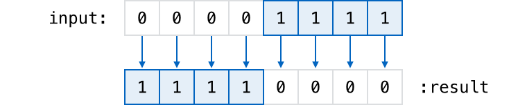

For example:

.. testcode:: bitwiseOperators

    (swift) val initialBits: UInt8 = 0b00001111
    // initialBits : UInt8 = 15
    (swift) val invertedBits = ~initialBits  // equals 11110000
    // invertedBits : UInt8 = 240

``UInt8`` integers have eight bits,
and can store any value between ``0`` and ``255``.
This example initializes a ``UInt8`` with the binary value ``00001111``,
which has its first four bits set to ``0``,
and its second four bits set to ``1``.
This is equivalent to a decimal value of ``15``.

The bitwise NOT operator is then used to create a new constant called ``invertedBits``,
which is equal to ``initialBits``,
but with all of the bits inverted.
Zeroes become ones, and ones become zeroes.
This gives a new value of ``11110000``,
which is equal to an unsigned decimal value of ``240``.

.. _Operators_BitwiseANDOperator:

Bitwise AND Operator
~~~~~~~~~~~~~~~~~~~~

The :newTerm:`bitwise AND operator` (``&``) combines the bits of two numbers.
It returns a new number whose bits are only set to ``1`` if the bits were equal to ``1`` in *both* input numbers:

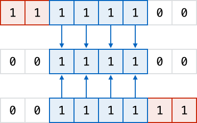

For example:

.. testcode:: bitwiseOperators

    (swift) val firstSixBits: UInt8 = 0b11111100
    // firstSixBits : UInt8 = 252
    (swift) val lastSixBits: UInt8  = 0b00111111
    // lastSixBits : UInt8 = 63
    (swift) val middleFourBits = firstSixBits & lastSixBits  // equals 00111100
    // middleFourBits : UInt8 = 60

The values of ``firstSixBits`` and ``lastSixBits`` both have their four middle bits equal to ``1``.
The bitwise AND operator combines them to make the number ``00111100``,
which is equal to an unsigned decimal value of ``60``.

.. _Operators_BitwiseOROperator:

Bitwise OR Operator
~~~~~~~~~~~~~~~~~~~

The :newTerm:`bitwise OR operator` (``|``) compares the bits of two numbers,
and returns a new number whose bits are set to ``1`` if the bits were equal to ``1`` in *either* of the input numbers:

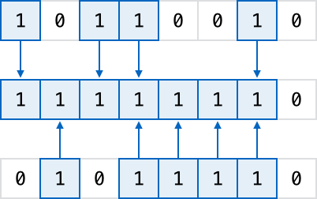

For example:

.. testcode:: bitwiseOperators

    (swift) val someBits: UInt8 = 0b10110010
    // someBits : UInt8 = 178
    (swift) val moreBits: UInt8 = 0b01011110
    // moreBits : UInt8 = 94
    (swift) val combinedbits = someBits | moreBits  // equals 11111110
    // combinedbits : UInt8 = 254

The values of ``someBits`` and ``moreBits`` have different bits set to ``1``.
The bitwise OR operator combines them to make the number ``11111110``,
which equals an unsigned decimal of ``254``.

.. _Operators_BitwiseXOROperator:

Bitwise XOR Operator
~~~~~~~~~~~~~~~~~~~~

The :newTerm:`bitwise XOR operator` (``^``) compares the bits of two numbers,
and returns a new number whose bits are set to ``1`` if the bits are equal to ``1`` in *either* of the input numbers,
but not if they are set to ``1`` in *both* of the input numbers:

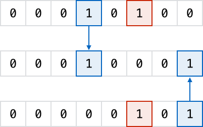

For example:

.. testcode:: bitwiseOperators

    (swift) val firstBits: UInt8 = 0b00010100
    // firstBits : UInt8 = 20
    (swift) val otherBits: UInt8 = 0b00000101
    // otherBits : UInt8 = 5
    (swift) val outputBits = firstBits ^ otherBits  // equals 00010001
    // outputBits : UInt8 = 17

.. TODO: Explain how this can be useful to toggle just a few bits in a bitfield.

.. _Operators_BitwiseLeftAndRightShifts:

Bitwise Left and Right Shifts
~~~~~~~~~~~~~~~~~~~~~~~~~~~~~

The :newTerm:`bitwise left shift operator` (``<<``) and :newTerm:`bitwise right shift operator` (``>>``)
move all of the bits in a number to the left or the right by a certain number of places,
as per the rules defined below.

Bitwise left and right shifts have the effect of multiplying (or dividing) an integer number by a factor of two.
Shifting an integer's bits to the left by one position doubles its value,
whereas shifting it to the right by one position halves its value.

.. TODO: mention the caveats to this claim.

.. _Operators_ShiftingBehaviorForUnsignedIntegers:

Shifting Behavior For Unsigned Integers
_______________________________________

The bit-shifting behavior for unsigned integers is:

* Existing bits are moved to the left or right by the requested number of places
* Any bits that fall off the edge of the integer's storage are discarded
* Zeroes are inserted in the spaces left behind

This approach is known as a :newTerm:`logical shift`.

The illustration below shows the results of ``11111111 << 1``
(which is ``11111111`` shifted to the left by ``1`` place),
and ``11111111 >> 1``
(which is ``11111111`` shifted to the right by ``1`` place).
Blue numbers have been shifted;
grey numbers have been discarded;
and orange zeroes have been inserted:

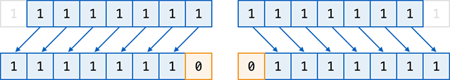

Here's how bit-shifting looks in Swift code:

.. testcode:: bitwiseShiftOperators

    (swift) val shiftBits: UInt8 = 4    // 00000100 in binary
    // shiftBits : UInt8 = 4
    (swift) shiftBits << 1              // 00001000
    // r0 : UInt8 = 8
    (swift) shiftBits << 5              // 10000000
    // r1 : UInt8 = 128
    (swift) shiftBits << 6              // 00000000
    // r2 : UInt8 = 0
    (swift) shiftBits >> 2              // 00000001
    // r3 : UInt8 = 1

Bit-shifting can be used to encode and decode values within other data types:

.. testcode:: bitwiseShiftOperators

    (swift) val pink: UInt32 = 0xCC6699
    // pink : UInt32 = 13395609
    (swift) val redComponent = (pink & 0xFF0000) >> 16
    // redComponent : UInt32 = 204
    (swift) val greenComponent = (pink & 0x00FF00) >> 8
    // greenComponent : UInt32 = 102
    (swift) val blueComponent = pink & 0x0000FF
    // blueComponent : UInt32 = 153

This example uses a ``UInt32`` constant called ``pink`` to store a
Cascading Style Sheets color value for the color pink.
Here, the CSS color value ``#CC6699`` is written as ``0xCC6699`` in Swift's hexadecimal number representation.
This color is then decomposed into its red (``CC``), green (``66``) and blue (``99``) components
using the bitwise AND operator (``&``) and the right-hand bit-shift operator (``>>``).

The red component is obtained by performing a bitwise AND between the numbers ``0xCC6699`` and ``0xFF0000``.
The zeroes in ``0xFF0000`` effectively ‘mask’ the second and third bytes of ``0xCC6699``,
causing the ``6699`` to be ignored, and leaving ``0xCC0000`` as the result.

This number is then shifted 16 places to the right (``>> 16``).
Each pair of characters in a hexadecimal number uses 8 bits,
so a move 16 places to the right will convert ``0xCC0000`` into ``0x0000CC``.
This is the same as ``0xCC``, which has a decimal value of ``204``.

Similarly, the green component is obtained by ANDing ``0xCC6699`` with ``0x00FF00``,
which gives an output of ``0x006600``.
This is then shifted eight places to the right,
giving a a value of ``0x66``, which has a decimal value of ``102``.

Finally, the blue component is obtained by ANDing ``0xCC6699`` with ``0x0000FF``,
which gives an output of ``0x000099``.
There's no need to shift this to the right,
as ``0x000099`` already equals ``0x99``,
which has a decimal value of ``153``.

.. admonition:: Experiment

    Try removing the parentheses around ``(pink & 0xFF0000)`` and ``(pink & 0x00FF00)``.
    Why do the values of ``redComponent`` and ``greenComponent`` change?
    Why do you then get same value of ``153`` for all three components?

.. QUESTION: I've used UInt32 values here,
   but this would also work with an inferred Int.
   Which is a better example? (I've chosen not to use Int so far,
   as this section is about unsigned shifts.)

.. _Operators_ShiftingBehaviorForSignedIntegers:

Shifting Behavior For Signed Integers
_____________________________________

The shifting behavior is slightly more involved for signed integers,
due to the way that they are represented in binary.
(The examples below are based on eight-bit signed integers for simplicity,
but the same principles apply for signed integers of any size.)

Signed integers use their first bit (known as the :newTerm:`sign bit`)
to indicate whether the integer is positive or negative.
A sign bit of ``0`` means positive, and a sign bit of ``1`` means negative.

The remaining bits (known as the :newTerm:`value bits`) are then used to store the actual value.
Positive numbers are stored in exactly the same way as for unsigned integers,
counting upwards from ``0``.
Here's how the bits inside an ``Int8`` look for the number ``4``:

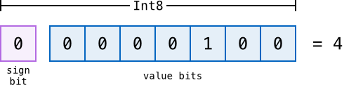

The sign bit is ``0`` (meaning ‘positive’),
and the seven value bits are just the number ``4``,
written in binary notation.

Negative numbers, however, are stored differently.
They are stored by subtracting their absolute value from ``2`` to the power of ``n``,
where ``n`` is the number of value bits.
In an eight-bit number, we have seven value bits,
so this means ``2`` to the power of ``7``, or ``128``.

Here's how the bits inside an ``Int8`` look for the number ``-4``:

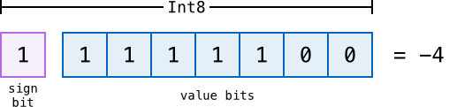

This time, the sign bit is ``1`` (meaning ‘negative’),
and the seven value bits actually have a binary value of ``124`` (which is ``128 - 4``):

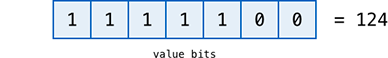

The encoding used for negative numbers is known as a :newTerm:`two's complement` representation.
It may seem an unusual way to represent negative numbers,
but it has several advantages.

Firstly, it means you can add ``-1`` to ``-4``,
just by performing a standard binary addition of all eight bits
(including the sign bit),
and discarding anything that doesn't fit in the eight bits once you're done:

.. image:: ../images/bitshiftSignedAddition.png
    :width: 445
    :align: center

The two's complement representation also means that you can
shift the bits of negative numbers to the left and right just like positive numbers,
and still end up doubling them for every shift you make to the left,
or halving them for every shift you make to the right.
To achieve this, an extra rule is used when shifting signed integers to the right:

* When shifting to the right,
  apply the same rules as for unsigned integers,
  but fill any empty bits on the left with the *sign bit*,
  rather than with a zero

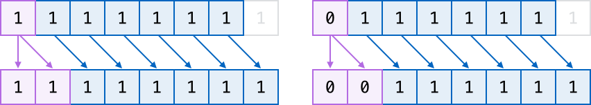

This ensures that signed integers have the same sign after they are shifted to the right,
and is known as an :newTerm:`arithmetic shift`.

Because of the special way that positive and negative numbers are stored,
shifting either of them to the right has the effect of moving them closer to zero.
Keeping the sign bit the same during this shift means that
negative integers remain negative as their value moves closer to zero.

.. _Operators_OverflowOperators:

Overflow Operators
------------------

An error will be thrown if you try to insert a number into an integer named value that cannot hold that value.
This gives extra safety when working with numbers that are too large or too small.

For example, the ``Int16`` integer type can hold any signed integer number between ``-32768`` and ``32767``.
If you try and set a ``UInt16`` named value to a number outside of this range,
an error is thrown:

.. testcode:: overflowOperatorsWillFailToOverflow

    (swift) var potentialOverflow = Int16.max()
    // potentialOverflow : Int16 = 32767
    (swift) potentialOverflow += 1                  // this will throw an error
    xxx overflow

.. TODO: is "throw an error" the correct phrase to use here?
   It actually triggers an assertion, causing the REPL to crash.
.. TODO: change the error text we detect here
   once overflowing provides an error message rather than just an assert.

Throwing an error in these scenarios is much safer than allowing an outsized value to overflow.
Providing error handling when values get too large or too small
gives you much more flexibility when coding for boundary value conditions.

However, in the cases where you *do* want the value to overflow,
you can opt in to this behavior rather than triggering an error.
Swift provides five arithmetic :newTerm:`overflow operators` that opt in to the overflow behavior for integer calculations.
These operators all begin with an ampersand (``&``):

* Overflow addition (``&+``)
* Overflow subtraction (``&-``)
* Overflow multiplication (``&*``)
* Overflow division (``&/``)
* Overflow modulo (``&%``)

.. _Operators_ValueOverflow:

Value Overflow
~~~~~~~~~~~~~~

Here's an example of what happens when an unsigned value is allowed to overflow,
using the overflow addition operator ``&+``:

.. testcode:: overflowOperatorsWillOverflow

    (swift) var willOverflow = UInt8.max
    // willOverflow : UInt8 = 255
    (swift) willOverflow = willOverflow &+ 1
    (swift) println("willOverflow is now \(willOverflow)")
    >>> willOverflow is now 0

Here, the variable ``willOverflow`` is initialized with the largest value a ``UInt8`` can hold
(``255``, or ``11111111`` in binary).
It is then incremented by ``1`` using the overflow addition operator, ``&+``.
This pushes its binary representation just over the size that a ``UInt8`` can hold,
causing it to overflow beyond its bounds,
as shown in the diagram below.
The value that remains within the bounds of the ``UInt8`` after the overflow addition is ``00000000``, or zero:

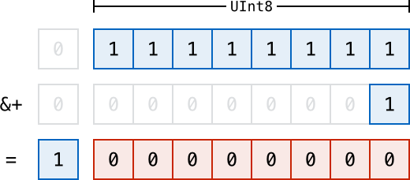

.. _Operators_ValueUnderflow:

Value Underflow
~~~~~~~~~~~~~~~

Numbers can also become too small to fit in their type's maximum bounds.
Here's an example.

The *smallest* value that a UInt8 can hold is ``0`` (which is ``00000000`` in eight-bit binary form).
If you subtract ``1`` from ``00000000`` using the overflow subtraction operator,
the number will overflow back round to ``11111111``,
or ``255`` in decimal:

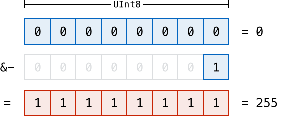

Here's how that looks in Swift code:

.. testcode:: overflowOperatorsWillUnderflow

    (swift) var willUnderflow = UInt8.min
    // willUnderflow : UInt8 = 0
    (swift) willUnderflow = willUnderflow &- 1
    (swift) println("willUnderflow is now \(willUnderflow)")
    >>> willUnderflow is now 255

A similar underflow happens for signed integers.
As described under :ref:`Operators_BitwiseLeftAndRightShifts`,
all subtraction for signed integers is performed as straight binary subtraction,
with the sign bit included as part of the numbers being subtracted.
The smallest number that an ``Int8`` can hold is ``-128``,
which is ``10000000`` in binary.
Subtracting ``1`` from this binary number with the overflow operator gives a binary value of ``01111111``,
which toggles the sign bit and gives positive ``127``,
the largest positive value that an ``Int8`` can hold:

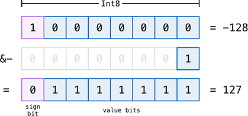

Here's the same thing in Swift code:

.. testcode:: overflowOperatorsWillUnderflow

    (swift) var signedUnderflow = Int8.min
    // signedUnderflow : Int8 = -128
    (swift) signedUnderflow = signedUnderflow &- 1
    (swift) println("signedUnderflow is now \(signedUnderflow)")
    >>> signedUnderflow is now 127

The end result of the overflow and underflow behavior described above is that for both signed and unsigned integers,
overflow always wraps around from the largest valid integer value back to the smallest,
and underflow always wraps around from the smallest value to the largest.

.. _Operators_DivisionByZero:

Division by Zero
~~~~~~~~~~~~~~~~

If you divide a number by zero,
or try to calculate modulo zero,
Swift will throw an error:

.. testcode:: overflowOperatorsDivZeroError

    (swift) val x = 1
    // x : Int = 1
    (swift) val y = x / 0
    xxx division by zero
 
Integer division by zero is not a valid mathematical action,
and so Swift throws an error rather than creating an invalid value.

.. NOTE: currently, this testcode block must be the last in the overflowOperators group,
   as otherwise the stack trace crash from the division-by-zero will mean that
   subsequent blocks in the group won't get tested.

.. TODO: update this example code to check for a true error,
   rather than a stack trace,
   once rdar://15804939 has been fixed.

.. _Operators_LogicalOperators:

Logical Operators
-----------------

.. TODO: write an introduction to this section.

.. _Operators_LogicalNOTOperator:

Logical NOT Operator
~~~~~~~~~~~~~~~~~~~~

The :newTerm:`logical NOT operator` (``!a``) inverts a boolean value so that ``true`` becomes ``false``,
and ``false`` becomes ``true``.
It can be read as “not ``a``”, as seen in the following example:

.. testcode:: logicalOperators

    (swift) val allowedEntry = false
    // allowedEntry : Bool = false
    (swift) if !allowedEntry {
        println("ACCESS DENIED")
    }
    >>> ACCESS DENIED

The phrase ``if !allowedEntry`` can be read as “if not allowed entry”.
The subsequent line is only executed if “not allowed entry” is true,
i.e. if ``allowedEntry`` is ``false``.

As in this example,
careful choice of boolean constant and variable names
can help to keep code readable and concise,
while avoiding double negatives or confusing logic statements.

.. _Operators_LogicalANDOperator:

Logical AND Operator
~~~~~~~~~~~~~~~~~~~~

The :newTerm:`logical AND operator` (``&&``) is used to create logical expressions
where both values must be ``true`` for the overall expression to also be ``true``.

This example considers two ``Bool`` values,
and only allows access if both values are ``true``:

.. testcode:: logicalOperators

    (swift) val enteredDoorCode = true
    // enteredDoorCode : Bool = true
    (swift) val passedRetinaScan = false
    // passedRetinaScan : Bool = false
    (swift) if enteredDoorCode && passedRetinaScan {
        println("Welcome!")
    } else {
        println("ACCESS DENIED")
    }
    >>> ACCESS DENIED

If either value is ``false``,
the overall expression will also be ``false``,
as shown above.
In fact, if the *first* value is false,
the second value won't even be checked,
because it can't possibly make the overall expression equal ``true``.
This is known as *short-circuit evaluation*.

.. _Operators_LogicalOROperator:

Logical OR Operator
~~~~~~~~~~~~~~~~~~~

The :newTerm:`logical OR operator` (``||``, i.e. two adjacent pipe characters)
is used to create logical expressions where only *one* of the two values has to be ``true``
for the overall expression to be ``true``.
For example:

.. testcode:: logicalOperators

    (swift) val hasDoorKey = false
    // hasDoorKey : Bool = false
    (swift) val knowsOverridePassword = true
    // knowsOverridePassword : Bool = true
    (swift) if hasDoorKey || knowsOverridePassword {
        println("Welcome!")
    } else {
        println("ACCESS DENIED")
    }
    >>> Welcome!

In this example,
the first ``Bool`` value (``hasDoorKey``) is ``false``,
but the second value (``knowsOverridePassword``) is ``true``.
Because one value is ``true``,
the overall expression also equates to ``true``,
and access is allowed.

Note that if the left-hand side of an OR expression is ``true``,
the right-hand side will not be evaluated,
because it cannot change the outcome of the overall expression.

.. _Operators_CombiningLogicalOperators:

Combining Logical Operators
~~~~~~~~~~~~~~~~~~~~~~~~~~~

You can combine multiple logical operators to create longer compound expressions:

.. testcode:: logicalOperators

    (swift) if enteredDoorCode && passedRetinaScan || hasDoorKey || knowsOverridePassword {
        println("Welcome!")
    } else {
        println("ACCESS DENIED")
    }
    >>> Welcome!

This example uses multiple ``&&`` and ``||`` operators to create a longer compound expression.
However, the ``&&`` and ``||`` operators still only operate on two values,
so this is actually three smaller expressions chained together.
It can be read as:

If we've entered the correct door code and passed the retina scan;
or if we have a valid door key;
or if we know the emergency override password;
then allow access.

Based on the example values from earlier,
the first two mini-expressions are ``false``,
but we know the emergency override password,
so the overall compound expression still equates to ``true``.

.. _Operators_PrecedenceAndAssociativity:

Precedence and Associativity
----------------------------

.. QUESTION: Could precedence and associativity be made clear
   as part of the hypothetical ‘show invisibles’ feature,
   to show the invisible parentheses implied by precedence and associativity?

It is important to consider each operator's :newTerm:`precedence` and :newTerm:`associativity` when working out how to calculate a compound expression.
These two principles are used to work out the order in which an expression should be calculated.

Here's an example.
Why does the following expression equal ``4``?

.. testcode:: evaluationOrder

    (swift) 2 + 3 * 4 % 5
    // r0 : Int = 4

Taken strictly from left to right, you might expect this to read as follows:

* 2 plus 3 equals 5;
* 5 times 4 equals 20;
* 20 modulo 5 equals 0

However, the actual answer is ``4``, not ``0``.
This is due to the priorities and associativity of the operators used:

* Operator :newTerm:`precedence` (also known as :newTerm:`priority`) means that
  some operators are given more precedence than others,
  and are calculated first.

* Operator :newTerm:`associativity` defines how operators of the same precedence
  are grouped together (or :newTerm:`associated`) –
  either grouped from the left, or grouped from the right.
  Think of it as meaning ‘they associate with the expression to their left’,
  or ‘they associate with the expression to their right’.

Here's how the actual evaluation order is calculated for the example above.
Precedence is considered first.
Higher-precedence operators are evaluated before lower-precedence ones.
In Swift, as in C,
the multiplication operator (``*``) and the modulo operator (``%``)
have a higher precedence than the addition operator (``+``).
As a result, they are both evaluated before the addition is considered.

However, multiplication and modulo happen to have the *same* precedence as each other.
To work out the exact evaluation order to use,
we therefore need to also look at their associativity.
Multiplication and modulo both associate with the expression to their left.
You can think of this as adding implicit parentheses around these parts of the expression,
starting from their left:

.. testcode:: evaluationOrder

    (swift) 2 + ((3 * 4) % 5)
    // r1 : Int = 4

``(3 * 4)`` is ``12``, so this is equivalent to:

.. testcode:: evaluationOrder

    (swift) 2 + (12 % 5)
    // r2 : Int = 4

``(12 % 5)`` is ``2``, so this is equivalent to:

.. testcode:: evaluationOrder

    (swift) 2 + 2
    // r3 : Int = 4

This gives the final answer of ``4``.

A complete list of Swift operator precedences and associativity rules can be found in the :doc:`../ReferenceManual/index`.

.. TODO: update this link to go to the specific section of the Reference Manual.

.. _Operators_Explicit Parentheses:

Explicit Parentheses
~~~~~~~~~~~~~~~~~~~~

Precedence and associativity define exactly one order of calculation
when multiple operators are used.
However, it can sometimes be useful to include parentheses anyway,
to make the intention of a complex expression easier to read.
In the door access example above,
it is useful to add parentheses around the first part of the compound expression:

.. testcode:: logicalOperators

    (swift) if (enteredDoorCode && passedRetinaScan) || hasDoorKey || knowsOverridePassword {
        println("Welcome!")
    } else {
        println("ACCESS DENIED")
    }
    >>> Welcome!

The parentheses make it clear that the first two values
are being considered as part of a separate possible state in the overall logic.
The output of the compound expression doesn't change,
but the overall intention is clearer to the reader.
Readability is always preferred over brevity;
use parentheses where they help to make your intentions clear.

.. _Operators_RangeOperator:

Range Operator
--------------

Swift includes a :newTerm:`range operator`,
which provides a shorthand way to express a range of values.
The range operator ``a...b`` defines a range that runs from ``a`` to ``b``,
but does not include ``b``.
For this reason, it is said to be :newTerm:`half-closed`.

The range operator is particularly useful when working with zero-based lists,
for counting up to (but not including) the length of a zero-based array:

.. testcode:: rangeOperators

    (swift) val names = ["Anna", "Brian", "Christine", "Daniel"]
    // names : String[] = ["Anna", "Brian", "Christine", "Daniel"]
    (swift) val count = names.count
    // count : Int = 4
    (swift) for i in 0...count {
        println("Person \(i + 1) is called \(names[i])")
    }
    >>> Person 1 is called Anna
    >>> Person 2 is called Brian
    >>> Person 3 is called Christine
    >>> Person 4 is called Daniel

Note that the array contains ``4`` items,
but ``0...count`` only counts as far as ``3``
(the index of the last item in the array),
because it is a half-closed range.

.. QUESTION: Should these appear here, or in Control Flow?
.. NOTE: Ranges have handy functions
   (well, specifically IntGeneratorType and DoubleGeneratorType at present)
   such as reverse(), contains() and by() - where should these be mentioned?

.. refnote:: References

    * https://[Internal Staging Server]/docs/LangRef.html#expr-assign
    * https://[Internal Staging Server]/docs/LangRef.html#expr-ternary
    * https://[Internal Staging Server]/docs/whitepaper/TypesAndValues.html#no-silent-truncation-or-undefined-behavior
    * https://[Internal Staging Server]/docs/whitepaper/LexicalStructure.html#identifiers-and-operators
    * http://en.wikipedia.org/wiki/Operator_(computer_programming)
    * /swift/stdlib/core/Policy.swift
