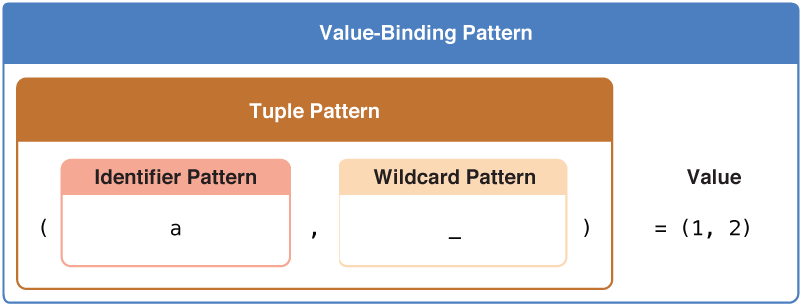

Destructuring & Pattern Matching
================================

.. TODO Expanded discussion and copy editing

:newTerm:`Patterns` express a structure of constant and variable declarations.
Swift uses patterns for :newTerm:`destructuring expressions`,
which bind values to a variable or constant name,
and for :newTerm:`pattern matching`,
which test whether a particular value or sequence of values
match a given pattern.

Patterns allows code to perform complex tasks
using concise, idiomatic syntax
that reduces complexity and eliminates boilerplate code.
For example...

.. TODO Real Examples

.. testcode::

   -> let point: (Int?, Int?) = (x: 1, y: 2)
   -> let x = point.x
   -> let y = point.y
   -> if x != nil && y != nil && x != y {
         print("(\(x), \(y))")
      }
   <- (1, 2)

(taking advantage of patterns)

.. testcode::

   -> if case let (x?, y?) = point where x != y {
          print("(\(x), \(y))")
      }

Destructuring Expressions
-------------------------

Destructuring expressions are used to bind values to constants or variables.
There are four types of destructuring expression patterns:
the identifier pattern,
the wildcard pattern,
the tuple pattern, and
the value-binding pattern.

.. TODO: Expand discussion

Identifier Pattern
~~~~~~~~~~~~~~~~~~

An :newTerm:`identifier pattern` matches any value to a variable or constant name.
If the constant or variable name has a type annotation,
the match only succeeds if the corresponding value has a compatible type.
Otherwise, the constant or variable implicitly becomes the type of the value.
For example, in the following constant declaration,
``someConstant`` is an identifier pattern
that matches the ``String`` value ``"Hello"``:

.. TODO: Real Examples

.. testcode::

   -> let someConstant = "Hello"
   << // someValue : String = "Hello"

.. testcode::

   -> for vowel in ["a", "e", "i", "o", "u"] {
         print(vowel)
      }

Wildcard Pattern
~~~~~~~~~~~~~~~~

A :newTerm:`wildcard pattern` matches and ignores any value,
and consists of an underscore (``_``).
For example, the following code iterates through the closed range ``1...3``,
ignoring the current value of the range on each iteration of the loop:

.. TODO: Real Examples

.. testcode::

   -> let _ = "something"

.. testcode::

   -> var a = 1
      for _ in 1...10 {
         a *= 2
      }
      print(a)
   <- 1024

Tuple Pattern
~~~~~~~~~~~~~

A :newTerm:`tuple pattern` matches a tuple value to
a comma-delimited list of of identifier or wildcard patterns enclosed in parentheses.
If the list of variable or constant names has a type annotation,
the match only succeeds if the tuple value has a compatible type.
Otherwise, the match will succeed if the tuple pattern has the same number of elements
as the corresponding tuple value.
For example, in the following constant declaration,
``(x, y) : (Int, String)`` is a tuple pattern
that matches the tuple value ``(1, "Hello")``:

.. TODO: Real Example

.. testcode::

   -> let (x, y) = (1, "Hello")
   << // ....

(wildcard used to ignore value for altitude)

.. testcode::

   -> for (latitude, longitude, _) in coordinates {

      }

Value-Binding Pattern
~~~~~~~~~~~~~~~~~~~~~

A :newTerm:`value-binding` pattern binds matched values to variable or constant names.
Value-binding patterns that
bind a matched value to the name of a constant begin with the ``let`` keyword;
those that bind to the name of variable begin with the ``var`` keyword.

.. testcode::

   let (x, y) = (1, 2)

Identifier patterns within a value-binding pattern bind new named variables or constants to their matching values. For example, you can decompose the elements of a tuple and bind the value of each element to a corresponding identifier pattern.

Optional Binding
________________

.. QUESTION: Is this correct?

When a value-binding pattern binds a value of optional type,
the initializer expression can be evaluated as part of a conditional statement.

.. TODO: Rework Examples

.. testcode::

   >> enum Error: ErrorType {
   >>    case Invalid
   >> }
   -> func validate(fields: [String: AnyObject]) throws {
         let name: String? = fields["name"] as? String
         if name == nil {
           throw Error.Invalid
         }

         let year: Int? = fields["year"] as? Int
         if year == nil || year! < 1980 {
           throw Error.Invalid
         }
      }

(using if-let with where)

.. testcode::

   >> enum Error: ErrorType {
   >>    case Invalid
   >> }
   -> func validate(fields: [String: AnyObject]) throws {
         if let name: String? = fields["name"] as? String {
            if let year: Int? = fields["year"] as? Int
               where year >= 1980 {
               return
            }
         }

         throw Error.Invalid
      }

(using guard statement)

.. testcode::

   -> func validate(fields: [String: AnyObject]) throws {
         guard let name = fields["name"] as? String,
               let year = fields["year"] as? Int
               where year >= 1980
         else {
            throw Error.Invalid
         }
      }

Pattern Matching
----------------

:newTerm:`Pattern matching` is the process of testing whether
a particular value or sequence of values match a given pattern.

You can match a pattern with the ``case`` statement,
which consists of the ``case`` keyword,
followed by a pattern to match.

You use a ``case`` statement in an
``if``, ``guard``, or ``switch`` statement
to determine which conditional branch is executed,
or in a
``for``-``in`` or ``while`` loop,
to determine how many times the loop is executed.

.. TODO: Additional examples

.. testcode::

   -> for case (key, value?) in myDictionary {
        doThing(value)
      }

   -> for case .MyEnumCase(let value) in enumValues where value != 42 {
          doThing(value)
      }

``case`` statements can match all of the patterns described above,
as well as the patterns described below,
which can only appear as part of a ``case`` statement.
These are
the enumeration pattern,
the optional pattern,
the type-casting ``is`` and ``as`` patterns, and
the expression pattern.

Enumeration Patterns
~~~~~~~~~~~~~~~~~~~~

.. TODO: Reword

An :newTerm:`enumeration pattern` matches a case of an existing enumeration type.

.. TODO: Real Examples

For example: ...

.. testcode::

   >> enum CoinFace {
   >>    case Heads, Tails
   >> }
   >> func flip() -> CoinFace { return .Heads }
   -> switch flip() {
      case .Heads: print("Heads, I win!")
      case .Tails: print("Tails, You Lose!")
      }

If the enumeration case you're trying to match has any associated values,
the corresponding enumeration case pattern must specify a tuple pattern that contains
one element for each associated value. For an example that uses a ``switch`` statement
to match enumeration cases containing associated values,
see :ref:`Enumerations_AssociatedValues`.

.. testcode::

   >> enum Foo {
   >> case Bar(Int)
   >> }
   >> let someValue = Bar(42)
   -> switch someValue {
      case .Bar(let value):
         // ...
      default:
         // ...
      }

This pattern is also used for error handling,
as described in :ref:`ErrorHandling_CatchingAndHandlingErrors`.

.. testcode::

   >> enum Error: ErrorType {
   >> case SomeError(String)
   >> }
   >> func canThrow() throws {}
   -> do {
         try canThrow()
      } catch Error.SomeError(let message):
         print(message)
      } catch {
         print("An error occurred")
      }

Exhaustiveness
______________

Both ``switch`` statements and ``catch`` expressions must be exhaustive.
That is, the compiler must be able to determine that
the provided patterns can match any values that can possibly be evaluated.

The Swift compiler is able to automatically determine exhaustiveness for
enumerations and certain data types.
For example, the compiler understands that a ``switch`` statement
that evaluates a value of type ``Bool``
with cases for both ``true`` and ``false``
is exhaustive,
since ``Bool`` can only be ``true`` or ``false.

.. testcode::

   >> let truthValue: Bool = true
   -> switch truthValue {
      case true: // ...
   >> print(true)
      case false: // ...
   >> print(false)
      }
   << false

Similarly, for an enumeration type, such as ``Optional``,
the compiler can determine a ``switch`` statement is exhaustive
if there are cases that match ``.Some`` and ``.None``.

.. testcode::

   >> let someOptional: Int? = nil
   -> switch someOptional {
      case
      }

When necessary, a ``default`` clause
or a ``case`` statement with a wildcard pattern in a ``switch`` statement,
or an unqualified ``catch`` expression
can be provided as an exhaustive ”catch-all”.

.. TODO: Mention that compiler can tell whether a case statement will not be executed

Optional Pattern
~~~~~~~~~~~~~~~~

An :newTerm:`optional pattern` matches
an ``Optional`` or ``ImplicitlyUnwrappedOptional`` type
that contains a value,
and binds that value to a constant or variable name.
It takes the form of a value-binding pattern
whose constant or variable is followed a question mark (``?``).

.. testcode::

   >> let someOptional: Int? = 57
   << // someOptional : Int? = 57
   -> switch someOptional {
      case let value?: // ...
      case nil: // ...
      }

Because Swift optionals are implemented as enumeration cases,
the example above is equivalent to the following example
using the enumeration pattern:

.. testcode::

   -> switch someOptional {
      case nil: // ...
   >> print("nil")
      case .Some(let value): // ...
   >> print(value)
      }
   << 57

The optional pattern provides a convenient way to
iterate over an array of optional types with a ``for``-``in`` loop
and only execute the loop for elements that have a value:

.. testcode::

   >> let arrayOfOptionals: [Int?] = [nil, 2, 3, nil, 5, nil, 7]
   -> for case let element? in arrayOfOptionals {
         print(element)
      }
   << 2
   << 3
   << 5
   << 7

Type-Casting Patterns
~~~~~~~~~~~~~~~~~~~~~

Swift has two :newTerm:`type-casting patterns`:
the ``is`` pattern and
the ``as`` pattern.

.. note::

   These are not to be confused with the ``as?`` and ``as!`` operators.

The ``is`` pattern matches a value if the type of that value at runtime is the same as
the type specified in the right-hand side of the ``is`` pattern---or a subclass of that type.
The ``is`` pattern behaves like the ``is`` operator in that they both perform a type cast
but discard the returned type.

.. TODO: Real Examples

.. testcode::

   -> let mixedArray: [Any] = [1, "a", true, nil]
      switch mixedArray.last {
      case is Int:
          print("Int")
      case is String:
          print("String")
      case is Bool:
          print("Bool")
      default:
          print("Who knows?")
      }

The ``as`` pattern matches a value if the type of that value at runtime is the same as
the type specified in the right-hand side of the ``as`` pattern---or a subclass of that type.
If the match succeeds,
the type of the matched value is cast to the *pattern* specified in the left-hand side
of the ``as`` pattern.

.. TODO: Real Examples

.. testcode::

   -> for case let string as String in mixedArray {
         // ...
      }
