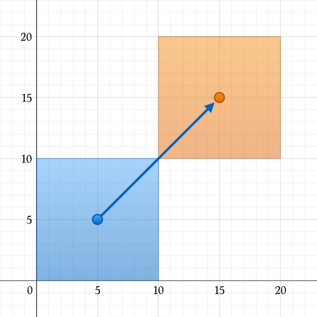

Properties
==========

:newTerm:`Properties` associate values with a particular class, structure, or enumeration.
Stored properties store constant and variable values as part of an instance,
whereas computed properties calculate (rather than store) a value.

Stored and computed properties are usually associated with instances of a particular type.
However, for value types, they can also be associated with the type itself.
Such properties are known as static properties.

In addition, you can define property observers
to monitor and respond to changes in a property's value.
Property observers can even be added to
properties that your subclass inherits from its superclass,
and are an easy way to add custom actions in response to property value changes.

.. note::

   Computed properties can be provided by classes, structures, and enumerations.
   Stored properties can only be provided by classes and structures.

.. QUESTION: should I mention dot syntax again?
   I introduced it in Custom Types out of necessity,
   but maybe it should be mentioned here too.

.. _Properties_StoredProperties:

Stored Properties
-----------------

In its simplest form, a stored property is just a constant or variable
that is stored as part of an instance of a particular class or structure.
Stored properties can be either
:newTerm:`variable stored properties` (introduced by the ``var`` keyword),
or :newTerm:`constant stored properties` (introduced by the ``let`` keyword).

You can provide a default value for a stored property as part of its definition,
as described in :ref:`Initialization_DefaultPropertyValues`.
You can also set and modify the initial value for a stored property during initialization.
This is true even for constant stored properties,
as described in :ref:`Initialization_ModifyingConstantPropertiesDuringInitialization`.

The example below defines a structure called ``FixedLengthRange``,
which describes a range of integers
whose range length cannot be changed once it is created:

.. testcode:: storedProperties

   -> struct FixedLengthRange {
         var firstValue: Int
         let length: Int
      }
   -> var rangeOfThreeItems = FixedLengthRange(firstValue: 0, length: 3)
   << // rangeOfThreeItems : FixedLengthRange = FixedLengthRange(0, 3)
   // the range represents integer values 0, 1, and 2
   -> rangeOfThreeItems.firstValue = 6
   // the range now represents integer values 6, 7, and 8

Instances of ``FixedLengthRange`` have
a variable stored property called ``firstValue``,
and a constant stored property called ``length``.
In the example above, ``length`` is initialized when the new range is created,
and cannot be changed thereafter, because it is a constant property.

.. _Properties_StoredPropertiesOfConstantStructureInstances:

Stored Properties of Constant Structure Instances
~~~~~~~~~~~~~~~~~~~~~~~~~~~~~~~~~~~~~~~~~~~~~~~~~

If you create an instance of a structure
and assign that instance to a constant,
you cannot modify the instance's properties,
even if they were declared as variable properties:

.. testcode:: storedProperties

   -> let rangeOfFourItems = FixedLengthRange(firstValue: 0, length: 4)
   << // rangeOfFourItems : FixedLengthRange = FixedLengthRange(0, 4)
   // this range represents integer values 0, 1, 2, and 3
   -> rangeOfFourItems.firstValue = 6
   !! <REPL Input>:1:29: error: cannot assign to 'firstValue' in 'rangeOfFourItems'
   !! rangeOfFourItems.firstValue = 6
   !! ~~~~~~~~~~~~~~~~~~~~~~~~~~~ ^
   // this will report an error, even thought firstValue is a variable property

Because ``rangeOfFourItems`` is declared as a constant (with the ``let`` keyword),
it is not possible to change its ``firstValue`` property,
even though ``firstValue`` is a variable property.

This behavior is due to the fact that structures are *value types*.
When an instance of a value type is marked as being a constant,
so are all of its properties.

The same is not true for classes, which are *reference types*.
If you assign an instance of a reference type to a constant,
you can still change that instance's variable properties.

.. TODO: this explanation could still do to be improved.

.. QUESTION: the same is actually true for computed properties of structures too
   (which surprised me, as they don't have storage).
   Does this mean I should mention it again later on?
   For now, I've deliberately said "properties" rather than "stored properties"
   in the first paragraph of this section, to set expectations.
   (I've also asked whether this is intentional, in rdar://16338553.)

.. _Properties_LazyStoredProperties:

Lazy Stored Properties
~~~~~~~~~~~~~~~~~~~~~~

.. QUESTION: is this section too complex for this point in the book?
   Should it go in the Default Property Values section of Initialization instead?

:newTerm:`Lazy stored properties`
are stored properties whose initial value is not calculated
until the first time it is used.
These kinds of properties are indicated by writing
the ``@lazy`` attribute before their declaration.

.. note::

   Lazy properties must always be declared as variables (with the ``var`` keyword),
   because it is possible that their initial value may not be retrieved
   until after instance initialization has finished.
   Constant properties must always have a value *before* initialization finishes,
   and cannot therefore be declared as lazy.

Lazy properties are useful when the initial value for a property
is dependent on outside factors whose values are not known
until after an instance's initialization is complete.
Lazy properties are also useful when the initial value for a property requires
complex or computationally-expensive setup that should not be performed
unless or until it is needed.

The example below shows a hypothetical situation where
a lazy stored property is an appropriate way to avoid
unnecessary initialization of a complex class.
This example defines two classes called ``DataImporter`` and ``DataManager``,
neither of which is shown in full:

.. testcode:: lazyProperties

   -> class DataImporter {
         /*
         DataImporter is a class to import data from an external file.
         The class is assumed to take a non-trivial amount of time to initialize.
         */
         var fileName = "data.txt"
         // the DataImporter class would provide data importing functionality here
   >>    init() {
   >>       println("the DataImporter instance for the importer property has now been created")
   >>    }
      }
   ---
   -> class DataManager {
         @lazy var importer = DataImporter()
         var data = String
         // the DataManager class would provide data management functionality here
      }
   ---
   -> let manager = DataManager()
   << // manager : DataManager = C4REPL11DataManager (has 2 children)
   -> manager.data += "Some data"
   -> manager.data += "Some more data"
   // the DataImporter instance for the importer property has not yet been created

The ``DataManager`` class has a stored property called ``data``,
which is initialized with a new, empty array of ``String`` values.
Although the rest of its functionality is not shown,
the purpose of this ``DataManager`` class is to manage and provide access to
this array of ``String`` data.

Part of the functionality of the ``DataManager`` class
is the ability to import some data from a file.
This functionality is provided by the ``DataImporter`` class,
which is assumed to take some non-trivial amount of time to initialize.
This might be because a ``DataImporter`` instance needs to open a file
and read its contents into memory when the ``DataImporter`` instance is initialized.

In this hypothetical scenario,
it is possible for a ``DataManager`` instance to manage its data
without ever needing to import any data from a file,
and so there is no need to create a new ``DataImporter`` instance
when the ``DataManager`` itself is created.
Instead, it makes more sense to create the ``DataImporter`` instance
if and when it is first used.

Because it has been marked with the ``@lazy`` attribute,
the ``DataImporter`` instance for the ``importer`` property
is only created when the property is first accessed,
such as if its ``fileName`` property is queried:

.. testcode:: lazyProperties

   -> println(manager.importer.fileName)
   </ the DataImporter instance for the importer property has now been created
   <- data.txt

.. _Properties_StoredPropertiesAndInstanceVariables:

Stored Properties and Instance Variables
~~~~~~~~~~~~~~~~~~~~~~~~~~~~~~~~~~~~~~~~

If you have experience with Objective-C,
you may know that it provides *two* ways
to store values and references as part of a class instance.
In addition to properties,
you can use instance variables as a backing store for the values stored in a property.

Swift unifies these two separate concepts into a single property declaration.
There is no longer a distinction between properties and instance variables,
and the backing store for a property is not accessed directly.
This avoids confusion about how the value is accessed in different contexts,
and simplifies the property's declaration into a single, definitive statement.
All of the information about the property –
including its name, type, and memory management characteristics –
is defined in a single location as part of the type's definition.

.. TODO: what happens if one property of a constant structure is an object reference?

.. _Properties_ComputedProperties:

Computed Properties
-------------------

Classes and structures can also define :newTerm:`computed properties`,
which do not actually store a value.
Instead, they provide a getter, and an optional setter,
to retrieve and set other properties and values indirectly.

.. testcode:: computedProperties

   -> struct Point {
         var x = 0.0, y = 0.0
      }
   -> struct Size {
         var width = 0.0, height = 0.0
      }
   -> struct Rect {
         var origin = Point()
         var size = Size()
         var center: Point {
            get {
               let centerX = origin.x + (size.width / 2)
               let centerY = origin.y + (size.height / 2)
               return Point(x: centerX, y: centerY)
            }
            set(newCenter) {
               origin.x = newCenter.x - (size.width / 2)
               origin.y = newCenter.y - (size.height / 2)
            }
         }
      }
   -> var square = Rect(origin: Point(x: 0.0, y: 0.0),
         size: Size(width: 10.0, height: 10.0))
   << // square : Rect = Rect(Point(0.0, 0.0), Size(10.0, 10.0))
   -> let initialSquareCenter = square.center
   << // initialSquareCenter : Point = Point(5.0, 5.0)
   -> square.center = Point(x: 15.0, y: 15.0)
   -> println("square.origin is now at (\(square.origin.x), \(square.origin.y))")
   <- square.origin is now at (10.0, 10.0)

This example defines three structures for working with geometric shapes:

* ``Point``, which encapsulates an ``(x, y)`` coordinate
* ``Size``, which encapsulates a ``width`` and a ``height``
* ``Rect``, which defines a rectangle by an origin point and a size

The ``Rect`` structure also provides a computed property called ``center``.
The current center position of a ``Rect`` can always be determined from its ``origin`` and ``size``,
and so you don't need to store the center point as an explicit ``Point`` value.
Instead, ``Rect`` defines a custom getter and setter for a computed variable called ``center``,
to enable you to work with the rectangle's ``center`` as if it were a real stored property.

The example creates a new ``Rect`` variable called ``square``.
The ``square`` variable is initialized with an origin point of ``(0, 0)``,
and a width and height of ``10``.
This square is represented by the blue square in the diagram below.

The ``square`` variable's ``center`` property is then accessed through dot syntax (``square.center``),
which causes the getter for ``center`` to be called,
to retrieve the current property value.
Rather than returning an existing value,
the getter actually calculates and returns a new ``Point`` to represent the center of the square.
As can be seen above, the getter correctly returns a center point of ``(5, 5)``.

The ``center`` property is then set to a new value of ``(15, 15)``,
which moves the square up and to the right,
to the new position shown by the orange square in the diagram below.
Setting the ``center`` property calls the setter for ``center``,
which modifies the ``x`` and ``y`` values of the stored ``origin`` property,
and moves the square to its new position.

.. _Properties_ShorthandSetterDeclaration:

Shorthand Setter Declaration
~~~~~~~~~~~~~~~~~~~~~~~~~~~~

If a computed property's setter does not define a name for the new value to be set,
a default name of ``newValue`` is used.
Here's an alternative version of the ``Rect`` structure,
which takes advantage of this shorthand notation:

.. testcode:: computedProperties

   -> struct AlternativeRect {
         var origin = Point()
         var size = Size()
         var center: Point {
            get {
               let centerX = origin.x + (size.width / 2)
               let centerY = origin.y + (size.height / 2)
               return Point(x: centerX, y: centerY)
            }
            set {
               origin.x = newValue.x - (size.width / 2)
               origin.y = newValue.y - (size.height / 2)
            }
         }
      }

.. _Properties_ReadOnlyComputedProperties:

Read-Only Computed Properties
~~~~~~~~~~~~~~~~~~~~~~~~~~~~~

A computed property with a getter but no setter is known as a :newTerm:`read-only computed property`.
Read-only computed properties enable you to
define a property that will always return a value,
and can be accessed through dot syntax,
but which cannot be set to a different value by users of your class or structure.

.. note::

   Computed properties – including read-only computed properties –
   must be declared as variable properties with the ``var`` keyword,
   because their value is not fixed.
   The ``let`` keyword is only used for constant properties,
   to indicate that their values cannot be changed once they are set
   as part of instance initialization.

The declaration of a read-only computed property can be simplified
by removing the ``get`` keyword:

.. testcode:: computedProperties

   -> struct Cuboid {
         var width = 0.0, height = 0.0, depth = 0.0
         var volume: Double {
            return width * height * depth
         }
      }
   -> let fourByFiveByTwo = Cuboid(width: 4.0, height: 5.0, depth: 2.0)
   << // fourByFiveByTwo : Cuboid = Cuboid(4.0, 5.0, 2.0)
   -> println("the volume of fourByFiveByTwo is \(fourByFiveByTwo.volume)")
   <- the volume of fourByFiveByTwo is 40.0

This example defines a new structure called ``Cuboid``,
which represents a 3D rectangular box with ``width``, ``height``, and ``depth`` properties.
This structure also has a read-only computed property called ``volume``,
which calculates and returns the current volume of the cuboid.
It doesn't make sense for ``volume`` to be settable,
as it would be ambiguous as to which values of ``width``, ``height``, and ``depth``
should be used for a particular ``volume`` value.
Nonetheless, it is useful for a ``Cuboid`` to provide a read-only computed property
to enable external users to discover its current calculated volume.

.. NOTE: getters and setters are also allowed for constants and variables
   that are not associated with a particular class or struct.
   Where should this be mentioned?
   
.. TODO: Anything else from https://[Internal Staging Server]/docs/StoredAndComputedVariables.html

.. TODO: Add an example of a computed property for an enumeration
   (now that the Enumerations chapter no longer has an example of this itself).

.. _Properties_PropertyObservers:

Property Observers
------------------

:newTerm:`Property observers` are a way to observe and respond to
changes in a property's value.
Property observers are called every time a property's value is set,
even if the new value is the same as the property's current value.

You can add property observers to any stored properties you define,
apart from lazy stored properties.
You can also add property observers to any inherited property (whether stored or computed)
by overriding the property within a subclass.
Property overriding is described in :ref:`Inheritance_Overriding`.

.. note::

   You don't need to define property observers for non-overridden computed properties,
   because you can observe and respond to changes to their value
   from directly within the computed property's setter.

You have the option to define either or both of these observers on a property:

* ``willSet``, which is called just before the value is stored
* ``didSet``, which is called immediately after the new value is stored

If you implement a ``willSet`` observer,
it is passed the new property value as a constant parameter.
You can specify a name for this parameter as part of your ``willSet`` implementation.
If you choose not to write the parameter name and parentheses within your implementation,
the parameter will still be made available with a default parameter name of ``newValue``.

Similarly, if you implement a ``didSet`` observer,
it will be passed a constant parameter containing the old property value.
You can name the parameter if you wish,
or use the default parameter name of ``oldValue``.

.. note::

   ``willSet`` and ``didSet`` observers are not called when
   a property is first initialized.
   They are only called when the property's value is set
   outside of an initialization context.

Here's an example of ``willSet`` and ``didSet`` in action:

.. testcode:: storedProperties

   -> class StepCounter {
         var totalSteps: Int = 0 {
            willSet(newTotalSteps) {
               println("About to set totalSteps to \(newTotalSteps)")
            }
            didSet {
               if totalSteps > oldValue  {
                  println("Added \(totalSteps - oldValue) steps")
               }
            }
         }
      }
   -> let stepCounter = StepCounter()
   << // stepCounter : StepCounter = <StepCounter instance>
   -> stepCounter.totalSteps = 200
   </ About to set totalSteps to 200
   </ Added 200 steps
   -> stepCounter.totalSteps = 360
   </ About to set totalSteps to 360
   </ Added 160 steps
   -> stepCounter.totalSteps = 896
   </ About to set totalSteps to 896
   </ Added 536 steps

This example defines a new class called ``StepCounter``,
which keeps track of the total number of steps that a person has taken while walking.
This class might be used with input data from a pedometer or other step counter
to keep track of a person's exercise during their daily routine.

The ``StepCounter`` class declares a ``totalSteps`` property of type ``Int``.
This is a stored property with ``willSet`` and ``didSet`` observers.

The ``willSet`` and ``didSet`` observers for ``totalSteps`` are called
whenever the property is assigned a new value.
This is true even if the new value is the same as the current value.

This example's ``willSet`` observer uses
a custom parameter name of ``newTotalSteps`` for the upcoming new value.
In this example, it simply prints out the value that is about to be set.

The ``didSet`` observer is called after the value of ``totalSteps`` has been updated.
In this example, it looks at the new value of ``totalSteps``,
and compares it against the old value.
If the total number of steps has increased,
a message is printed to indicate how many new steps have been taken.
The ``didSet`` observer does not provide a custom parameter name for the old value,
and the default name of ``oldValue`` is used instead.

.. note::

   If you assign a value to a property within its own ``didSet`` observer,
   the new value that you assign will replace the one that was just set.

.. TODO: mention that this also works for global / local variables

.. _Properties_GlobalAndLocalVariables:

Global and Local Variables
--------------------------

The capabilities described above for computing and observing properties
are also available to :newTerm:`global variables`
(that is, variables defined outside of any function, method, closure, or type context),
and :newTerm:`local variables`
(that is, variables defined within a function, method, or closure context).

The global and local variables you have encountered in previous chapters
have all been *stored* variables.
However, you can define computed variables, and define observers for stored variables,
in either a global or local scope.

.. FIXME: observed variables in a closure trigger an assertion:
   <rdar://problem/16955318> Observed variable in a closure triggers an assertion
   Nonetheless, I'm claiming they work everywhere,
   on the assumption that this will be fixed.
   It would be odd to say "…except for observed variables in a closure" here.

.. note::

   Global constants and variables are always computed lazily,
   in a similar manner to :ref:`Properties_LazyStoredProperties`.
   Unlike lazy stored properties,
   global constants and variables do not need to be marked with the ``@lazy`` attribute.

   Local constants and variables are never computed lazily.

.. _Properties_TypeProperties:

Type Properties
---------------

Instance properties, as described above,
are properties that belong to an instance of a particular type.
Every time you create a new instance of that type,
it has its own set of property values, separate from any other instance.

You can also define properties that belong to the type itself,
and not to any one instance of that type.
There will only ever be one copy of these properties,
no matter how many instances of that type you create.
These kinds of properties are called :newTerm:`type properties`.

Type properties are useful for defining values that are universal to
*all* instances of a particular type.
This might be a constant property that all instances can use
(like a static constant in C),
or a variable property that stores a value that is global to all instances of that type
(like a static variable in C).

For value types (that is, structures and enumerations),
you can define stored and computed type properties.
For classes, you can define computed type properties only.

Stored type properties (for value types) can be variables or constants.
Computed type properties are always declared as variable properties,
in the same way as computed instance properties.

.. note::

   Unlike stored instance properties,
   stored type properties must *always* be given a default value.
   This is because the type itself does not have an initializer
   that can assign a value to a stored type property at initialization time.

.. _Properties_TypePropertySyntax:

Type Property Syntax
~~~~~~~~~~~~~~~~~~~~

In C and Objective-C, you define static constants and variables associated with a type
as *global* static variables.
In Swift, however, type properties are written as part of the type's definition,
within the type's outer curly braces,
and each type property is explicitly scoped to the type it supports.

You define type properties for value types with the ``static`` keyword,
and type properties for class types with the ``class`` keyword.
The example below shows the syntax for stored and computed type properties:

.. testcode:: typePropertySyntax

   -> struct SomeStructure {
         static var storedTypeProperty = "Some value."
         static var computedTypeProperty: Int {
            // return an Int value here
   >>       return 42
         }
      }
   -> enum SomeEnumeration {
         static var storedTypeProperty = "Some value."
         static var computedTypeProperty: Int {
            // return an Int value here
   >>       return 42
         }
      }
   -> class SomeClass {
         class var computedTypeProperty: Int {
            // return an Int value here
   >>       return 42
         }
      }

.. note::

   The computed type property examples above are for read-only computed type properties,
   but you can also define read-write computed type properties
   with the same syntax as for computed instance properties.

.. _Properties_QueryingAndSettingTypeProperties:

Querying and Setting Type Properties
~~~~~~~~~~~~~~~~~~~~~~~~~~~~~~~~~~~~

Type properties are queried and set with dot syntax, just like instance properties.
However, type properties are queried and set on the *type*, not on an instance of that type.
For example:

.. testcode:: typePropertySyntax

   -> println(SomeClass.computedTypeProperty)
   <- 42
   ---
   -> println(SomeStructure.storedTypeProperty)
   <- Some value.
   -> SomeStructure.storedTypeProperty = "Another value."
   -> println(SomeStructure.storedTypeProperty)
   <- Another value.

The example below uses two stored type properties as part of a structure that models
an audio level meter for a number of audio channels.
Each of these channels has an integer audio level between ``0`` and ``10`` inclusive,
as shown in the figure below:

.. image:: ../images/staticPropertiesVUMeter.png
   :align: center

The figure above shows two separate audio channels as part of a stereo audio level meter.
The left channel has a current level of ``9``,
and the right channel has a current level of ``7``.

Each audio channel in the meter is modeled by an ``AudioChannel`` structure:

.. testcode:: staticProperties
   :compile: true

   -> struct AudioChannel {
         static let thresholdLevel = 10
         static var maxInputLevelForAllChannels = 0
         var currentLevel: Int = 0 {
            didSet {
               if currentLevel > AudioChannel.thresholdLevel {
                  // cap the new audio level to the threshold level
                  currentLevel = AudioChannel.thresholdLevel
               }
               if currentLevel > AudioChannel.maxInputLevelForAllChannels {
                  // store this as the new overall maximum input level
                  AudioChannel.maxInputLevelForAllChannels = currentLevel
               }
            }
         }
      }

The ``AudioChannel`` structure defines two stored type properties to support its functionality.
The first, ``thresholdLevel``, defines the maximum threshold value an audio level can take.
This is a constant value of ``10`` for all ``AudioChannel`` instances.
If an audio signal comes in with a higher value than ``10``,
it will be capped to this threshold value (as described below).

The second type property is
a variable stored property called ``maxInputLevelForAllChannels``.
This keeps track of the maximum input value that has been received
by *any* ``AudioChannel`` instance.
It starts with an initial value of ``0``.

The ``AudioChannel`` structure also defines
a stored instance property called ``currentLevel``,
which represents the channel's current audio level on a scale of ``0`` to ``10``.

The ``currentLevel`` property has a ``didSet`` property observer
to check the value of ``currentLevel`` whenever it is set.
This observer performs two checks:

* If the new value of ``currentLevel`` is greater than the allowed ``thresholdLevel``,
  the property observer caps ``currentLevel`` to ``thresholdLevel``.

* If the new value of ``currentLevel`` (after any capping) is higher than
  any value previously received by *any* ``AudioChannel`` instance,
  the property observer stores the new ``currentLevel`` value in
  the ``maxInputLevelForAllChannels`` static property.

.. note::

   In the first of these two checks,
   the ``didSet`` observer sets ``currentLevel`` to a different value.
   This does not, however, cause the observer to be called again.

You can use the ``AudioChannel`` structure to create
two new audio channels called ``leftChannel`` and ``rightChannel``,
to represent the audio levels of a stereo sound system:

.. testcode:: staticProperties
   :compile: true

   -> var leftChannel = AudioChannel()
   -> var rightChannel = AudioChannel()

If you set the ``currentLevel`` of the *left* channel to ``7``,
you can see that the ``maxInputLevelForAllChannels`` type property
is updated to equal ``7``:

.. testcode:: staticProperties
   :compile: true

   -> leftChannel.currentLevel = 7
   -> println(leftChannel.currentLevel)
   <- 7
   -> println(AudioChannel.maxInputLevelForAllChannels)
   <- 7

If you try and set the ``currentLevel`` of the *right* channel to ``11``,
you can see that the right channel's ``currentLevel`` property
has been capped to the maximum value of ``10``,
and the ``maxInputLevelForAllChannels`` type property is updated to equal ``10``:

.. testcode:: staticProperties
   :compile: true

   -> rightChannel.currentLevel = 11
   -> println(rightChannel.currentLevel)
   <- 10
   -> println(AudioChannel.maxInputLevelForAllChannels)
   <- 10
