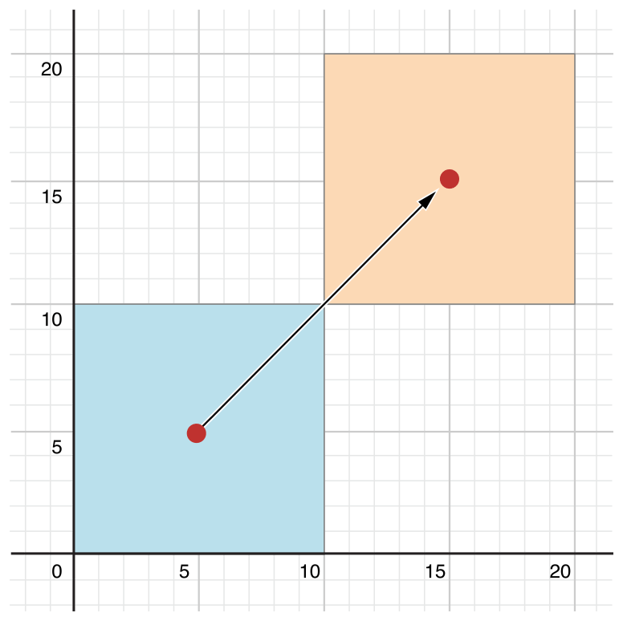
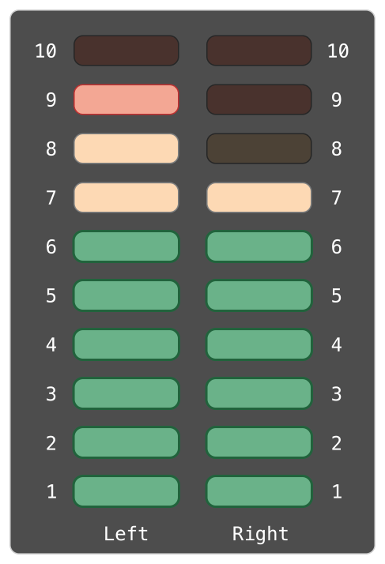

Properties
==========

:newTerm:`Properties` associate values with a particular class, structure, or enumeration.
Stored properties store constant and variable values as part of an instance,
whereas computed properties calculate (rather than store) a value.
Computed properties are provided by classes, structures, and enumerations.
Stored properties are provided only by classes and structures.

.. assertion:: enumerationsCantProvideStoredProperties

   -> enum E { case A, B; var x = 0 }
   !! <REPL Input>:1:25: error: enums may not contain stored properties
   !! enum E { case A, B; var x = 0 }
   !! ^

Stored and computed properties are usually associated with instances of a particular type.
However, properties can also be associated with the type itself.
Such properties are known as type properties.

In addition, you can define property observers to monitor changes in a property's value,
which you can respond to with custom actions.
Property observers can be added to stored properties you define yourself,
and also to properties that a subclass inherits from its superclass.

.. assertion:: propertyObserverIntroClaims

   -> class C {
         var x: Int = 0 {
            willSet { print("C willSet x to \(newValue)") }
            didSet { print("C didSet x from \(oldValue)") }
         }
      }
   -> class D: C {
         override var x: Int {
            willSet { print("D willSet x to \(newValue)") }
            didSet { print("D didSet x from \(oldValue)") }
         }
      }
   -> var c = C(); c.x = 42
   << // c : C = REPL.C
   <- C willSet x to 42
   <- C didSet x from 0
   -> var d = D(); d.x = 42
   << // d : D = REPL.D
   <- D willSet x to 42
   <- C willSet x to 42
   <- C didSet x from 0
   <- D didSet x from 0

.. _Properties_StoredProperties:

Stored Properties
-----------------

In its simplest form, a stored property is a constant or variable
that is stored as part of an instance of a particular class or structure.
Stored properties can be either
:newTerm:`variable stored properties` (introduced by the ``var`` keyword)
or :newTerm:`constant stored properties` (introduced by the ``let`` keyword).

You can provide a default value for a stored property as part of its definition,
as described in :ref:`Initialization_DefaultPropertyValues`.
You can also set and modify the initial value for a stored property during initialization.
This is true even for constant stored properties,
as described in :ref:`Initialization_ModifyingConstantPropertiesDuringInitialization`.

The example below defines a structure called ``FixedLengthRange``,
which describes a range of integers
whose range length cannot be changed once it is created:

.. testcode:: storedProperties

   -> struct FixedLengthRange {
         var firstValue: Int
         let length: Int
      }
   -> var rangeOfThreeItems = FixedLengthRange(firstValue: 0, length: 3)
   << // rangeOfThreeItems : FixedLengthRange = REPL.FixedLengthRange
   // the range represents integer values 0, 1, and 2
   -> rangeOfThreeItems.firstValue = 6
   // the range now represents integer values 6, 7, and 8

Instances of ``FixedLengthRange`` have
a variable stored property called ``firstValue``
and a constant stored property called ``length``.
In the example above, ``length`` is initialized when the new range is created
and cannot be changed thereafter, because it is a constant property.

.. _Properties_StoredPropertiesOfConstantStructureInstances:

Stored Properties of Constant Structure Instances
~~~~~~~~~~~~~~~~~~~~~~~~~~~~~~~~~~~~~~~~~~~~~~~~~

If you create an instance of a structure
and assign that instance to a constant,
you cannot modify the instance's properties,
even if they were declared as variable properties:

.. testcode:: storedProperties

   -> let rangeOfFourItems = FixedLengthRange(firstValue: 0, length: 4)
   << // rangeOfFourItems : FixedLengthRange = REPL.FixedLengthRange
   // this range represents integer values 0, 1, 2, and 3
   -> rangeOfFourItems.firstValue = 6
   !! <REPL Input>:1:29: error: cannot assign to 'firstValue' in 'rangeOfFourItems'
   !! rangeOfFourItems.firstValue = 6
   !! ~~~~~~~~~~~~~~~~~~~~~~~~~~~ ^
   // this will report an error, even though firstValue is a variable property

Because ``rangeOfFourItems`` is declared as a constant (with the ``let`` keyword),
it is not possible to change its ``firstValue`` property,
even though ``firstValue`` is a variable property.

This behavior is due to structures being *value types*.
When an instance of a value type is marked as a constant,
so are all of its properties.

The same is not true for classes, which are *reference types*.
If you assign an instance of a reference type to a constant,
you can still change that instance's variable properties.

.. TODO: this explanation could still do to be improved.

.. QUESTION: the same is actually true for computed properties of structures too
   (which surprised me, as they don't have storage).
   Does this mean I should mention it again later on?
   For now, I've deliberately said "properties" rather than "stored properties"
   in the first paragraph of this section, to set expectations.
   (I've also asked whether this is intentional, in rdar://16338553.)

.. TODO: see the explanation in rdar://16338553, and write about it here.

.. _Properties_LazyStoredProperties:

Lazy Stored Properties
~~~~~~~~~~~~~~~~~~~~~~

.. QUESTION: is this section too complex for this point in the book?
   Should it go in the Default Property Values section of Initialization instead?

A :newTerm:`lazy stored property` is a property whose initial value is not calculated
until the first time it is used.
You indicate a lazy stored property by writing
the ``lazy`` modifier before its declaration.

.. note::

   You must always declare a lazy property as a variable (with the ``var`` keyword),
   because its initial value might not be retrieved until
   after instance initialization completes.
   Constant properties must always have a value *before* initialization completes,
   and therefore cannot be declared as lazy.

.. assertion:: lazyPropertiesMustAlwaysBeVariables

   -> class C { lazy let x = 0 }
   !! <REPL Input>:1:11: error: 'lazy' cannot be used on a let
   !! class C { lazy let x = 0 }
   !! ^~~~
   !!-

Lazy properties are useful when the initial value for a property
is dependent on outside factors whose values are not known
until after an instance's initialization is complete.
Lazy properties are also useful when the initial value for a property requires
complex or computationally expensive setup that should not be performed
unless or until it is needed.

.. TODO: add a note that if you assign a value to a lazy property before first access,
   the initial value you give in your code will be ignored.

The example below uses a lazy stored property to avoid
unnecessary initialization of a complex class.
This example defines two classes called ``DataImporter`` and ``DataManager``,
neither of which is shown in full:

.. testcode:: lazyProperties

   -> class DataImporter {
         /*
         DataImporter is a class to import data from an external file.
         The class is assumed to take a non-trivial amount of time to initialize.
         */
         var fileName = "data.txt"
         // the DataImporter class would provide data importing functionality here
   >>    init() {
   >>       print("the DataImporter instance for the importer property has now been created")
   >>    }
      }
   ---
   -> class DataManager {
         lazy var importer = DataImporter()
         var data = [String]()
         // the DataManager class would provide data management functionality here
      }
   ---
   -> let manager = DataManager()
   << // manager : DataManager = REPL.DataManager
   -> manager.data.append("Some data")
   -> manager.data.append("Some more data")
   // the DataImporter instance for the importer property has not yet been created

The ``DataManager`` class has a stored property called ``data``,
which is initialized with a new, empty array of ``String`` values.
Although the rest of its functionality is not shown,
the purpose of this ``DataManager`` class is to manage and provide access to
this array of ``String`` data.

Part of the functionality of the ``DataManager`` class
is the ability to import data from a file.
This functionality is provided by the ``DataImporter`` class,
which is assumed to take a non-trivial amount of time to initialize.
This might be because a ``DataImporter`` instance needs to open a file
and read its contents into memory when the ``DataImporter`` instance is initialized.

It is possible for a ``DataManager`` instance to manage its data
without ever importing data from a file,
so there is no need to create a new ``DataImporter`` instance
when the ``DataManager`` itself is created.
Instead, it makes more sense to create the ``DataImporter`` instance
if and when it is first used.

Because it is marked with the ``lazy`` modifier,
the ``DataImporter`` instance for the ``importer`` property
is only created when the ``importer`` property is first accessed,
such as when its ``fileName`` property is queried:

.. testcode:: lazyProperties

   -> print(manager.importer.fileName)
   </ the DataImporter instance for the importer property has now been created
   <- data.txt

.. FIXME: Add a note to describe whether or not lazy is thread-safe.
   This is as per <rdar://problem/17084977>
   ER: We should document whether lazy initialization is thread safe

.. _Properties_StoredPropertiesAndInstanceVariables:

Stored Properties and Instance Variables
~~~~~~~~~~~~~~~~~~~~~~~~~~~~~~~~~~~~~~~~

If you have experience with Objective-C,
you may know that it provides *two* ways
to store values and references as part of a class instance.
In addition to properties,
you can use instance variables as a backing store for the values stored in a property.

Swift unifies these concepts into a single property declaration.
A Swift property does not have a corresponding instance variable,
and the backing store for a property is not accessed directly.
This approach avoids confusion about how the value is accessed in different contexts
and simplifies the property's declaration into a single, definitive statement.
All information about the property ---
including its name, type, and memory management characteristics ---
is defined in a single location as part of the type's definition.

.. TODO: what happens if one property of a constant structure is an object reference?

.. _Properties_ComputedProperties:

Computed Properties
-------------------

In addition to stored properties,
classes, structures, and enumerations can define :newTerm:`computed properties`,
which do not actually store a value.
Instead, they provide a getter and an optional setter
to retrieve and set other properties and values indirectly.

.. testcode:: computedProperties

   -> struct Point {
         var x = 0.0, y = 0.0
      }
   -> struct Size {
         var width = 0.0, height = 0.0
      }
   -> struct Rect {
         var origin = Point()
         var size = Size()
         var center: Point {
            get {
               let centerX = origin.x + (size.width / 2)
               let centerY = origin.y + (size.height / 2)
               return Point(x: centerX, y: centerY)
            }
            set(newCenter) {
               origin.x = newCenter.x - (size.width / 2)
               origin.y = newCenter.y - (size.height / 2)
            }
         }
      }
   -> var square = Rect(origin: Point(x: 0.0, y: 0.0),
         size: Size(width: 10.0, height: 10.0))
   << // square : Rect = REPL.Rect
   -> let initialSquareCenter = square.center
   << // initialSquareCenter : Point = REPL.Point
   -> square.center = Point(x: 15.0, y: 15.0)
   -> print("square.origin is now at (\(square.origin.x), \(square.origin.y))")
   <- square.origin is now at (10.0, 10.0)

This example defines three structures for working with geometric shapes:

* ``Point`` encapsulates an ``(x, y)`` coordinate.
* ``Size`` encapsulates a ``width`` and a ``height``.
* ``Rect`` defines a rectangle by an origin point and a size.

The ``Rect`` structure also provides a computed property called ``center``.
The current center position of a ``Rect`` can always be determined from its ``origin`` and ``size``,
and so you don't need to store the center point as an explicit ``Point`` value.
Instead, ``Rect`` defines a custom getter and setter for a computed variable called ``center``,
to enable you to work with the rectangle's ``center`` as if it were a real stored property.

The preceding example creates a new ``Rect`` variable called ``square``.
The ``square`` variable is initialized with an origin point of ``(0, 0)``,
and a width and height of ``10``.
This square is represented by the blue square in the diagram below.

The ``square`` variable's ``center`` property is then accessed through dot syntax (``square.center``),
which causes the getter for ``center`` to be called,
to retrieve the current property value.
Rather than returning an existing value,
the getter actually calculates and returns a new ``Point`` to represent the center of the square.
As can be seen above, the getter correctly returns a center point of ``(5, 5)``.

The ``center`` property is then set to a new value of ``(15, 15)``,
which moves the square up and to the right,
to the new position shown by the orange square in the diagram below.
Setting the ``center`` property calls the setter for ``center``,
which modifies the ``x`` and ``y`` values of the stored ``origin`` property,
and moves the square to its new position.

.. _Properties_ShorthandSetterDeclaration:

Shorthand Setter Declaration
~~~~~~~~~~~~~~~~~~~~~~~~~~~~

If a computed property's setter does not define a name for the new value to be set,
a default name of ``newValue`` is used.
Here's an alternative version of the ``Rect`` structure,
which takes advantage of this shorthand notation:

.. testcode:: computedProperties

   -> struct AlternativeRect {
         var origin = Point()
         var size = Size()
         var center: Point {
            get {
               let centerX = origin.x + (size.width / 2)
               let centerY = origin.y + (size.height / 2)
               return Point(x: centerX, y: centerY)
            }
            set {
               origin.x = newValue.x - (size.width / 2)
               origin.y = newValue.y - (size.height / 2)
            }
         }
      }

.. _Properties_ReadOnlyComputedProperties:

Read-Only Computed Properties
~~~~~~~~~~~~~~~~~~~~~~~~~~~~~

A computed property with a getter but no setter is known as a :newTerm:`read-only computed property`.
A read-only computed property always returns a value,
and can be accessed through dot syntax, but cannot be set to a different value.

.. note::

   You must declare computed properties --- including read-only computed properties ---
   as variable properties with the ``var`` keyword, because their value is not fixed.
   The ``let`` keyword is only used for constant properties,
   to indicate that their values cannot be changed once they are set
   as part of instance initialization.

.. assertion:: readOnlyComputedPropertiesMustBeVariables
   :compile: true

   -> class C {
         let x: Int { return 42 }
         let y: Int { get { return 42 } set {} }
      }
   !! /tmp/swifttest.swift:2:15: error: 'let' declarations cannot be computed properties
   !! let x: Int { return 42 }
   !! ^
   !! /tmp/swifttest.swift:3:15: error: 'let' declarations cannot be computed properties
   !! let y: Int { get { return 42 } set {} }
   !! ^

You can simplify the declaration of a read-only computed property
by removing the ``get`` keyword and its braces:

.. testcode:: computedProperties

   -> struct Cuboid {
         var width = 0.0, height = 0.0, depth = 0.0
         var volume: Double {
            return width * height * depth
         }
      }
   -> let fourByFiveByTwo = Cuboid(width: 4.0, height: 5.0, depth: 2.0)
   << // fourByFiveByTwo : Cuboid = REPL.Cuboid
   -> print("the volume of fourByFiveByTwo is \(fourByFiveByTwo.volume)")
   <- the volume of fourByFiveByTwo is 40.0

This example defines a new structure called ``Cuboid``,
which represents a 3D rectangular box with ``width``, ``height``, and ``depth`` properties.
This structure also has a read-only computed property called ``volume``,
which calculates and returns the current volume of the cuboid.
It doesn't make sense for ``volume`` to be settable,
because it would be ambiguous as to which values of ``width``, ``height``, and ``depth``
should be used for a particular ``volume`` value.
Nonetheless, it is useful for a ``Cuboid`` to provide a read-only computed property
to enable external users to discover its current calculated volume.

.. NOTE: getters and setters are also allowed for constants and variables
   that are not associated with a particular class or struct.
   Where should this be mentioned?

.. TODO: Anything else from https://[Internal Staging Server]/docs/StoredAndComputedVariables.html

.. TODO: Add an example of a computed property for an enumeration
   (now that the Enumerations chapter no longer has an example of this itself).

.. _Properties_PropertyObservers:

Property Observers
------------------

:newTerm:`Property observers` observe and respond to changes in a property's value.
Property observers are called every time a property's value is set,
even if the new value is the same as the property's current value.

.. assertion:: observersAreCalledEvenIfNewValueIsTheSameAsOldValue

   -> class C { var x: Int = 0 { willSet { print("willSet") } didSet { print("didSet") } } }
   -> let c = C()
   << // c : C = REPL.C
   -> c.x = 24
   <- willSet
   <- didSet
   -> c.x = 24
   <- willSet
   <- didSet

You can add property observers to any stored properties you define,
apart from lazy stored properties.
You can also add property observers to any inherited property (whether stored or computed)
by overriding the property within a subclass.
Property overriding is described in :ref:`Inheritance_Overriding`.

.. assertion:: lazyPropertiesCannotHaveObservers

   -> class C {
         lazy var x: Int = 0 {
            willSet { print("C willSet x to \(newValue)") }
            didSet { print("C didSet x from \(oldValue)") }
         }
      }
   !! <REPL Input>:2:6: error: lazy properties may not have observers
   !! lazy var x: Int = 0 {
   !! ^~~~
   !!-

.. assertion:: storedAndComputedInheritedPropertiesCanBeObserved
   :compile: true

   -> class C {
         var x = 0
         var y: Int { get { return 42 } set {} }
      }
   -> class D: C {
         override var x: Int {
            willSet { print("D willSet x to \(newValue)") }
            didSet { print("D didSet x from \(oldValue)") }
         }
         override var y: Int {
            willSet { print("D willSet y to \(newValue)") }
            didSet { print("D didSet y from \(oldValue)") }
         }
      }
   -> var d = D()
   -> d.x = 42
   <- D willSet x to 42
   <- D didSet x from 0
   -> d.y = 42
   <- D willSet y to 42
   <- D didSet y from 42

.. note::

   You don't need to define property observers for non-overridden computed properties,
   because you can observe and respond to changes to their value
   from directly within the computed property's setter.

You have the option to define either or both of these observers on a property:

* ``willSet`` is called just before the value is stored.
* ``didSet`` is called immediately after the new value is stored.

If you implement a ``willSet`` observer,
it is passed the new property value as a constant parameter.
You can specify a name for this parameter as part of your ``willSet`` implementation.
If you choose not to write the parameter name and parentheses within your implementation,
the parameter will still be made available with a default parameter name of ``newValue``.

Similarly, if you implement a ``didSet`` observer,
it will be passed a constant parameter containing the old property value.
You can name the parameter if you wish,
or use the default parameter name of ``oldValue``.

.. note::

   ``willSet`` and ``didSet`` observers of superclass properties
   are called when a property is set in a subclass initializer.

   For more information about initializer delegation,
   see :ref:`Initialization_InitializerDelegationForValueTypes`
   and :ref:`Initialization_InitializerChaining`.

.. assertion:: observersAreNotCalledDuringInitialization

   -> class C {
         var x: Int { willSet { print("willSet") } didSet { print("didSet") } }
         init(x: Int) { self.x = x }
      }
   -> let c = C(x: 42)
   << // c : C = REPL.C
   -> c.x = 24
   <- willSet
   <- didSet

Here's an example of ``willSet`` and ``didSet`` in action.
The example below defines a new class called ``StepCounter``,
which tracks the total number of steps that a person takes while walking.
This class might be used with input data from a pedometer or other step counter
to keep track of a person's exercise during their daily routine.

.. testcode:: storedProperties

   -> class StepCounter {
         var totalSteps: Int = 0 {
            willSet(newTotalSteps) {
               print("About to set totalSteps to \(newTotalSteps)")
            }
            didSet {
               if totalSteps > oldValue  {
                  print("Added \(totalSteps - oldValue) steps")
               }
            }
         }
      }
   -> let stepCounter = StepCounter()
   << // stepCounter : StepCounter = REPL.StepCounter
   -> stepCounter.totalSteps = 200
   </ About to set totalSteps to 200
   </ Added 200 steps
   -> stepCounter.totalSteps = 360
   </ About to set totalSteps to 360
   </ Added 160 steps
   -> stepCounter.totalSteps = 896
   </ About to set totalSteps to 896
   </ Added 536 steps

The ``StepCounter`` class declares a ``totalSteps`` property of type ``Int``.
This is a stored property with ``willSet`` and ``didSet`` observers.

The ``willSet`` and ``didSet`` observers for ``totalSteps`` are called
whenever the property is assigned a new value.
This is true even if the new value is the same as the current value.

This example's ``willSet`` observer uses
a custom parameter name of ``newTotalSteps`` for the upcoming new value.
In this example, it simply prints out the value that is about to be set.

The ``didSet`` observer is called after the value of ``totalSteps`` is updated.
It compares the new value of ``totalSteps`` against the old value.
If the total number of steps has increased,
a message is printed to indicate how many new steps have been taken.
The ``didSet`` observer does not provide a custom parameter name for the old value,
and the default name of ``oldValue`` is used instead.

.. note::

   If you assign a value to a property within its own ``didSet`` observer,
   the new value that you assign will replace the one that was just set.

.. assertion:: assigningANewValueInADidSetReplacesTheNewValue

   -> class C { var x: Int = 0 { didSet { x = -273 } } }
   -> let c = C()
   << // c : C = REPL.C
   -> c.x = 24
   -> print(c.x)
   <- -273

.. TODO: If you add a property observer to a stored property of structure type,
   that property observer is fired whenever any of the sub-properties
   of that structure instance are set. This is cool, but non-obvious.
   Provide an example of it here.

.. _Properties_GlobalAndLocalVariables:

Global and Local Variables
--------------------------

The capabilities described above for computing and observing properties
are also available to :newTerm:`global variables` and :newTerm:`local variables`.
Global variables are variables that are defined outside of any
function, method, closure, or type context.
Local variables are variables that are defined within
a function, method, or closure context.

The global and local variables you have encountered in previous chapters
have all been :newTerm:`stored variables`.
Stored variables, like stored properties,
provide storage for a value of a certain type and allow that value to be set and retrieved.

However, you can also define :newTerm:`computed variables`
and define observers for stored variables,
in either a global or local scope.
Computed variables calculate rather than store a value,
and are written in the same way as computed properties.

.. assertion:: computedVariables
   :compile: true

   -> var a: Int { get { return 42 } set { print("set a to \(newValue)") } }
   -> a = 37
   <- set a to 37
   -> print(a)
   <- 42

.. assertion:: observersForStoredVariables
   :compile: true

   -> var a: Int = 0 { willSet { print("willSet") } didSet { print("didSet") } }
   -> a = 42
   <- willSet
   <- didSet

.. note::

   Global constants and variables are always computed lazily,
   in a similar manner to :ref:`Properties_LazyStoredProperties`.
   Unlike lazy stored properties,
   global constants and variables do not need to be marked with the ``lazy`` modifier.

   Local constants and variables are never computed lazily.

.. TODO: clarify what we mean by "global variables" here.
   According to [Contributor 6004], anything defined in a playground, REPL, or in main.swift
   is a local variable in top-level code, not a global variable.

.. TODO: this also makes it impossible (at present) to test the "always lazy" assertion.

.. _Properties_TypeProperties:

Type Properties
---------------

Instance properties are properties that belong to an instance of a particular type.
Every time you create a new instance of that type,
it has its own set of property values, separate from any other instance.

You can also define properties that belong to the type itself,
not to any one instance of that type.
There will only ever be one copy of these properties,
no matter how many instances of that type you create.
These kinds of properties are called :newTerm:`type properties`.

Type properties are useful for defining values that are universal to
*all* instances of a particular type,
such as a constant property that all instances can use
(like a static constant in C),
or a variable property that stores a value that is global to all instances of that type
(like a static variable in C).

Stored type properties can be variables or constants.
Computed type properties are always declared as variable properties,
in the same way as computed instance properties.

.. note::

   Unlike stored instance properties,
   you must always give stored type properties a default value.
   This is because the type itself does not have an initializer
   that can assign a value to a stored type property at initialization time.

.. TODO: I've found a note saying that
   "Global variables and static properties are now lazily initialized on first use.
   Where you would use dispatch_once to lazily initialize a singleton object
   in Objective-C, you can simply declare a global variable with an initializer in Swift.
   Like dispatch_once, this lazy initialization is thread safe."
   If this is true, I haven't yet mentioned it for static properties.

.. _Properties_TypePropertySyntax:

Type Property Syntax
~~~~~~~~~~~~~~~~~~~~

In C and Objective-C, you define static constants and variables associated with a type
as *global* static variables.
In Swift, however, type properties are written as part of the type's definition,
within the type's outer curly braces,
and each type property is explicitly scoped to the type it supports.

You define type properties with the ``static`` keyword.
Classes may also use the ``class`` keyword
with computed type properties
to allow subclasses to override the superclass’s implementation of that property.
The example below shows the syntax for stored and computed type properties:

.. testcode:: typePropertySyntax

   -> struct SomeStructure {
         static var storedTypeProperty = "Some value."
         static var computedTypeProperty: Int {
            return 1
         }
      }
   -> enum SomeEnumeration {
         static var storedTypeProperty = "Some value."
         static var computedTypeProperty: Int {
            return 6
         }
      }
   -> class SomeClass {
         static var storedTypeProperty = "Some value."
         static var computedTypeProperty: Int {
            return 27
         }
         class var overrideableComputedTypeProperty: Int {
            return 107
         }
      }

.. assertion:: classComputedTypePropertiesAreOverrideable

   -> class A { class var cp: String { return "A" } }
   -> class B: A { override class var cp: String { return "B" } }
   -> A.cp
   << // r0 : String = "A"
   -> B.cp
   << // r1 : String = "B"

.. assertion:: staticComputedTypePropertiesAreFinal

   -> class A { static var cp: String { return "A" } }
   -> class B: A { override static var cp: String { return "B" } }
   !! <REPL Input>:1:34: error: class var overrides a 'final' class var
   !! class B: A { override static var cp: String { return "B" } }
   !!                                  ^
   !! <REPL Input>:1:22: note: overridden declaration is here
   !! class A { static var cp: String { return "A" } }
   !!                      ^

.. note::

   The computed type property examples above are for read-only computed type properties,
   but you can also define read-write computed type properties
   with the same syntax as for computed instance properties.

.. _Properties_QueryingAndSettingTypeProperties:

Querying and Setting Type Properties
~~~~~~~~~~~~~~~~~~~~~~~~~~~~~~~~~~~~

Type properties are queried and set with dot syntax, just like instance properties.
However, type properties are queried and set on the *type*, not on an instance of that type.
For example:

.. testcode:: typePropertySyntax

   -> print(SomeStructure.storedTypeProperty)
   <- Some value.
   -> SomeStructure.storedTypeProperty = "Another value."
   -> print(SomeStructure.storedTypeProperty)
   <- Another value.
   -> println(SomeEnumeration.computedTypeProperty)
   <- 6
   -> println(SomeClass.computedTypeProperty)
   <- 27

The examples that follow use two stored type properties as part of a structure
that models an audio level meter for a number of audio channels.
Each channel has an integer audio level between ``0`` and ``10`` inclusive.

The figure below illustrates how two of these audio channels can be combined
to model a stereo audio level meter.
When a channel's audio level is ``0``, none of the lights for that channel are lit.
When the audio level is ``10``, all of the lights for that channel are lit.
In this figure, the left channel has a current level of ``9``,
and the right channel has a current level of ``7``:

The audio channels described above are represented by
instances of the ``AudioChannel`` structure:

.. testcode:: staticProperties
   :compile: true

   -> struct AudioChannel {
         static let thresholdLevel = 10
         static var maxInputLevelForAllChannels = 0
         var currentLevel: Int = 0 {
            didSet {
               if currentLevel > AudioChannel.thresholdLevel {
                  // cap the new audio level to the threshold level
                  currentLevel = AudioChannel.thresholdLevel
               }
               if currentLevel > AudioChannel.maxInputLevelForAllChannels {
                  // store this as the new overall maximum input level
                  AudioChannel.maxInputLevelForAllChannels = currentLevel
               }
            }
         }
      }

The ``AudioChannel`` structure defines two stored type properties to support its functionality.
The first, ``thresholdLevel``, defines the maximum threshold value an audio level can take.
This is a constant value of ``10`` for all ``AudioChannel`` instances.
If an audio signal comes in with a higher value than ``10``,
it will be capped to this threshold value (as described below).

The second type property is
a variable stored property called ``maxInputLevelForAllChannels``.
This keeps track of the maximum input value that has been received
by *any* ``AudioChannel`` instance.
It starts with an initial value of ``0``.

The ``AudioChannel`` structure also defines
a stored instance property called ``currentLevel``,
which represents the channel's current audio level on a scale of ``0`` to ``10``.

The ``currentLevel`` property has a ``didSet`` property observer
to check the value of ``currentLevel`` whenever it is set.
This observer performs two checks:

* If the new value of ``currentLevel`` is greater than the allowed ``thresholdLevel``,
  the property observer caps ``currentLevel`` to ``thresholdLevel``.

* If the new value of ``currentLevel`` (after any capping) is higher than
  any value previously received by *any* ``AudioChannel`` instance,
  the property observer stores the new ``currentLevel`` value in
  the ``maxInputLevelForAllChannels`` type property.

.. note::

   In the first of these two checks,
   the ``didSet`` observer sets ``currentLevel`` to a different value.
   This does not, however, cause the observer to be called again.

You can use the ``AudioChannel`` structure to create
two new audio channels called ``leftChannel`` and ``rightChannel``,
to represent the audio levels of a stereo sound system:

.. testcode:: staticProperties
   :compile: true

   -> var leftChannel = AudioChannel()
   -> var rightChannel = AudioChannel()

If you set the ``currentLevel`` of the *left* channel to ``7``,
you can see that the ``maxInputLevelForAllChannels`` type property
is updated to equal ``7``:

.. testcode:: staticProperties
   :compile: true

   -> leftChannel.currentLevel = 7
   -> print(leftChannel.currentLevel)
   <- 7
   -> print(AudioChannel.maxInputLevelForAllChannels)
   <- 7

If you try to set the ``currentLevel`` of the *right* channel to ``11``,
you can see that the right channel's ``currentLevel`` property
is capped to the maximum value of ``10``,
and the ``maxInputLevelForAllChannels`` type property is updated to equal ``10``:

.. testcode:: staticProperties
   :compile: true

   -> rightChannel.currentLevel = 11
   -> print(rightChannel.currentLevel)
   <- 10
   -> print(AudioChannel.maxInputLevelForAllChannels)
   <- 10
