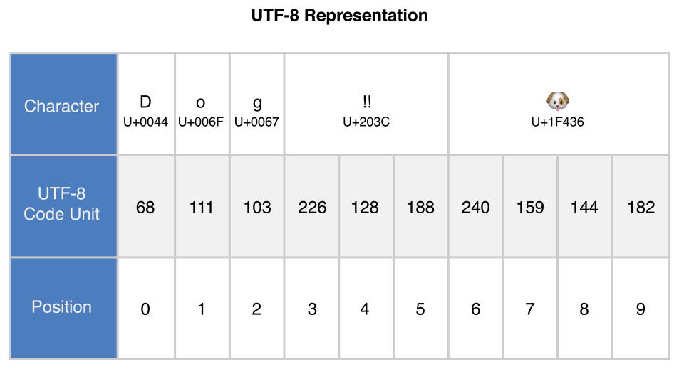
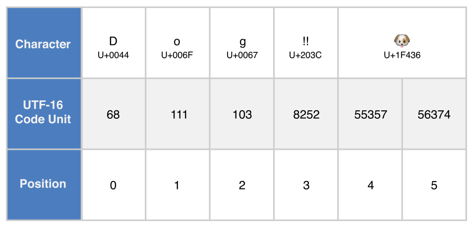
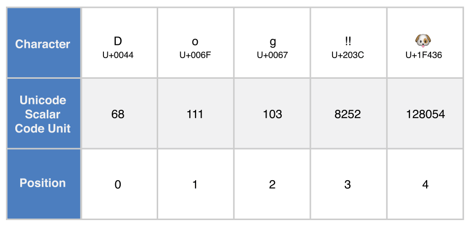

Strings and Characters
======================

A :newTerm:`string` is a series of characters,
such as ``"hello, world"`` or ``"albatross"``.
Swift strings are represented by the ``String`` type.
The contents of a ``String`` can be accessed in various ways,
including as a collection of ``Character`` values.

Swift's ``String`` and ``Character`` types provide
a fast, Unicode-compliant way to work with text in your code.
The syntax for string creation and manipulation is lightweight and readable,
with a string literal syntax that is similar to C.
String concatenation is as simple as
combining two strings with the ``+`` operator,
and string mutability is managed by choosing between a constant or a variable,
just like any other value in Swift.
You can also use strings to insert
constants, variables, literals, and expressions into longer strings,
in a process known as string interpolation.
This makes it easy to create custom string values for display, storage, and printing.

Despite this simplicity of syntax,
Swift's ``String`` type is a fast, modern string implementation.
Every string is composed of encoding-independent Unicode characters,
and provides support for accessing those characters in various Unicode representations.

.. note::

   Swift's ``String`` type is bridged with Foundation's ``NSString`` class.
   If you are working with the Foundation framework in Cocoa,
   the entire ``NSString`` API is available to call on any ``String`` value you create
   when type cast to ``NSString``, as described in :ref:`TypeCasting_AnyObject`.
   You can also use a ``String`` value with any API that requires an ``NSString`` instance.

   For more information about using ``String`` with Foundation and Cocoa,
   see `Using Swift with Cocoa and Objective-C <//apple_ref/doc/uid/TP40014216>`_.

.. _StringsAndCharacters_Literals:

String Literals
---------------

You can include predefined ``String`` values within your code as :newTerm:`string literals`.
A string literal is a fixed sequence of textual characters
surrounded by a pair of double quotes (``""``).

Use a string literal as an initial value for a constant or variable:

.. testcode:: stringLiterals

   -> let someString = "Some string literal value"
   << // someString : String = "Some string literal value"

Note that Swift infers a type of ``String`` for the ``someString`` constant,
because it is initialized with a string literal value.

.. note::

   For information about using special characters in string literals,
   see :ref:`StringsAndCharacters_SpecialCharactersInStringLiterals`.

.. _StringsAndCharacters_InitializingAnEmptyString:

Initializing an Empty String
----------------------------

To create an empty ``String`` value as the starting point
for building a longer string,
either assign an empty string literal to a variable,
or initialize a new ``String`` instance with initializer syntax:

.. testcode:: emptyStrings

   -> var emptyString = ""               // empty string literal
   << // emptyString : String = ""
   -> var anotherEmptyString = String()  // initializer syntax
   << // anotherEmptyString : String = ""
   // these two strings are both empty, and are equivalent to each other

Find out whether a ``String`` value is empty
by checking its Boolean ``isEmpty`` property:

.. testcode:: emptyStrings

   -> if emptyString.isEmpty {
         print("Nothing to see here")
      }
   <- Nothing to see here

.. TODO: init(size, character)

.. _StringsAndCharacters_StringMutability:

String Mutability
-----------------

You indicate whether a particular ``String`` can be modified (or *mutated*)
by assigning it to a variable (in which case it can be modified),
or to a constant (in which case it cannot be modified):

.. testcode:: stringMutability

   -> var variableString = "Horse"
   << // variableString : String = "Horse"
   -> variableString += " and carriage"
   /> variableString is now \"\(variableString)\"
   </ variableString is now "Horse and carriage"
   ---
   -> let constantString = "Highlander"
   << // constantString : String = "Highlander"
   -> constantString += " and another Highlander"
   !! <REPL Input>:1:16: error: left side of mutating operator isn't mutable: 'constantString' is a 'let' constant
   !! constantString += " and another Highlander"
   !! ~~~~~~~~~~~~~~ ^
   !! <REPL Input>:1:1: note: change 'let' to 'var' to make it mutable
   !! let constantString = "Highlander"
   !! ^~~
   !! var
   // this reports a compile-time error - a constant string cannot be modified

.. note::

   This approach is different from string mutation in Objective-C and Cocoa,
   where you choose between two classes (``NSString`` and ``NSMutableString``)
   to indicate whether a string can be mutated.

.. _StringsAndCharacters_StringsAreValueTypes:

Strings Are Value Types
-----------------------

Swift's ``String`` type is a *value type*.
If you create a new ``String`` value,
that ``String`` value is *copied* when it is passed to a function or method,
or when it is assigned to a constant or variable.
In each case, a new copy of the existing ``String`` value is created,
and the new copy is passed or assigned, not the original version.
Value types are described in :ref:`ClassesAndStructures_StructuresAndEnumerationsAreValueTypes`.

Swift's copy-by-default ``String`` behavior ensures that
when a function or method passes you a ``String`` value,
it is clear that you own that exact ``String`` value,
regardless of where it came from.
You can be confident that the string you are passed will not be modified
unless you modify it yourself.

Behind the scenes, Swift's compiler optimizes string usage
so that actual copying takes place only when absolutely necessary.
This means you always get great performance
when working with strings as value types.

.. _StringsAndCharacters_WorkingWithCharacters:

Working with Characters
-----------------------

You can access the individual ``Character`` values for a ``String``
by iterating over its ``characters`` property with a ``for``-``in`` loop:

.. testcode:: characters

   -> for character in "Dog!🐶".characters {
         print(character)
      }
   </ D
   </ o
   </ g
   </ !
   </ 🐶

The ``for``-``in`` loop is described in :ref:`ControlFlow_ForLoops`.

Alternatively, you can create a stand-alone ``Character`` constant or variable
from a single-character string literal by providing a ``Character`` type annotation:

.. testcode:: characters

   -> let exclamationMark: Character = "!"
   << // exclamationMark : Character = "!"

``String`` values can be constructed by passing an array of ``Character`` values
as an argument to its initializer:

.. testcode:: characters

   -> let catCharacters: [Character] = ["C", "a", "t", "!", "🐱"]
   << // catCharacters : [Character] = ["C", "a", "t", "!", "🐱"]
   -> let catString = String(catCharacters)
   << // catString : String = "Cat!🐱"
   -> print(catString)
   <- Cat!🐱

.. _StringsAndCharacters_ConcatenatingStringsAndCharacters:

Concatenating Strings and Characters
------------------------------------

``String`` values can be added together (or *concatenated*)
with the addition operator (``+``) to create a new ``String`` value:

.. testcode:: concatenation

   -> let string1 = "hello"
   << // string1 : String = "hello"
   -> let string2 = " there"
   << // string2 : String = " there"
   -> var welcome = string1 + string2
   << // welcome : String = "hello there"
   /> welcome now equals \"\(welcome)\"
   </ welcome now equals "hello there"

You can also append a ``String`` value to an existing ``String`` variable
with the addition assignment operator (``+=``):

.. testcode:: concatenation

   -> var instruction = "look over"
   << // instruction : String = "look over"
   -> instruction += string2
   /> instruction now equals \"\(instruction)\"
   </ instruction now equals "look over there"

You can append a ``Character`` value to a ``String`` variable
with the ``String`` type's ``append()`` method:

.. testcode:: concatenation

   -> let exclamationMark: Character = "!"
   << // exclamationMark : Character = "!"
   -> welcome.append(exclamationMark)
   /> welcome now equals \"\(welcome)\"
   </ welcome now equals "hello there!"

.. note::

   You can't append a ``String`` or ``Character`` to an existing ``Character`` variable,
   because a ``Character`` value must contain a single character only.

.. _StringsAndCharacters_StringInterpolation:

String Interpolation
--------------------

:newTerm:`String interpolation` is a way to construct a new ``String`` value
from a mix of constants, variables, literals, and expressions
by including their values inside a string literal.
Each item that you insert into the string literal is wrapped in
a pair of parentheses, prefixed by a backslash:

.. testcode:: stringInterpolation

   -> let multiplier = 3
   << // multiplier : Int = 3
   -> let message = "\(multiplier) times 2.5 is \(Double(multiplier) * 2.5)"
   << // message : String = "3 times 2.5 is 7.5"
   /> message is \"\(message)\"
   </ message is "3 times 2.5 is 7.5"

In the example above,
the value of ``multiplier`` is inserted into a string literal as ``\(multiplier)``.
This placeholder is replaced with the actual value of ``multiplier``
when the string interpolation is evaluated to create an actual string.

The value of ``multiplier`` is also part of a larger expression later in the string.
This expression calculates the value of ``Double(multiplier) * 2.5``
and inserts the result (``7.5``) into the string.
In this case, the expression is written as ``\(Double(multiplier) * 2.5)``
when it is included inside the string literal.

.. note::

   The expressions you write inside parentheses within an interpolated string
   cannot contain an unescaped backslash (``\``), a carriage return, or a line feed.
   However, they can contain other string literals.

.. TODO: add a bit here about making things Printable.

.. _StringsAndCharacters_Unicode:

Unicode
-------

:newTerm:`Unicode` is an international standard for
encoding, representing, and processing text in different writing systems.
It enables you to represent almost any character from any language in a standardized form,
and to read and write those characters to and from an external source
such as a text file or web page.
Swift's ``String`` and ``Character`` types are fully Unicode-compliant,
as described in this section.

.. _StringsAndCharacters_StringsAreUnicodeScalars:

Unicode Scalars
~~~~~~~~~~~~~~~

Behind the scenes,
Swift's native ``String`` type is built from :newTerm:`Unicode scalar` values.
A Unicode scalar is a unique 21-bit number for a character or modifier,
such as ``U+0061`` for ``LATIN SMALL LETTER A`` (``"a"``),
or ``U+1F425`` for ``FRONT-FACING BABY CHICK`` (``"🐥"``).

.. note::

   A Unicode scalar is any Unicode :newTerm:`code point` in the range
   ``U+0000`` to ``U+D7FF`` inclusive or ``U+E000`` to ``U+10FFFF`` inclusive.
   Unicode scalars do not include the Unicode :newTerm:`surrogate pair` code points,
   which are the code points in the range ``U+D800`` to ``U+DFFF`` inclusive.

Note that not all 21-bit Unicode scalars are assigned to a character ---
some scalars are reserved for future assignment.
Scalars that have been assigned to a character typically also have a name,
such as ``LATIN SMALL LETTER A`` and ``FRONT-FACING BABY CHICK`` in the examples above.

.. _StringsAndCharacters_SpecialCharactersInStringLiterals:

Special Characters in String Literals
~~~~~~~~~~~~~~~~~~~~~~~~~~~~~~~~~~~~~

String literals can include the following special characters:

* The escaped special characters ``\0`` (null character), ``\\`` (backslash),
  ``\t`` (horizontal tab), ``\n`` (line feed), ``\r`` (carriage return),
  ``\"`` (double quote) and ``\'`` (single quote)
* An arbitrary Unicode scalar, written as :literal:`\\u{`:emphasis:`n`:literal:`}`,
  where *n* is a 1--8 digit hexadecimal number
  with a value equal to a valid Unicode code point

.. assertion:: stringLiteralUnicodeScalar

   -> "\u{0}"
   << // r0 : String = "\0"
   -> "\u{00000000}"
   << // r1 : String = "\0"
   -> "\u{000000000}"
   !! <REPL Input>:1:15: error: \u{...} escape sequence expects between 1 and 8 hex digits
   !! "\u{000000000}"
   !! ^
   -> "\u{10FFFF}"
   << // r2 : String = "􏿿"
   -> "\u{110000}"
   !! <REPL Input>:1:2: error: invalid unicode scalar
   !! "\u{110000}"
   !! ^

The code below shows four examples of these special characters.
The ``wiseWords`` constant contains two escaped double quote characters.
The ``dollarSign``, ``blackHeart``, and ``sparklingHeart`` constants
demonstrate the Unicode scalar format:

.. testcode:: specialCharacters

   -> let wiseWords = "\"Imagination is more important than knowledge\" - Einstein"
   << // wiseWords : String = "\"Imagination is more important than knowledge\" - Einstein"
   >> print(wiseWords)
   </ "Imagination is more important than knowledge" - Einstein
   -> let dollarSign = "\u{24}"        // $,  Unicode scalar U+0024
   << // dollarSign : String = "$"
   -> let blackHeart = "\u{2665}"      // ♥,  Unicode scalar U+2665
   << // blackHeart : String = "♥"
   -> let sparklingHeart = "\u{1F496}" // 💖, Unicode scalar U+1F496
   << // sparklingHeart : String = "💖"

.. _StringsAndCharacters_ExtendedGraphemeClusters:

Extended Grapheme Clusters
~~~~~~~~~~~~~~~~~~~~~~~~~~

Every instance of Swift's ``Character`` type represents
a single :newTerm:`extended grapheme cluster`.
An extended grapheme cluster is a sequence of one or more Unicode scalars
that (when combined) produce a single human-readable character.

Here's an example.
The letter ``é`` can be represented as the single Unicode scalar ``é``
(``LATIN SMALL LETTER E WITH ACUTE``, or ``U+00E9``).
However, the same letter can also be represented as a *pair* of scalars ---
a standard letter ``e`` (``LATIN SMALL LETTER E``, or ``U+0065``),
followed by the ``COMBINING ACUTE ACCENT`` scalar (``U+0301``).
The ``COMBINING ACUTE ACCENT`` scalar is graphically applied to the scalar that precedes it,
turning an ``e`` into an ``é`` when it is rendered by
a Unicode-aware text-rendering system.

In both cases, the letter ``é`` is represented as a single Swift ``Character`` value
that represents an extended grapheme cluster.
In the first case, the cluster contains a single scalar;
in the second case, it is a cluster of two scalars:

.. testcode:: graphemeClusters1

   -> let eAcute: Character = "\u{E9}"                         // é
   << // eAcute : Character = "é"
   -> let combinedEAcute: Character = "\u{65}\u{301}"          // e followed by ́
   << // combinedEAcute : Character = "é"
   /> eAcute is \(eAcute), combinedEAcute is \(combinedEAcute)
   </ eAcute is é, combinedEAcute is é

Extended grapheme clusters are a flexible way to represent
many complex script characters as a single ``Character`` value.
For example, Hangul syllables from the Korean alphabet
can be represented as either a precomposed or decomposed sequence.
Both of these representations qualify as a single ``Character`` value in Swift:

.. testcode:: graphemeClusters2

   -> let precomposed: Character = "\u{D55C}"                  // 한
   << // precomposed : Character = "한"
   -> let decomposed: Character = "\u{1112}\u{1161}\u{11AB}"   // ᄒ, ᅡ, ᆫ
   << // decomposed : Character = "한"
   /> precomposed is \(precomposed), decomposed is \(decomposed)
   </ precomposed is 한, decomposed is 한

Extended grapheme clusters enable
scalars for enclosing marks (such as ``COMBINING ENCLOSING CIRCLE``, or ``U+20DD``)
to enclose other Unicode scalars as part of a single ``Character`` value:

.. testcode:: graphemeClusters3

   -> let enclosedEAcute: Character = "\u{E9}\u{20DD}"
   << // enclosedEAcute : Character = "é⃝"
   /> enclosedEAcute is \(enclosedEAcute)
   </ enclosedEAcute is é⃝

Unicode scalars for regional indicator symbols
can be combined in pairs to make a single ``Character`` value,
such as this combination of ``REGIONAL INDICATOR SYMBOL LETTER U`` (``U+1F1FA``)
and ``REGIONAL INDICATOR SYMBOL LETTER S`` (``U+1F1F8``):

.. testcode:: graphemeClusters4

   -> let regionalIndicatorForUS: Character = "\u{1F1FA}\u{1F1F8}"
   << // regionalIndicatorForUS : Character = "🇺🇸"
   /> regionalIndicatorForUS is \(regionalIndicatorForUS)
   </ regionalIndicatorForUS is 🇺🇸

.. _StringsAndCharacters_CountingCharacters:

Counting Characters
-------------------

To retrieve a count of the ``Character`` values in a string,
use the ``count`` property of the string's ``characters`` property:

.. testcode:: characterCount

   -> let unusualMenagerie = "Koala 🐨, Snail 🐌, Penguin 🐧, Dromedary 🐪"
   << // unusualMenagerie : String = "Koala 🐨, Snail 🐌, Penguin 🐧, Dromedary 🐪"
   -> print("unusualMenagerie has \(unusualMenagerie.characters.count) characters")
   <- unusualMenagerie has 40 characters

Note that Swift's use of extended grapheme clusters for ``Character`` values
means that string concatenation and modification may not always affect
a string's character count.

For example, if you initialize a new string with the four-character word ``cafe``,
and then append a ``COMBINING ACUTE ACCENT`` (``U+0301``) to the end of the string,
the resulting string will still have a character count of ``4``,
with a fourth character of ``é``, not ``e``:

.. testcode:: characterCount

   -> var word = "cafe"
   << // word : String = "cafe"
   -> print("the number of characters in \(word) is \(word.characters.count)")
   <- the number of characters in cafe is 4
   ---
   -> word += "\u{301}"    // COMBINING ACUTE ACCENT, U+0301
   ---
   -> print("the number of characters in \(word) is \(word.characters.count)")
   <- the number of characters in café is 4

.. note::

   Extended grapheme clusters can be composed of one or more Unicode scalars.
   This means that different characters—
   and different representations of the same character—
   can require different amounts of memory to store.
   Because of this, characters in Swift do not each take up
   the same amount of memory within a string's representation.
   As a result, the number of characters in a string cannot be calculated
   without iterating through the string to determine
   its extended grapheme cluster boundaries.
   If you are working with particularly long string values,
   be aware that the ``characters`` property
   must iterate over the Unicode scalars in the entire string
   in order to determine the characters for that string.

   The count of the characters returned by the ``characters`` property
   is not always the same as the ``length`` property of
   an ``NSString`` that contains the same characters.
   The length of an ``NSString`` is based on
   the number of 16-bit code units within the string's UTF-16 representation
   and not the number of Unicode extended grapheme clusters within the string.

.. _StringsAndCharacters_AccessingAndModifyingAString:

Accessing and Modifying a String
--------------------------------

You access and modify a string through its methods and properties,
or by using subscript syntax.

.. _StringsAndCharacters_StringIndices:

String Indices
~~~~~~~~~~~~~~

Each ``String`` value has an associated :newterm:`index type`,
``String.Index``,
which corresponds to the position of each ``Character`` in the string.

As mentioned above,
different characters can require different amounts of memory to store,
so in order to determine which ``Character`` is at a particular position,
you must iterate over each Unicode scalar from the start or end of that ``String``.
For this reason, Swift strings cannot be indexed by integer values.

Use the ``startIndex`` property to access
the position of the first ``Character`` of a ``String``.
The ``endIndex`` property is the position after the last character in a ``String``.
As a result,
the ``endIndex`` property isn't a valid argument to a string's subscript.
If a ``String`` is empty, ``startIndex`` and ``endIndex`` are equal.

You access the indices before and after a given index
using the ``index(before:)`` and ``index(after:)`` methods of ``String``.
Instead of calling these methods multiple times on the same index,
use the ``index(_:offsetBy:)`` method,
which is more efficient.

You can use subscript syntax to access
the ``Character`` at a particular ``String`` index.

.. testcode:: stringIndex

   -> let greeting = "Guten Tag!"
   << // greeting : String = "Guten Tag!"
   -> greeting[greeting.startIndex]
   <$ : Character = "G"
   // G
   -> greeting[greeting.index(before: greeting.endIndex)]
   <$ : Character = "!"
   // !
   -> greeting[greeting.index(after: greeting.startIndex)]
   <$ : Character = "u"
   // u
   -> let index = greeting.index(greeting.startIndex, offsetBy: 7)
   <~ // index : Index = Swift.String.CharacterView.Index
   -> greeting[index]
   <$ : Character = "a"
   // a

Attempting to access an index outside of a string's range
or a ``Character`` at an index outside of a string's range
will trigger a runtime error.

.. code-block:: swift

   greeting[greeting.endIndex] // error
   greeting.index(after: endIndex) // error

.. assertion:: emptyStringIndexes

   -> let emptyString = ""
   << // emptyString : String = ""
   -> emptyString.isEmpty && emptyString.startIndex == emptyString.endIndex
   << // r0 : Bool = true

Use the ``indices`` property of the ``characters`` property to create a ``Range`` of all of the
indexes used to access individual characters in a string.

.. testcode:: stringIndex

   -> for index in greeting.characters.indices {
         print("\(greeting[index]) ", terminator: "")
      }
   >> print("")
   << G u t e n   T a g ! 
   // Prints "G u t e n   T a g ! "

.. Workaround for rdar://26016325

.. _StringsAndCharacters_InsertingAndRemoving:

Inserting and Removing
~~~~~~~~~~~~~~~~~~~~~~

To insert a character into a string at a specified index,
use the ``insert(_:at:)`` method.

.. testcode:: stringInsertionAndRemoval

   -> var welcome = "hello"
   << // welcome : String = "hello"
   -> welcome.insert("!", at: welcome.endIndex)
   /> welcome now equals \"\(welcome)\"
   </ welcome now equals "hello!"

To insert the contents of another string at a specified index,
use the ``insert(contentsOf:at:)`` method.

.. testcode:: stringInsertionAndRemoval

   -> welcome.insert(contentsOf:" there".characters, at: welcome.index(before: welcome.endIndex))
   /> welcome now equals \"\(welcome)\"
   </ welcome now equals "hello there!"

To remove a character from a string at a specified index,
use the ``remove(at:)`` method.

.. testcode:: stringInsertionAndRemoval

   -> welcome.remove(at: welcome.index(before: welcome.endIndex))
   << // r0 : Character = "!"
   /> welcome now equals \"\(welcome)\"
   </ welcome now equals "hello there"

To remove a substring at a specified range,
use the ``removeSubrange(_:)`` method:

.. testcode:: stringInsertionAndRemoval

   -> let range = welcome.index(welcome.endIndex, offsetBy: -6)..<welcome.endIndex
   <~ // range : Range<Index> = Range(Swift.String.CharacterView.Index
   -> welcome.removeSubrange(range)
   /> welcome now equals \"\(welcome)\"
   </ welcome now equals "hello"

.. TODO: Find and Replace section, once the standard library supports finding substrings

.. _StringsAndCharacters_ComparingStrings:

Comparing Strings
-----------------

Swift provides three ways to compare textual values:
string and character equality, prefix equality, and suffix equality.

.. _StringsAndCharacters_StringEquality:

String and Character Equality
~~~~~~~~~~~~~~~~~~~~~~~~~~~~~

String and character equality is checked with the “equal to” operator (``==``)
and the “not equal to” operator (``!=``),
as described in :ref:`BasicOperators_ComparisonOperators`:

.. testcode:: stringEquality

   -> let quotation = "We're a lot alike, you and I."
   << // quotation : String = "We\'re a lot alike, you and I."
   -> let sameQuotation = "We're a lot alike, you and I."
   << // sameQuotation : String = "We\'re a lot alike, you and I."
   -> if quotation == sameQuotation {
         print("These two strings are considered equal")
      }
   <- These two strings are considered equal

Two ``String`` values (or two ``Character`` values) are considered equal if
their extended grapheme clusters are :newTerm:`canonically equivalent`.
Extended grapheme clusters are canonically equivalent if they have
the same linguistic meaning and appearance,
even if they are composed from different Unicode scalars behind the scenes.

.. assertion:: characterComparisonUsesCanonicalEquivalence

   -> let eAcute: Character = "\u{E9}"
   << // eAcute : Character = "é"
   -> let combinedEAcute: Character = "\u{65}\u{301}"
   << // combinedEAcute : Character = "é"
   -> if eAcute != combinedEAcute {
         print("not equivalent, which is not expected")
      } else {
         print("equivalent, as expected")
      }
   <- equivalent, as expected

.. assertion:: stringComparisonUsesCanonicalEquivalence

   -> let cafe1 = "caf\u{E9}"
   << // cafe1 : String = "café"
   -> let cafe2 = "caf\u{65}\u{301}"
   << // cafe2 : String = "café"
   -> if cafe1 != cafe2 {
         print("not equivalent, which is not expected")
      } else {
         print("equivalent, as expected")
      }
   <- equivalent, as expected

For example, ``LATIN SMALL LETTER E WITH ACUTE`` (``U+00E9``)
is canonically equivalent to ``LATIN SMALL LETTER E`` (``U+0065``)
followed by ``COMBINING ACUTE ACCENT`` (``U+0301``).
Both of these extended grapheme clusters are valid ways to represent the character ``é``,
and so they are considered to be canonically equivalent:

.. testcode:: stringEquality

   // "Voulez-vous un café?" using LATIN SMALL LETTER E WITH ACUTE
   -> let eAcuteQuestion = "Voulez-vous un caf\u{E9}?"
   << // eAcuteQuestion : String = "Voulez-vous un café?"
   ---
   // "Voulez-vous un café?" using LATIN SMALL LETTER E and COMBINING ACUTE ACCENT
   -> let combinedEAcuteQuestion = "Voulez-vous un caf\u{65}\u{301}?"
   << // combinedEAcuteQuestion : String = "Voulez-vous un café?"
   ---
   -> if eAcuteQuestion == combinedEAcuteQuestion {
         print("These two strings are considered equal")
      }
   <- These two strings are considered equal

Conversely, ``LATIN CAPITAL LETTER A`` (``U+0041``, or ``"A"``),
as used in English, is *not* equivalent to
``CYRILLIC CAPITAL LETTER A`` (``U+0410``, or ``"А"``),
as used in Russian.
The characters are visually similar,
but do not have the same linguistic meaning:

.. testcode:: stringEquality

   -> let latinCapitalLetterA: Character = "\u{41}"
   << // latinCapitalLetterA : Character = "A"
   ---
   -> let cyrillicCapitalLetterA: Character = "\u{0410}"
   << // cyrillicCapitalLetterA : Character = "А"
   ---
   -> if latinCapitalLetterA != cyrillicCapitalLetterA {
         print("These two characters are not equivalent")
      }
   <- These two characters are not equivalent

.. note::

   String and character comparisons in Swift are not locale-sensitive.

.. _StringsAndCharacters_PrefixAndSuffixEquality:

Prefix and Suffix Equality
~~~~~~~~~~~~~~~~~~~~~~~~~~

To check whether a string has a particular string prefix or suffix,
call the string's ``hasPrefix(_:)`` and ``hasSuffix(_:)`` methods,
both of which take a single argument of type ``String`` and return a Boolean value.

.. assertion:: prefixComparisonUsesCharactersNotScalars

   -> let ecole = "\u{E9}cole"
   << // ecole : String = "école"
   -> if ecole.hasPrefix("\u{E9}") {
         print("has U+00E9 prefix, as expected")
      } else {
         print("does not have U+00E9 prefix, which is unexpected")
      }
   <- has U+00E9 prefix, as expected
   -> if ecole.hasPrefix("\u{65}\u{301}") {
         print("has U+0065 U+0301 prefix, as expected")
      } else {
         print("does not have U+0065 U+0301 prefix, which is unexpected")
      }
   <- has U+0065 U+0301 prefix, as expected

.. assertion:: suffixComparisonUsesCharactersNotScalars

   -> let cafe = "caf\u{E9}"
   << // cafe : String = "café"
   -> if cafe.hasSuffix("\u{E9}") {
         print("has U+00E9 suffix, as expected")
      } else {
         print("does not have U+00E9 suffix, which is unexpected")
      }
   <- has U+00E9 suffix, as expected
   -> if cafe.hasSuffix("\u{65}\u{301}") {
         print("has U+0065 U+0301 suffix, as expected")
      } else {
         print("does not have U+0065 U+0301 suffix, which is unexpected")
      }
   <- has U+0065 U+0301 suffix, as expected

The examples below consider an array of strings representing
the scene locations from the first two acts of Shakespeare's *Romeo and Juliet*:

.. testcode:: prefixesAndSuffixes

   -> let romeoAndJuliet = [
         "Act 1 Scene 1: Verona, A public place",
         "Act 1 Scene 2: Capulet's mansion",
         "Act 1 Scene 3: A room in Capulet's mansion",
         "Act 1 Scene 4: A street outside Capulet's mansion",
         "Act 1 Scene 5: The Great Hall in Capulet's mansion",
         "Act 2 Scene 1: Outside Capulet's mansion",
         "Act 2 Scene 2: Capulet's orchard",
         "Act 2 Scene 3: Outside Friar Lawrence's cell",
         "Act 2 Scene 4: A street in Verona",
         "Act 2 Scene 5: Capulet's mansion",
         "Act 2 Scene 6: Friar Lawrence's cell"
      ]
   << // romeoAndJuliet : [String] = ["Act 1 Scene 1: Verona, A public place", "Act 1 Scene 2: Capulet\'s mansion", "Act 1 Scene 3: A room in Capulet\'s mansion", "Act 1 Scene 4: A street outside Capulet\'s mansion", "Act 1 Scene 5: The Great Hall in Capulet\'s mansion", "Act 2 Scene 1: Outside Capulet\'s mansion", "Act 2 Scene 2: Capulet\'s orchard", "Act 2 Scene 3: Outside Friar Lawrence\'s cell", "Act 2 Scene 4: A street in Verona", "Act 2 Scene 5: Capulet\'s mansion", "Act 2 Scene 6: Friar Lawrence\'s cell"]

You can use the ``hasPrefix(_:)`` method with the ``romeoAndJuliet`` array
to count the number of scenes in Act 1 of the play:

.. testcode:: prefixesAndSuffixes

   -> var act1SceneCount = 0
   << // act1SceneCount : Int = 0
   -> for scene in romeoAndJuliet {
         if scene.hasPrefix("Act 1 ") {
            act1SceneCount += 1
         }
      }
   -> print("There are \(act1SceneCount) scenes in Act 1")
   <- There are 5 scenes in Act 1

Similarly, use the ``hasSuffix(_:)`` method to count the number of scenes
that take place in or around Capulet's mansion and Friar Lawrence's cell:

.. testcode:: prefixesAndSuffixes

   -> var mansionCount = 0
   << // mansionCount : Int = 0
   -> var cellCount = 0
   << // cellCount : Int = 0
   -> for scene in romeoAndJuliet {
         if scene.hasSuffix("Capulet's mansion") {
            mansionCount += 1
         } else if scene.hasSuffix("Friar Lawrence's cell") {
            cellCount += 1
         }
      }
   -> print("\(mansionCount) mansion scenes; \(cellCount) cell scenes")
   <- 6 mansion scenes; 2 cell scenes

.. note::

   The ``hasPrefix(_:)`` and ``hasSuffix(_:)`` methods
   perform a character-by-character canonical equivalence comparison between
   the extended grapheme clusters in each string,
   as described in :ref:`StringsAndCharacters_StringEquality`.

.. _StringsAndCharacters_UnicodeRepresentationsOfStrings:

Unicode Representations of Strings
----------------------------------

When a Unicode string is written to a text file or some other storage,
the Unicode scalars in that string are encoded in one of
several Unicode-defined :newTerm:`encoding forms`.
Each form encodes the string in small chunks known as :newTerm:`code units`.
These include the UTF-8 encoding form (which encodes a string as 8-bit code units),
the UTF-16 encoding form (which encodes a string as 16-bit code units),
and the UTF-32 encoding form (which encodes a string as 32-bit code units).

Swift provides several different ways to access Unicode representations of strings.
You can iterate over the string with a ``for``-``in`` statement,
to access its individual ``Character`` values as Unicode extended grapheme clusters.
This process is described in :ref:`StringsAndCharacters_WorkingWithCharacters`.

Alternatively, access a ``String`` value
in one of three other Unicode-compliant representations:

* A collection of UTF-8 code units (accessed with the string's ``utf8`` property)
* A collection of UTF-16 code units (accessed with the string's ``utf16`` property)
* A collection of 21-bit Unicode scalar values,
  equivalent to the string's UTF-32 encoding form
  (accessed with the string's ``unicodeScalars`` property)

Each example below shows a different representation of the following string,
which is made up of the characters ``D``, ``o``, ``g``,
``‼`` (``DOUBLE EXCLAMATION MARK``, or Unicode scalar ``U+203C``),
and the 🐶 character (``DOG FACE``, or Unicode scalar ``U+1F436``):

.. testcode:: unicodeRepresentations

   -> let dogString = "Dog‼🐶"
   << // dogString : String = "Dog‼🐶"

.. _StringsAndCharacters_UTF8:

UTF-8 Representation
~~~~~~~~~~~~~~~~~~~~

You can access a UTF-8 representation of a ``String``
by iterating over its ``utf8`` property.
This property is of type ``String.UTF8View``,
which is a collection of unsigned 8-bit (``UInt8``) values,
one for each byte in the string's UTF-8 representation:

.. testcode:: unicodeRepresentations

   -> for codeUnit in dogString.utf8 {
         print("\(codeUnit) ", terminator: "")
      }
   -> print("")
   </ 68 111 103 226 128 188 240 159 144 182

In the example above, the first three decimal ``codeUnit`` values
(``68``, ``111``, ``103``)
represent the characters ``D``, ``o``, and ``g``,
whose UTF-8 representation is the same as their ASCII representation.
The next three decimal ``codeUnit`` values
(``226``, ``128``, ``188``)
are a three-byte UTF-8 representation of the ``DOUBLE EXCLAMATION MARK`` character.
The last four ``codeUnit`` values (``240``, ``159``, ``144``, ``182``)
are a four-byte UTF-8 representation of the ``DOG FACE`` character.

.. TODO: contiguousUTF8()

.. TODO: nulTerminatedUTF8()
   (which returns a NativeArray, but handwave this for now)

.. _StringsAndCharacters_UTF16:

UTF-16 Representation
~~~~~~~~~~~~~~~~~~~~~

You can access a UTF-16 representation of a ``String``
by iterating over its ``utf16`` property.
This property is of type ``String.UTF16View``,
which is a collection of unsigned 16-bit (``UInt16``) values,
one for each 16-bit code unit in the string's UTF-16 representation:

.. testcode:: unicodeRepresentations

   -> for codeUnit in dogString.utf16 {
         print("\(codeUnit) ", terminator: "")
      }
   -> print("")
   </ 68 111 103 8252 55357 56374

Again, the first three ``codeUnit`` values
(``68``, ``111``, ``103``)
represent the characters ``D``, ``o``, and ``g``,
whose UTF-16 code units have the same values as in the string's UTF-8 representation
(because these Unicode scalars represent ASCII characters).

The fourth ``codeUnit`` value (``8252``) is a decimal equivalent of
the hexadecimal value ``203C``,
which represents the Unicode scalar ``U+203C``
for the ``DOUBLE EXCLAMATION MARK`` character.
This character can be represented as a single code unit in UTF-16.

The fifth and sixth ``codeUnit`` values (``55357`` and ``56374``)
are a UTF-16 surrogate pair representation of the ``DOG FACE`` character.
These values are a high-surrogate value of ``U+D83D`` (decimal value ``55357``)
and a low-surrogate value of ``U+DC36`` (decimal value ``56374``).

.. _StringsAndCharacters_UnicodeScalars:

Unicode Scalar Representation
~~~~~~~~~~~~~~~~~~~~~~~~~~~~~

You can access a Unicode scalar representation of a ``String`` value
by iterating over its ``unicodeScalars`` property.
This property is of type ``UnicodeScalarView``,
which is a collection of values of type ``UnicodeScalar``.

Each ``UnicodeScalar`` has a ``value`` property that returns
the scalar's 21-bit value, represented within a ``UInt32`` value:

.. testcode:: unicodeRepresentations

   -> for scalar in dogString.unicodeScalars {
         print("\(scalar.value) ", terminator: "")
      }
   -> print("")
   </ 68 111 103 8252 128054

The ``value`` properties for the first three ``UnicodeScalar`` values
(``68``, ``111``, ``103``)
once again represent the characters ``D``, ``o``, and ``g``.

The fourth ``codeUnit`` value (``8252``) is again a decimal equivalent of
the hexadecimal value ``203C``,
which represents the Unicode scalar ``U+203C``
for the ``DOUBLE EXCLAMATION MARK`` character.

The ``value`` property of the fifth and final ``UnicodeScalar``, ``128054``,
is a decimal equivalent of the hexadecimal value ``1F436``,
which represents the Unicode scalar ``U+1F436`` for the ``DOG FACE`` character.

As an alternative to querying their ``value`` properties,
each ``UnicodeScalar`` value can also be used to construct a new ``String`` value,
such as with string interpolation:

.. testcode:: unicodeRepresentations

   -> for scalar in dogString.unicodeScalars {
         print("\(scalar) ")
      }
   </ D
   </ o
   </ g
   </ ‼
   </ 🐶
