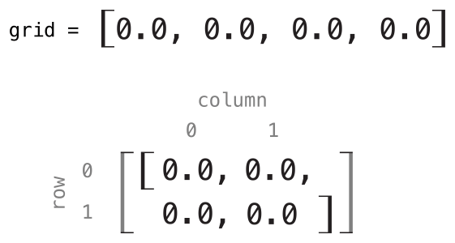
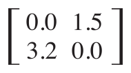

Subscripts
==========

Classes, structures, and enumerations can define :newTerm:`subscripts`,
which are shortcuts for accessing the member elements of a collection, list, or sequence.
You use subscripts to set and retrieve values by index without needing
separate methods for setting and retrieval.
For example, you access elements in an ``Array`` instance as ``someArray[index]``
and elements in a ``Dictionary`` instance as ``someDictionary[key]``.

You can define multiple subscripts for a single type,
and the appropriate subscript overload to use is selected
based on the type of index value you pass to the subscript.
Subscripts are not limited to a single dimension,
and you can define subscripts with multiple input parameters
to suit your custom type's needs.

.. TODO: this chapter should provide an example of subscripting an enumeration,
   as per Joe Groff's example from rdar://16555559.

.. _Subscripts_SubscriptSyntax:

Subscript Syntax
----------------

Subscripts enable you to query instances of a type
by writing one or more values in square brackets after the instance name.
Their syntax is similar to both instance method syntax and computed property syntax.
You write subscript definitions with the ``subscript`` keyword,
and specify one or more input parameters and a return type,
in the same way as instance methods.
Unlike instance methods, subscripts can be read-write or read-only.
This behavior is communicated by a getter and setter
in the same way as for computed properties:

.. testcode:: subscriptSyntax

   >> class Test1 {
   -> subscript(index: Int) -> Int {
         get {
            // return an appropriate subscript value here
   >>       return 1
         }
         set(newValue) {
            // perform a suitable setting action here
         }
      }
   >> }

The type of ``newValue`` is the same as the return value of the subscript.
As with computed properties, you can choose not to specify
the setter's ``(newValue)`` parameter.
A default parameter called ``newValue`` is provided to your setter
if you do not provide one yourself.

As with read-only computed properties,
you can drop the ``get`` keyword for read-only subscripts:

.. testcode:: subscriptSyntax

   >> class Test2 {
   -> subscript(index: Int) -> Int {
         // return an appropriate subscript value here
   >>    return 1
      }
   >> }

Here's an example of a read-only subscript implementation,
which defines a ``TimesTable`` structure to represent an *n*-times-table of integers:

.. testcode:: timesTable

   -> struct TimesTable {
         let multiplier: Int
         subscript(index: Int) -> Int {
            return multiplier * index
         }
      }
   -> let threeTimesTable = TimesTable(multiplier: 3)
   << // threeTimesTable : TimesTable = REPL.TimesTable(multiplier: 3)
   -> print("six times three is \(threeTimesTable[6])")
   <- six times three is 18

In this example, a new instance of ``TimesTable`` is created
to represent the three-times-table.
This is indicated by passing a value of ``3`` to the structure's ``initializer``
as the value to use for the instance's ``multiplier`` parameter.

You can query the ``threeTimesTable`` instance by calling its subscript,
as shown in the call to ``threeTimesTable[6]``.
This requests the sixth entry in the three-times-table,
which returns a value of ``18``, or ``3`` times ``6``.

.. note::

   An *n*-times-table is based on a fixed mathematical rule.
   It is not appropriate to set ``threeTimesTable[someIndex]`` to a new value,
   and so the subscript for ``TimesTable`` is defined as a read-only subscript.

.. _Subscripts_SubscriptUsage:

Subscript Usage
---------------

The exact meaning of “subscript” depends on the context in which it is used.
Subscripts are typically used as a shortcut for accessing
the member elements in a collection, list, or sequence.
You are free to implement subscripts in the most appropriate way for
your particular class or structure's functionality.

For example, Swift's ``Dictionary`` type implements a subscript
to set and retrieve the values stored in a ``Dictionary`` instance.
You can set a value in a dictionary
by providing a key of the dictionary's key type within subscript brackets,
and assigning a value of the dictionary's value type to the subscript:

.. testcode:: dictionarySubscript

   -> var numberOfLegs = ["spider": 8, "ant": 6, "cat": 4]
   << // numberOfLegs : [String : Int] = ["ant": 6, "spider": 8, "cat": 4]
   -> numberOfLegs["bird"] = 2

The example above defines a variable called ``numberOfLegs``
and initializes it with a dictionary literal containing three key-value pairs.
The type of the ``numberOfLegs`` dictionary is inferred to be ``[String: Int]``.
After creating the dictionary,
this example uses subscript assignment to add
a ``String`` key of ``"bird"`` and an ``Int`` value of ``2`` to the dictionary.

For more information about ``Dictionary`` subscripting,
see :ref:`CollectionTypes_AccessingAndModifyingADictionary`.

.. note::

   Swift's ``Dictionary`` type implements its key-value subscripting
   as a subscript that takes and returns an *optional* type.
   For the ``numberOfLegs`` dictionary above,
   the key-value subscript takes and returns a value of type ``Int?``,
   or “optional int”.
   The ``Dictionary`` type uses an optional subscript type to model the fact that
   not every key will have a value, and to give a way to delete a value for a key
   by assigning a ``nil`` value for that key.

.. _Subscripts_SubscriptOptions:

Subscript Options
-----------------

Subscripts can take any number of input parameters,
and these input parameters can be of any type.
Subscripts can also return any type.
Subscripts can use variable parameters and variadic parameters,
but cannot use in-out parameters or provide default parameter values. 

A class or structure can provide as many subscript implementations as it needs,
and the appropriate subscript to be used will be inferred based on
the types of the value or values that are contained within the subscript brackets
at the point that the subscript is used.
This definition of multiple subscripts is known as :newTerm:`subscript overloading`.

While it is most common for a subscript to take a single parameter,
you can also define a subscript with multiple parameters
if it is appropriate for your type.
The following example defines a ``Matrix`` structure,
which represents a two-dimensional matrix of ``Double`` values.
The ``Matrix`` structure's subscript takes two integer parameters:

.. testcode:: matrixSubscript, matrixSubscriptAssert

   -> struct Matrix {
         let rows: Int, columns: Int
         var grid: [Double]
         init(rows: Int, columns: Int) {
            self.rows = rows
            self.columns = columns
            grid = Array(repeating: 0.0, count: rows * columns)
         }
         func indexIsValidForRow(row: Int, column: Int) -> Bool {
            return row >= 0 && row < rows && column >= 0 && column < columns
         }
         subscript(row: Int, column: Int) -> Double {
            get {
               assert(indexIsValidForRow(row, column: column), "Index out of range")
               return grid[(row * columns) + column]
            }
            set {
               assert(indexIsValidForRow(row, column: column), "Index out of range")
               grid[(row * columns) + column] = newValue
            }
         }
      }

``Matrix`` provides an initializer that takes two parameters called ``rows`` and ``columns``,
and creates an array that is large enough to store ``rows * columns`` values of type ``Double``.
Each position in the matrix is given an initial value of ``0.0``.
To achieve this, the array's size, and an initial cell value of ``0.0``,
are passed to an array initializer that creates and initializes a new array of the correct size.
This initializer is described in more detail
in :ref:`CollectionTypes_CreatingAnArrayWithADefaultValue`.

You can construct a new ``Matrix`` instance by passing
an appropriate row and column count to its initializer:

.. testcode:: matrixSubscript, matrixSubscriptAssert

   -> var matrix = Matrix(rows: 2, columns: 2)
   << // matrix : Matrix = REPL.Matrix(rows: 2, columns: 2, grid: [0.0, 0.0, 0.0, 0.0])

The preceding example creates a new ``Matrix`` instance with two rows and two columns.
The ``grid`` array for this ``Matrix`` instance
is effectively a flattened version of the matrix,
as read from top left to bottom right:

Values in the matrix can be set by passing row and column values into the subscript,
separated by a comma:

.. testcode:: matrixSubscript, matrixSubscriptAssert

   -> matrix[0, 1] = 1.5
   >> print(matrix[0, 1])
   << 1.5
   -> matrix[1, 0] = 3.2
   >> print(matrix[1, 0])
   << 3.2

These two statements call the subscript's setter to set
a value of ``1.5`` in the top right position of the matrix
(where ``row`` is ``0`` and ``column`` is ``1``),
and ``3.2`` in the bottom left position
(where ``row`` is ``1`` and ``column`` is ``0``):

The ``Matrix`` subscript's getter and setter both contain an assertion
to check that the subscript's  ``row`` and ``column`` values are valid.
To assist with these assertions,
``Matrix`` includes a convenience method called ``indexIsValidForRow(_:column:)``,
which checks whether the requested ``row`` and ``column``
are inside the bounds of the matrix:

.. testcode:: matrixSubscript

   >> var rows = 2
   << // rows : Int = 2
   >> var columns = 2
   << // columns : Int = 2
   -> func indexIsValidForRow(row: Int, column: Int) -> Bool {
         return row >= 0 && row < rows && column >= 0 && column < columns
      }

An assertion is triggered if you try to access a subscript
that is outside of the matrix bounds:

.. testcode:: matrixSubscriptAssert

   -> let someValue = matrix[2, 2]
   xx assert
   // this triggers an assert, because [2, 2] is outside of the matrix bounds

.. TODO: subscripts can provide external names for their parameters,
   to enable subscript overloading (e.g. subscript(row: Int) and subscript(column: Int)
   to get a slice of the matrix). This would make a great example!
